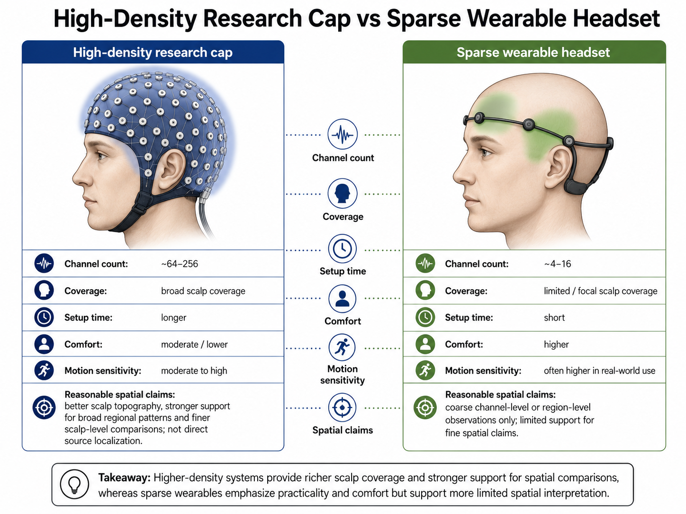
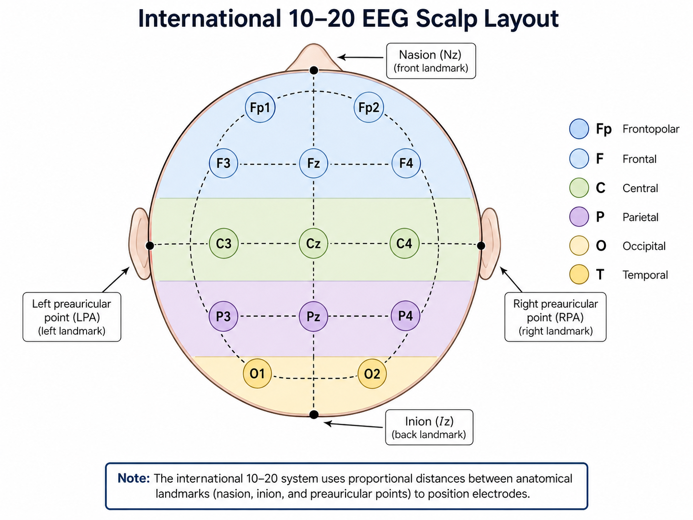

# Electrodes, Montages, Wearables, and Source Estimation

## Overview

EEG quality depends strongly on how and where signals are recorded. Electrode placement, referencing, channel density, and hardware design all affect what can be inferred from the data. For wearable affective computing, this becomes even more important because comfort and portability often force reduced channel counts and less controlled acquisition conditions.

This section introduces the standard electrode system, wearable EEG tradeoffs, and the role and limits of source estimation in low-channel portable settings.

**Figure 1.11: Dense vs. sparse headset comparison.** A high-density research cap and a sparse wearable headset are compared on a head silhouette, with annotations for channel count, coverage, setup time, comfort, motion sensitivity, and the kinds of spatial claims each system can reasonably support.

## Electrode Placement and the 10-20 System

The international 10-20 system defines standardized electrode positions across the scalp. Labels such as Fp1, F3, Cz, P4, and O2 indicate approximate anatomical regions:

- **Fp**: frontal pole
- **F**: frontal
- **C**: central
- **P**: parietal
- **O**: occipital
- **T**: temporal
- **z**: midline

This standardization improves reproducibility across studies and makes channel-level interpretations easier.

**Figure 1.12: International 10-20 system.** A clean top-down scalp diagram of the international 10-20 system. The Fp, F, C, P, O, and T regions are marked, representative electrodes such as Fp1, F3, Cz, P4, and O2 are labeled, and the nasion, inion, and left/right preauricular landmarks used to construct the layout are shown.

## Montages and Referencing

EEG measures voltage differences, so the reference matters.

Common choices include:

- linked ears or mastoids,
- common average reference,
- single reference electrode,
- bipolar derivations.

Reference choice affects:

- apparent amplitude,
- channel correlation structure,
- spatial interpretability,
- downstream model features.

**Figure 1.13: Montages and referencing.** The same three electrode recordings are re-expressed using a single reference, linked-mastoid reference, common-average reference, and bipolar derivations. The comparison shows how rereferencing changes voltage values and channel relationships without creating new neural information.

## Channel Density Tradeoffs

### High-Density Systems

Advantages:

- better spatial sampling,
- better support for source localization,
- richer connectivity analysis.

Disadvantages:

- longer setup time,
- higher cost,
- reduced comfort,
- less practicality for wearable settings.

### Low-Channel Wearable Systems

Advantages:

- fast setup,
- higher participant comfort,
- practical for real-world deployment,
- lower cost.

Disadvantages:

- reduced spatial coverage,
- weaker support for source estimation,
- higher sensitivity to missing or noisy channels,
- more limited interpretability.

## Wearable EEG in Affective Computing

Wearable EEG is attractive because affective computing often aims for ecological settings rather than tightly controlled laboratory environments.

Typical wearable challenges include:

- dry electrodes with less stable contact,
- frontal-only or sparse channel layouts,
- motion contamination,
- consumer-grade sampling and hardware limits,
- reduced spatial richness.

Nonetheless, wearable systems are often the most relevant for deployment-focused emotion recognition.

## Source Estimation

### What It Is

Source estimation attempts to infer the underlying brain sources that generated the observed scalp EEG.

This is often framed as an **inverse problem**:

- **forward problem**: given sources, predict scalp potentials,
- **inverse problem**: given scalp potentials, infer likely sources.

<!-- Figure suggestion: Add a forward/inverse-problem diagram. In the forward direction, show candidate cortical sources passing through a head model to generate scalp potentials; in the inverse direction, show one scalp pattern branching to multiple plausible source configurations. Label the inverse problem as ill-posed and identify head model, electrode positions, coverage, and regularization as constraints. -->

The inverse problem is ill-posed because many source configurations can produce similar scalp measurements.

## Why Source Estimation Is Difficult

Source estimation depends on:

- accurate head models,
- electrode positions,
- conductivity assumptions,
- sufficient channel coverage,
- suitable regularization.

Errors in any of these reduce reliability.

## Source Estimation for Wearable Devices

For wearable low-channel EEG, source estimation is possible only in a limited and highly constrained sense.

### Main Challenges

- too few channels for stable inverse inference,
- sparse or uneven electrode placement,
- uncertain electrode locations,
- simplified head modeling,
- stronger motion and contact noise.

### What Is Still Reasonable

In wearable settings, source analysis is often used more cautiously for:

- coarse regional inference,
- constrained cortical priors,
- model-based interpretation rather than precise localization,
- fusion with other modalities or prior anatomical information.

### Practical Recommendation

For most low-channel affective computing systems, it is safer to interpret models in terms of:

- scalp regions,
- frequency content,
- channel-level asymmetry,
- connectivity proxies,

rather than claiming precise neural localization.

**Figure 1.14: Interpretation ladder for wearable EEG.** Evidence strength decreases from directly observed channel and scalp-region patterns through frequency content and connectivity proxies to coarse regional inference, with precise source localization shown as the least supported claim. Confidence labels indicate interpretive caution rather than a strict quantitative scale.

## Summary

Electrode design and channel configuration strongly shape EEG analysis. High-density systems support richer spatial analysis, while wearable systems favor usability at the cost of spatial precision. Source estimation is theoretically appealing but becomes much less reliable in sparse wearable settings, so conclusions should be framed cautiously.

---

Next: [Software Ecosystem and Practical Tooling](05-software-ecosystem-and-practical-tooling.md)

## References

- Jasper, H. H. (1958). The ten-twenty electrode system of the International Federation. *Electroencephalography and Clinical Neurophysiology*, 10, 371–375.
- Oostenveld, R., and Praamstra, P. (2001). The five percent electrode system for high-resolution EEG and ERP measurements. *Clinical Neurophysiology*, 112(4), 713–719.
- Nunez, P. L., and Srinivasan, R. (2006). *Electric Fields of the Brain: The Neurophysics of EEG* (2nd ed.). Oxford University Press.
- Michel, C. M., and Brunet, D. (2019). EEG source imaging: A practical review of the analysis steps. *Frontiers in Neurology*, 10, 325.
- Grech, R., Cassar, T., Muscat, J., et al. (2008). Review on solving the inverse problem in EEG source analysis. *Journal of NeuroEngineering and Rehabilitation*, 5, 25.
- Radüntz, T. (2018). Signal quality evaluation of emerging EEG devices. *Frontiers in Physiology*, 9, 98.
