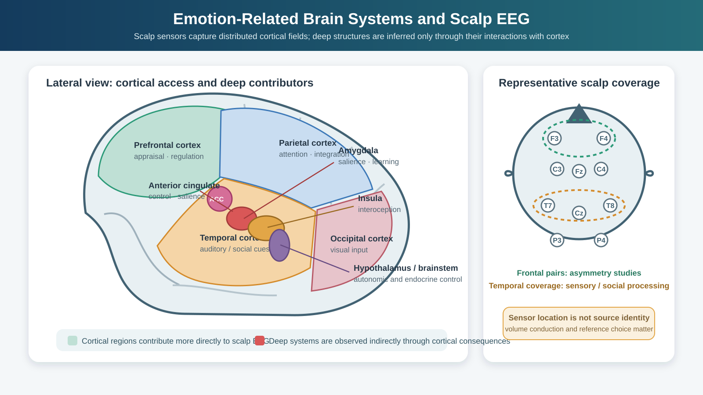
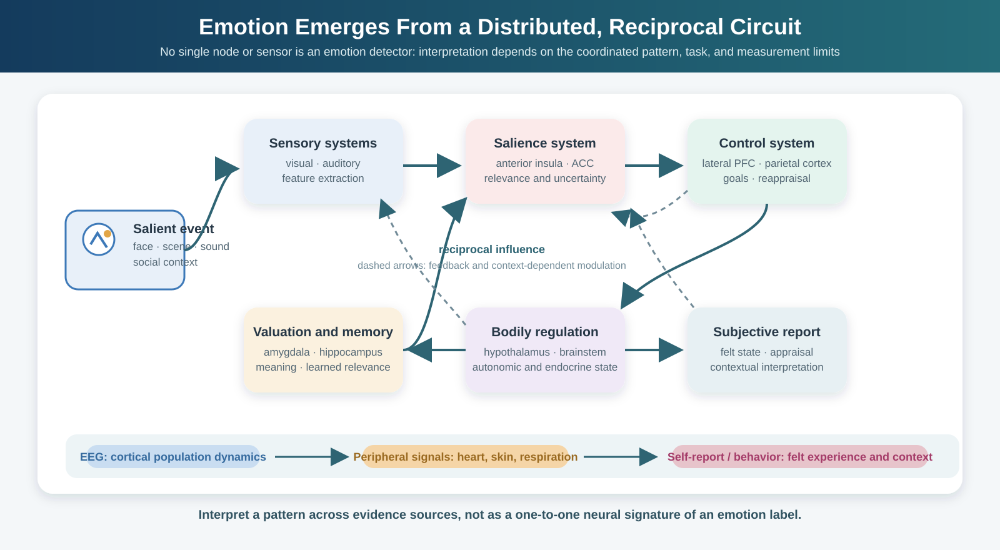

# Neuroscience Foundations for Affective Computing

## Overview

Emotion is not located in a single brain region, nor does a region have one fixed emotional meaning. It emerges from interactions among systems for perception, bodily regulation, memory, valuation, attention, and action. A threatening face, for example, can recruit visual cortex, amygdala, insula, autonomic control systems, and prefrontal regions at overlapping but different times.

This matters for EEG-based affective computing because a scalp recording is a partial, temporally precise view of that larger system. It can capture synchronized activity from superficial cortical populations, but it does not provide a direct readout of deep structures or of a person's emotional state. This section introduces the main structures and networks, then translates that neurobiology into realistic expectations for EEG analysis.

*Figure 1. Emotion-relevant cortical and subcortical systems contribute differently to what can be inferred from scalp EEG. Sensor positions provide spatial coverage, not a direct one-to-one map to individual brain structures.*

## Core Emotion-Related Brain Regions

### The Amygdala

The amygdala is a collection of nuclei in the medial temporal lobe. It helps prioritize biologically or socially relevant events, supports learning about threat and reward, and interacts closely with sensory, memory, autonomic, and prefrontal systems. Calling it a "fear center" is an oversimplification: amygdala responses also occur for novelty, uncertainty, reward-related cues, and salient non-emotional events.

**EEG relevance**: The amygdala is deep and spatially compact, so conventional scalp EEG cannot isolate its activity reliably. Its interactions with cortex may nevertheless alter cortical responses, particularly during the early allocation of attention to salient stimuli. A frontal or temporal scalp effect should therefore be interpreted as a cortical correlate of a broader circuit, not as a direct amygdala measurement.

### The Prefrontal Cortex (PFC)

The prefrontal cortex contributes to valuation, goal maintenance, attention, and the regulation of emotional responses. Its subdivisions are functionally heterogeneous and strongly interconnected; the labels below are useful landmarks rather than independent modules:

- **Dorsolateral PFC**: cognitive control and reappraisal
- **Ventromedial PFC**: valuation and emotional decision-making
- **Orbitofrontal cortex**: reward processing and expectation

**EEG relevance**: Frontal electrodes sample activity from several frontal sources, with substantial volume conduction and contributions from non-neural signals such as eye movements. Frontal alpha asymmetry is a useful research construct, but it reflects a relative spectral difference at the sensors rather than a direct measurement of left and right PFC activation. Its relation to affect is discussed in more detail in the EEG-correlates section.

### The Insula

The insula integrates interoceptive signals such as cardiac, respiratory, and visceral information with sensory and contextual information. It is often implicated in subjective feeling, disgust, pain, uncertainty, and the detection of personally relevant events. Its role is best understood as part of an interoceptive and salience-related system, not as a dedicated emotion detector.

**EEG relevance**: Because much of the insula lies beneath the opercula, source localization from scalp EEG is uncertain. Central and temporal sensor patterns can be compatible with insula-related processing, but they cannot establish it without converging evidence from anatomy, task design, or another modality.

### The Anterior Cingulate Cortex (ACC)

The ACC spans several functionally distinct zones. Broadly, it participates in monitoring conflict and control demands, learning from outcomes, pain and threat processing, and coordination of autonomic responses. It frequently appears alongside the anterior insula in studies of salient, uncertain, or effortful events.

**EEG relevance**: Frontal midline theta is often associated with cognitive control and performance monitoring, and medial frontal generators are plausible contributors. It is not an ACC-specific signature, however: the same sensor-level pattern can arise under many task conditions.

### The Hypothalamus and Brainstem

These structures coordinate autonomic and endocrine responses that accompany emotion, including changes in heart rate, respiration, sweating, and hormonal release. They link the brain to the body and help explain why peripheral measures such as electrocardiography and electrodermal activity can complement EEG.

**EEG relevance**: These are not directly visible in scalp EEG, but their downstream effects may influence peripheral measures and, indirectly, cortical state.

## Emotion Circuits, Not Single Regions

Modern neuroscience treats emotion as a distributed, context-dependent process rather than the output of isolated "emotion centers." The following large-scale network descriptions are useful summaries, although their boundaries vary across studies:

- **Salience network**: insula, ACC, amygdala — detects relevant stimuli
- **Default mode network**: medial PFC, posterior cingulate — self-referential processing
- **Executive control network**: dorsolateral PFC, parietal regions — regulation

These networks overlap and reconfigure with task demands. Scalp EEG samples parts of their cortical dynamics with millisecond resolution, but it has limited spatial specificity and reduced sensitivity to deep or radially oriented sources. Source reconstruction can support a network-level hypothesis, but it remains an ill-posed inference that depends on the head model, electrode coverage, reference, and regularization assumptions.

*Figure 2. Affective processing is distributed and reciprocal. EEG samples part of the cortical dynamics, whereas peripheral signals and self-report contribute complementary information about bodily state and subjective experience.*

## Neurotransmitter Systems

Several neurotransmitter systems modulate emotional states:

- **Dopamine**: reward, motivation, pleasure
- **Serotonin**: mood regulation, impulse control
- **Norepinephrine**: arousal, alertness, stress response
- **GABA and Glutamate**: inhibitory/excitatory balance

These systems act across broad circuits and are not one-to-one markers of particular feelings. For example, dopamine is involved in learning and motivation as well as reward, while serotonin has diverse effects that depend on receptor type and neural pathway. EEG does not measure transmitter concentration or release directly; at most, it can reveal population-level dynamics shaped partly by neuromodulation.

## What Neuroscience Tells EEG Researchers

Several practical lessons follow from the neuroscience:

1. Emotion is **distributed**, so no single channel, frequency band, or hand-picked region is likely to be sufficient.
2. Several important contributors are **subcortical**. Scalp EEG observes cortical activity and possible downstream consequences, not those structures directly.
3. **Lateralization** is conditional on task, person, reference scheme, and analysis choices. Frontal asymmetry is not a simple "left = positive, right = negative" rule.
4. **Individual differences** in anatomy, baseline rhythms, appraisal, and reporting can make a group-level effect unreliable for a particular participant.
5. **Temporal dynamics** matter. Sensory orienting, appraisal, regulation, and self-report can unfold on different time scales, from hundreds of milliseconds to minutes.

## Implications for EEG-Based Affective Computing

Given the neuroscience:

- Prefer multi-channel recordings when the question concerns spatial patterns or connectivity; a single-channel device can be useful for a constrained application, but it cannot support broad neural claims.
- Include frontal, central, and temporal coverage when the montage permits, while treating occipital responses carefully when visual stimuli are used because they may reflect stimulus properties rather than affect.
- Use time-resolved spectral or time-frequency analyses when the induction procedure has meaningful temporal structure.
- Compare subject-dependent, subject-independent, and calibrated models explicitly. Personal calibration may improve performance, but it changes the deployment claim.
- Pair EEG with behavioral, self-report, or peripheral measures when possible. Multimodal agreement can strengthen inference, whereas disagreement can reveal a timing or measurement problem worth investigating.

## Summary

Emotion arises from distributed brain circuits involving both cortical and subcortical structures. EEG can access cortical correlates of these circuits — especially in frontal and central regions — but cannot directly measure key subcortical contributors. This neuroscience perspective sets realistic expectations for what EEG-based affective computing can achieve and guides channel selection, feature design, and interpretation.

---

## References

- Craig, A. D. (2009). How do you feel--now? The anterior insula and human awareness. *Nature Reviews Neuroscience*, 10(1), 59-70.
- Lindquist, K. A., Wager, T. D., Kober, H., Bliss-Moreau, E., and Barrett, L. F. (2012). The brain basis of emotion: A meta-analytic review. *Behavioral and Brain Sciences*, 35(3), 121-143.
- Ochsner, K. N., and Gross, J. J. (2005). The cognitive control of emotion. *Trends in Cognitive Sciences*, 9(5), 242-249.
- Pessoa, L. (2008). On the relationship between emotion and cognition. *Nature Reviews Neuroscience*, 9(2), 148-158.
- Shackman, A. J., Salomons, T. V., Slagter, H. A., Fox, A. S., Winter, J. J., and Davidson, R. J. (2011). The integration of negative affect, pain and cognitive control in the cingulate cortex. *Nature Reviews Neuroscience*, 12(3), 154-167.
- Van den Heuvel, M. P., and Hulshoff Pol, H. E. (2010). Exploring the brain network: A review on resting-state fMRI functional connectivity. *European Neuropsychopharmacology*, 20(8), 519-534.

Next: [Emotion Theory: Discrete and Dimensional Models](02-emotion-theory-discrete-and-dimensional.md)
