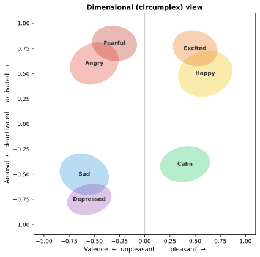
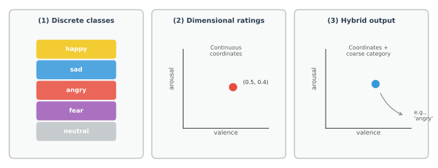

# Emotion Theory: Discrete and Dimensional Models

## Overview

Before building a system that recognizes emotion from EEG, we must decide what "emotion" means in computational terms. Psychology offers several competing frameworks, and the choice of framework directly determines the output space, loss function, and evaluation metrics of any affective computing system.

This section introduces the major emotion theories, their strengths and weaknesses, and their practical implications for EEG-based recognition.

*Figure 1. Dimensional circumplex (valence vs. arousal) with overlapping discrete-emotion regions. The blurred boundaries indicate that category labels are useful modelling choices, not sharply separated neural territories.*

## The Fundamental Tension

The central debate in emotion science can be framed as:

- **Are emotions discrete categories** with distinct neural, physiological, and behavioral signatures?
- **Are emotions continuous dimensions** that vary smoothly along axes such as valence and arousal?

Both views have empirical support, and neither is universally correct. The choice should follow the scientific question, the annotation procedure, and the decision an application must make. A system that selects one of a few intervention modes may require categories; a system that tracks a changing affective state may be better served by dimensions.

## Discrete Emotion Theories

### Basic Emotions (Ekman)

Paul Ekman proposed a set of **basic emotions** that are:

- universally recognized across cultures,
- associated with distinct facial expressions,
- evolutionarily adaptive,
- relatively brief in duration.

The classic set includes happiness, sadness, fear, anger, disgust, and surprise. The strength of this proposal is its clear vocabulary for prototypical expressions and events. Its limitation is that everyday experience is often weaker, mixed, culturally shaped, or context-dependent in ways that do not fit one label cleanly.

### Plutchik's Wheel of Emotions

Robert Plutchik organized emotions in a circumplex-like wheel with:

- eight primary emotions arranged as opposites,
- varying intensity levels,
- combinations that produce secondary emotions.

This model bridges discrete and dimensional thinking.

### Practical Implications for EEG

Discrete models suggest:

- classification tasks with a fixed set of labels,
- evaluation via accuracy, precision, recall, and confusion matrices,
- potential difficulty with ambiguous or mixed emotional states,
- sensitivity to class imbalance.

## Dimensional Emotion Models

### The Circumplex Model (Russell)

James Russell proposed that emotions can be mapped onto a two-dimensional space:

- **Valence**: pleasantness vs. unpleasantness (horizontal axis)
- **Arousal**: activation vs. deactivation (vertical axis)

In this framework, affective states occupy regions rather than exact points: the same label can have different intensity, context, and action tendency across people. Discrete emotion terms often cluster in characteristic areas of the space, but their regions overlap.

### The VAD Model

An extension adds a third dimension:

- **Dominance** (or control): feeling in control vs. feeling overwhelmed

This produces a 3D valence-arousal-dominance space, which can capture more nuanced emotional states.

### Practical Implications for EEG

Dimensional models suggest:

- regression tasks with continuous outputs,
- evaluation via mean squared error, correlation, or explained variance,
- the ability to represent ambiguous or mixed states naturally,
- potentially smoother learning signals.

## Appraisal Theories

Appraisal theories propose that emotions arise from cognitive evaluations of events along dimensions such as:

- novelty,
- goal relevance,
- coping potential,
- normative significance.

These theories emphasize that the same stimulus can produce different emotions depending on context and individual appraisal. This has implications for EEG because it suggests that stimulus-locked averaging may overlook important individual variability.

## Constructivist and Psychological Construction Views

Constructivist theories (e.g., Barrett's theory of constructed emotion) argue that emotions are not hardwired categories but are constructed by the brain from more basic psychological ingredients such as:

- core affect (valence and arousal),
- conceptual knowledge,
- interoceptive signals,
- contextual information.

This view has gained influence and is compatible with dimensional approaches. It does not imply that emotion is arbitrary; rather, it emphasizes that brain, body, learned concepts, and situation jointly shape an emotional episode.

*Figure 2. Three ways to represent emotion computationally. (1) Discrete classification assigns one of a fixed set of labels. (2) Dimensional regression predicts continuous coordinates. (3) A hybrid model predicts both a location in affect space and a coarse category label.*

## Which Framework for EEG-Based Affective Computing?

### Discrete Classification

**Strengths**:
- Intuitive and interpretable,
- straightforward evaluation,
- well-suited for applications needing categorical output (e.g., alert systems).

**Weaknesses**:
- may force artificial boundaries,
- struggles with mixed or ambiguous states,
- label granularity is arbitrary.

### Dimensional Regression

**Strengths**:
- captures nuance and ambiguity naturally,
- compatible with continuous annotation,
- allows interpolation in emotion space.

**Weaknesses**:
- less intuitive for non-experts,
- evaluation metrics can be harder to interpret,
- annotation is more demanding.

### Hybrid Approaches

Many systems use both:

- classify coarse emotion categories while also regressing valence/arousal,
- use dimensional annotations to derive discrete labels via thresholds,
- multi-task learning combining classification and regression.

## How This Affects EEG Modeling

The choice of emotion framework determines:

- **Output layer design**: softmax for classification, linear for regression
- **Loss function**: cross-entropy vs. MSE
- **Data requirements**: discrete labels may need balanced classes; dimensional labels need reliable continuous annotation
- **Evaluation**: accuracy vs. correlation vs. agreement measures
- **Interpretability**: discrete confusion matrices vs. dimensional error distributions

For dimensional ratings, evaluate agreement as well as error. A low mean-squared error can still hide a model that misses relative ordering or systematically shrinks predictions toward the mean. Report a scale-appropriate measure such as concordance correlation, along with the rating transformation, participant-level normalization policy, and the procedure used to turn ratings into classes when discretization is used.

## Summary

Emotion theory provides the conceptual vocabulary for affective computing. Discrete models simplify classification but may oversimplify emotional experience. Dimensional models capture nuance but complicate annotation and evaluation. The best choice depends on the application, the annotation resources available, and the nature of the EEG data. Many modern systems adopt a pragmatic blend of both approaches.

---

## References

- Barrett, L. F. (2017). *How Emotions Are Made: The Secret Life of the Brain*. Houghton Mifflin Harcourt.
- Ekman, P. (1992). An argument for basic emotions. *Cognition and Emotion*, 6(3-4), 169-200.
- Moors, A. (2009). Theories of emotion causation: A review. *Cognition and Emotion*, 23(4), 625-662.
- Plutchik, R. (1980). *Emotion: A Psychoevolutionary Synthesis*. Harper & Row.
- Russell, J. A. (1980). A circumplex model of affect. *Journal of Personality and Social Psychology*, 39(6), 1161-1178.
- Scherer, K. R. (2005). What are emotions? And how can they be measured? *Social Science Information*, 44(4), 695-729.

---

Next: [Self-Evaluation, Label Noise, and Annotation Challenges](03-self-evaluation-label-noise-and-annotation.md)
