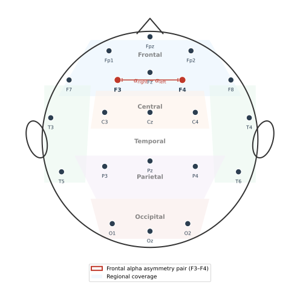

# EEG Correlates of Emotion

## Overview

This section bridges the neuroscience and emotion theory of earlier sections with the EEG signal that will be used in later chapters. It describes the main EEG features and patterns that have been linked to emotional states, organized by frequency band, spatial distribution, and connectivity.

These correlates are not deterministic rules — they are statistical regularities observed across studies, subjects, and paradigms. They provide useful starting points for feature engineering and interpretation, but they should not be treated as infallible markers.

*Figure 1. Sensor-space overview of a 10-20 montage. F3 and F4 (red) are the homologous frontal pair most often used to quantify frontal alpha asymmetry. Shaded regions indicate approximate scalp coverage; electrode position does not uniquely identify an underlying brain source.*

## Frontal Alpha Asymmetry

One of the most studied EEG-emotion relationships involves the balance of alpha power between left and right frontal regions. It is more accurately linked to approach-withdrawal tendencies and affective style than to a universal positive-versus-negative axis.

### The Basic Finding

Greater relative left frontal activity (i.e., lower alpha power on the left) has been associated in some paradigms with:

- positive affect,
- approach motivation,
- higher self-reported valence.

Greater relative right frontal activity has been associated in some paradigms with:

- negative affect,
- withdrawal motivation,
- lower self-reported valence.

### Measurement

Frontal alpha asymmetry is often quantified as:

$$\text{FAA} = \ln(\alpha_{\text{right}}) - \ln(\alpha_{\text{left}})$$

where $\alpha$ denotes alpha-band power at homologous frontal electrode pairs (e.g., F4 and F3).

With this convention, positive FAA scores indicate relatively greater left frontal activity. The sign reverses if the electrode order or subtraction convention is changed, so authors should always report the formula, band limits, reference, artifact-rejection procedure, and electrodes used.

### Important Caveats

- The effect is statistical, not deterministic at the single-trial level.
- Individual differences in anatomy and alpha generation affect measurement.
- Reference choice influences asymmetry estimates.
- The relationship has often been more reliable for trait-like affective style and approach motivation than for moment-to-moment valence.
- Not all studies replicate the simple left-positive/right-negative mapping.

## Frequency Band Power and Arousal

Arousal is often linked to broader spectral changes rather than lateralized ones. These changes may reflect vigilance, attention, task difficulty, and movement as well as affect, so an emotion interpretation requires an appropriate control condition and careful artifact handling.

### General Patterns

- **Higher arousal** is generally associated with:
  - decreased alpha power,
  - increased beta and gamma power,
  - shifts in theta/beta ratio.

- **Lower arousal** (calm, drowsy states) is generally associated with:
  - increased alpha power,
  - increased theta power in some contexts.

### Theta/Beta Ratio

The ratio of theta to beta power has been used as an index of cortical arousal and attention, with higher ratios sometimes associated with lower arousal or attentional deficits.

## Gamma Activity and Emotion

Gamma-band activity (above 30 Hz) has been linked to:

- emotional processing intensity,
- conscious emotional experience,
- integration of emotional information across brain regions.

However, scalp gamma is highly susceptible to facial, jaw, neck, and eye-muscle artifacts. Before treating a high-frequency difference as neural, inspect its topography, timing, spectral shape, and relation to electromyography or motion; use conservative filtering and artifact procedures documented in the preprocessing chapter.

## Spatial Patterns Across Channels

Different emotions may engage different spatial patterns:

- **Frontal regions**: strongly implicated in valence and regulation.
- **Central regions**: involved in arousal and motor preparation associated with emotion.
- **Temporal regions**: involved in processing emotional sounds, faces, and memories.
- **Parietal regions**: involved in emotional attention and representation.
- **Occipital regions**: mainly driven by visual stimulus properties rather than emotion per se.

This spatial distribution is one reason multi-channel EEG is preferable to single-channel systems.

## Connectivity and Network-Level Correlates

Beyond power at individual channels, emotion affects how brain regions communicate:

- **Functional connectivity** measured by correlation, coherence, or phase synchrony between channels,
- **Effective connectivity** attempting to model directed influence,
- **Graph-theoretic measures** that summarize network organization.

Connectivity estimates are sensitive to volume conduction, reference choice, filtering, epoch length, and common stimulus drive. Phase-lagged measures and suitable surrogate or control analyses can reduce some confounds, but they do not by themselves establish directed communication between brain regions.

## Event-Related Potentials (ERPs) and Emotion

Though affective computing often uses continuous or longer-duration EEG, ERPs provide important evidence about emotional processing:

- **Late Positive Potential (LPP)**: enhanced for emotionally salient stimuli, modulated by arousal,
- **N170 and EPN**: early components modulated by emotional faces and scenes,
- **P300**: modulated by emotional relevance and novelty.

These ERP findings help establish that emotional salience can modulate time-locked EEG responses under controlled conditions. They do not guarantee that the same components will be recoverable from long, naturalistic trials or that they support reliable single-trial classification.

*Figure 2. Illustrative EEG-emotion correlates from simulated data. Each panel shows a representative pattern rather than a diagnostic signature: (a) frontal alpha power spectra and the asymmetry score, (b) time-frequency power aligned to stimulus onset, and (c) an event-related potential with an enhanced late positive potential (LPP) for emotional stimuli.*

## Individual Differences

EEG-emotion relationships vary substantially across individuals due to:

- skull thickness and conductivity,
- cortical folding and anatomy,
- baseline alpha power,
- personality traits,
- emotional reactivity,
- age and sex.

This is a major reason why subject-independent emotion recognition is harder than subject-dependent recognition.

## What EEG Cannot Tell Us About Emotion

It is equally important to recognize the limits:

- EEG cannot directly measure deep brain structures critical for emotion.
- EEG cannot distinguish between different emotions that produce similar cortical patterns.
- EEG-emotion relationships are correlational, not causal.
- Single-trial classification is difficult because the signal is noisy and the emotional signal is weak.
- EEG alone may not be sufficient for fine-grained emotion discrimination without additional context.

## Summary

EEG carries measurable correlates of emotional states, particularly in frontal alpha asymmetry, frequency band power distributions, and connectivity patterns. These correlates provide useful features and interpretive anchors, but they are statistical regularities, not deterministic signatures. Their reliability varies across individuals, paradigms, and recording conditions, which is why data-driven approaches that learn features from data have become popular.

---

## References

- Allen, J. J. B., Coan, J. A., and Nazarian, M. (2004). Issues and assumptions on the road from raw signals to metrics of frontal EEG asymmetry in emotion. *Biological Psychology*, 67(1-2), 183-218.
- Davidson, R. J. (1992). Anterior cerebral asymmetry and the nature of emotion. *Brain and Cognition*, 20(1), 125-151.
- Hajcak, G., MacNamara, A., and Olvet, D. M. (2010). Event-related potentials, emotion, and emotion regulation: An integrative review. *Developmental Neuropsychology*, 35(2), 129-155.
- Keil, A., Debener, S., Gratton, G., Junghofer, M., Kappenman, E. S., Luck, S. J., Luu, P., Miller, G. A., and Yee, C. M. (2014). Committee report: Publication guidelines and recommendations for studies using EEG and MEG. *Psychophysiology*, 51(1), 1-21.
- Klimesch, W. (2012). Alpha-band oscillations, attention, and controlled access to stored information. *Trends in Cognitive Sciences*, 16(12), 606-617.
- Whitham, E. M., Pope, K. J., Fitzgibbon, S. P., Lewis, T., Clark, C. R., Loveless, S., Broberg, M., Wallace, A., DeLosAngeles, D., Lillie, P., Hardy, A., Fronsko, R., Pulbrook, A., and Willoughby, J. O. (2007). Scalp electrical recording during paralysis: Quantitative evidence that EEG frequencies above 20 Hz are contaminated by EMG. *Clinical Neurophysiology*, 118(8), 1877-1888.

Next: [Emotion Induction and Experimental Paradigms](05-emotion-induction-and-experimental-paradigms.md)
