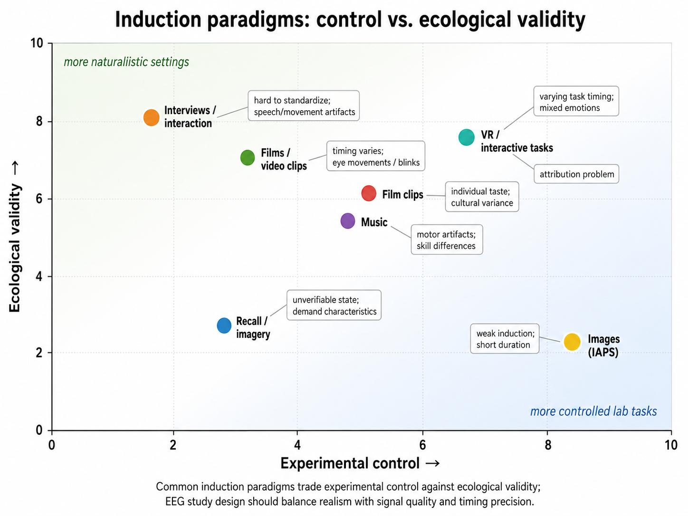
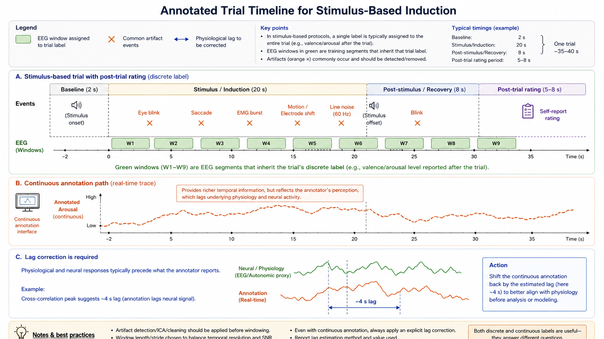

# Emotion Induction and Experimental Paradigms

## Overview

The EEG data used in affective computing must come from somewhere. How emotions are induced during recording strongly affects the nature, quality, and ecological validity of the resulting data. This section reviews common induction methods, their strengths and weaknesses, and their implications for EEG-based emotion recognition.

An induction procedure is not successful merely because a stimulus has been assigned an intended emotion. The study should test whether participants actually reported or displayed the expected change, how variable that change was, and when it occurred relative to the EEG segment being labelled.

*Figure 1. Common emotion-induction paradigms trade experimental control against ecological validity. Labels note the main EEG artifact or timing risk for each method.*

## Stimulus-Based Induction

The most common approach uses carefully selected stimuli to evoke target emotional states.

### Visual Stimuli

**International Affective Picture System (IAPS)** and similar databases provide images with normative ratings of valence, arousal, and dominance. Those norms are useful for selecting and balancing stimuli, but they are population summaries rather than a guarantee of an individual participant's response.

Pros:
- well-controlled,
- large normed databases available,
- easy to standardize across studies.

Cons:
- static images may produce weaker emotional responses than dynamic stimuli,
- short duration limits temporal dynamics,
- cultural and individual variability in responses.

### Video Clips

Film clips are widely used because they combine visual, auditory, and narrative elements.

Pros:
- stronger and more sustained emotional induction,
- more ecologically valid than static images,
- well-suited for studying temporal emotion dynamics with EEG.

Cons:
- harder to control the exact timing of emotional peaks,
- individual engagement with narrative varies,
- clips may evoke mixed or evolving emotions.

### Music and Auditory Stimuli

Music can evoke strong emotions without visual input.

Pros:
- modality-specific (useful for studying auditory emotion processing),
- strong arousal induction,
- relatively independent of visual artifacts.

Cons:
- personal music preference strongly affects response,
- genre and cultural familiarity matter,
- harder to norm universally.

### Multi-Modal Stimuli

Combining video, audio, and sometimes tactile or olfactory stimuli often produces the strongest and most reliable emotional responses.

The tradeoff is attribution: when several modalities change together, a spectral or evoked EEG effect cannot easily be assigned to one sensory stream, narrative element, or emotional component. Record event markers for all meaningful stimulus boundaries and preserve them with the released data.

## Interactive and Naturalistic Paradigms

### Game-Based Induction

Video games can induce frustration, excitement, flow, or achievement emotions.

Pros:
- high engagement,
- naturalistic emotional dynamics,
- suitable for studying emotion during active tasks.

Cons:
- motor artifacts in EEG,
- difficult to control the exact timing of emotional events,
- individual skill differences affect experience.

### Social Interaction

Real or simulated social interactions can evoke emotions such as embarrassment, pride, empathy, or social anxiety.

Pros:
- high ecological validity,
- engages social-emotional circuits strongly.

Cons:
- hard to standardize,
- strong individual differences,
- EEG artifacts from speech and movement.

### Recall and Imagery

Participants are asked to recall or imagine emotional experiences.

Pros:
- no external equipment needed beyond EEG,
- can target specific emotions.

Cons:
- hard to verify what the participant is actually experiencing,
- weaker physiological responses than direct stimulation,
- susceptible to demand characteristics.

## Key Experimental Design Choices

### Within-Subject vs. Between-Subject

- **Within-subject**: same participants experience all conditions, reducing individual differences but risking carryover effects.
- **Between-subject**: different participants in different conditions, cleaner comparisons but larger individual variability.

### Trial Duration and Inter-Stimulus Interval

- Short trials (1–5 seconds) are common for ERP studies.
- Longer trials (30 seconds to several minutes) are better for capturing sustained emotional states relevant to affective computing.
- Inter-stimulus intervals should allow emotional responses to return to baseline.

### Baseline Measurement

Always record a pre-stimulus baseline. This allows:

- normalization of individual differences in resting EEG,
- subtraction of pre-existing state effects,
- computation of change scores relative to baseline.

A baseline is a reference, not a neutral guarantee. Quiet rest can include anticipation, rumination, or drowsiness. Define its duration and timing in advance, use a consistent procedure, and inspect whether baseline quality differs systematically across conditions or participants.

### Counterbalancing and Randomization

Emotion induction order matters because:

- earlier emotions may carry over to later trials,
- fatigue reduces emotional responsiveness,
- practice effects can change task engagement.

Counterbalancing or randomization reduces order confounds.

### Manipulation Checks and Timing

Plan a manipulation check before data collection. At minimum, compare condition-level self-report with the intended ordering in valence or arousal and report both the group pattern and individual variability. For continuous EEG labels, document the assumed relationship among stimulus onset, physiological response, annotation lag, and analysis windows. A model can otherwise appear to predict emotion while exploiting trial order, stimulus identity, or a late summary rating.

*Figure 2. Annotated trial timeline for stimulus-based induction. Green windows show EEG segments assigned to the trial label; orange crosses mark common artifact events. The continuous-annotation path records a real-time trace that still requires an explicit lag correction relative to physiology.*

## Common Affective Computing Datasets

Several well-known datasets use these paradigms:

- **DEAP**: music video clips with valence/arousal/dominance self-ratings
- **SEED / SEED-IV / SEED-V**: film clips inducing discrete emotions
- **MAHNOB-HCI**: video clips with continuous annotation and multiple physiological signals
- **DREAMER**: film clips with EEG and ECG recordings
- **AMIGOS**: combined short and long video clips with personality and mood data

Each dataset makes different choices about induction method, annotation style, EEG hardware, preprocessing, and train-test protocol. These differences affect what models can be trained and how results should be compared; performance numbers are not directly interchangeable across datasets.

## Implications for EEG-Based Affective Computing

### Data Quality

- Stronger induction produces larger EEG effects and easier classification.
- But very strong induction may not represent everyday emotional experience.

### Generalization

- Models trained on passive viewing may not transfer to active tasks.
- Models trained on one induction modality (e.g., video) may not work well on another (e.g., music).
- Cross-dataset generalization remains a major challenge.

### Annotation Alignment

- If labels are obtained post-stimulus but EEG is continuous, there is a temporal alignment problem: when exactly did the emotion occur?
- Continuous annotation reduces but does not eliminate this issue.

### Practical Recommendations

1. Choose induction methods that match the target application.
2. Record baselines and demographic/psychological metadata.
3. Use multiple trials per condition for statistical power.
4. Consider both categorical and dimensional annotation.
5. Be transparent about induction methods when reporting results — they strongly affect what conclusions can be drawn.
6. Report manipulation-check results, event markers, exclusions, and the temporal rule used to assign labels to EEG windows.

## Summary

Emotion induction paradigms shape the EEG data that affective computing systems learn from. Stimulus-based methods offer control but may lack ecological validity; interactive paradigms offer realism but introduce artifacts and variability. Understanding these tradeoffs is essential for interpreting model performance and for designing new data collection efforts.

---

## References

- Bradley, M. M., and Lang, P. J. (2007). The International Affective Picture System (IAPS) in the study of emotion and attention. In J. A. Coan and J. J. B. Allen (Eds.), *Handbook of Emotion Elicitation and Assessment* (pp. 29-46). Oxford University Press.
- Correa, J. A. M., Abadi, M. K., Sebe, N., and Patras, I. (2018). AMIGOS: A dataset for affect, personality and mood research on individuals and groups. *IEEE Transactions on Affective Computing*, 9(1), 85-98.
- Katsigiannis, S., and Ramzan, N. (2018). DREAMER: A database for emotion recognition through EEG and ECG signals from wireless low-cost off-the-shelf devices. *IEEE Journal of Biomedical and Health Informatics*, 22(1), 98-107.
- Koelstra, S., Muhl, C., Soleymani, M., Lee, J.-S., Yazdani, A., Ebrahimi, T., Pun, T., Nijholt, A., and Patras, I. (2012). DEAP: A database for emotion analysis using physiological signals. *IEEE Transactions on Affective Computing*, 3(1), 18-31.
- Soleymani, M., Lichtenauer, J., Pun, T., and Pantic, M. (2012). A multimodal database for affect recognition and implicit tagging. *IEEE Transactions on Affective Computing*, 3(1), 42-55.
- Westermann, R., Spies, K., Stahl, G., and Hesse, F. W. (1996). Relative effectiveness and validity of mood induction procedures: A meta-analysis. *European Journal of Social Psychology*, 26(4), 557-580.
- Zheng, W.-L., and Lu, B.-L. (2015). Investigating critical frequency bands and channels for EEG-based emotion recognition with deep neural networks. *IEEE Transactions on Autonomous Mental Development*, 7(3), 162-175.

**Related Reading**: See [EEG Correlates of Emotion](04-eeg-correlates-of-emotion.md) for how different induction methods engage different EEG signatures.
