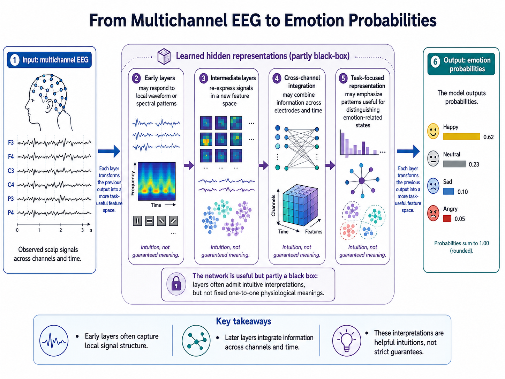

# Neural Network Foundations

## Overview

At its core, deep learning asks a practical question: how can a model learn a useful mapping from observations to a desired output? In EEG-based affective computing, the observation may be a multichannel signal segment and the output may be an emotion category, a valence or arousal score, or a compact representation for a later task. Neural networks are valuable because they offer a flexible family of functions for learning these mappings from data.

The central idea is simple. Instead of deciding in advance which signal features matter, a neural network can learn intermediate representations that make the final prediction easier. This section develops that idea by moving from linear models to nonlinear layers, then explaining what depth, width, and universal approximation do--and do not--tell us about practical EEG models.

## From Linear Prediction to Learned Representations

A linear predictor maps an input $x \in \mathbb{R}^d$ to an output $\hat{y}$ as

$$\hat{y} = w^T x + b.$$

Linear models are often useful baselines: they are efficient, relatively interpretable, and can work well with carefully designed EEG features. Their limitation is that they can only form linear decision boundaries. In affective EEG, informative patterns may depend on interactions between channels, frequency bands, and time. A change in frontal asymmetry, for example, may matter only in combination with particular spectral or temporal patterns elsewhere in the recording.

A neural network extends a linear model by applying a nonlinear transformation after the weighted sum:

$$z = w^T x + b, \qquad a = \sigma(z),$$

where $\sigma$ is an activation function. Sigmoid and hyperbolic tangent were historically important choices, while rectified linear units (ReLU) and related activations are common in modern networks. The choice is not cosmetic. If every layer were linear, however many layers were stacked, their composition would still be one linear map. Nonlinearity is what allows a network to represent more complex relationships.

A feedforward network repeats this operation across layers:

$$h^{(1)} = \sigma(W^{(1)}x + b^{(1)}),$$
$$h^{(2)} = \sigma(W^{(2)}h^{(1)} + b^{(2)}),$$
$$\hat{y} = f_{\text{out}}(W^{(L)}h^{(L-1)} + b^{(L)}).$$

The vectors $h^{(1)}, h^{(2)}, \dots$ are called hidden representations. Each layer converts the output of the preceding layer into a new feature space that may be more useful for the task. For EEG, early layers might respond to local waveform or spectral patterns, later layers might combine information across channels, and the final layers might emphasize patterns that help distinguish emotion-related states. These are useful intuitions rather than a guarantee that every layer has a single, easily named meaning.

**Figure 3.1: Learned representations for EEG-based emotion prediction.** Multichannel EEG is transformed through successive hidden layers before producing emotion probabilities. The hidden-layer descriptions are conceptual rather than fixed physiological labels.

## Capacity: Depth and Width

The expressive capacity of a network is shaped most visibly by its width, the number of units in a layer, and its depth, the number of successive layers. A wide layer can combine many nonlinear features in parallel. Depth instead builds complex functions by repeatedly composing simpler transformations. This compositional structure is one reason deep networks can represent some structured functions far more efficiently than a single, very wide hidden layer.

Neither dimension should be increased automatically. EEG datasets often have limited numbers of participants and highly correlated samples within a recording. A wider or deeper network can fit more complicated signal patterns, but it also has more opportunity to memorize subject-specific cues, artifacts, or noise. Architecture selection is therefore a balance between the complexity of the target relationship and the amount and diversity of data available to identify it.

## What Universal Approximation Establishes

The universal approximation theorem provides an important theoretical anchor. Informally, it states that a sufficiently wide network with an appropriate nonlinear activation can approximate any continuous function on a compact domain to arbitrary accuracy. One common form says that, for a continuous function $f$, there can be a one-hidden-layer network

$$g(x) = \sum_{i=1}^{m} a_i \sigma(w_i^T x + b_i)$$

such that

$$\sup_x |f(x) - g(x)| < \epsilon$$

for any $\epsilon > 0$, provided that the number of hidden units $m$ is large enough.

This result explains why neural networks are not inherently too rigid for nonlinear EEG tasks and why activations are central to their expressive power. It does not, however, say that a network can be learned efficiently from finite data, that an optimizer will discover the desired solution, or that a shallow and extremely wide model is the best practical design. Approximation capacity, optimization, and generalization are different questions. In noisy, small-sample EEG settings, a model may be capable of representing the target mapping without having enough evidence to learn it reliably.

## A Function-Approximation View of EEG Tasks

This perspective unifies several common goals in affective computing. In classification, the network learns a mapping from EEG $x$ to a discrete emotion label. In regression, it maps $x$ to a continuous valence or arousal score. In representation learning, it maps $x$ to a latent code $z$ that retains useful structure for a later task. The output changes, but the basic challenge is the same: choose a function class expressive enough for the problem and constrained enough to learn from the available data.

For this reason, neural networks should be viewed as learned feature extractors as well as predictors. Their expressive power makes them promising for EEG, but it is only the beginning of the story. The next section considers how a network is fitted to data by defining a loss and minimizing it.

## Summary

Neural networks generalize linear models by composing nonlinear transformations and learning hidden representations. Depth and width determine aspects of their capacity, while the universal approximation theorem explains their theoretical flexibility. None of these facts guarantees a useful EEG model on its own: data quality, optimization, and generalization remain decisive.

## References

- Cybenko, G. (1989). Approximation by superpositions of a sigmoidal function. *Mathematics of Control, Signals and Systems*, 2, 303-314.
- Goodfellow, I., Bengio, Y., and Courville, A. (2016). *Deep Learning*. MIT Press.
- Hornik, K., Stinchcombe, M., and White, H. (1989). Multilayer feedforward networks are universal approximators. *Neural Networks*, 2(5), 359-366.

---

Next: [Empirical Risk Minimization and Optimization](02-empirical-risk-minimization-and-optimization.md)