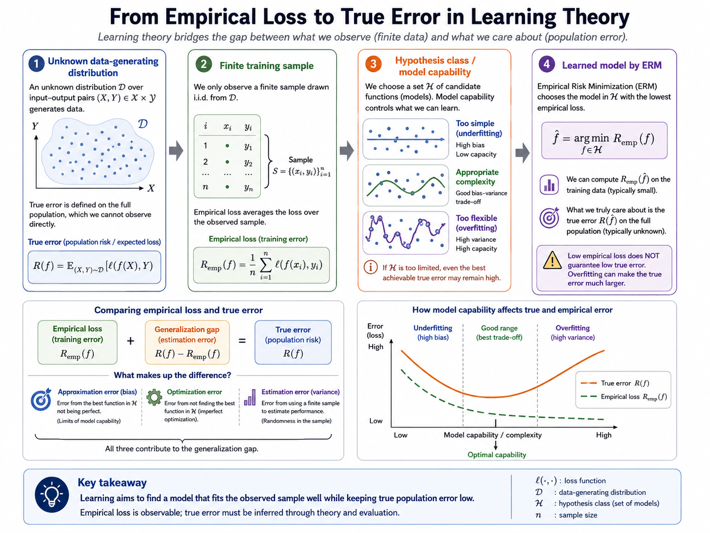
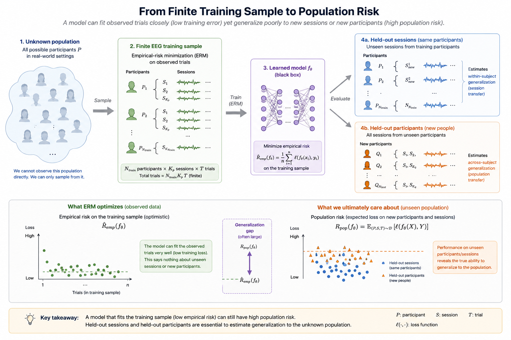

# Empirical Risk Minimization and Optimization

## Overview

After choosing a neural-network architecture, learning becomes a question of preference: among all possible parameter settings, which one should the model prefer? Empirical risk minimization (ERM) answers by selecting parameters that make costly mistakes rare on the observed data. It is the organizing principle behind most modern deep-learning training procedures.

For EEG-based affective computing, this viewpoint makes an important distinction visible. A model is shaped not only by its architecture, but also by the errors its loss function rewards, the data distribution represented by the training set, and the behavior of the optimizer used to reduce that loss.

## From the Ideal Objective to Training Data

Let $$f_\theta(x)$$ be a model with parameters $$\theta$$, and let $$\ell(f_\theta(x), y)$$ measure the cost of predicting $$f_\theta(x)$$ when the target is $$y$$. If examples were drawn from a known distribution $$\mathcal{D}$$, the ideal objective would be the population risk

$$R(\theta) = \mathbb{E}_{(x,y) \sim \mathcal{D}}[\ell(f_\theta(x), y)].$$

The distribution is unknown, so training replaces this expectation with the average loss on a dataset of $$n$$ examples:

$$\hat{R}_n(\theta) = \frac{1}{n} \sum_{i=1}^n \ell(f_\theta(x_i), y_i).$$

Minimizing $$\hat{R}_n$$ is ERM. It is sensible because the training set is the available evidence, but it is not identical to minimizing $$R$$. A model can fit the observed trials closely while performing poorly for new sessions or new participants. This gap is especially important for EEG, where subjective labels, artifacts, and participant differences can distort the training sample.

**Figure 3.2: Error decomposition in learning theory.** Total prediction error can be decomposed into approximation error, estimation error, and optimization error. Approximation error reflects a model class that is too limited for the task; estimation error reflects finite-sample uncertainty from the training set; optimization error reflects the failure to find the model that best fits the objective. In EEG, label noise, participant heterogeneity, and unstable optimization can make the practical error much larger than the training loss alone suggests.

**Figure 3.3: Population risk and empirical risk.** An unknown population supplies a finite EEG training sample for empirical-risk minimization, while held-out participants and sessions provide evidence about population risk and generalization.

## Losses Specify What Counts as an Error

The loss function translates the scientific task into an optimization target. For $$K$$-class emotion classification, cross-entropy compares the predicted class probabilities $$\hat{p}_k$$ with a one-hot target $$y_k$$:

$$\ell_{\text{CE}} = - \sum_{k=1}^{K} y_k \log \hat{p}_k.$$

For continuous valence or arousal scores, mean squared error is a common choice:

$$\ell_{\text{MSE}} = \|y - \hat{y}\|^2.$$

Representation-learning objectives can instead encourage related EEG segments to have nearby embeddings and unrelated segments to be separated. There is no universally correct loss: its assumptions must match the target, the label quality, and the consequences of different errors. Class imbalance or unreliable self-reports, for example, may require weighting, robust losses, or a revised target definition rather than merely longer training.

## Searching for Good Parameters

Deep networks are trained by seeking

$$\theta^* = \arg\min_\theta \hat{R}_n(\theta).$$

The objective is high-dimensional and nonconvex, so closed-form solutions are usually unavailable. Gradient descent moves parameters in the direction that locally reduces the empirical risk:

$$\theta_{t+1} = \theta_t - \eta \nabla_\theta \hat{R}_n(\theta_t),$$

where $$\eta$$ is the learning rate. Computing this gradient across an entire dataset at every step is expensive, so stochastic gradient descent (SGD) estimates it with a mini-batch $$\mathcal{B}$$:

$$\theta_{t+1} = \theta_t - \eta \nabla_\theta \hat{R}_{\mathcal{B}}(\theta_t).$$

Mini-batches make training feasible and introduce noise into the updates. Momentum smooths updates by accumulating past gradients, while Adam adapts step sizes using running estimates of gradient moments. AdamW combines this adaptive behavior with decoupled weight decay. These optimizers are useful tools, not substitutes for a sound objective or validation design.

## Why Optimization Is Fragile in EEG Studies

The optimization landscape depends on initialization, parameterization, and the data seen in each batch. Xavier/Glorot and He initialization schemes aim to keep activations and gradients well scaled at the start of training. Learning-rate schedules, normalization, and batch construction then influence whether training remains stable.

EEG makes these choices consequential. A small number of participants can leave a large model underconstrained; batches that mix heterogeneous subjects can produce conflicting update directions; artifacts or label noise can dominate the gradient. Channel-wise normalization, balanced or subject-aware sampling, robust preprocessing, and early stopping are therefore parts of the optimization procedure, not mere implementation details.

Often the objective also includes an explicit penalty:

$$\hat{R}_n^{\text{reg}}(\theta) = \hat{R}_n(\theta) + \lambda \Omega(\theta),$$

where $$\Omega(\theta)$$ may be L2 weight decay, an L1 sparsity penalty, or a domain-specific constraint. This connects fitting the data directly to the broader question of generalization.

## Summary

ERM turns learning into the minimization of a loss over observed data, while gradient-based optimization makes that minimization practical for large networks. The resulting model reflects the loss, data, optimizer, and regularization choices together. The next section explains how the gradients required by these updates are computed efficiently through layered networks.

## References

- Bottou, L. (2010). Large-scale machine learning with stochastic gradient descent. In *Proceedings of COMPSTAT 2010*.
- Kingma, D. P., and Ba, J. (2015). Adam: A method for stochastic optimization. *International Conference on Learning Representations*.
- Loshchilov, I., and Hutter, F. (2019). Decoupled weight decay regularization. *International Conference on Learning Representations*.
- Vapnik, V. N. (1998). *Statistical Learning Theory*. Wiley.

---

Next: [Backpropagation and Training Dynamics](03-backpropagation-and-training-dynamics.md)