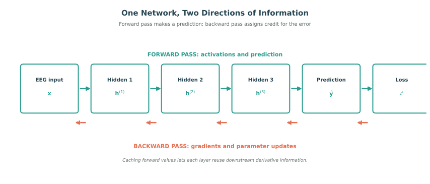

# Backpropagation and Training Dynamics

## Overview

Gradient-based optimization is only useful if a model can calculate how each parameter affects its loss. Backpropagation makes that calculation practical by applying the chain rule through a network in reverse order. It is the mechanism that turns a layered computation into trainable parameters, and it also explains several of the most common failures of deep models.

## From a Forward Pass to a Gradient

Consider a two-layer network:

$$h = \sigma(W_1x+b_1), \qquad \hat{y}=W_2h+b_2, \qquad \mathcal{L}=\ell(\hat{y},y).$$

The forward pass calculates the hidden state, prediction, and loss. The backward pass asks how a small change to each earlier quantity would change that loss. For a nested computation, the chain rule gives

$$\frac{\partial \mathcal{L}}{\partial W} = \frac{\partial \mathcal{L}}{\partial \hat{y}}\cdot\frac{\partial \hat{y}}{\partial h}\cdot\frac{\partial h}{\partial W}.$$

In a layered network, define $z^{(l)}=W^{(l)}h^{(l-1)}+b^{(l)}$ and $h^{(l)}=\sigma(z^{(l)})$. The backward pass propagates an error signal $\delta^{(l)}=\partial\mathcal{L}/\partial z^{(l)}$, producing

$$\frac{\partial \mathcal{L}}{\partial W^{(l)}}=\delta^{(l)}(h^{(l-1)})^T, \qquad \frac{\partial \mathcal{L}}{\partial b^{(l)}}=\delta^{(l)},$$

with the recursion

$$\delta^{(l)}=((W^{(l+1)})^T\delta^{(l+1)})\odot\sigma'(z^{(l)}).$$

By caching forward values and reusing downstream derivatives, backpropagation avoids recomputing the same work for each parameter. Automatic-differentiation systems in PyTorch and TensorFlow automate this bookkeeping, but they still rely on this principle.

## When Gradients Do Not Travel Well

The recursion above multiplies many derivative terms. When those terms are repeatedly small, gradients vanish before reaching early layers; when they are repeatedly large, gradients explode and produce unstable updates. Saturated sigmoid or tanh units, deep temporal models, long sequences, and poorly scaled inputs can make either problem more likely.

Several design choices improve gradient flow. ReLU-like activations reduce saturation. Careful initialization keeps initial signal magnitudes in a useful range. Batch or layer normalization stabilizes intermediate representations, while residual connections provide short paths through deep networks. For unstable recurrent or temporal models, gradient clipping limits the update magnitude:

$$g \leftarrow g\cdot\min\left(1,\frac{c}{\|g\|}\right).$$

These techniques help, but trainability is not a property of architecture alone. Batch size, optimizer, learning-rate schedule, data ordering, and regularization also determine how the model evolves during training.

## EEG-Specific Training Considerations

EEG signals can vary sharply in amplitude across channels, sessions, and participants. Artifacts may dominate the loss, noisy labels can send misleading gradient signals, and heterogeneous batches can encourage incompatible updates. Channel-wise normalization, artifact-aware preprocessing, balanced batches across classes or subjects, and appropriate loss weighting make the gradients more meaningful before any optimizer is applied.

Monitoring training is equally important. A declining loss does not prove that the model is learning emotion-related structure; it may be exploiting subject identity or session artifacts. Training curves, gradient norms, and held-out subject performance provide complementary evidence about whether optimization is stable and useful.

## Summary

Backpropagation efficiently computes gradients by applying the chain rule from the loss back through each layer. Its recursive nature makes deep learning scalable, but also creates vanishing and exploding gradient risks. Sound initialization, normalization, residual paths, and data preparation help convert a mathematically valid gradient into a stable learning signal.

## References

- He, K., Zhang, X., Ren, S., and Sun, J. (2015). Delving deep into rectifiers: Surpassing human-level performance on ImageNet classification. *IEEE International Conference on Computer Vision*.
- Hochreiter, S. (1991). *Untersuchungen zu dynamischen neuronalen Netzen*. Diploma thesis, Technical University of Munich.
- Ioffe, S., and Szegedy, C. (2015). Batch normalization: Accelerating deep network training by reducing internal covariate shift. *International Conference on Machine Learning*.
- Rumelhart, D. E., Hinton, G. E., and Williams, R. J. (1986). Learning representations by back-propagating errors. *Nature*, 323, 533-536.

---

Next: [Generalization, Overfitting, and Regularization](04-generalization-overfitting-and-regularization.md)