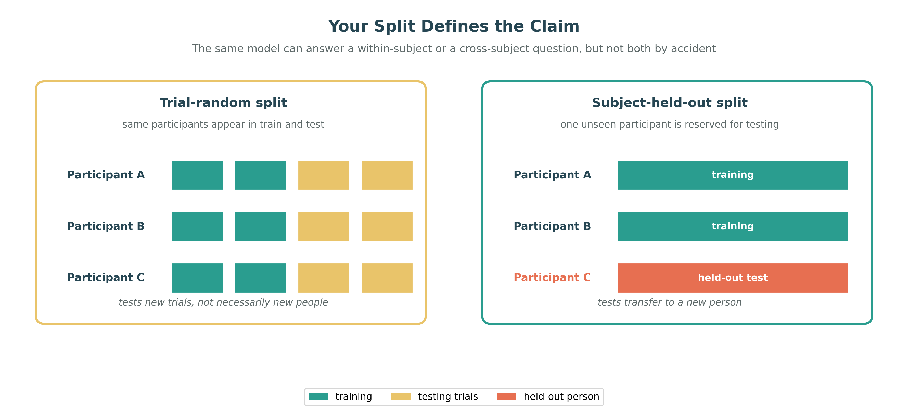

# Generalization, Overfitting, and Regularization

## Overview

The purpose of a learning system is not to reproduce its training data; it is to make reliable predictions on data it has not seen. This ability is called generalization. In EEG-based affective computing, it is particularly difficult because recordings are noisy, participant pools are often small, and the relationship between EEG and reported emotion can differ across people and sessions.

## The Gap Between Training and New Data

Training error measures performance on the examples used to fit a model. Test error measures performance on held-out examples that were not used for fitting or model selection. When training performance continues to improve while held-out performance stagnates or worsens, the model is overfitting: it has captured details of the training set that do not transfer.

In the language of empirical risk, the generalization gap is

$$R(\theta)-\hat{R}_n(\theta),$$

the difference between the unknown population risk and the observed training risk. A small gap is desirable, but it cannot be inferred from training accuracy alone. It must be estimated with a validation design that matches the intended use of the model.

EEG provides many ways for an apparent success to be misleading. A classifier may recognize participant identity rather than emotion, exploit session-specific noise, or benefit from preprocessing information that leaked across a train-test boundary. Such a model can achieve impressive within-dataset scores while failing on a new participant or recording session.

## Capacity, Bias, and Variance

The bias-variance perspective provides a useful, if simplified, way to think about this problem. A model with high bias is too constrained to capture a meaningful pattern and underfits: both training and test performance are poor. A model with high variance is too sensitive to the particular training sample and overfits: training performance is strong, but test performance is weak.

Capacity grows with architectural flexibility, including depth, width, and the number of adjustable parameters. More capacity can model complex relationships, but it also makes it easier to memorize artifacts or sampling quirks. EEG is a demanding regime because high-dimensional inputs and correlated channels are commonly paired with a small number of participants and subjective annotations. A smaller, well-matched model can therefore generalize better than a much larger one.

## Regularization as Controlled Flexibility

Regularization places useful constraints on the fitting process. L2 weight decay, for example, adds a penalty for large parameter values:

$$\mathcal{L}_{\text{reg}}=\mathcal{L}+\lambda\|\theta\|_2^2.$$

Dropout randomly suppresses units during training, discouraging fragile co-adaptation. Early stopping halts training when validation performance stops improving, which is often one of the most effective practical defenses against overfitting in small EEG datasets. Data augmentation can further expose the model to plausible variation, such as temporal jitter, modest additive noise, frequency perturbations, or masked channels and time spans. Each augmentation must preserve the target label under the scientific assumptions of the task; a transformation that changes affect-relevant content is not a valid regularizer.

Normalization and architectural control also matter. Properly scaled inputs make optimization more stable, and a deliberately small model may be the most appropriate form of regularization when data are limited. These methods do not eliminate the need for a sound evaluation protocol.

## Validation Is Part of the Model

For EEG, the train-test split determines the claim a result can support. Subject-dependent evaluation asks whether a model can predict new trials from participants represented in training. Subject-independent evaluation asks whether it transfers to a previously unseen participant. Leave-one-subject-out and session-aware protocols make these distinctions explicit.

Preprocessing must respect the same boundary. Normalization statistics, feature selection, and hyperparameter choices should be estimated using training data only and then applied to held-out data. Otherwise, information leakage produces overly optimistic estimates of generalization. The correct protocol is not universally the strictest one; it is the one that matches the deployment or scientific question and is reported clearly.

**Figure 3.4: Trial-random vs. subject-held-out validation.** A trial-random split tests new trials from known participants, whereas a subject-held-out split tests transfer to a previously unseen participant.

## Inductive Bias and Label Quality

Architectures generalize partly because they encode inductive biases. Convolutional networks favor local structure, recurrent models favor sequential dependence, graph neural networks favor a specified relational structure, and Transformers allow flexible contextual interaction. A well-matched bias can reduce the amount of data needed, provided the structural assumption is justified for the EEG representation being used.

Finally, apparent overfitting may reflect label noise rather than model capacity alone. Emotion labels can vary because of self-report uncertainty, coarse rating scales, delayed responses, and individual or cultural interpretation. Robust losses, uncertainty-aware modeling, and semi- or self-supervised approaches can help, but they do not turn an ambiguous target into a precise ground truth.

## Practical Guidance

1. Define whether the intended claim is within-subject, cross-subject, or cross-session generalization.
2. Split data by the relevant participant and session groups before fitting preprocessing or selecting models.
3. Begin with a simple baseline, then add capacity only when validation evidence supports it.
4. Use early stopping and weight decay routinely, and monitor the divergence between training and validation performance.
5. Test plausible shortcuts, including whether a model can predict subject identity from the representation.

## Summary

Generalization, rather than low training loss, is the real criterion for a useful EEG model. Regularization, inductive bias, label quality, and validation protocol work together to determine whether a learned pattern survives outside the training set. The next section considers how the source of supervision further shapes what a model can learn.

## References

- Cawley, G. C., and Talbot, N. L. C. (2010). On over-fitting in model selection and subsequent selection bias in performance evaluation. *Journal of Machine Learning Research*, 11, 2079-2107.
- Goodfellow, I., Bengio, Y., and Courville, A. (2016). *Deep Learning*. MIT Press.
- Lotte, F., Bougrain, L., Clerc, M., et al. (2018). A review of classification algorithms for EEG-based brain-computer interfaces: A 10 year update. *Journal of Neural Engineering*, 15(3), 031005.
- Srivastava, N., Hinton, G., Krizhevsky, A., Sutskever, I., and Salakhutdinov, R. (2014). Dropout: A simple way to prevent neural networks from overfitting. *Journal of Machine Learning Research*, 15, 1929-1958.

---

Next: [Learning Paradigms](05-learning-paradigms.md)