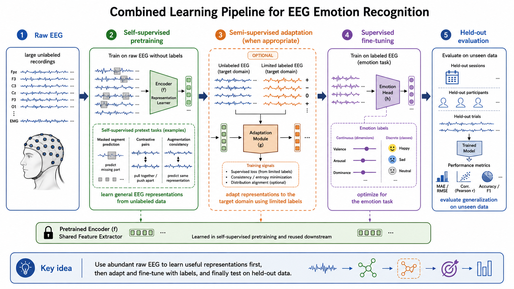

# Learning Paradigms

## Overview

Learning begins with a question that is easy to overlook: where will the teaching signal come from? In some studies, every EEG segment is paired with an emotion label. In others, researchers have many recordings but only a small subset has been annotated. Sometimes the recordings themselves must provide the learning signal. The answer defines the learning paradigm and shapes the data, objective, and evaluation of a model.

This distinction matters particularly in EEG-based affective computing. Recording EEG is not effortless, but assigning a reliable emotional label is often harder. Labels can be costly to collect, subjective, and noisy; they may also vary with the participant, experimental setting, and measurement method. A useful EEG pipeline can therefore draw on both annotated and unannotated recordings.

The four paradigms discussed here--supervised, unsupervised, semi-supervised, and self-supervised learning--are not competing labels for a single method. They describe different ways of using the information available in a dataset, and they are often combined. An encoder, for example, may learn from raw EEG first and later be fine-tuned with the smaller collection of emotion annotations.

## Supervised Learning

Supervised learning is the most direct setting. The model receives labeled pairs $(x,y)$, where $x$ is an EEG input and $y$ is the desired prediction. It learns a mapping from signal to label by minimizing a task-specific loss, commonly cross-entropy for emotion classes or mean squared error for continuous valence and arousal scores.

This setup fits emotion classification, valence/arousal regression, and subject-specific emotion recognition. Its objective is directly aligned with the final task, and held-out labels provide a straightforward evaluation target. When annotations are plentiful and trustworthy, supervised learning is the natural starting point.

For EEG, that condition is often only partly met. Emotional self-reports are expensive and uncertain, while labeled datasets may be too small to support large models. A model can then learn participant or session cues instead of emotion-related patterns. These limitations motivate methods that learn from recordings without final-task labels.

## Unsupervised Learning

Unsupervised learning works with inputs $x$ alone. Rather than predicting an external annotation, the model is asked to capture structure within the recordings. Depending on the method, that may mean grouping similar signals, reconstructing an input, estimating its density, or compressing it into a lower-dimensional representation.

An autoencoder, for example, can reconstruct a multichannel segment through a compact latent code. Those representations can then be inspected or clustered to explore recurring signal patterns, describe a signal manifold, or identify atypical recordings through reconstruction error or low likelihood. The objective does not guarantee that the structure it finds will separate emotional states, but it can reveal regularities before a final prediction task is specified.

Unsupervised learning is therefore useful for exploration and representation learning when raw EEG is abundant but labels are scarce. Its central limitation is task alignment: a feature that preserves prominent signal variation is not necessarily a feature that distinguishes emotions.

## Semi-Supervised Learning

Semi-supervised learning trains with both labeled and unlabeled examples. A labeled subset anchors the model to the emotion task, while the unlabeled subset provides information about the broader distribution of EEG signals. This is a natural fit when a study includes carefully annotated trials alongside a much larger archive of unannotated sessions.

Consistency regularization asks the model to make stable predictions under reasonable transformations of an input. A teacher-student network is a common implementation: the student is trained on an input view, while the teacher produces a target from a weakly augmented or differently transformed view. The teacher is often an exponential moving average of the student and is not updated by the same gradient step. This makes the teacher target less noisy than a single student prediction, but it does not remove the need for confidence thresholds and carefully chosen augmentations.

Pseudo-labeling turns high-confidence predictions on unlabeled trials into provisional targets. Entropy minimization encourages decisive predictions, while graph-based and generative methods use assumptions about the structure of the data distribution. These approaches share a premise: unlabeled examples are useful only when their relationship to the labeled task is sufficiently well understood.

The potential benefit is substantial because unlabeled trials may include more participants, sessions, and contexts than the annotated subset. They can reduce overfitting, but poorly calibrated pseudo-labels or large distribution shifts can reinforce bias instead. The unlabeled data should therefore be checked for relevance to the target population rather than treated as automatically beneficial. In EEG, the teacher and student should normally receive views that preserve the affective content of a segment; aggressive channel masking, time warping, or filtering can change the label-relevant evidence.

## Self-Supervised Learning

Self-supervised learning also starts with raw data, but it constructs a training signal from the recording itself. The model solves a deliberately designed pretext task, not the final emotion-prediction task, in order to learn an encoder that can later be adapted to a labeled downstream problem.

For EEG, a model might decide whether two segments came from the same trial, reconstruct masked channels or time intervals, predict temporal order, or align time-domain and frequency-domain views of the same recording. These tasks represent common approaches such as contrastive learning, masked reconstruction, predictive coding, and multi-view consistency.

### Generative Pretraining with Masked Reconstruction

A masked autoencoder (MAE) is a generative self-supervised method. It hides part of an EEG input and trains an encoder-decoder model to reconstruct the missing content. The masked units may be contiguous time spans, channel groups, time-frequency patches, or combinations of these. A typical objective is computed on the masked region only:

$$\mathcal{L}_{\text{mask}} = \left\|M \odot \left(x - \hat{x}\right)\right\|^2,$$

where $M$ selects the masked samples or patches. The encoder processes the visible signal, and the decoder uses that representation to predict the missing signal. After pretraining, the encoder can be retained and fine-tuned for emotion classification, valence/arousal regression, or another downstream task.

Masked reconstruction is attractive for EEG because recordings are often plentiful even when emotion labels are scarce. It can encourage representations that capture temporal continuity, cross-channel relationships, and frequency structure. Its limitations are equally important: a model may learn to interpolate predictable waveform patterns without learning affective information, or it may reconstruct subject-specific artifacts. Masking strategy, reconstruction target, and evaluation should therefore be chosen to match the intended downstream task.

### Contrastive and Teacher-Student Learning

Contrastive learning trains representations so that compatible views of the same underlying example are close while views from different examples are separated. For an EEG segment, two views might be produced by label-preserving transformations such as modest temporal cropping, amplitude scaling, channel dropout, or noise injection. An InfoNCE-style objective for an anchor $z_i$ and its positive representation $z_i^+$ can be written as

$$\mathcal{L}_{\text{NCE}} = -\log \frac{\exp(\\mathrm{sim}(z_i,z_i^+)/\tau)}{\sum_{j} \exp(\\mathrm{sim}(z_i,z_j)/\tau)},$$

where $\\mathrm{sim}$ is a similarity function and $\tau$ is a temperature parameter. The negative examples should be selected carefully: two segments from the same participant, session, or emotional episode may not be valid negatives simply because they have different indices.

Teacher-student networks are closely related to consistency learning and are often combined with contrastive objectives, although the two ideas are not identical. A teacher, commonly updated as an exponential moving average of the student, supplies a stable representation or pseudo-target for another view of the same EEG segment. The student is optimized to agree with that target, sometimes with additional negatives or a supervised loss. This design can avoid reliance on large labeled datasets, but it can also collapse to uninformative representations unless normalization, prediction heads, stop-gradient operations, centering, or other anti-collapse mechanisms are used.

For affective EEG, both approaches depend on the definition of a positive pair or matched teacher-student view. The transformations must preserve the emotion-related content while changing nuisance variation. Subject identity, session identity, stimulus identity, and temporal proximity should be considered explicitly because they can create easy shortcuts or invalid negative pairs.

After pretraining, the encoder is fine-tuned with the available emotion labels. This procedure can learn reusable signal structure from large corpora before asking the model to solve a label-limited task, potentially improving transfer across subjects or datasets. Its risk is pretext-target mismatch: a model can excel at the constructed task without learning the aspects of EEG that are relevant to emotion. A useful comparison is therefore not only pretraining loss, but also frozen-encoder and fine-tuned performance under subject-held-out or session-held-out evaluation.

## Comparison of Paradigms

| Paradigm | Uses Labels? | Main Benefit | Main Limitation |
|---|---|---|---|
| **Supervised** | Yes | Direct task optimization | Label scarcity and noise |
| **Unsupervised** | No | Learns general structure | Task alignment may be weak |
| **Semi-supervised** | Partly | Better data efficiency | Method design can be complex |
| **Self-supervised** | Derived from data | Strong reusable representations | Pretext-target mismatch risk |

## Choosing and Combining Paradigms

The paradigms are answers to the same practical question: what information is available at training time? Supervised learning uses final-task labels directly. Unsupervised learning seeks structure without labels. Semi-supervised learning combines limited labels with unlabeled examples, while self-supervised learning derives a training signal from the data before applying the learned representation to a labeled task.

In practice, they often form a sequence:

1. **Unsupervised or self-supervised learning** develops a representation from raw EEG.
2. **Semi-supervised learning**, when appropriate, introduces limited task labels while using additional unlabeled trials.
3. **Supervised learning** fine-tunes and evaluates the model against the final emotion-prediction objective.

**Figure 3.5: Combined learning pipeline.** Raw EEG supports self-supervised pretraining, followed when appropriate by semi-supervised adaptation and supervised fine-tuning with emotion labels and held-out evaluation.

This pattern respects the common imbalance between plentiful recordings and limited reliable annotations. The right choice depends on the scientific question, the reliability of labels, and the similarity of the available unlabeled data to the intended deployment setting.

## Summary

Learning paradigms differ primarily in the source of their supervision signal. In affective EEG, where labels are limited, noisy, and expensive while raw recordings are comparatively easier to collect, a well-designed system often combines paradigms rather than relying on just one. Each should be used where its assumptions match the data and the final scientific question.

## References

- Banville, H., Chehab, O., Hyvarinen, A., Engemann, D. A., and Gramfort, A. (2021). Uncovering the structure of clinical EEG signals with self-supervised learning. *Journal of Neural Engineering*, 18(4), 046020.
- Chapelle, O., Scholkopf, B., and Zien, A., eds. (2006). *Semi-Supervised Learning*. MIT Press.
- Chen, T., Kornblith, S., Norouzi, M., and Hinton, G. (2020). A simple framework for contrastive learning of visual representations. *International Conference on Machine Learning*.
- Grill, J.-B., Strub, F., Altche, F., et al. (2020). Bootstrap your own latent: A new approach to self-supervised learning. *Advances in Neural Information Processing Systems*.
- He, K., Chen, X., Xie, S., Li, Y., Dollár, P., and Girshick, R. (2022). Masked autoencoders are scalable vision learners. *IEEE/CVF Conference on Computer Vision and Pattern Recognition*.
- Hinton, G. E., and Salakhutdinov, R. R. (2006). Reducing the dimensionality of data with neural networks. *Science*, 313(5786), 504-507.
- Tarvainen, A., and Valpola, H. (2017). Mean teachers are better role models: Weight-averaged consistency targets improve semi-supervised deep learning results. *Advances in Neural Information Processing Systems*.
