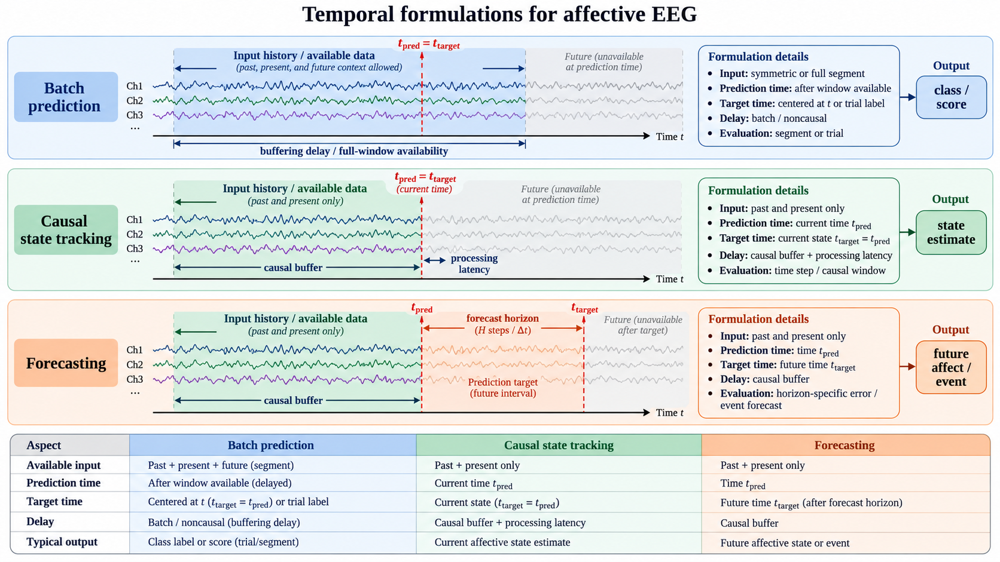

# Predictive Tasks and Temporal Formulations

A problem formulation specifies more than an input tensor and a label. It states what is predicted, the time at which a prediction is made, the information available at that time, and the unit on which success is evaluated. In EEG-based affective computing, these choices distinguish tasks that may use the same recordings but answer different scientific or engineering questions.

This section defines the main predictive formulations. Generalization settings, such as cross-subject or cross-session evaluation, are treated separately in the next section.

## Specify the Prediction Contract

Before choosing a model, write down the prediction contract:

- **Input:** which channels, preprocessing operations, context variables, and history are available;
- **Target:** what quantity is predicted, at what time, and from which annotation source;
- **Output:** a class, score, trajectory, distribution, ranking, or abstention decision;
- **Latency:** how long after the relevant signal or event a prediction may be produced; and
- **Evaluation unit:** the trial, window, session, subject, or interaction on which performance is aggregated.

Two studies can use identical EEG recordings but define different problems if one predicts a trial label offline and the other predicts a future state causally during interaction. This contract should be fixed before test data are inspected or thresholds are selected.

**Figure 4.1: Prediction contract for affective EEG.** A rigorous formulation declares the available information, target time, output, latency, and evaluation unit before model selection or test-set inspection.

## Classification

Classification maps an EEG example to one of a finite set of affective categories. Examples include high versus low valence, positive-neutral-negative emotion, or discrete categories such as happiness, sadness, fear, and neutral affect.

The formulation should state whether categories are observed directly, inherited from a stimulus, or created by thresholding continuous self-reports. Thresholding is a modeling decision: a global threshold, a subject-specific threshold, and a threshold fitted using training data define different tasks and can lead to different class distributions.

For a segment $$x_i$$ with label $$y_i \in \{1, \ldots, K\}$$, a classifier estimates

$$
p(y_i \mid x_i).
$$

The unit $$x_i$$ may be an entire trial, an epoch, a fixed window, or a sequence. Its temporal boundaries and label rule must be reported.

### Label Granularity and Inheritance

Labels may be attached to a stimulus, trial, time interval, window, or participant. Copying a trial-level label onto every window creates a weak assumption that the target is constant within the trial. It may be useful for window-level classification, but it should not be presented as evidence that the model resolves rapid affective transitions.

For continuous annotations, report annotation delay, sampling interval, smoothing, aggregation, and inter-rater or test-retest reliability. If multiple annotators provide labels, preserve disagreement when possible instead of reducing it immediately to a single hard class. Soft targets, label distributions, ordinal targets, or uncertainty intervals may better represent the supervision available.

## Regression

Regression predicts a continuous affective quantity, commonly valence, arousal, dominance, liking, stress intensity, or an aggregated rating score. It is appropriate when the target scale carries meaningful order or distance that would be lost by discretizing it.

For a continuous target $$y_i \in \mathbb{R}$$, the model estimates

$$
\hat{y}_i = f(x_i).
$$

Regression can also predict a conditional distribution rather than a point estimate. For example, a model may output $$p(y_i \mid x_i)$$ or a mean and variance, allowing it to distinguish an uncertain estimate from a confident estimate with the same predicted mean. This is useful when ratings are noisy, annotator disagreement is substantial, or the input is out of distribution.

Report the rating scale, its range, any rescaling or normalization, and whether normalization was fitted per subject, per session, or on training data only. A model that predicts normalized within-subject ratings answers a different question from one that predicts the original population-scale ratings.

## Batch Prediction

Batch prediction evaluates pre-defined units without requiring predictions to be produced causally in a live stream. An example may be a fixed-length window, a trial summary, a clip-level representation, or a collection of windows aggregated before inference. Future context may be available inside the declared example boundary.

This formulation is appropriate for offline clip-level recognition, standardized benchmark comparisons, and retrospective analysis. It does not establish real-time usability merely because the model's input is short.

## State Tracking

State tracking estimates an evolving affective state from a continuous EEG stream. At time $$t$$, a causal tracker should use only the signal history available up to that point:

$$
\hat{s}_t = f(x_{\leq t}).
$$

The target may be a continuous annotation, a slowly varying latent state, or a sequence of discrete states. Specify the update interval, input window, prediction latency, label-alignment rule, smoothing, and whether every operation is causal. Tracking should be evaluated over trajectories, not only as independent shuffled windows. Also report the warm-up period, overlap between successive inputs, buffering delay, and whether smoothing uses future samples.

## Forecasting

Forecasting predicts a future affective state rather than the present state. With a prediction horizon $$\Delta > 0$$,

$$
\hat{s}_{t + \Delta} = f(x_{\leq t}).
$$

Forecasting is relevant for proactive human-computer interaction, adaptive interventions, and early warning systems. It should not be conflated with delayed state tracking: the target time, forecast horizon, and information cutoff must be explicit. Performance should be compared with simple persistence or recent-state baselines, since slowly changing affect can make these baselines strong. Treat the horizon as part of the task: a 1-second forecast for interface timing is not equivalent to a 30-second forecast for early intervention.

## Temporal Task Comparison

| Formulation | Target time | Future EEG allowed? | Typical output | Core evaluation need |
| --- | --- | --- | --- | --- |
| Batch classification or regression | Defined by the pre-segmented example | May be within the declared example | Category or score | Grouped held-out examples |
| State tracking | Current time $$t$$ | No for causal claims | Current state trajectory | Chronological trajectory evaluation |
| Forecasting | Future time $$t + \Delta$$ | No beyond time $$t$$ | Future state trajectory | Horizon-specific chronological evaluation |

**Figure 4.2: Temporal formulations for affective EEG.** Batch prediction, state tracking, and forecasting differ in the information cutoff, target time, and latency requirements even when they use the same underlying recordings.

## Structured and Multi-Task Targets

Affective targets often have related structure. Valence and arousal may be predicted jointly; continuous ratings may be combined with a discrete category; and an auxiliary signal-quality or subject-invariant objective may regularize the representation. A multi-task formulation can be written as

$$
\mathcal{L} = \lambda_1 \mathcal{L}_{\mathrm{class}} + \lambda_2 \mathcal{L}_{\mathrm{reg}} + \lambda_3 \mathcal{L}_{\mathrm{quality}}.
$$

The additional tasks must have a scientific purpose. Reporting only a combined score can hide whether one target improved while another degraded. Define task weights using training data or a predeclared rule, and evaluate every output separately. Ordinal labels, valence-arousal coordinates, label distributions, and pairwise preferences are alternatives to treating all categories as unrelated.

## Baselines and Leakage Checks

Every predictive formulation should include baselines that expose how much the task can be solved without the proposed model. Depending on the setting, useful baselines include majority or class-prior prediction, subject mean, recent-state persistence, linear or regularized models, handcrafted features, and context-only models.

Check whether performance can be explained by non-neural shortcuts. Examples include stimulus identity, trial order, participant identity, session markers, channel quality, or preprocessing statistics computed using held-out data. A strong result should survive a leakage audit and, where relevant, a negative-control task such as predicting shuffled labels or an explicitly nuisance variable.

## Choose a Task That Matches the Labels

Trial-level ratings can support trial or clip prediction, but they do not by themselves validate continuous tracking. Assigning one trial label to every short EEG window assumes that the state is constant throughout the trial. When this approximation is used, it should be described as window-level prediction with inherited trial labels rather than evidence of temporally resolved affect estimation.

Likewise, a task that uses future samples through centered filtering, noncausal smoothing, or a symmetric context window should be described as offline. Clear temporal language prevents models with similar accuracy from being credited with different capabilities. The clocks, buffers, latency budgets, and runtime abstention rules that make a causal tracking claim operational are developed in [Chapter 10](../10-real-time-affective-bci-engineering/README.md).

## References

- Calvo, R. A., and D'Mello, S. (2010). Affect detection: An interdisciplinary review of models, methods, and their applications. IEEE Transactions on Affective Computing, 1(1), 18-37.
- Cowie, R., Douglas-Cowie, E., Tsapatsoulis, N., Votsis, G., Kollias, S., Fellenz, W., and Taylor, J. G. (2001). Emotion recognition in human-computer interaction. IEEE Signal Processing Magazine, 18(1), 32-80.
- Soleymani, M., Pantic, M., and Pun, T. (2012). Multimodal emotion recognition in response to videos. IEEE Transactions on Affective Computing, 3(2), 211-223.
