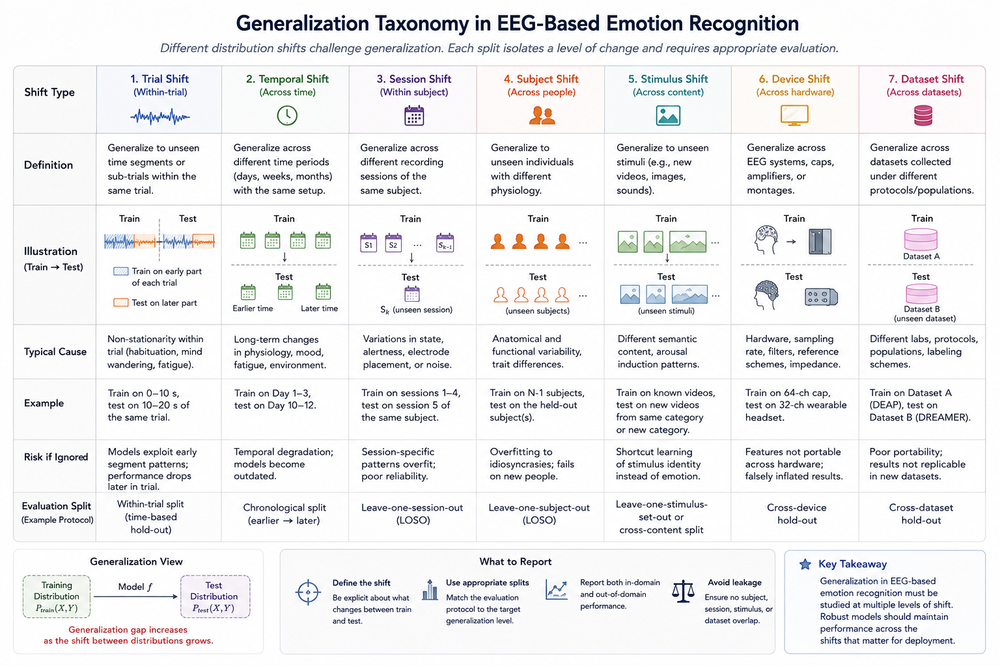

# Generalization Settings and Evaluation Missions

After the prediction task is fixed, the next question is what must generalize. In EEG-based affective computing, training and test data can differ by trial, time, session, participant, stimulus, device, site, or dataset. These settings are not interchangeable: each holds out a different source of variation and supports a different claim about deployment.

**Figure 4.3: Generalization taxonomy for EEG-based affective computing.** Evaluation settings can hold out variation across trials, time, sessions, participants, stimuli, devices, sites, or datasets; each setting supports a different claim about deployment robustness.

## Subject-Dependent and Subject-Independent Settings

Both batch and online prediction can be studied in subject-dependent or subject-independent form.

Subject-dependent prediction means that training and test data come from the same subject, although from different trials, sessions, or time periods. This setting evaluates how well a model personalizes within a person. It is often easier because the model does not need to bridge strong inter-subject variability in EEG rhythms, emotional baselines, and physiological response patterns.

Subject-independent prediction means that test subjects are unseen during training. This is a more demanding but often more deployment-relevant setting, because it asks whether a model can generalize across individuals. Performance is typically lower, but the results say more about population-level robustness.

These two settings should never be mixed implicitly. A paper that reports high within-subject performance is not necessarily solving the same problem as one reporting lower cross-subject performance.

| Setting | Training-test relation | What it measures | Common risk if defined poorly |
| --- | --- | --- | --- |
| Subject-dependent | Same subject, different held-out units | Personalization and within-person stability | Inflated scores from trial or temporal leakage |
| Subject-independent | Different subjects in train and test | Cross-person robustness | Hidden calibration or identity leakage |

## Calibration Regimes

Subject-independent does not necessarily mean zero personalization. A deployment may allow no target-subject data, a short labeled calibration period, unlabeled target recordings for normalization, or continual confirmed feedback. These are different missions and should be named explicitly:

| Regime | Target information available | Typical claim |
| --- | --- | --- |
| Zero-shot | No target-subject recordings or labels | Immediate transfer to a new user |
| Unsupervised adaptation | Unlabeled target recordings only | Robust normalization or representation alignment |
| Few-shot calibration | A small, declared set of labeled target trials | Reduced setup burden for personalization |
| Continual adaptation | Feedback arrives during later use | Long-term maintenance under drift |

Target data used for calibration must be separated from the final evaluation period. Otherwise, a result described as zero-shot or few-shot may include hidden access to the test distribution.

**Figure 4.4: Calibration regimes for EEG generalization.** Subject-independent evaluation can range from zero-shot transfer to continual personalization; each regime makes a different claim about setup burden and target-domain access.

## Subject-Dependent Missions

Within subject-dependent evaluation, several distinct missions should be separated because they test different kinds of generalization.

### Cross-Trial Prediction

Cross-trial prediction uses some trials of a subject for training and different trials of the same subject for testing, usually within the same recording session or within sessions pooled together. This is the most common subject-dependent setting for trial-based datasets.

It mainly measures whether the model can generalize across repeated stimuli or repeated elicitation events for the same person. It does not, by itself, establish robustness to day-to-day drift.

### Cross-Session Prediction

Cross-session prediction trains on one or more sessions and tests on a different session from the same subject. This is harder than cross-trial prediction because session effects include electrode placement changes, impedance variation, fatigue, learning, adaptation, and baseline drift.

For practical EEG systems, cross-session performance is often more informative than within-session cross-trial performance because it better reflects repeated real-world use.

### Temporal Split or Historical-to-Future Prediction

A temporal split uses earlier data to predict later data from the same subject. This can be defined within a single long recording or across multiple sessions ordered in time. The key requirement is chronological separation: the model must learn from the past and predict the future.

This setting is particularly useful for online affect tracking, longitudinal monitoring, and adaptive systems. It addresses a question that random train-test splits cannot answer: whether the model remains valid as the subject's state and recording conditions evolve over time.

### Other Within-Subject Missions

Depending on the dataset, other missions may also be meaningful, such as cross-stimulus prediction, cross-task prediction, or adaptation from a short calibration period to later unconstrained use. These should be defined explicitly rather than folded into a generic subject-dependent label.

| Mission | Held-out unit | Main question | Difficulty driver |
| --- | --- | --- | --- |
| Cross-trial | Trials from the same subject | Does the model generalize across repeated elicitation episodes? | Trial-specific variability |
| Cross-session | Sessions from the same subject | Does the model survive recording drift and day-to-day variation? | Session shift and baseline drift |
| Temporal split | Later time blocks from the same subject | Can history predict the future state? | Chronology and nonstationarity |
| Cross-stimulus or cross-task | Stimuli or tasks from the same subject | Does the model transfer across elicitation contexts? | Context shift |

## Subject-Independent Missions

Subject-independent evaluation asks whether the model generalizes to unseen people. The most common form is leave-one-subject-out or leave-several-subjects-out testing, but the precise design can vary depending on sample size and class balance.

This setting is crucial when the intended application is plug-and-play affect recognition without extensive personal calibration. It is also the right setting for studying subject-invariant representations, domain adaptation, and fairness across users.

For online tasks, subject-independent evaluation can be combined with streaming constraints. In that case the model must both generalize to a new person and operate causally over time.

## Nested Validation and Grouped Splits

All operations that learn from data belong inside the training boundary. This includes normalization, feature selection, channel selection, augmentation statistics, threshold selection, hyperparameter tuning, early-stopping decisions, and calibration. A grouped split should be applied before window extraction or, at minimum, before windows from the same trial or session can cross partitions.

When model choices are tuned repeatedly, use nested validation or a predeclared development set. The outer test groups should be opened once for final evaluation. Reporting the best result across many split seeds, subjects, or metrics without accounting for selection produces an optimistic estimate.

**Figure 4.5: Nested grouped validation.** All data-dependent choices belong inside the training boundary, while outer subject, session, or trial groups provide an untouched estimate of the intended generalization claim.

## Composed Distribution Shifts

Real deployment often combines shifts. A new user may also use a different device in a home environment after a delay of several months. Report whether the protocol holds out one shift at a time or composes several shifts, and avoid claiming robustness to an untested combination. A useful evaluation matrix crosses axes such as subject, session, device, stimulus, site, and time.

The taxonomy is also a guide to diagnosis. A failure across subjects but not sessions suggests inter-person variability; a failure across sessions but not trials suggests drift or acquisition instability; a failure across devices may reflect montage, reference, sampling, or hardware differences rather than a missing model capacity.

## Why Generalization Settings Matter

These settings are not cosmetic. They determine what counts as leakage, which train-test split is valid, which metrics are meaningful, and what claims can be made from the results. A model that performs well on randomly shuffled trials may fail on a later session or an unseen subject.

For that reason, the problem formulation should always specify at least:

- which source of variation is held out, such as trials, sessions, subjects, or future time;
- whether training, validation, and testing preserve independence at that level;
- what calibration or target-domain information is available; and
- which generalization claim the resulting split can support.

## Reporting Template

A reproducible report should state the grouping key, number of groups, train-validation-test counts, chronological order where relevant, target-domain data available for calibration, preprocessing fit boundaries, and the unit used to aggregate metrics. Also report uncertainty across groups, not only the pooled mean: per-subject or per-session distributions can reveal whether a model works broadly or only for a subset of participants.

If a model abstains or requests recalibration, include abstention rate, coverage, performance at fixed coverage, and recovery after signal-quality failure. These measures are often more informative for deployment than a forced prediction on every window.

## References

- Calvo, R. A., and D'Mello, S. (2010). Affect detection: An interdisciplinary review of models, methods, and their applications. IEEE Transactions on Affective Computing, 1(1), 18-37.
- Shu, L., Xie, J., Yang, M., Li, Z., Li, Z., Liao, D., Xu, X., and Yang, X. (2018). A review of emotion recognition using physiological signals. Sensors, 18(7), 2074.
- Stober, S., Sternin, A., Owen, A. M., and Grahn, J. A. (2015). Towards music imagery information retrieval: Introducing the OpenMIIR dataset of EEG recordings from music perception and imagination. Proceedings of ISMIR 2015.