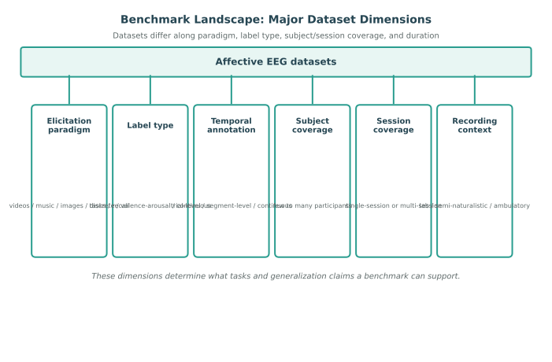
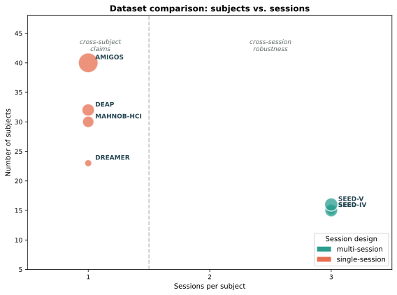

# Dataset Design and Benchmarking Criteria

EEG-based affective computing is shaped as much by the dataset as by the model. Reported performance depends on how emotions are elicited, how labels are collected, how many subjects and sessions are included, how signals are segmented, and how evaluation splits are constructed. For that reason, understanding datasets is not only a matter of cataloging benchmarks. It is also a matter of understanding what scientific and engineering claims a benchmark can support.

This section summarizes the main dimensions along which affective EEG datasets differ and explains how those differences affect benchmarking.

*Figure 1. Major dimensions along which affective EEG datasets differ. Each dimension constrains the tasks and generalization claims a benchmark can support.*

## Core Dimensions of Dataset Design

Several design choices determine what kinds of models can be trained and what kinds of conclusions can be drawn.

| Dimension | Typical options | Why it matters |
| --- | --- | --- |
| Emotion elicitation | Videos, music, images, tasks, recall, interaction | Changes ecological validity and temporal structure |
| Label type | Discrete category, valence-arousal, self-report, observer rating | Determines whether the task is classification, regression, or tracking |
| Temporal annotation | Trial-level, segment-level, continuous | Determines whether online prediction can be evaluated rigorously |
| Subject coverage | Few or many subjects | Affects confidence in subject-independent claims |
| Session coverage | Single-session or multi-session | Controls whether cross-session robustness can be studied |
| Recording context | Laboratory, semi-naturalistic, ambulatory | Changes noise level, realism, and deployment relevance |

Datasets that appear similar at a glance may therefore support very different task formulations. A trial-level movie dataset with one session per subject is well suited to offline batch prediction, but it may be much less informative for online tracking or longitudinal robustness.

## Common Affective EEG Datasets

The datasets below are widely used reference points in EEG-based affective computing. They are not interchangeable: their recording devices, elicitation paradigms, label formats, and release versions differ. Dataset statistics should therefore be verified against the documentation for the exact release being used.

| Dataset | Participants and recording | Elicitation | Labels | Useful benchmark claims |
| --- | --- | --- | --- | --- |
| DEAP | 32 participants; 32-channel EEG plus peripheral physiology | 40 music-video excerpts | Trial-level valence, arousal, dominance, and liking self-ratings | Offline valence-arousal classification or regression; multimodal fusion |
| SEED | 15 participants across three sessions; 62-channel EEG | Film clips | Positive, neutral, and negative trial labels | Cross-session and subject-dependent or subject-independent discrete emotion recognition |
| SEED-IV | 15 participants across three sessions; 62-channel EEG | Film clips | Four discrete emotion categories | Fine-grained discrete emotion recognition and session robustness |
| SEED-V | 16 participants across three sessions; 62-channel EEG | Film clips | Five discrete emotion categories | Expanded discrete emotion benchmarks and cross-session generalization |
| DREAMER | 23 participants; 14-channel wearable EEG and ECG | 18 film clips | Trial-level valence, arousal, and dominance self-ratings | Low-density wearable EEG and EEG-ECG fusion |
| AMIGOS | 40 participants; 14-channel wearable EEG with ECG and GSR | Short and long videos, including group viewing | Valence, arousal, dominance, liking, personality, and mood measures | Multimodal, social, and individual-versus-group affect studies |
| MAHNOB-HCI | 30 participants; 32-channel EEG with multiple physiological and video modalities | Video clips | Self-report affect ratings and related behavioral measures | Multimodal affect recognition and comparison with visual or peripheral signals |

Most of these datasets provide labels at the trial level rather than continuously. Segmenting their recordings into short windows can be useful for model training, but it does not make the labels temporally local. This limitation should be stated whenever window-level performance is interpreted as continuous affect tracking.

## Elicitation Paradigms and Their Consequences

Emotion elicitation is never neutral. Passive viewing paradigms often produce cleaner timing and more standardized comparisons across subjects, but they may also narrow the range of emotions observed. Interactive, social, or naturalistic paradigms may better reflect real-world affect, yet they introduce more uncontrolled variation.

This matters for benchmarking because the elicitation method shapes the signal-to-noise ratio, the temporal smoothness of affect, and the degree to which subject-independent learning is realistic. A highly structured laboratory paradigm may allow easier benchmarking, while a naturalistic paradigm may better reveal the limits of current methods.

## Label Quality and Supervision Granularity

Labels are central to dataset quality. In affective EEG, labels may come from self-assessment, external annotators, stimulus assumptions, or hybrid procedures. Each choice introduces different uncertainty.

Important questions include:

- whether labels are collected once per trial or continuously over time,
- whether they refer to felt emotion, expressed emotion, or intended stimulus affect,
- whether inter-rater agreement or self-report reliability is reported,
- and whether the label resolution matches the temporal granularity of the prediction task.

Continuous labels are often required for rigorous online affect tracking, whereas trial-level labels may be enough for clip-level batch prediction. Benchmarking becomes misleading when the label format is finer or coarser than the claim being made by the model.

## Coverage, Imbalance, and Missing Data

Dataset size alone does not describe the examples available to a model. Report the distribution of emotion labels, stimulus conditions, subjects, sessions, and retained recording duration. A balanced class count can still conceal an imbalance in subjects, trials, or usable EEG quality. In regression tasks, report the distribution and range of ratings rather than only the mean and standard deviation.

Missing channels, failed trials, excluded participants, incomplete modalities, and artifacts can change the effective dataset after preprocessing. These losses should be reported by subject, session, condition, and reason. Otherwise, a model may appear robust while being evaluated on a selectively easier subset of the original recording population.

When rebalancing, augmentation, or sample weighting is used, apply it within the training data only. Validation and test partitions should retain their natural distribution so that reported metrics reflect the intended use case.

## Subject and Session Diversity

The number of subjects matters, but so does the structure of their recordings. A dataset with many subjects but only one short session each is useful for some cross-subject benchmarks, yet it says little about cross-session drift, adaptation, or long-term stability. Conversely, a smaller dataset with repeated sessions can be valuable for studying personalization and robustness over time.

For benchmarking, the key question is not only dataset size, but whether the dataset spans the variability that the intended application will face.

*Figure 2. Common datasets plotted by subject count and session count. Single-session datasets (coral) primarily support cross-subject claims, whereas multi-session datasets (teal) also allow cross-session robustness to be studied.*

## Benchmarking Criteria

A useful affective EEG benchmark should ideally satisfy several criteria.

| Criterion | What to look for |
| --- | --- |
| Task clarity | The dataset should support clearly defined classification, regression, or tracking tasks |
| Split validity | The dataset structure should permit leakage-free subject, trial, session, or temporal splits |
| Annotation quality | Labels should be documented, reliable, and aligned with the modeling objective |
| Subject diversity | Enough variation should exist to assess generalization claims |
| Temporal richness | The data should support the temporal assumptions made by the task |
| Reproducibility | Metadata, preprocessing conventions, and protocols should be documented |

Benchmarks are most valuable when they do not merely make training possible, but also make evaluation interpretable.

## Dataset Governance and Reuse

Public availability does not by itself settle whether a dataset can be reused for every purpose. Dataset documentation should identify the consent and ethics conditions, allowed uses, access restrictions, license, de-identification procedure, and any restrictions on redistribution. These details matter especially when recordings include video, voice, demographic attributes, clinical information, or other potentially identifying metadata.

Record the dataset name, release version, download date, official preprocessing resources used, and any local corrections or exclusions. If a benchmark split is adopted from prior work, publish the subject, session, trial, or segment identifiers in each partition. This lets later work distinguish a genuine modeling improvement from a difference in dataset version or split construction.

## Common Benchmarking Pitfalls

Several dataset-related issues repeatedly weaken empirical claims in the literature.

- Benchmarks are compared even though they define different emotion targets.
- Window-level results are reported on trial-level labels without explaining the supervision mismatch.
- Single-session datasets are used to support claims about stable real-world deployment.
- Subject-independent claims are made on datasets too small to support reliable fold estimates.
- Dataset preprocessing choices are inherited from earlier work without checking whether they match the current task.
- Dataset release versions, exclusions, or benchmark split identifiers are omitted.
- Performance is reported after filtering out poor-quality recordings without reporting how the retained subset differs from the original cohort.

These problems do not necessarily make a result invalid, but they do limit what can honestly be concluded from it.

## Practical Guidance for Using Public Datasets

When selecting a benchmark, the first question should not be which dataset is most popular, but which dataset actually matches the target use case. For example, if the goal is causal affect tracking, then continuous or densely aligned labels, sufficiently long recordings, and defensible chronological splits matter more than simple benchmark popularity. If the goal is plug-and-play subject-independent recognition, then the subject pool and inter-subject diversity are more important than trial count alone.

The practical lesson is straightforward: dataset choice is already part of problem formulation. It should be justified in terms of the task, the desired generalization claim, and the evaluation protocol.

## References

- Calvo, R. A., and D'Mello, S. (2010). Affect detection: An interdisciplinary review of models, methods, and their applications. IEEE Transactions on Affective Computing, 1(1), 18-37.
- Koelstra, S., Muhl, C., Soleymani, M., Lee, J.-S., Yazdani, A., Ebrahimi, T., Pun, T., Nijholt, A., and Patras, I. (2012). DEAP: A database for emotion analysis using physiological signals. IEEE Transactions on Affective Computing, 3(1), 18-31.
- Katsigiannis, S., and Ramzan, N. (2018). DREAMER: A database for emotion recognition through EEG and ECG signals from wireless low-cost off-the-shelf devices. IEEE Journal of Biomedical and Health Informatics, 22(1), 98-107.
- Correa, J. A. M., Abadi, M. K., Sebe, N., and Patras, I. (2018). AMIGOS: A dataset for affect, personality and mood research on individuals and groups. IEEE Transactions on Affective Computing, 9(1), 85-98.
- Soleymani, M., Lichtenauer, J., Pun, T., and Pantic, M. (2012). A multimodal database for affect recognition and implicit tagging. IEEE Transactions on Affective Computing, 3(1), 42-55.
- Zheng, W.-L., and Lu, B.-L. (2015). Investigating critical frequency bands and channels for EEG-based emotion recognition with deep neural networks. IEEE Transactions on Autonomous Mental Development, 7(3), 162-175.
- Zheng, W.-L., Liu, W., Lu, Y., Lu, B.-L., and Cichocki, A. (2019). EmotionMeter: A multimodal framework for recognizing human emotions. IEEE Transactions on Cybernetics, 49(3), 1110-1122.
- Shu, L., Xie, J., Yang, M., Li, Z., Li, Z., Liao, D., Xu, X., and Yang, X. (2018). A review of emotion recognition using physiological signals. Sensors, 18(7), 2074.