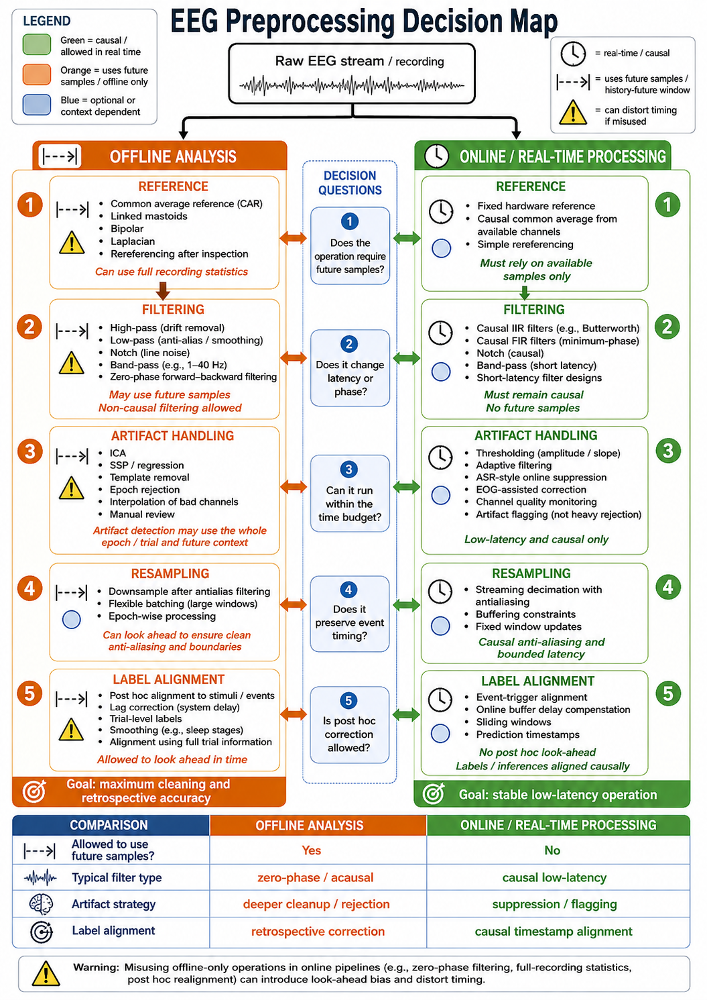

# Preprocessing from Device to Dataset

Before EEG can be packaged into a dataset, the signal recorded by a device must be converted into a consistent and auditable representation. This stage begins with continuous recordings, channel metadata, timestamps, and event markers. Its purpose is not to make EEG look artificially clean, but to preserve neural signal while identifying, reducing, or documenting non-neural contamination.

This section covers preprocessing that normally occurs before model-oriented segmentation and feature extraction. Later segmentation choices determine the examples seen by a model; the steps here determine whether those examples are physically and temporally valid.

**Figure 6.1: EEG preprocessing path from device to dataset.** Raw recordings become auditable dataset inputs through synchronized events, documented signal processing, artifact decisions, quality control, and provenance-preserving packaging.

## Preserve Acquisition Metadata

Preprocessing begins with the information needed to interpret the recording. Store the device sampling rate, channel names, electrode locations, reference scheme, units, trigger codes, and clock information. For multimodal experiments, preserve the relationship between EEG timestamps and stimulus, behavioral, or physiological recordings.

Channel names and locations should be mapped to a common convention where possible. This makes it easier to compare sessions, identify missing electrodes, apply spatial analyses, and package the data in reusable formats. A channel should not be silently relabeled or dropped: retain a record of its original name and every subsequent decision.

## Inspect the Continuous Recording

Continuous EEG should be inspected before it is divided into trials or windows. This early inspection can reveal clipped signals, flat channels, swapped electrodes, long recording interruptions, incorrect trigger timing, and mains interference. These issues are easier to diagnose in the raw time series than after transformations have obscured their source.

Useful initial checks include:

- verifying that sample counts agree with the expected recording duration;
- confirming that event codes and timestamps are monotonic and plausible;
- identifying channels with flat lines, saturation, excessive noise, or frequent dropouts;
- examining broad-band spectra for line noise and unexpected frequency content;
- and comparing electrode locations and channel availability across recordings.

The outcome should be a recording-level quality report, including channels and time intervals that require special handling.

## Synchronize Signals and Events

Affective EEG studies often combine EEG with stimulus logs, responses, video, physiology, or behavioral annotations. These streams may use different clocks. Align them using a documented synchronization event, trigger channel, shared timestamp, or clock-drift correction procedure.

Event timing should be represented in sample indices and, when useful, absolute timestamps. Record the uncertainty of the alignment. A small timing error can change whether an epoch is interpreted as pre-stimulus, onset-related, or steady-state activity.

Do not shift labels solely to improve model performance. If annotation delay is compensated, state the delay and justify it from the task or measurement process. For online prediction, only use an event or label when it would have been available to the deployed system.

## Align Continuous Annotations

Continuous affect ratings require an additional alignment step because the label stream and the EEG stream usually have different sampling rates and may reflect delayed human responses. Preserve the original annotation timestamps, then resample or aggregate labels onto the intended prediction grid using a documented rule. The rule might use the label at the end of each causal window, the mean label within a window, or a future label for a clearly defined forecasting task.

Annotator reaction time should be treated as a measurement property, not as a parameter to optimize against test performance. Estimate or justify a delay from the annotation procedure, pilot data, or prior evidence, then apply the same compensation to every partition. When multiple annotators provide continuous ratings, record the aggregation method, such as a mean, median, reliability-weighted estimate, or retained individual trajectories.

Smoothing a label stream can reduce high-frequency reporting noise, but it also changes the target's temporal resolution. State the smoothing method, span, boundary policy, and whether it is causal. In an online setting, a centered smoother or a future annotation cannot define the current state target; it can only support retrospective analysis or an explicitly forecasting task.

## Reference and Filter the Signal

EEG is measured as a voltage difference, so the reference choice affects every channel. Common approaches include a linked-mastoid reference, common average reference, and robust average reference. The appropriate choice depends on the montage, device, missing channels, and scientific question. Document the original reference and the reference used for analysis.

Filtering is used to reduce slow drift, high-frequency noise, and line contamination. A typical pipeline may apply a high-pass filter to reduce slow baseline drift, a low-pass filter to limit high-frequency content, and a notch or line-noise regression method at the local power frequency and its harmonics. Filter settings should be chosen for the intended analysis rather than copied as defaults: an event-related potential analysis, a low-frequency affective signal, and a high-frequency muscle-artifact analysis have different requirements.

Filtering can distort boundaries and temporal relationships. Use padding or a clearly specified boundary policy for offline analyses, and causal filters when making real-time claims. Report the filter type, cutoff frequencies, order or transition band, and whether filtering was applied continuously or after epoching.

**Figure 6.2: Offline and online preprocessing decisions.** Preprocessing choices depend on the deployment claim: offline analyses may use declared boundary handling, while online systems must respect causal filtering, available metadata, and current-time information.

## Detect and Handle Artifacts

Artifacts arise from eye blinks, eye movements, facial and neck muscles, cardiac activity, electrode motion, poor contact, cable movement, and environmental interference. Artifact processing should distinguish between identifying contamination, correcting it, and rejecting unusable data. These decisions have different risks and should not be described by the single word "cleaning."

Common strategies include:

| Strategy | Typical use | Main caution |
| --- | --- | --- |
| Mark bad channels or intervals | Persistent noise, dropouts, saturation | Preserve the rejection reason and duration |
| Interpolate limited bad channels | Localized electrode failure in a dense montage | Do not conceal widespread recording failure |
| Regression using EOG or ECG channels | Ocular or cardiac contamination with reference sensors | Validate that neural signal is not removed excessively |
| Independent component analysis | Separating repeatable artifact components | Component rejection needs documented criteria |
| Reject epochs or segments | Severe transient contamination | Rejection can bias retained conditions or subjects |

Artifact decisions should be made from signal criteria, sensor information, and inspection rules rather than from target labels. For machine-learning datasets, save artifact masks or annotations alongside the processed signal so that later quality-control and segmentation decisions remain reproducible.

## Epoch Around Meaningful Events

Epoching extracts intervals around stimulus onsets, responses, feedback, or other events. It converts a continuous recording into trial-level units while retaining the relationship between time zero and the event of interest. An epoch can include a pre-event baseline and a post-event response interval.

The epoch limits should match the expected temporal process. A short sensory response may require milliseconds of context, while affect induction by a video clip may require seconds or minutes. Define how trials with missing events, overlapping events, or interrupted recordings are handled. Do not assume that every trigger marks a valid trial without checking its experimental meaning.

Baseline correction is often applied to event-related analyses by subtracting the mean signal in a pre-event interval. It can reduce slow offsets, but the selected baseline must be free of stimulus-related activity and treated consistently across conditions. For continuous affect tracking, baseline correction may be less appropriate than drift handling performed on the continuous signal.

## Standardize Sampling and Channels

Recordings from different devices or sessions may have different sampling rates, channel sets, and units. Resampling can create a common sampling rate for dataset packaging, but it must include anti-alias filtering and should be performed only when the target frequency content is retained. Record both source and target sampling rates.

Channel harmonization requires an explicit policy. A dataset may retain only the intersection of available electrodes, interpolate missing channels when justified, or use montage-specific models. The choice affects the population of usable recordings and should be made before model evaluation. Signal units should also be standardized and recorded, typically in microvolts for scalp EEG.

## Package the Dataset with Provenance

Each processed recording or epoch should remain linked to its source. Alongside the signal arrays, store subject, session, run, trial, channel, event, preprocessing, and quality metadata. A structure based on Brain Imaging Data Structure (BIDS) conventions can make these relationships explicit, but the essential requirement is that another researcher can determine what happened to each signal.

Separate immutable source recordings from derived data. Keep the preprocessing configuration, software version, and any random seeds used by automated procedures. This allows the packaged dataset to be regenerated if artifact criteria, filtering choices, or event definitions later change.

## Preprocessing Checklist

Before moving from raw recordings to model-oriented segmentation, verify that:

- device, channel, timestamp, and event metadata are retained;
- continuous annotations are timestamped, aligned, and delay-compensated by a declared rule;
- the reference and filter settings are documented and appropriate for the task;
- bad channels and artifact intervals are flagged, corrected, or excluded by explicit rules;
- epochs are aligned to validated events and use a declared boundary policy;
- resampling and channel harmonization preserve the information needed downstream;
- and processed data retain provenance to the original recording and preprocessing configuration.

These steps prepare trustworthy continuous recordings or trial-level epochs. The next section uses those signals to define the windows and labels that form learning examples.

## References

- Delorme, A., and Makeig, S. (2004). EEGLAB: An open source toolbox for analysis of single-trial EEG dynamics. Journal of Neuroscience Methods, 134(1), 9-21.
- Jas, M., Engemann, D. A., Raimondo, F., Bekhti, Y., Leary, C. O., Knight, R. T., and Gramfort, A. (2017). Automagic: Standardized preprocessing of big EEG data. NeuroImage, 159, 346-358.
- Pernet, C. R., Appelhoff, S., Gorgolewski, K. J., Flandin, G., Phillips, C., Delorme, A., and Oostenveld, R. (2019). EEG-BIDS, an extension to the BIDS specification for EEG. Scientific Data, 6, 103.
- Widmann, A., Schroger, E., and Maess, B. (2015). Digital filter design for electrophysiological data: A practical approach. Journal of Neuroscience Methods, 250, 34-46.
