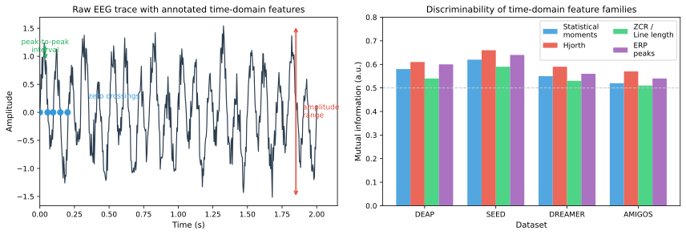

# Time-Domain Features

Time-domain features are the most straightforward representation of EEG signals. They operate directly on the raw voltage time series without transformation into other domains, making them computationally cheap and easy to interpret. While they may lack the spectral specificity of frequency-domain features, time-domain features capture waveform morphology, transient events, and basic statistical properties that are often lost in spectral averaging.

*Figure 1. Left: a raw EEG trace with annotated time-domain features. Right: illustrative discriminability (mutual information) of several time-domain feature families across benchmark datasets.*

## Statistical Moments

Statistical moments are the simplest and most widely used time-domain features. For a univariate EEG segment $x(t)$ of length $N$, the basic moments provide a compact summary of the signal's amplitude distribution.

### Mean and Variance

The mean $\mu$ and variance $\sigma^2$ capture the central tendency and spread:

$$\mu = \frac{1}{N}\sum_{t=1}^{N} x(t), \quad \sigma^2 = \frac{1}{N}\sum_{t=1}^{N} (x(t) - \mu)^2$$

In EEG, the mean is typically near zero after referencing and baseline correction, so variance (or its square root, standard deviation) is more informative. Higher variance can indicate stronger activation or increased noise.

### Skewness and Kurtosis

Higher-order moments describe the shape of the amplitude distribution:

$$\text{Skewness} = \frac{\frac{1}{N}\sum_{t=1}^{N} (x(t) - \mu)^3}{\sigma^3}$$

$$\text{Kurtosis} = \frac{\frac{1}{N}\sum_{t=1}^{N} (x(t) - \mu)^4}{\sigma^4}$$

Skewness measures asymmetry: positive skewness indicates a right-heavy distribution (more large positive deflections), while negative skewness indicates the opposite. Kurtosis measures tailedness: high kurtosis suggests more outliers or peakedness relative to a Gaussian. Both have been explored as affective markers, with some studies reporting changes in skewness and kurtosis across emotional states.

| Moment | What it captures | Affective relevance |
| --- | --- | --- |
| Mean ($\mu$) | Central tendency | Usually near zero; limited standalone value |
| Variance ($\sigma^2$) | Signal power | Reflects overall activation and arousal |
| Skewness | Amplitude asymmetry | May reflect hemispheric or valence-related biases |
| Kurtosis | Tail behavior and peakedness | Sensitive to transient events and outliers |

## Hjorth Parameters

Hjorth parameters are a classic set of three time-domain features that capture activity, mobility, and complexity of a signal. They are computationally efficient and have been widely used in EEG analysis since their introduction in 1970.

### Activity

Activity is simply the variance of the signal:

$$\text{Activity} = \sigma_x^2$$

It quantifies the total power in the time domain and is equivalent to the mean power. High activity indicates strong signal fluctuations.

### Mobility

Mobility is the square root of the ratio of the variance of the first derivative to the variance of the original signal:

$$\text{Mobility} = \sqrt{\frac{\sigma_{dx}^2}{\sigma_x^2}}$$

Mobility can be interpreted as the mean frequency of the signal. A higher mobility indicates a faster-changing signal dominated by higher frequencies, while lower mobility indicates a slower, smoother signal. This links time-domain properties to an approximate spectral interpretation without requiring a Fourier transform.

### Complexity

Complexity compares the mobility of the first derivative to the mobility of the original signal:

$$\text{Complexity} = \frac{\text{Mobility}(dx/dt)}{\text{Mobility}(x)}$$

Complexity indicates how much the signal deviates from a pure sine wave. A value of 1 corresponds to a pure sinusoid, while higher values indicate more complex waveforms with multiple frequency components.

### Hjorth Parameters in Affective Computing

Hjorth parameters have proven valuable in affective EEG research because they provide interpretable, low-dimensional descriptors that correlate with emotional states. Studies have found that:

- **Activity** tends to increase with arousal across multiple frequency bands.
- **Mobility** shifts with changes in the dominant oscillatory frequency, which can reflect emotional engagement.
- **Complexity** may differentiate between relaxation and active emotional processing.

Their low computational cost makes them suitable for real-time applications, and their interpretability aids neuroscientific analysis.

## Zero-Crossing Rate and Line Length

### Zero-Crossing Rate

The zero-crossing rate (ZCR) counts how many times the signal crosses the zero axis per unit time:

$$\text{ZCR} = \frac{1}{N-1}\sum_{t=1}^{N-1} \mathbb{I}\big[x(t) \cdot x(t+1) < 0\big]$$

ZCR provides a rough estimate of the dominant frequency without spectral analysis. Higher ZCR generally indicates higher-frequency content. In affective computing, changes in ZCR across frontal and temporal electrodes have been associated with shifts in cognitive load and emotional arousal.

### Line Length (Waveform Length)

Line length (also called curve length or waveform length) is the sum of absolute differences between consecutive samples:

$$\text{Line Length} = \sum_{t=1}^{N-1} |x(t+1) - x(t)|$$

This measure is sensitive to both amplitude and frequency: a signal with larger amplitudes or higher frequencies will have a larger line length. It has been used as a computationally efficient feature for seizure detection and has been adapted for emotion recognition, particularly for capturing rapid changes in EEG amplitude associated with affective responses.

## Event-Related Potentials (ERPs)

Event-related potentials are time-locked EEG responses to specific stimuli or events. Unlike ongoing EEG, ERPs are characterized by stereotyped waveforms with well-defined peaks (e.g., P100, N200, P300) that occur at predictable latencies after stimulus onset.

### ERP Components Relevant to Affect

| Component | Latency | Typical location | Affective relevance |
| --- | --- | --- | --- |
| P100 | ~100 ms | Occipital | Early visual attention; modulated by emotional stimuli |
| N170 | ~170 ms | Occipito-temporal | Face processing; sensitive to emotional expressions |
| N200 | ~200–350 ms | Fronto-central | Conflict monitoring; enhanced for negative stimuli |
| P300 (P3) | ~300–600 ms | Centro-parietal | Attention and stimulus evaluation; larger for emotional stimuli |
| Late Positive Potential (LPP) | 400+ ms | Centro-parietal | Sustained emotional processing; sensitive to arousal |

### ERP Feature Extraction

ERP features are typically extracted by:

1. **Peak amplitude**: The maximum (or minimum) voltage within a defined time window after stimulus onset.
2. **Peak latency**: The time at which the peak occurs.
3. **Mean amplitude**: The average voltage within a time window of interest.
4. **Area under the curve**: Integrating the ERP waveform over a window.

In affective computing, ERP features are most useful when the experimental paradigm involves discrete stimulus presentations with clear timing, such as image viewing, oddball tasks, or feedback paradigms.

### Limitations of ERP Features

ERP features require precise time-locking to stimuli, which limits their applicability to continuous or naturalistic emotion monitoring. They also require many trials for reliable estimation due to the low signal-to-noise ratio of single-trial EEG. For these reasons, ERP features are less common in everyday wearable affective computing but remain important in laboratory emotion research.

## First and Second Difference Features

The first difference (temporal derivative) and second difference capture the rate of change and acceleration of the signal:

$$d_1(t) = x(t+1) - x(t)$$

$$d_2(t) = d_1(t+1) - d_1(t) = x(t+2) - 2x(t+1) + x(t)$$

Summary statistics of these difference signals (mean, variance, mobility) can serve as additional features. They are particularly sensitive to rapid transitions in EEG, which may accompany shifts in emotional state.

## Practical Considerations

| Consideration | Guidance |
| --- | --- |
| Baseline correction | Remove mean before computing features to avoid DC offset effects |
| Artifact sensitivity | Statistical features are sensitive to artifacts; use after artifact removal |
| Segment length | Most time-domain features are more stable with longer segments (≥1 s) |
| Electrode selection | Some features (e.g., skewness) may be more informative at specific regions |
| Normalization | Per-subject normalization is often needed due to large individual differences |

The right panel of Figure 1 above shows an illustrative comparison of discriminability (mutual information with emotion labels) for several time-domain feature families across benchmark datasets.

## Summary

Time-domain features are computationally efficient, interpretable, and provide a solid baseline for affective EEG classification. However, they cannot directly isolate frequency-specific information, which is a significant limitation given the well-established spectral correlates of emotion. For this reason, time-domain features are typically combined with frequency-domain and time-frequency features, as discussed in subsequent sections.
