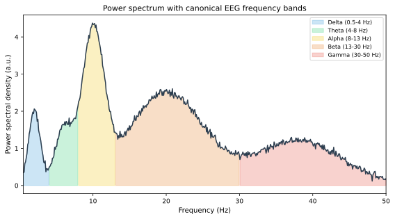
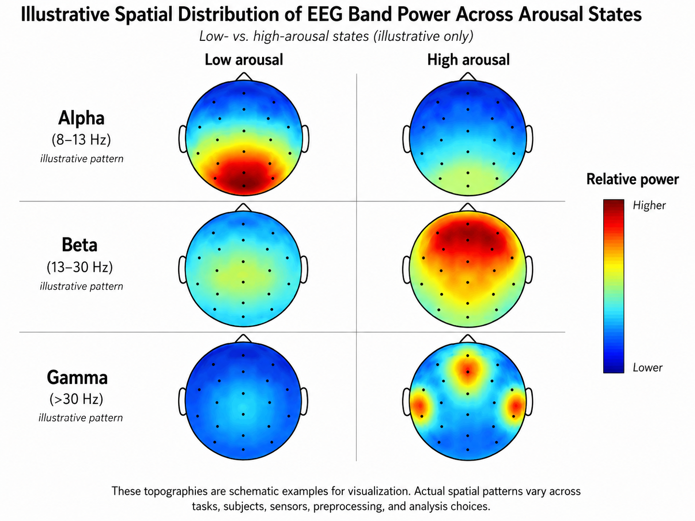

# Frequency-Domain Features

Frequency-domain features are arguably the most important class of features in EEG-based affective computing. The rhythmic nature of brain activity, organized into canonical frequency bands (delta, theta, alpha, beta, gamma), makes spectral representations a natural and neuroscience-grounded choice for characterizing emotional states.

**Figure 7.3: EEG power spectrum and canonical frequency bands.** Colored bands correspond to the canonical delta, theta, alpha, beta, and gamma ranges.

## The Fourier Transform and Power Spectral Density

### Fourier Transform

The Discrete Fourier Transform (DFT) decomposes a signal $$x(t)$$ of length $$N$$ into its constituent frequency components:

$$X(f_k) = \sum_{n=0}^{N-1} x(n) \, e^{-j 2\pi k n / N}, \quad k = 0, 1, \ldots, N-1$$

where $$f_k = k \cdot f_s / N$$ and $$f_s$$ is the sampling frequency. In practice, the Fast Fourier Transform (FFT) is used for computational efficiency.

### Power Spectral Density

The Power Spectral Density (PSD) describes how the power of a signal is distributed across frequencies. For a finite-length signal, the periodogram provides a simple estimate:

$$\hat{P}(f_k) = \frac{1}{N} |X(f_k)|^2$$

More robust estimates are obtained using Welch's method, which averages periodograms over overlapping, windowed segments:

$$P_{\text{Welch}}(f) = \frac{1}{K} \sum_{i=1}^{K} \hat{P}_i(f)$$

Welch's method trades frequency resolution for reduced variance, which is usually a beneficial trade-off for EEG analysis given the inherent noise.

| Method | Variance | Frequency resolution | Best for |
| --- | --- | --- | --- |
| Periodogram | High | High | Long, clean segments |
| Welch's method | Low | Moderate | Typical EEG segments (1–5 s) |
| Multitaper | Low | Moderate | Research-grade spectral analysis |

## Canonical EEG Frequency Bands

The power in specific frequency bands is the most widely used spectral feature. The canonical bands and their affective associations are:

| Band | Frequency range (Hz) | Affective associations |
| --- | --- | --- |
| Delta ($$\delta$$) | 0.5–4 | Deep emotional processing; may increase during intense emotional states |
| Theta ($$\theta$$) | 4–8 | Emotional memory, internally focused attention; frontal theta linked to emotion regulation |
| Alpha ($$\alpha$$) | 8–13 | Relaxation, reduced vigilance; frontal alpha asymmetry linked to valence |
| Beta ($$\beta$$) | 13–30 | Active engagement, alertness; increased beta related to emotional arousal |
| Gamma ($$\gamma$$) | 30–45+ | Higher-order processing, emotional integration; linked to conscious emotional experience |

### Band Power Features

For each EEG channel and frequency band, band power is computed by integrating (or averaging) the PSD over the band:

$$P_{\text{band}} = \int_{f_{\text{low}}}^{f_{\text{high}}} P(f) \, df$$

Common variants include:

- **Absolute band power**: Raw integrated power within the band.
- **Relative band power**: Band power divided by total power across all bands, which partly normalizes for individual differences in skull conductivity and electrode impedance.
- **Log band power**: Log-transformed band power, which makes the distribution more Gaussian and stabilizes variance.

### Band Power Ratios

Ratios between band powers can capture shifts in the spectral balance:

$$\text{Theta/Beta ratio} = \frac{P_{\theta}}{P_{\beta}}, \quad \text{Alpha/Beta ratio} = \frac{P_{\alpha}}{P_{\beta}}$$

These ratios are popular in neurofeedback and have been extended to affective computing. For instance, an increased theta/beta ratio has been associated with reduced attentional control, while shifts in the alpha/beta balance may reflect changes in relaxation vs. engagement.

## Spectral Asymmetry

Hemispheric asymmetry in alpha-band power is one of the most replicated findings in affective neuroscience. Frontal alpha asymmetry (FAA) is typically computed as:

$$\text{FAA} = \ln(P_{\alpha}^{\text{right}}) - \ln(P_{\alpha}^{\text{left}})$$

where $$P_{\alpha}^{\text{right}}$$ and $$P_{\alpha}^{\text{left}}$$ are alpha power at homologous right and left frontal electrodes (commonly F4 and F3, or F8 and F7).

### Interpretation

According to the motivational direction model:

- **Greater relative left frontal activity** (i.e., lower left alpha power, resulting in positive FAA) is associated with approach motivation and positive affect.
- **Greater relative right frontal activity** (negative FAA) is associated with withdrawal motivation and negative affect.

However, the relationship is nuanced. Some studies find that FAA reflects motivational direction rather than emotional valence per se—for example, anger (a negative emotion with approach motivation) can produce left frontal activation similar to happiness.

### Beyond Alpha Asymmetry

Asymmetry indices can also be computed for other bands:

$$\text{Asymmetry}_{\text{band}} = \ln(P_{\text{band}}^{\text{right}}) - \ln(P_{\text{band}}^{\text{left}})$$

Asymmetry in beta, theta, and gamma bands has been explored for emotion recognition, although the theoretical grounding is less developed than for alpha.

## Spectral Edge Frequency and Median Frequency

Spectral edge frequency (SEF) and median frequency (MDF) reduce the spectrum to a single number that characterizes its overall shape:

$$\text{MDF: } \int_{f_{\text{low}}}^{\text{MDF}} P(f) \, df = \frac{1}{2} \int_{f_{\text{low}}}^{f_{\text{high}}} P(f) \, df$$

$$\text{SEF}_{95}: \int_{f_{\text{low}}}^{\text{SEF}_{95}} P(f) \, df = 0.95 \int_{f_{\text{low}}}^{f_{\text{high}}} P(f) \, df$$

These measures can track global shifts in the spectrum. A shift toward higher frequencies may indicate increased arousal or cognitive load, while a shift toward lower frequencies may indicate drowsiness or relaxation.

## Higher-Order Spectral Features

Beyond the PSD, higher-order spectral analysis can capture nonlinear interactions between frequency components.

### Bispectrum and Bicoherence

The bispectrum $$B(f_1, f_2)$$ is the 2D Fourier transform of the third-order cumulant and captures quadratic phase coupling between frequency components $$f_1$$ and $$f_2$$. The normalized bicoherence provides a measure of the strength of phase coupling:

$$\text{Bicoherence}(f_1, f_2) = \frac{|B(f_1, f_2)|}{\sqrt{P(f_1) P(f_2) P(f_1 + f_2)}}$$

Bicoherence features have been explored for EEG emotion recognition, particularly for detecting nonlinear interactions that are not visible in the PSD. They are computationally more expensive but can provide complementary information.

## Practical Considerations

| Consideration | Guidance |
| --- | --- |
| Frequency resolution | Determined by $$f_s / N_{\text{FFT}}$$; choose window length to achieve ~1 Hz resolution |
| Windowing | Use Hann or Hamming windows to reduce spectral leakage |
| Epoch length | Longer epochs improve frequency resolution; 1–4 s is typical for affective computing |
| Detrending | Remove linear trends before spectral analysis |
| Log transformation | Apply $$\log$$ to band powers to improve normality before statistical modeling |
| Reference scheme | Spectral features depend on the EEG reference; be consistent within a study |

**Figure 7.4: Spatial distribution of band power.** Spatial distribution of alpha, beta, and gamma power for low- vs. high-arousal states (illustrative). Color intensity indicates relative band power.

## Summary

Frequency-domain features, particularly band powers, are the backbone of EEG-based affective computing. They are grounded in decades of neuroscience research linking spectral bands to emotional processes, computationally efficient, and relatively robust to noise when estimated over sufficient segment lengths. Their main limitation is the loss of temporal information within the analysis window—a limitation addressed by the time-frequency representations discussed in the next section.

## References

- Welch, P. D. (1967). The use of fast Fourier transform for the estimation of power spectra: A method based on time averaging over short, modified periodograms. *IEEE Transactions on Audio and Electroacoustics, 15*(2), 70–73. https://doi.org/10.1109/TAU.1967.1161901
- Klimesch, W. (1999). EEG alpha and theta oscillations reflect cognitive and memory performance: A review and analysis. *Brain Research Reviews, 29*(2–3), 169–195. https://doi.org/10.1016/S0165-0173(98)00056-3
- Davidson, R. J. (2004). What does the prefrontal cortex “do” in affect: Perspectives on frontal EEG asymmetry research. *Biological Psychology, 67*(1–2), 219–233. https://doi.org/10.1016/j.biopsycho.2004.03.008
- Oppenheim, A. V., & Schafer, R. W. (2010). *Discrete-Time Signal Processing* (3rd ed.). Prentice Hall.
