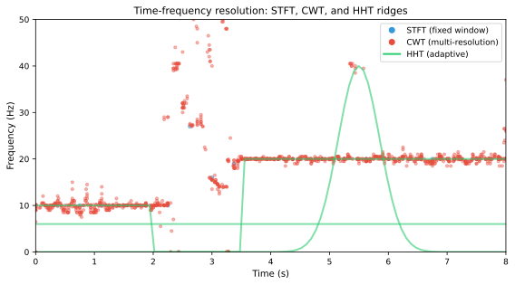

# Time-Frequency Features

While frequency-domain features reveal the spectral content of an EEG segment and time-domain features capture waveform morphology, time-frequency features jointly resolve signal properties in both time and frequency. This is crucial for affective computing because emotional states are dynamic: spectral properties shift over time as emotions unfold, and these transient changes are averaged away in static spectral estimates. Time-frequency representations make it possible to track how the spectrum evolves and to capture transient oscillatory events that are characteristic of emotional processing.

*Figure 1. STFT spectrogram aligned to an emotion induction procedure. Power shifts across bands illustrate the dynamic spectral changes that time-frequency features capture.*

## Short-Time Fourier Transform (STFT)

### Definition

The STFT is the most straightforward time-frequency representation. It computes the Fourier transform over a sliding window:

$$\text{STFT}(t, f) = \sum_{n=-\infty}^{\infty} x(n) \, w(n - t) \, e^{-j 2\pi f n}$$

where $w(n - t)$ is a window function centered at time $t$. The squared magnitude $|\text{STFT}(t, f)|^2$ gives the spectrogram—the time-varying power spectrum.

### Window Design

The choice of window length implements the fundamental time-frequency trade-off:

| Window length | Time resolution | Frequency resolution | Best for |
| --- | --- | --- | --- |
| Short (e.g., 250 ms) | High | Low (~4 Hz) | Detecting rapid emotional changes |
| Medium (e.g., 1 s) | Moderate | Moderate (~1 Hz) | General-purpose emotion tracking |
| Long (e.g., 2–4 s) | Low | High (~0.25–0.5 Hz) | Stable spectral estimates |

In affective EEG, a window of 1–2 seconds with 50% overlap is a common default that balances responsiveness and spectral reliability.

### STFT Features for Emotion Recognition

Features derived from the spectrogram include:

- **Time-varying band powers**: Power in each frequency band as a function of time, capturing the spectral trajectory of emotional processing.
- **Spectral centroid over time**: A measure of the center of mass of the spectrum at each time point.
- **Spectral flux**: The rate of change of the spectrum between consecutive windows, reflecting the speed of spectral transitions.
- **Spectral roll-off**: The frequency below which a specified percentage of total power is contained, tracked over time.

These features can be vectorized (concatenated across time bins) to form a fixed-length feature vector, or fed into sequential models (RNNs, Transformers) that can exploit their temporal structure.

## Wavelet Transform

### Continuous Wavelet Transform (CWT)

The CWT decomposes a signal using scaled and translated versions of a mother wavelet $\psi(t)$:

$$W(a, b) = \frac{1}{\sqrt{|a|}} \int_{-\infty}^{\infty} x(t) \, \psi^*\!\left(\frac{t - b}{a}\right) dt$$

where $a$ is the scale (inversely related to frequency) and $b$ is the translation (time). Unlike the STFT with its fixed window, the CWT adapts its time-frequency resolution: high frequencies are resolved with better time resolution and lower frequency resolution, while low frequencies have better frequency resolution and lower time resolution. This multi-resolution property is well suited to EEG, where fast oscillations (gamma) are brief and slow oscillations (delta) are sustained.

### Mother Wavelet Selection

The choice of mother wavelet affects the interpretability of the resulting features:

| Wavelet | Characteristics | EEG application |
| --- | --- | --- |
| Morlet (Gabor) | Gaussian-enveloped complex sinusoid; good frequency localization | Most common for time-frequency analysis of EEG oscillations |
| Mexican Hat | Real-valued, second derivative of Gaussian | Edge and transient detection |
| Daubechies (dbN) | Orthogonal, compact support | Discrete wavelet decomposition, feature compression |

The Morlet wavelet is most widely used for EEG emotion analysis because its complex-valued output allows separate analysis of amplitude and phase, and its Gaussian envelope provides a natural balance between time and frequency localization.

### Wavelet Features

Key features extracted from the wavelet transform include:

- **Wavelet power**: $|W(a, b)|^2$ — the time-frequency energy distribution.
- **Wavelet coherence**: A measure of phase consistency between two signals across time and frequency.
- **Wavelet entropy**: Entropy of the wavelet coefficients at each scale, reflecting the complexity of the signal at that frequency.
- **Cross-wavelet power**: Joint power between two signals, useful for studying functional coupling.

### Discrete Wavelet Transform (DWT)

The DWT provides a computationally efficient, non-redundant decomposition using filter banks:

$$x(t) = \sum_k c_{J,k} \, \phi_{J,k}(t) + \sum_{j=1}^{J} \sum_k d_{j,k} \, \psi_{j,k}(t)$$

where $c_{J,k}$ are approximation coefficients (low-frequency content) and $d_{j,k}$ are detail coefficients at level $j$ (progressively higher frequencies). The sub-band energies $\sum_k d_{j,k}^2$ for each decomposition level provide a compact set of features that align roughly with the canonical EEG bands.

DWT features are popular because they are fast to compute, produce relatively few coefficients, and the decomposition levels can be chosen to match frequency bands of interest.

## Hilbert-Huang Transform (HHT)

The HHT is an adaptive time-frequency method designed for non-stationary and nonlinear signals. It consists of two steps:

### Empirical Mode Decomposition (EMD)

EMD decomposes the signal into a set of Intrinsic Mode Functions (IMFs) without assuming any basis functions:

$$x(t) = \sum_{i=1}^{M} \text{IMF}_i(t) + r(t)$$

Each IMF satisfies two conditions: (1) the number of extrema and zero-crossings differ by at most one, and (2) the mean of the upper and lower envelopes is zero at all points.

### Hilbert Spectral Analysis

The Hilbert transform is applied to each IMF to obtain instantaneous amplitude $a_i(t)$ and instantaneous frequency $\omega_i(t)$:

$$z_i(t) = \text{IMF}_i(t) + j \mathcal{H}\{\text{IMF}_i(t)\} = a_i(t) e^{j \theta_i(t)}, \quad \omega_i(t) = \frac{d\theta_i(t)}{dt}$$

The Hilbert spectrum $H(\omega, t)$ provides a high-resolution time-frequency representation:

$$H(\omega, t) = \sum_{i=1}^{M} a_i^2(t) \, \delta(\omega - \omega_i(t))$$

### HHT in Affective EEG

HHT-based features offer several advantages for emotion recognition:

- **Adaptivity**: No need to pre-specify frequency bands; the decomposition is data-driven.
- **Nonlinearity**: EMD naturally handles nonlinear oscillations.
- **High resolution**: The instantaneous frequency can resolve fine spectral changes.

Features such as the marginal Hilbert spectrum (time-averaged), instantaneous energy, and Hilbert weighted frequencies have been used for emotion classification with competitive results. However, HHT is more computationally intensive and can be sensitive to noise, and EMD can suffer from mode mixing.

## Common Spatial Patterns (CSP)

CSP is a spatial filtering technique that finds linear combinations of electrode channels that maximize the variance difference between two conditions. While not a time-frequency method per se, CSP is often applied to band-pass filtered EEG, effectively creating a joint spatial-frequency feature space.

### CSP Formulation

For two classes with covariance matrices $\Sigma_1$ and $\Sigma_2$, CSP finds spatial filters $\mathbf{w}$ that satisfy:

$$\mathbf{w}^T \Sigma_1 \mathbf{w} = \lambda \, \mathbf{w}^T \Sigma_2 \mathbf{w}$$

The filters with the largest and smallest eigenvalues maximize the variance ratio between the two classes. The log-variance of the CSP-filtered signals serves as features:

$$f_k = \log\left(\text{var}(\mathbf{w}_k^T \mathbf{X})\right)$$

### CSP in Affective Computing

CSP is a staple of motor imagery BCI but has been adapted for affective computing by applying it to emotion-relevant frequency bands. Multi-class extensions (e.g., one-vs-rest CSP) and regularized variants (to handle the low sample sizes common in affective datasets) have been explored.

The Filter Bank CSP (FBCSP) extends CSP by applying it to multiple frequency sub-bands and selecting the most discriminative features, a strategy that aligns naturally with the spectral nature of affective EEG.

*Figure 2. Comparative time-frequency ridges for the same EEG segment. STFT uses a fixed window, CWT provides multi-resolution scaling, and HHT offers adaptive, data-driven ridges.*

## Comparison of Time-Frequency Methods

| Method | Time-freq resolution | Basis | Computational cost | Emotion recognition use |
| --- | --- | --- | --- | --- |
| STFT | Fixed | Sinusoidal | Low | Very common |
| CWT | Adaptive (multi-resolution) | Wavelet | Moderate | Common |
| DWT | Fixed (dyadic) | Wavelet | Low | Moderately common |
| HHT | Adaptive | Data-driven (IMFs) | High | Emerging |
| CSP (with filter bank) | Spatial only | Data-driven | Moderate | Moderate |

## Practical Considerations

| Consideration | Guidance |
| --- | --- |
| Feature dimensionality | Time-frequency maps can be very high-dimensional; consider dimensionality reduction or use summary statistics |
| Overlap | 50% overlap is typical for STFT-based features |
| Boundary effects | Avoid or account for edge artifacts at segment boundaries |
| Computational budget | For real-time systems, prefer DWT or STFT over CWT or HHT |
| Normalization | Per-trial or per-subject normalization of time-frequency maps is recommended |
| Visualization | Always visually inspect time-frequency representations to verify feature quality |

## Summary

Time-frequency features bridge the gap between static spectral features and raw time-domain signals, enabling the capture of dynamic spectral changes that accompany emotional processing. The STFT remains the most practical choice for many applications, while wavelet-based methods offer theoretical advantages in resolution, and HHT provides an adaptive alternative for nonlinear signals. For affective computing, the key is to match the time-frequency resolution to the expected time scale of emotional dynamics—typically on the order of seconds, not milliseconds.
