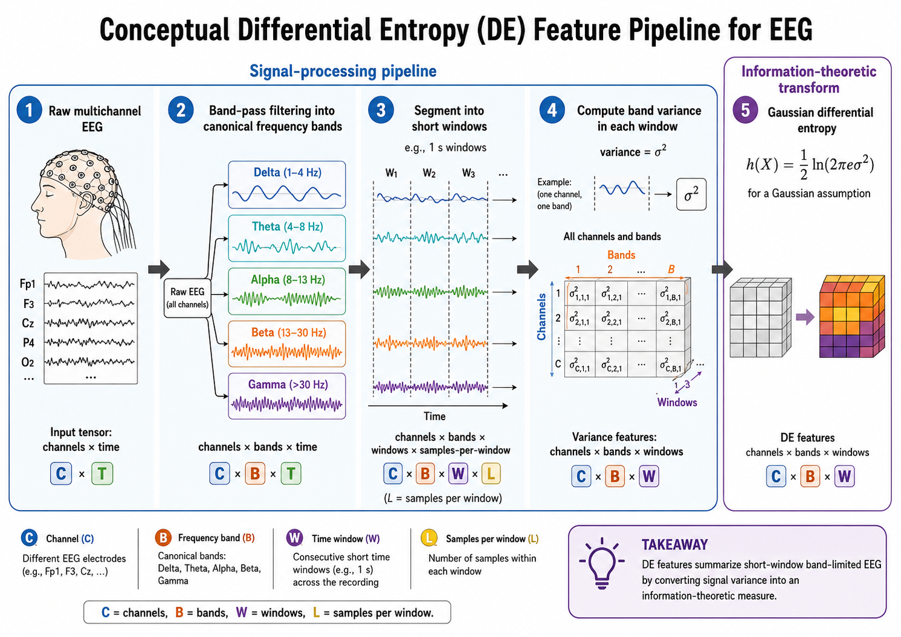
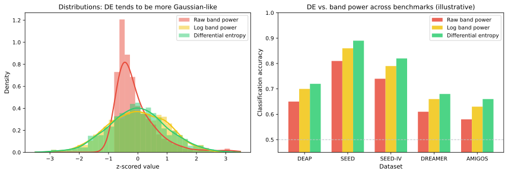

# Differential Entropy Features

Differential Entropy (DE) is arguably the single most influential feature in modern EEG-based affective computing. Since its popularization through the SEED dataset and related benchmarks, DE has become the de facto standard spectral feature for emotion recognition, consistently outperforming traditional band power features in many comparative studies. This section explains what DE is, why it works well for EEG, how it is typically computed, and what its limitations are.

**Figure 7.7: Differential-entropy feature extraction pipeline.** Raw multichannel EEG is filtered into canonical frequency bands, segmented into short windows, converted to band variance, and transformed with the Gaussian differential-entropy formula. The pipeline tracks channel, band, and time-window dimensions and distinguishes signal-processing steps from the information-theoretic transformation.

## Information-Theoretic Definition

Differential entropy extends the discrete Shannon entropy to continuous random variables. For a continuous random variable $$X$$ with probability density function $$p(x)$$, the differential entropy is:

$$h(X) = -\int_{-\infty}^{\infty} p(x) \ln p(x) \, dx$$

Unlike discrete entropy, differential entropy can be negative and is not invariant under nonlinear transformations. Its value depends on both the spread and the shape of the distribution. For a given variance, the Gaussian distribution maximizes differential entropy.

### Why Differential Entropy for EEG?

DE is particularly well motivated for EEG analysis because:

1. **Gaussianity assumption**: Band-pass filtered EEG signals are often approximately Gaussian-distributed within short time windows. Under the Gaussian assumption, DE has a simple closed-form expression that is directly related to signal power.

2. **Log-power relationship**: For Gaussian signals, DE is proportional to the logarithm of the variance, which means DE captures the same information as log-band-power but with a principled information-theoretic interpretation.

3. **Discriminative power**: DE has been shown empirically to provide better separability between emotional states compared to raw or linearly scaled band power, partly because the log transform stabilizes variance and reduces skew.

4. **Neuroscience alignment**: The balance between spectral power and complexity that DE captures aligns with neuroscientific understanding of how emotional states modulate oscillatory brain activity.

## DE Under the Gaussian Assumption

### Closed-Form Expression

If a signal $$x(t)$$ in a given frequency band follows a Gaussian distribution $$\mathcal{N}(\mu, \sigma^2)$$, its differential entropy simplifies to:

$$h(X) = \frac{1}{2} \ln(2\pi e \sigma^2) = \frac{1}{2} \ln(\sigma^2) + \frac{1}{2} \ln(2\pi e)$$

Since $$\frac{1}{2} \ln(2\pi e)$$ is a constant, DE under the Gaussian assumption is essentially:

$$h(X) \propto \ln(\sigma^2)$$

where $$\sigma^2$$ is the variance (i.e., the average power) of the band-pass filtered signal. In practice, this means DE is often computed as the log of the variance of the signal in each frequency band.

### Comparison with Related Measures

| Measure | Formula (Gaussian case) | Relationship to DE |
| --- | --- | --- |
| Band power | $$\sigma^2$$ | DE $$\propto \ln($$ band power $$)$$ |
| Log band power | $$\ln(\sigma^2)$$ | DE is an affine transform of log band power |
| Shannon entropy (discrete) | $$-\sum p_i \log_2 p_i$$ | Different quantity; requires discretization |
| Sample entropy | See Section 07 | Measures regularity, not information content |

The key insight is that DE and log band power are essentially equivalent under the Gaussian assumption—yet DE provides a richer framework that can be extended when the Gaussian assumption does not hold.

## Computing DE Features for Affective EEG

### Standard Pipeline

The standard DE feature extraction pipeline consists of the following steps:

1. **Band-pass filtering**: Filter the raw EEG into the canonical frequency bands (delta, theta, alpha, beta, gamma) or finer sub-bands using Butterworth or FIR filters.

2. **Segmentation**: Divide the filtered signal into short time windows (typically 1–4 seconds).

3. **DE computation per window**: For each channel, frequency band, and time window, compute:

   $$\text{DE} = \frac{1}{2} \ln(2\pi e \sigma^2_{\text{band, channel, window}})$$

   where $$\sigma^2$$ is the variance of the band-pass filtered signal in that window.

4. **Feature vector construction**: Concatenate DE values across all channels and frequency bands to form a feature vector of dimension $$C \times B$$, where $$C$$ is the number of channels and $$B$$ is the number of frequency bands.

### Example Dimensionality

For the commonly used SEED dataset configuration:

- 62 channels of EEG
- 5 frequency bands (delta, theta, alpha, beta, gamma)
- Feature dimensionality: $$62 \times 5 = 310$$ features per time window

Additional sub-bands (e.g., dividing gamma into low and high gamma) further increase dimensionality.

### DE with Different Linear Features (DE-LDS)

An extension known as DE with Linear Dynamic System (DE-LDS) features augments DE with temporal smoothing. Rather than treating each time window independently, DE-LDS applies a linear dynamic system to model the temporal evolution of DE features:

$$\mathbf{h}_t = A \mathbf{h}_{t-1} + \mathbf{w}_t$$
$$\mathbf{x}_t = C \mathbf{h}_t + \mathbf{v}_t$$

where $$\mathbf{h}_t$$ is a latent state, $$A$$ is the transition matrix, and $$\mathbf{x}_t$$ is the observed DE feature vector. This temporal smoothing has been shown to improve emotion recognition accuracy, particularly for longer recordings where emotional states evolve gradually.

## Moving Beyond the Gaussian Assumption

### Non-Gaussian DE Estimation

While the Gaussian approximation is widely used and often effective, EEG signals are not always Gaussian, especially in the presence of artifacts, during transient events, or with certain electrode configurations. Non-parametric DE estimation methods include:

- **Kernel density estimation (KDE)**: Estimate $$p(x)$$ using a kernel density estimator and numerically integrate $$-\int \hat{p}(x) \ln \hat{p}(x) \, dx$$.
- **k-Nearest Neighbors (k-NN)**: Use the Kozachenko-Leonenko estimator:

  $$\hat{h}(X) = \psi(N) - \psi(k) + \ln(c_d) + \frac{d}{N} \sum_{i=1}^{N} \ln \epsilon_i$$

  where $$\psi$$ is the digamma function, $$d$$ is the dimensionality, and $$\epsilon_i$$ is the distance to the $$k$$-th nearest neighbor.
- **Histogram-based**: Simple but sensitive to bin width; rarely used in modern EEG pipelines.

In practice, the Gaussian approximation works well enough for most affective computing applications, and the computational simplicity makes it the default choice. Non-parametric estimators are reserved for cases where distributional assumptions are clearly violated or where theoretical rigor is paramount.

### DE for Non-Gaussian Distributions

If the signal follows a different parametric distribution, DE takes a different form:

| Distribution | DE formula |
| --- | --- |
| Uniform on $$[a, b]$$ | $$\ln(b - a)$$ |
| Laplace (double exponential) | $$1 + \ln(2b)$$, where $$b$$ is the scale parameter |
| Student's t with $$\nu$$ d.f. | Depends on $$\nu$$; approaches Gaussian DE as $$\nu \to \infty$$ |

In EEG practice, the Gaussian assumption is almost universal for DE computation, and deviations are rarely modeled explicitly.

## DE in State-of-the-Art Emotion Recognition

### Key Results

DE features have been central to many landmark results in EEG-based emotion recognition:

- **SEED dataset**: DE features combined with DBN (Deep Belief Network) or SVM achieved state-of-the-art accuracy on three-class emotion recognition (positive, neutral, negative), often exceeding 85–90%.
- **SEED-IV and SEED-V**: DE features extended to four and five emotion classes, maintaining strong performance.
- **DEAP dataset**: DE features (computed on short windows) have been widely used for valence-arousal regression and classification.

### Why DE Outperforms Raw Power

Several factors contribute to DE's empirical success:

1. **Log transform**: The logarithm naturally compresses the dynamic range of EEG power, reducing the influence of outlier high-power segments and making feature distributions more Gaussian.
2. **Variance stabilization**: EEG power often exhibits heteroscedasticity (variance that scales with the mean); the log transform stabilizes this.
3. **Additivity**: Under independence, DE adds across independent frequency components, providing a principled way to combine information across bands.
4. **Information-theoretic interpretation**: DE quantifies the average uncertainty (or complexity) of the signal in each band, which aligns conceptually with the idea that emotional states modulate the information content of brain signals.

**Figure 7.8: Differential-entropy feature comparison.** Illustrative benchmark comparison of DE, log band power, and raw band power. DE typically matches or exceeds the alternatives across datasets.

## Multi-Scale and Hierarchical DE

### Multi-Scale DE

Rather than computing DE only on the band-pass filtered signal, some approaches compute DE at multiple time scales through coarse-graining:

$$y_j^{(\tau)} = \frac{1}{\tau} \sum_{i=(j-1)\tau + 1}^{j\tau} x_i, \quad 1 \leq j \leq N/\tau$$

DE is then computed on each coarse-grained series. Multi-scale DE captures information across different temporal resolutions and has been shown to improve emotion classification accuracy by capturing both fast and slow EEG dynamics.

### DE with Flexible Frequency Resolution

Instead of using fixed canonical bands, some studies use:

- **DE on sub-bands**: Dividing each canonical band into narrower sub-bands (e.g., alpha1: 8–10 Hz, alpha2: 10–13 Hz) to capture finer spectral structure.
- **DE on overlapping bands**: Using overlapping frequency windows to create a smoother spectral representation.
- **DE on individual frequency bins**: Computing DE on individual FFT bins, creating a high-dimensional spectral feature map.

Higher frequency resolution increases feature dimensionality and may improve discriminability, but also increases the risk of overfitting when sample sizes are limited.

## Channel Selection and DE

Because DE features scale linearly with the number of channels, channel selection is important for computational efficiency and for avoiding the curse of dimensionality. Common strategies include:

- **Topography-based selection**: Choosing channels that cover key regions (frontal, temporal, parietal, occipital) while minimizing redundancy.
- **Statistical selection**: Using mutual information, ANOVA F-score, or recursive feature elimination to select channels whose DE features are most discriminative.
- **Neuroscience-driven selection**: Focusing on regions with known affective relevance, such as prefrontal and temporal areas.

| Strategy | Channels (example) | Rationale |
| --- | --- | --- |
| Full montage | All 62/64 | Maximum information, high dimensionality |
| Regional coverage | Fp1, Fp2, F3, F4, F7, F8, T3, T4, T5, T6, C3, C4, P3, P4, O1, O2 | Balanced coverage |
| Frontal-temporal focus | Fp1, Fp2, F3, F4, F7, F8, T3, T4 | Emotion-relevant regions |
| Minimal wearable | Fp1, Fp2, F3, F4 | Practical for consumer-grade headsets |

Reducing from 62 to 4 channels with DE features often retains 80–90% of classification accuracy in many benchmarks, suggesting that DE is robust even at low spatial resolution.

## Comparison with Other Spectral Features

| Feature | Formula | Gaussian DE relationship | Discriminability | Computational cost |
| --- | --- | --- | --- |
| Raw band power | $$\sigma^2$$ | DE $$\propto \ln(\sigma^2)$$ | Moderate | Very low |
| Log band power | $$\ln(\sigma^2)$$ | Affine equivalent | High | Very low |
| DE (Gaussian) | $$\frac{1}{2}\ln(2\pi e \sigma^2)$$ | — | High | Low |
| DE (KDE) | $$-\int \hat{p}(x) \ln \hat{p}(x) dx$$ | — | Potentially higher | High |
| Spectral entropy | $$-\sum P(f) \ln P(f)$$ | Different quantity | Moderate | Low |

## Practical Considerations

| Consideration | Guidance |
| --- | --- |
| Gaussian check | Visually inspect band-pass filtered signal distributions; if heavily skewed, consider artifact removal first |
| Constant offset | DE adds $$\frac{1}{2}\ln(2\pi e)$$; this constant can be omitted when using models that learn additive biases |
| Normalization | Per-subject z-score normalization of DE features is standard and improves cross-subject generalization |
| Frequency band edges | Consistent band definitions are critical for reproducibility; report exact cutoff frequencies |
| Smoothing | Linear dynamic system (LDS) smoothing can further improve DE feature quality for continuous emotion tracking |
| DE for short windows | DE becomes unreliable for windows shorter than ~0.5 s due to poor variance estimates |

## Limitations

1. **Gaussian assumption**: While often reasonable, the Gaussian assumption is not universally valid. EEG during artifacts, transient events, or in certain pathological states may deviate substantially.

2. **Loss of phase information**: Like other spectral power-based features, DE discards phase information, which may carry emotion-relevant synchronization patterns.

3. **No direct spatial information**: DE is computed per channel independently. Spatial interactions and connectivity patterns must be captured by the downstream model or by the relation-based features discussed in Section 05.

4. **Sensitivity to filtering**: DE values depend on the specific filter design (order, type, passband ripple). Inconsistent filtering across studies can reduce reproducibility.

## Summary

Differential entropy has become the benchmark spectral feature for EEG-based affective computing. Its strong empirical performance, principled information-theoretic foundation, and computational simplicity make it the recommended starting point for most emotion recognition pipelines. While closely related to log band power under the Gaussian assumption, DE provides a framework that can be extended to non-Gaussian scenarios and integrated with temporal smoothing for continuous affect tracking.

## References

- Shi, L.-C., Jiao, Y.-Y., & Lu, B.-L. (2013). Differential entropy feature for EEG-based vigilance estimation. *2013 35th Annual International Conference of the IEEE Engineering in Medicine and Biology Society*, 6627–6630. https://doi.org/10.1109/EMBC.2013.6611075
- Zheng, W.-L., & Lu, B.-L. (2015). Investigating critical frequency bands and channels for EEG-based emotion recognition with deep neural networks. *IEEE Transactions on Autonomous Mental Development, 7*(3), 162–175. https://doi.org/10.1109/TAMD.2015.2431497
- Zheng, W.-L., Liu, W., Lu, Y., Lu, B.-L., & Cichocki, A. (2019). EmotionMeter: A multimodal framework for recognizing human emotions. *IEEE Transactions on Cybernetics, 49*(3), 1110–1122. https://doi.org/10.1109/TCYB.2018.2797176
- Cover, T. M., & Thomas, J. A. (2006). *Elements of Information Theory* (2nd ed.). Wiley.
