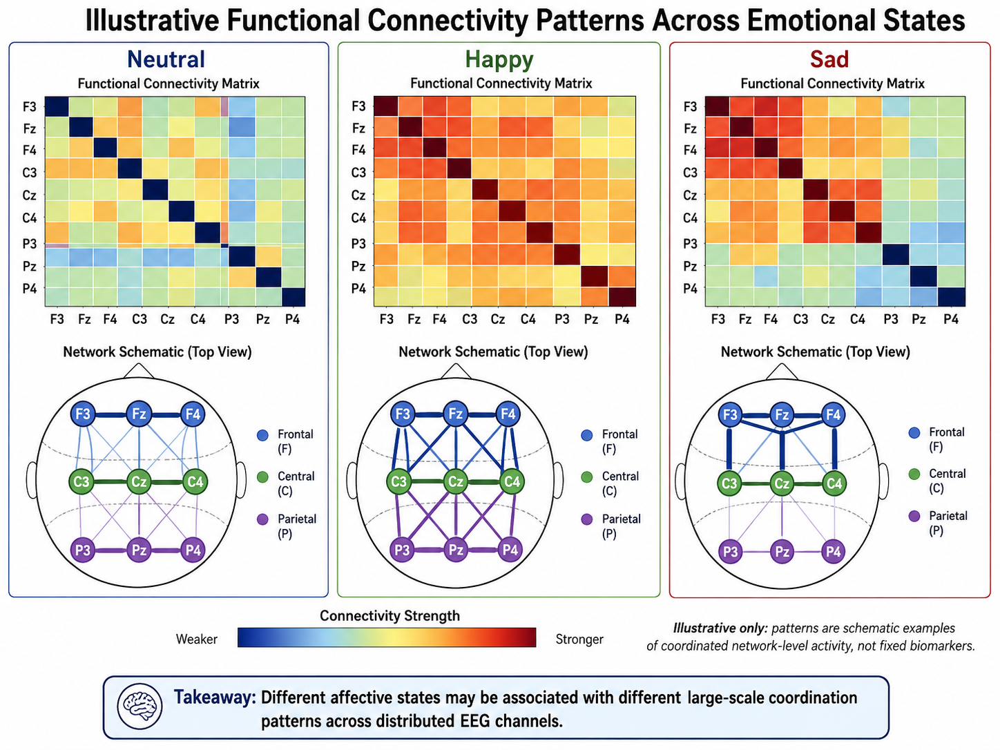
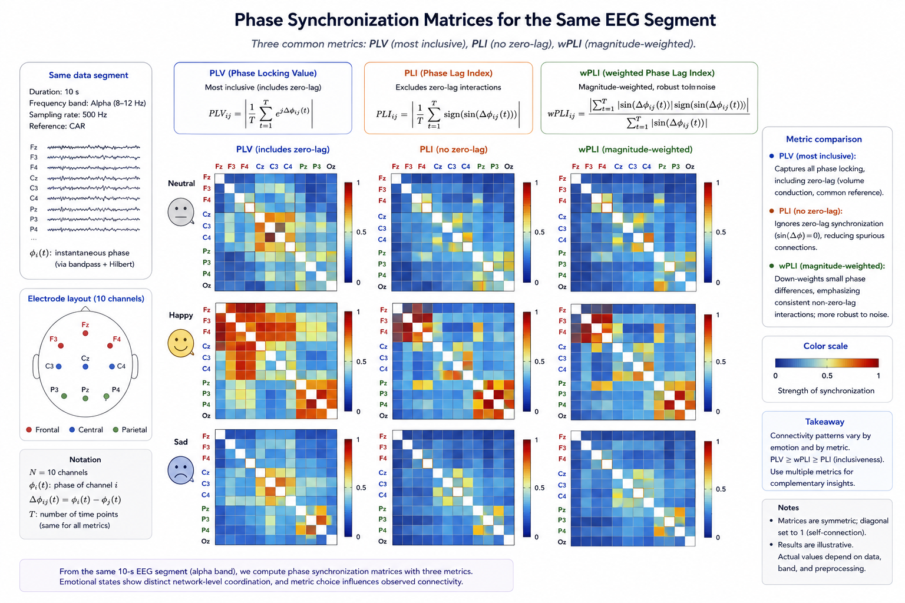
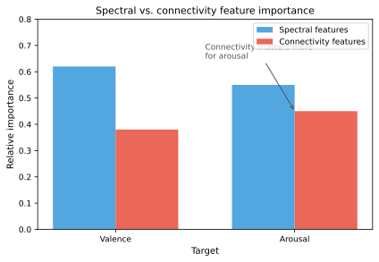

# Relation-Based Features

Most EEG features treat each channel as an independent source of information. However, the brain is a network: emotional processing involves coordinated activity across distributed regions, and these interactions are at least as informative as local spectral properties. Relation-based features capture the dependencies, synchronizations, and connectivity patterns between EEG channels, providing a fundamentally different and complementary view of brain dynamics during emotional processing.

**Figure 7.9: Functional connectivity across emotional states.** Connectivity patterns differ across states, reflecting coordinated network-level activity.

## Why Relations Matter for Affective EEG

Emotion is not localized to a single brain region. It emerges from the coordinated activity of multiple networks, including prefrontal control regions, limbic emotional centers, parietal integration areas, and sensory cortices. This distributed nature means that:

- **Connectivity changes with emotion**: Emotional states modulate the strength and direction of information flow between brain regions.
- **Network topology reflects affective style**: Individual differences in functional connectivity have been linked to trait affect and emotion regulation ability.
- **Relations may be more robust than raw power**: Connectivity measures can be less sensitive to individual differences in skull conductivity and electrode impedance than amplitude-based features.
- **Complementary to spectral features**: Relation-based features capture variance that is orthogonal to channel-wise spectral features, making them valuable for feature fusion.

## Functional Connectivity

Functional connectivity quantifies the statistical dependence between pairs of EEG channels without implying a specific causal or anatomical structure.

### Correlation-Based Measures

#### Pearson Correlation

The simplest connectivity measure is the Pearson correlation coefficient between two channels $x$ and $y$:

$$r_{xy} = \frac{\sum_{t=1}^{N} (x(t) - \bar{x})(y(t) - \bar{y})}{\sqrt{\sum_{t=1}^{N} (x(t) - \bar{x})^2 \sum_{t=1}^{N} (y(t) - \bar{y})^2}}$$

Pearson correlation captures linear co-modulation of amplitudes. It is computationally trivial but limited to linear relationships and sensitive to outliers. Correlation-based connectivity matrices (one correlation per channel pair) can be vectorized to form features of dimension $\binom{C}{2} = C(C-1)/2$.

#### Cross-Correlation with Lag

Cross-correlation extends Pearson correlation by considering time lags:

$$\rho_{xy}(\tau) = \frac{\sum_{t} (x(t) - \bar{x})(y(t+\tau) - \bar{y})}{\sigma_x \sigma_y}$$

The maximum cross-correlation and the lag at which it occurs provide directional information about which channel tends to lead or lag the other. This is a simple proxy for directed connectivity.

### Coherence

Coherence is the frequency-domain analogue of correlation, measuring the linear relationship between two signals at each frequency $f$:

$$C_{xy}(f) = \frac{|S_{xy}(f)|^2}{S_{xx}(f) \, S_{yy}(f)}$$

where $S_{xy}(f)$ is the cross-spectral density and $S_{xx}(f)$, $S_{yy}(f)$ are the auto-spectral densities. Coherence ranges from 0 (no linear relationship) to 1 (perfect linear relationship) and is frequency-specific.

For affective computing, coherence is typically averaged within each canonical frequency band:

$$C_{xy}^{\text{band}} = \frac{1}{f_{\text{high}} - f_{\text{low}}} \int_{f_{\text{low}}}^{f_{\text{high}}} C_{xy}(f) \, df$$

Coherence-based features are popular because they separate connectivity by frequency band, aligning with the spectral specificity of emotional EEG.

#### Imaginary Coherence

A known problem with standard coherence is volume conduction: a single source can produce correlated activity at multiple scalp electrodes, creating spurious connectivity. Imaginary coherence mitigates this by using only the imaginary part of the cross-spectrum, which captures true phase-delayed interactions:

$$\text{iCoh}_{xy}(f) = \frac{|\Im\{S_{xy}(f)\}|}{\sqrt{S_{xx}(f) \, S_{yy}(f)}}$$

Zero-lag interactions (including those from volume conduction) have zero imaginary part and are thus excluded.

## Phase Synchronization Measures

Phase synchronization captures the consistency of phase differences between two oscillatory signals, independent of their amplitudes.

### Phase Locking Value (PLV)

The PLV quantifies the consistency of the phase difference across time or trials:

$$\text{PLV} = \left| \frac{1}{N} \sum_{t=1}^{N} e^{j(\phi_x(t) - \phi_y(t))} \right|$$

where $\phi_x(t)$ and $\phi_y(t)$ are the instantaneous phases of signals $x$ and $y$ at time $t$, typically extracted via the Hilbert transform or wavelet convolution. PLV ranges from 0 (random phase relationship) to 1 (perfect phase locking).

PLV is one of the most widely used synchronization measures in affective EEG because it is intuitive, robust to amplitude fluctuations, and sensitive to transient phase coupling that may accompany emotional processing.

### Phase Lag Index (PLI)

The PLI addresses volume conduction by discounting zero-lag phase differences:

$$\text{PLI} = \left| \frac{1}{N} \sum_{t=1}^{N} \text{sign}\big(\phi_x(t) - \phi_y(t)\big) \right|$$

By considering only the sign (not magnitude) of phase differences, PLI is less sensitive to volume conduction and outliers. PLI ranges from 0 (no phase locking or purely zero-lag locking) to 1 (perfect, consistent non-zero phase locking).

#### Weighted PLI (wPLI)

Weighted PLI further weights phase differences by their magnitude, reducing sensitivity to small phase differences that are close to zero and may be noise-driven:

$$\text{wPLI} = \frac{\left| \sum_{t} |\Im\{S_{xy}(t)\}| \, \text{sign}\big(\Im\{S_{xy}(t)\}\big) \right|}{\sum_{t} |\Im\{S_{xy}(t)\}|}$$

wPLI has become the preferred phase-based connectivity measure in many EEG studies due to its robustness to volume conduction, noise, and small sample sizes.

### Comparison of Synchronization Measures

| Measure | Range | Volume conduction robust? | Amplitude independent? | Notes |
| --- | --- | --- | --- | --- |
| PLV | [0, 1] | No | Yes | Simple, widely used |
| PLI | [0, 1] | Yes | Yes | Less sensitive than PLV |
| wPLI | [0, 1] | Yes | Yes | Preferred for most applications |
| Coherence | [0, 1] | No | No | Frequency-specific |
| Imaginary coherence | [0, 1] | Yes | No | Frequency-specific |

**Figure 7.10: Phase-synchronization measures.** Phase synchronization matrices for the same segment. PLV is the most inclusive; PLI drops zero-lag interactions; wPLI weights phase differences by magnitude.

## Mutual Information and Nonlinear Coupling

Mutual information (MI) captures both linear and nonlinear dependencies:

$$I(X; Y) = \iint p(x, y) \ln \frac{p(x, y)}{p(x) p(y)} \, dx \, dy$$

For EEG, MI is typically estimated using k-NN methods or binning approaches. MI-based connectivity can detect nonlinear coupling that correlation and coherence miss. However, MI estimation is data-hungry and noisier than linear measures, which can be a limitation for the relatively short segments used in affective computing.

### Transfer Entropy

Transfer entropy extends mutual information to capture directed information flow:

$$T_{X \to Y} = \sum p(y_{t+1}, y_t^{(k)}, x_t^{(l)}) \ln \frac{p(y_{t+1} \mid y_t^{(k)}, x_t^{(l)})}{p(y_{t+1} \mid y_t^{(k)})}$$

where $y_t^{(k)}$ and $x_t^{(l)}$ are the past $k$ and $l$ values of $Y$ and $X$, respectively. Transfer entropy quantifies how much the past of $X$ reduces uncertainty about the future of $Y$, beyond what the past of $Y$ already reveals.

In affective computing, transfer entropy has been used to study directed connectivity changes during emotional processing, such as frontal-to-posterior information flow during emotional regulation. However, its high data requirements and sensitivity to parameter choices (embedding dimension, lag) have limited its widespread adoption.

## Graph-Theoretic Features

Once a connectivity matrix is computed (by any of the above methods), the resulting network can be characterized using graph-theoretic measures. These measures reduce the full connectivity matrix to a smaller set of interpretable network properties.

### Node-Level (Local) Measures

| Measure | Definition | Affective interpretation |
| --- | --- | --- |
| Node degree | Number of connections (or sum of weights) above a threshold | How connected a region is during emotional processing |
| Clustering coefficient | Fraction of a node's neighbors that are connected to each other | Local segregation; may reflect specialized emotional processing |
| Node efficiency | Average inverse shortest path length from the node | How efficiently a region communicates with the rest of the brain |
| Betweenness centrality | Fraction of shortest paths that pass through the node | Hub regions that integrate emotional information |

### Network-Level (Global) Measures

| Measure | Definition | Affective interpretation |
| --- | --- | --- |
| Characteristic path length | Average shortest path between all node pairs | Global integration efficiency |
| Global clustering coefficient | Average of local clustering coefficients | Network segregation |
| Small-worldness | Ratio of clustering to path length (normalized) | Balance of integration and segregation; may shift with emotional state |
| Modularity | Degree to which the network can be partitioned into modules | Functional specialization during emotion |

### Practical Considerations for Graph Features

Graph-theoretic features depend fundamentally on the thresholding scheme used to convert a weighted connectivity matrix to a binary graph. Common approaches include:

- **Absolute threshold**: Keep edges with weight above a fixed value.
- **Proportional threshold**: Keep the top $p\%$ of edges.
- **Minimum spanning tree**: Use the backbone of the network, eliminating cycles and arbitrary thresholds.

The choice of threshold can significantly affect results, and there is no universal standard. Reporting sensitivity to threshold choice is essential for reproducibility.

## Spatial Covariance and Riemannian Features

### Spatial Covariance Matrices

The spatial covariance matrix of a multichannel EEG segment captures the linear relationships among all channels simultaneously:

$$\Sigma = \frac{1}{N-1} \mathbf{X} \mathbf{X}^T \in \mathbb{R}^{C \times C}$$

where $\mathbf{X} \in \mathbb{R}^{C \times N}$ is the EEG segment (channels $\times$ time). The covariance matrix is symmetric positive definite (SPD), which means it lies on a Riemannian manifold rather than in flat Euclidean space.

### Riemannian Geometry Approach

Treating covariance matrices as points on a Riemannian manifold has become a powerful paradigm in BCI and is increasingly adopted in affective computing. Key operations:

- **Riemannian distance**: The geodesic distance between two SPD matrices $P$ and $Q$ under the affine-invariant metric:

  $$\delta_R(P, Q) = \left\| \log(P^{-1/2} Q P^{-1/2}) \right\|_F$$

- **Tangent space projection**: Map SPD matrices to a Euclidean tangent space for use with standard classifiers:

  $$s = \text{upper}\left( \log_M(P_{\text{ref}}^{-1/2} P P_{\text{ref}}^{-1/2}) \right)$$

  where $\log_M$ is the matrix logarithm, $P_{\text{ref}}$ is a reference point (typically the Riemannian mean), and $\text{upper}$ extracts the upper triangular elements.

Riemannian features have several advantages: they naturally capture channel interactions, are invariant to linear transformations of the data (including re-referencing), and provide a principled geometry for averaging and interpolating covariance matrices. In affective computing, Riemannian approaches have achieved competitive or state-of-the-art results, particularly in cross-subject settings.

## Directed and Effective Connectivity

### Granger Causality

Granger causality tests whether past values of one time series improve prediction of another:

$$y(t) = \sum_{k=1}^{p} a_k y(t-k) + \sum_{k=1}^{p} b_k x(t-k) + \varepsilon(t)$$

If including $x$ significantly reduces the prediction error, $x$ is said to Granger-cause $y$. Frequency-domain Granger causality (e.g., directed transfer function, partial directed coherence) provides frequency-specific directed connectivity.

### Limitations

- Granger causality assumes linear, autoregressive relationships.
- It is sensitive to filter artifacts and requires stationary signals.
- Volume conduction can introduce spurious directed connections.
- Results depend strongly on model order selection.

Despite these limitations, Granger-causal features have been used to study the direction of information flow during emotional processing, with findings such as increased frontal-to-parietal drive during high-arousal states.

## Feature Construction from Relations

Given $C$ EEG channels, relation-based features quickly become high-dimensional: there are $\mathcal{O}(C^2)$ pairwise relations. Strategies for managing this dimensionality include:

### Direct Vectorization

Vectorize the upper triangle of the connectivity matrix (excluding the diagonal):

$$\mathbf{f}_{\text{conn}} = [r_{1,2}, r_{1,3}, \ldots, r_{1,C}, r_{2,3}, \ldots, r_{C-1,C}]$$

For $C = 62$, this yields $62 \times 61 / 2 = 1891$ features per frequency band—highly dimensional relative to typical affective EEG sample sizes.

### Dimensionality Reduction

| Strategy | Description | Pros and cons |
| --- | --- | --- |
| Graph-theoretic summary | Reduce to node-level or network-level graph metrics | Low-dimensional and interpretable, but lossy |
| Thresholding and binarization | Keep only strongest connections | Reduces noise, but threshold choice is arbitrary |
| PCA on connectivity vectors | Principal components of vectorized connectivity | Data-driven, but loses interpretability |
| Region-of-interest averaging | Average connectivity within and between predefined regions | Neuroscience-grounded, requires ROI definition |
| Feature selection | Select most discriminative connections via statistical tests or regularization | Adaptive, but risks overfitting with small samples |

### Connectivity Fingerprints

An emerging approach is to use the full pattern of connectivity (the connectome fingerprint) as a feature. Individual differences in functional connectivity are stable enough that connectivity patterns can identify individuals—and by extension, may carry individual-level affective information. Representing the connectivity matrix as a whole (e.g., as input to a graph neural network) preserves the full relational structure.

## Practical Considerations

| Consideration | Guidance |
| --- | --- |
| Volume conduction | Use measures robust to volume conduction (wPLI, imaginary coherence) unless source-localized signals are available |
| Segment length | Most connectivity measures require at minimum 2–5 seconds for stable estimates |
| Multiple comparisons | With $\mathcal{O}(C^2)$ connections, correction for multiple comparisons is essential in statistical analysis (less critical in ML pipelines) |
| Reference scheme | Connectivity patterns depend on the EEG reference; be consistent within and across studies |
| Frequency specificity | Compute connectivity separately for each frequency band rather than on broadband signals |
| Surrogate testing | Use phase-randomized surrogates to establish significance thresholds for connectivity |
| Combination with spectral features | Connectivity features complement spectral features; fused representations often outperform either alone |

**Figure 7.11: Spectral and connectivity feature importance.** Connectivity tends to contribute more strongly to arousal prediction, while spectral features dominate valence in this illustrative benchmark.

## Summary

Relation-based features capture the coordinated, network-level brain dynamics that underlie emotional processing. From simple correlations to Riemannian geometry, these features provide a perspective that is fundamentally complementary to channel-wise spectral features. The choice of connectivity measure should be guided by theoretical considerations (volume conduction robustness, linear vs. nonlinear assumptions) and practical constraints (segment length, computational budget). In modern affective EEG pipelines, relation-based features are increasingly integrated with spectral features through feature fusion or through models that inherently capture spatial interactions, such as graph neural networks (see Chapter 08, Section 06).
