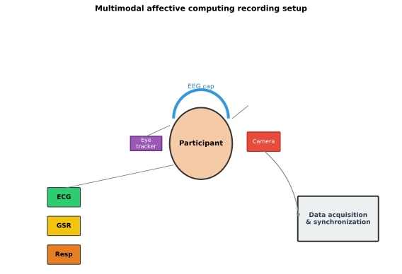
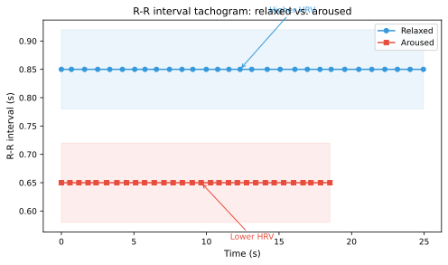
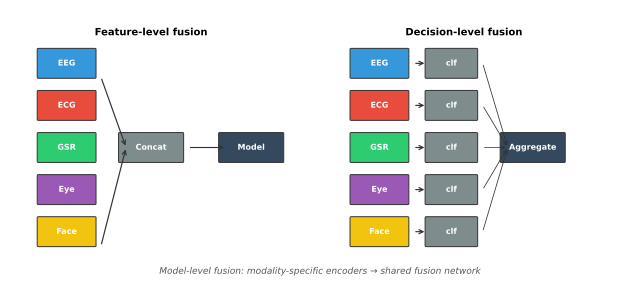

# Multimodal Features

Emotion is an inherently multimodal phenomenon. It manifests not only in brain activity but also in peripheral physiology, facial expressions, vocal characteristics, eye movements, and behavior. EEG, while providing a direct window into cortical processing, captures only one aspect of the emotional response. Features from complementary modalities can provide synergistic information that improves recognition accuracy, robustness, and ecological validity.

*Figure 1. A typical multimodal affective computing recording setup. Multiple streams are synchronized by a common acquisition system.*

## Why Multimodal Features?

### Complementary Information

Different modalities reflect different aspects of the emotional response:

| Modality | What it captures | Time scale | Key affective information |
| --- | --- | --- | --- |
| EEG | Cortical electrical activity | Milliseconds | Cognitive appraisal, neural processing of emotion |
| ECG/HRV | Cardiac activity | Seconds | Arousal, autonomic regulation |
| GSR/EDA | Electrodermal activity | Seconds | Arousal, sympathetic activation |
| Eye tracking | Gaze and pupil | Milliseconds to seconds | Attention, cognitive load, pupil-linked arousal |
| Facial expressions | Muscle activity | Milliseconds to seconds | Valence, specific emotion categories |
| Respiration | Breathing patterns | Seconds | Arousal, relaxation, emotion regulation |
| EMG | Muscle activity | Milliseconds | Startle response, facial muscle activity (corrugator, zygomaticus) |
| Body movement | Posture and motion | Seconds | Behavioral activation, restlessness |

### The Case for Multimodal Fusion

Single-modality EEG-based emotion recognition typically achieves accuracies in the 60–85% range depending on the dataset, number of classes, and evaluation protocol. Multimodal fusion consistently improves upon these baselines, particularly for:

- **Ambiguous emotional states**: When EEG patterns are subtle, peripheral physiology or facial expressions may provide clearer signals.
- **Real-world noise**: In noisy or ambulatory settings, multimodal redundancy can compensate for degraded EEG quality.
- **Subject-independent recognition**: Peripheral signals may generalize better across subjects than EEG alone.
- **Continuous affect tracking**: Combining modalities with different time constants can improve both responsiveness and stability.

## Peripheral Physiological Features

### Electrocardiography (ECG) and Heart Rate Variability (HRV)

ECG features are among the most widely used peripheral measures in affective computing:

**Heart Rate (HR)**
$$\text{HR} = \frac{60}{\text{RR}_{\text{mean}}} \quad \text{(beats per minute)}$$

Heart rate generally increases with arousal and can differentiate high-arousal positive vs. negative states.

**Heart Rate Variability (HRV) Features**

HRV measures the variation in inter-beat intervals and reflects autonomic nervous system balance:

| HRV feature | Domain | Formula / Definition | Affective interpretation |
| --- | --- | --- | --- |
| SDNN | Time | Standard deviation of NN intervals | Overall HRV; decreases under stress |
| RMSSD | Time | $\sqrt{\frac{1}{N-1}\sum_{i=1}^{N-1}(NN_{i+1} - NN_i)^2}$ | Parasympathetic (vagal) activity |
| pNN50 | Time | Proportion of NN intervals differing by >50 ms | Vagal tone |
| LF power | Frequency | Power in 0.04–0.15 Hz | Mixed sympathetic and parasympathetic |
| HF power | Frequency | Power in 0.15–0.4 Hz | Parasympathetic (respiratory sinus arrhythmia) |
| LF/HF ratio | Frequency | Ratio of LF to HF power | Sympathovagal balance; increases with stress/arousal |

*Figure 2. R-R interval tachogram. Relaxed states (blue) show larger beat-to-beat variability; aroused states (red) show faster, more regular heartbeats and reduced HRV.*

### Electrodermal Activity (EDA / GSR)

EDA measures sweat gland activity, which is controlled by the sympathetic nervous system. It is one of the purest measures of sympathetic arousal.

**Tonic and Phasic Components**

EDA is typically decomposed into:

- **Skin Conductance Level (SCL)**: The slowly varying tonic component; reflects baseline arousal.
- **Skin Conductance Response (SCR)**: The phasic component; transient responses to specific stimuli.

**Key EDA Features**

| Feature | Description | Affective relevance |
| --- | --- | --- |
| Mean SCL | Average tonic level | Baseline arousal |
| SCR frequency | Number of SCRs per minute | Responsiveness to emotional stimuli |
| SCR amplitude | Peak amplitude of SCRs | Intensity of emotional response |
| SCR rise time | Time from onset to peak | Speed of sympathetic response |
| SCR recovery time | Time from peak to half recovery | Rate of return to baseline |

EDA is particularly effective for tracking arousal but carries little information about valence. Combining EEG (which can differentiate valence through asymmetry) with EDA (which tracks arousal) is a natural multimodal strategy.

### Electromyography (EMG)

Facial EMG captures subtle muscle activations that may not be visible in overt facial expressions:

- **Corrugator supercilii** (brow furrowing): Activity increases with negative affect and decreases with positive affect.
- **Zygomaticus major** (smiling): Activity increases with positive affect.
- **Orbicularis oculi** (eye corner): Associated with genuine (Duchenne) smiles.

EMG features include:

- **Root mean square (RMS) amplitude**: Overall muscle activation in a time window.
- **Mean frequency / median frequency**: Spectral properties of the EMG signal.
- **Integrated EMG**: Cumulative activation over a window.

### Respiration

Respiration features capture breathing patterns that change with emotional state:

| Feature | Description | Affective interpretation |
| --- | --- | --- |
| Respiration rate | Breaths per minute | Increases with arousal and anxiety |
| Respiration depth | Amplitude of breathing cycles | Shallow breathing with tension; deep with relaxation |
| Inspiration/expiration ratio | Ratio of inhalation to exhalation time | May shift with emotional valence |
| Respiration regularity | Variability in cycle durations | Decreases under stress |
| Respiratory sinus arrhythmia (RSA) | Heart rate changes synchronized with breathing | Index of vagal control; decreases under stress |

### Peripheral Temperature

Skin temperature, particularly at the extremities (fingers), changes with vasoconstriction and vasodilation driven by sympathetic activity. Temperature features include:

- Mean skin temperature over a window.
- Rate of temperature change.
- Temperature variability.

Temperature is a slow signal (changes over tens of seconds to minutes) and is most useful for tracking sustained emotional states rather than rapid transitions.

## Eye Tracking Features

Eye tracking provides a rich set of features that complement EEG, particularly for paradigms involving visual emotional stimuli.

### Fixation and Saccade Features

| Feature | Description | Affective interpretation |
| --- | --- | --- |
| Fixation duration | How long gaze remains at a location | Longer fixations on emotional vs. neutral stimuli |
| Fixation count | Number of fixations per unit time | Decreases with focused attention on emotional content |
| Saccade amplitude | Distance of rapid eye movements | Smaller saccades during focused attention |
| Saccade velocity | Speed of eye movements | May change with arousal |
| Blink rate | Blinks per minute | Decreases during high cognitive/emotional engagement |
| Blink duration | Duration of individual blinks | Longer blinks may indicate reduced vigilance |

### Pupillometry

Pupil diameter is controlled by both sympathetic (dilation) and parasympathetic (constriction) pathways:

| Feature | Description | Affective interpretation |
| --- | --- | --- |
| Mean pupil diameter | Average pupil size | Increases with arousal and cognitive load |
| Pupil dilation latency | Time from stimulus to dilation onset | Speed of emotional response |
| Peak dilation amplitude | Maximum pupil size change | Intensity of emotional response |
| Pupil recovery time | Time to return to baseline | Rate of emotional recovery |

Pupil diameter is a reliable, non-invasive index of arousal and cognitive effort. It can be measured with most modern eye trackers and even with webcam-based systems, making it practical for real-world affective computing.

### Gaze Patterns

Spatial distribution of gaze reveals attentional biases:

- **Dwell time on emotional regions**: Longer looking at emotionally salient parts of images or faces.
- **Gaze dispersion**: Broader scanning of neutral vs. focused attention on emotional content.
- **Gaze heatmaps**: Spatial distribution of fixations across the visual field.

## Facial Expression Features

Facial expressions are among the most intuitive signals of emotion, and automated facial expression analysis has matured significantly.

### Action Units (AUs)

The Facial Action Coding System (FACS) defines Action Units as the fundamental components of facial movement:

| Emotion-relevant AUs | Associated emotion |
| --- | --- |
| AU 4 (Brow Lowerer) | Anger, concentration |
| AU 6 (Cheek Raiser) | Happiness (Duchenne marker) |
| AU 9 (Nose Wrinkler) | Disgust |
| AU 12 (Lip Corner Puller) | Happiness |
| AU 15 (Lip Corner Depressor) | Sadness |
| AU 17 (Chin Raiser) | Sadness |

AU intensities over time can be extracted using libraries such as OpenFace and used as features. AU features are interpretable and aligned with psychological theory.

### Geometric and Appearance Features

Modern deep learning-based facial expression recognition typically uses one of two approaches:

- **Geometric features**: Landmark positions (68-point or similar), distances between landmarks, angles.
- **Appearance features**: Features extracted from the face image using CNNs (e.g., from penultimate layers of models like VGG-Face or specialized expression recognition networks).

The trade-off is similar to that with EEG features: geometric features are interpretable but lossy; learned features are more powerful but less transparent.

### Facial Expressions vs. EEG

An important distinction is that facial expressions can be voluntarily controlled (display rules, social masking), whereas EEG and peripheral physiology are mostly involuntary. This means:

- Facial expressions may reflect *displayed* emotion rather than *felt* emotion.
- In social contexts, facial expressions can be suppressed or amplified.
- EEG and peripheral signals may reveal genuine emotional states even when facial expressions are neutral.

This dissociation is itself an argument for multimodal fusion: EEG can capture felt emotion, while facial expressions capture social signaling, and the relationship between them may itself be informative.

## Behavioral and Contextual Features

### Speech and Voice

When emotional stimuli involve speech (or when the participant speaks), voice features include:

- **Prosodic features**: Pitch (F0), pitch variability, speech rate, intensity.
- **Spectral features**: Mel-frequency cepstral coefficients (MFCCs), spectral centroid.
- **Voice quality**: Jitter, shimmer, harmonics-to-noise ratio.

### Body Movement and Posture

- **Accelerometry**: Body motion intensity; reduced movement during high engagement.
- **Posture features**: Forward lean (engagement), reclining (relaxation or disengagement).
- **Gesture features**: Frequency and amplitude of hand gestures.

### Context Features

- **Task context**: What the participant is doing (watching, interacting, recalling).
- **Environmental features**: Ambient noise, lighting, social context.
- **Self-report timing**: When the participant last reported their emotional state.

## Multimodal Feature Alignment and Fusion

### Temporal Alignment

Different modalities operate at different sampling rates and with different latencies:

| Modality | Typical sampling rate | Temporal latency |
| --- | --- | --- |
| EEG | 128–1000 Hz | Near-instantaneous (neural) |
| ECG | 256–1000 Hz | Seconds (autonomic) |
| EDA | 4–256 Hz | 1–5 seconds (slow sympathetic) |
| Eye tracking | 60–1000 Hz | ~200 ms (saccade planning) |
| Facial EMG | 256–1000 Hz | Milliseconds |
| Facial video | 25–30 fps | ~50–200 ms (muscle activation) |

Temporal alignment typically involves:

1. **Synchronization**: Ensuring all modalities share a common clock (through hardware triggers, network time protocol, or software markers).
2. **Resampling**: Up-sampling or down-sampling to a common time base.
3. **Windowing**: Segmenting all modalities into the same time windows, accounting for differing latencies.

### Feature-Level Fusion

The simplest fusion strategy is concatenating feature vectors from all modalities:

$$\mathbf{f}_{\text{fused}} = [\mathbf{f}_{\text{EEG}} \, \| \, \mathbf{f}_{\text{ECG}} \, \| \, \mathbf{f}_{\text{EDA}} \, \| \, \mathbf{f}_{\text{eye}} \, \| \, \ldots]$$

This creates a single feature vector that can be fed into any classifier. While simple, feature-level fusion ignores the different statistical properties, dimensionalities, and noise characteristics of each modality.

#### Normalization Before Fusion

Because feature scales differ dramatically across modalities (e.g., EEG band power vs. heart rate in BPM), normalization is essential:

- **Per-modality z-score normalization**: $\mathbf{f}' = (\mathbf{f} - \mu_{\text{modality}}) / \sigma_{\text{modality}}$
- **Min-max scaling**: Scale to [0, 1] per modality.
- **Feature-wise normalization**: Normalize each feature independently.

### Decision-Level Fusion

Decision-level fusion combines the outputs of separate models trained on each modality:

$$\hat{y} = \text{aggregate}\big( \hat{y}_{\text{EEG}}, \hat{y}_{\text{ECG}}, \hat{y}_{\text{EDA}}, \ldots \big)$$

Aggregation can be:

- **Majority voting**: Hard voting among classifiers.
- **Weighted averaging**: Soft voting with learned or fixed weights.
- **Stacking**: Train a meta-classifier on the output probabilities of modality-specific models.

Decision-level fusion has the advantage that modalities can be missing at test time (the corresponding classifier simply doesn't vote), which is practical for real-world deployment where sensors may fail.

### Model-Level (Intermediate) Fusion

Intermediate fusion combines modalities within the model architecture, allowing the model to learn cross-modal interactions:

$$\mathbf{h} = g\big( [h_{\text{EEG}}(\mathbf{x}_{\text{EEG}}) \, \| \, h_{\text{ECG}}(\mathbf{x}_{\text{ECG}}) \, \| \, \ldots] \big)$$

where $h_{\text{modality}}$ are modality-specific encoders and $g$ is a fusion network. This approach can capture synergistic relationships but requires all modalities at both training and test time, and is more prone to overfitting with small datasets.

### Attention-Based Fusion

Cross-modal attention mechanisms allow the model to dynamically weight modalities based on their reliability or informativeness:

$$\alpha_m = \frac{\exp(\text{score}(\mathbf{f}_m, \mathbf{q}))}{\sum_{m'} \exp(\text{score}(\mathbf{f}_{m'}, \mathbf{q}))}$$

$$\mathbf{f}_{\text{fused}} = \sum_m \alpha_m \, \mathbf{f}_m$$

Attention-based fusion is particularly useful when the relevance of each modality varies over time or across emotional states.

*Figure 3. Multimodal fusion strategies. Feature-level concatenates raw features; decision-level aggregates classifier outputs; model-level uses modality-specific encoders joined in a shared network.*

## Available Multimodal Affective Datasets

Several datasets provide synchronized multimodal recordings:

| Dataset | Modalities | Subjects | Emotion model |
| --- | --- | --- | --- |
| DEAP | EEG + peripheral + facial video (subset) | 32 | Valence, arousal, dominance |
| MAHNOB-HCI | EEG + ECG + GSR + respiration + temperature + eye tracking + facial video | 30 | Valence, arousal, dominance |
| DECAF | EEG + MEG + ECG + EDA + facial video | 30 | Valence, arousal, dominance |
| RECOLA | EEG + ECG + EDA + facial video + audio | 27 | Valence, arousal (continuous) |
| AMIGOS | EEG + ECG + GSR + facial video | 40 | Valence, arousal |

## Practical Considerations

| Consideration | Guidance |
| --- | --- |
| Synchronization | Use hardware triggers or software markers for precise temporal alignment |
| Missing modalities | Plan for missing modalities at test time; decision-level fusion is most robust |
| Modality-specific preprocessing | Apply appropriate preprocessing to each modality independently |
| Feature dimensionality balance | Ensure no single modality dominates due to higher feature dimensionality |
| Computational cost | Multimodal systems can be computationally heavy; profile and optimize per modality |
| Interpretability vs. performance | More modalities can improve performance but reduce interpretability |
| Modality ablation | Always report single-modality baselines to quantify the value added by each additional modality |

## Summary

Multimodal features enrich EEG-based affective computing by capturing complementary aspects of the emotional response. Peripheral physiology (ECG, EDA, respiration) provides robust arousal signals; eye tracking reveals attentional and cognitive aspects; facial expressions capture social and communicative dimensions; and behavioral features ground the response in context. Effective multimodal fusion—at the feature, decision, model, or attention level—consistently improves upon EEG-only baselines, particularly in challenging settings such as subject-independent recognition and real-world deployment. The practical challenges of sensor synchronization, missing modalities, and computational cost are non-trivial but surmountable, and the field is moving toward increasingly integrated multimodal systems.
