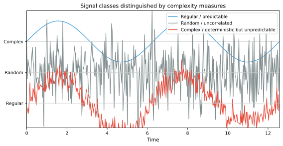
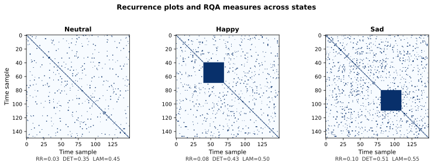

# Nonlinear and Complexity Features

Linear methods—correlation, Fourier analysis, band power—capture much of the structure in EEG signals, but the brain is fundamentally a nonlinear dynamical system. Nonlinear and complexity features attempt to characterize aspects of the EEG that linear methods miss: the irregularity, predictability, self-similarity, and chaotic properties that may carry information about emotional states.

**Figure 7.15: Conceptual comparison of signal classes.** Nonlinear complexity measures can separate complex, deterministic-but-unpredictable dynamics from pure periodicity or randomness.

## Why Nonlinear Features?

### The Case for Nonlinearity in Emotional EEG

Emotion-related brain activity exhibits several properties that motivate nonlinear analysis:

1. **Nonlinear coupling**: Different frequency components interact nonlinearly (e.g., cross-frequency coupling between theta phase and gamma amplitude), which linear spectral analysis cannot capture.
2. **Transient dynamics**: Emotional states involve rapid transitions, bursts of oscillatory activity, and event-related synchronization/desynchronization that may be better characterized by complexity than by average power.
3. **Deterministic chaos**: EEG signals exhibit characteristics of deterministic chaotic systems, including finite correlation dimension and positive Lyapunov exponents, which linear methods treat as noise.
4. **State-dependent variability**: The predictability of EEG may change with emotional state independently of spectral power.

### When Do Nonlinear Features Help?

Nonlinear features are most useful when:

- Linear features (band power, DE) alone produce poor discrimination.
- The dataset involves subtle or complex emotional states (e.g., mixed emotions, emotion regulation).
- Individual differences in spectral properties are large but dynamical properties are more consistent.
- The research question specifically concerns brain complexity, integration, or dynamical changes.

However, nonlinear features also tend to be more computationally expensive, more sensitive to artifacts and segment length, and more difficult to interpret than linear features. They are best used as a complement to, not a replacement for, linear features.

## Entropy-Based Complexity Measures

### Sample Entropy (SampEn)

Sample entropy quantifies the regularity (or unpredictability) of a time series by measuring how often patterns of length $m$ that are similar remain similar when extended by one point:

$$\text{SampEn}(m, r, N) = -\ln \frac{A^m(r)}{B^m(r)}$$

where:
- $B^m(r)$: Number of template vector pairs of length $m$ with distance $\leq r$.
- $A^m(r)$: Number of template vector pairs of length $m+1$ with distance $\leq r$.
- $m$: Embedding dimension (typically 2).
- $r$: Tolerance (typically 0.1–0.25 times the standard deviation of the signal).

A lower Sample Entropy indicates a more regular (predictable) signal; higher values indicate greater irregularity.

**Affective relevance**: Studies have found that emotional states can modulate EEG complexity. For instance, high-arousal states may be associated with increased complexity in frontal regions, while relaxed states show more regular, dominant alpha oscillations.

### Approximate Entropy (ApEn)

Approximate entropy is a predecessor of Sample Entropy:

$$\text{ApEn}(m, r, N) = \phi^m(r) - \phi^{m+1}(r)$$

where $\phi^m(r) = \frac{1}{N-m+1} \sum_{i=1}^{N-m+1} \ln C_i^m(r)$ and $C_i^m(r)$ is the fraction of template vectors within distance $r$ of template $i$.

ApEn is biased toward lower values for short time series (it includes self-matches), which SampEn corrects. For this reason, SampEn is generally preferred in contemporary EEG research.

### Fuzzy Entropy (FuzzyEn)

Fuzzy entropy replaces the hard threshold (within $r$ or not) with a fuzzy membership function, typically a Gaussian:

$$\text{FuzzyEn}(m, r, N) = -\ln \frac{\sum_{i,j} \exp\left(-\| \mathbf{u}_i^{m+1} - \mathbf{u}_j^{m+1} \|^2 / r^2\right)}{\sum_{i,j} \exp\left(-\| \mathbf{u}_i^m - \mathbf{u}_j^m \|^2 / r^2\right)}$$

Fuzzy entropy is more robust to small parameter changes than SampEn and has been successfully applied to emotion recognition from EEG.

### Multiscale Entropy (MSE)

Multiscale entropy extends SampEn by computing it over multiple temporal scales through coarse-graining:

$$y_j^{(\tau)} = \frac{1}{\tau} \sum_{i=(j-1)\tau + 1}^{j\tau} x_i, \quad \text{SampEn}^{(\tau)} = \text{SampEn}(y^{(\tau)}, m, r)$$

The resulting curve of entropy vs. scale provides a richer characterization than single-scale entropy. Healthy, flexible systems typically show increasing or stable entropy across scales, while pathological or rigid states show decreasing entropy.

In affective computing, MSE has been used to show that different emotional states are associated with distinct complexity profiles across temporal scales.

### Comparison of Entropy Measures

| Measure | Self-matches | Parameter sensitivity | Short data handling | Complexity |
| --- | --- | --- | --- | --- |
| ApEn | Included (biased) | High | Poor | Moderate |
| SampEn | Excluded (unbiased) | Moderate | Better than ApEn | Moderate |
| FuzzyEn | Fuzzy membership | Low | Good | Higher |
| MSE | Same as SampEn per scale | Moderate | Needs longer data | High |

## Fractal and Self-Similarity Measures

### Higuchi Fractal Dimension (HFD)

HFD estimates the fractal dimension of a time series directly in the time domain:

$$\langle L(k) \rangle \propto k^{-D}$$

where $L(k)$ is the average length of the curve when measured at scale $k$, and $D$ is the fractal dimension. The HFD is estimated by:

1. For each scale $k$, construct $k$ sub-series by subsampling.
2. Compute the average curve length $\langle L(k) \rangle$ across sub-series.
3. Estimate $D$ from the slope of $\ln\langle L(k) \rangle$ vs. $\ln(1/k)$.

HFD ranges from 1 (smooth curve) to 2 (space-filling). Higher HFD indicates greater complexity and irregularity.

**Affective relevance**: HFD has been reported to differentiate emotional states, with some studies finding higher HFD during high-arousal emotions and lower HFD during relaxation. It is computationally efficient and does not assume stationarity, making it suitable for shorter EEG segments.

### Detrended Fluctuation Analysis (DFA)

DFA quantifies long-range temporal correlations (scaling behavior) in a signal:

$$F(n) \propto n^{\alpha}$$

where $F(n)$ is the fluctuation amplitude at window size $n$, and $\alpha$ is the scaling exponent:

- $\alpha \approx 0.5$: Uncorrelated (white noise).
- $0.5 < \alpha < 1.0$: Persistent long-range correlations.
- $\alpha \approx 1.0$: $1/f$ noise (pink noise).
- $\alpha > 1.0$: Non-stationary, random walk-like behavior.

EEG typically exhibits scaling exponents in the 0.6–1.0 range, with shifts in $\alpha$ associated with changes in cognitive and emotional state.

### Katz Fractal Dimension

Katz's fractal dimension provides a simple estimate:

$$D_{\text{Katz}} = \frac{\ln(N-1)}{\ln(N-1) + \ln(d/L)}$$

where $L$ is the total length of the curve and $d$ is the maximum distance from the first point. Katz FD is faster to compute than HFD but less accurate for short time series.

## Lempel-Ziv Complexity (LZC)

LZC measures the complexity of a sequence by the number of distinct patterns required to reconstruct it. The signal is first binarized (typically by thresholding at the median), and then the Lempel-Ziv algorithm counts the number of unique substrings:

$$C = \frac{c(N)}{N / \log_2 N}$$

where $c(N)$ is the number of distinct patterns and the denominator normalizes by the upper bound for a random sequence. LZC ranges from 0 (constant sequence) to near 1 (fully random).

LZC is conceptually simple, parameter-free (beyond the binarization threshold), and computationally efficient. In affective EEG, it has been used alongside entropy measures, with some studies finding that LZC differentiates emotional states with performance comparable to spectral features.

## Recurrence Quantification Analysis (RQA)

RQA characterizes the recurrence properties of a dynamical system from its phase space trajectory without requiring long, stationary signals.

### Recurrence Plot

Given a reconstructed phase space trajectory $\{\mathbf{x}_i\}$, the recurrence matrix is:

$$R_{ij} = \Theta(\varepsilon - \|\mathbf{x}_i - \mathbf{x}_j\|)$$

where $\Theta$ is the Heaviside function and $\varepsilon$ is a distance threshold. $R_{ij} = 1$ when states $i$ and $j$ are close (recurrent).

### RQA Features

From the recurrence plot, several quantitative measures are derived:

| Measure | Definition | Interpretation |
| --- | --- | --- |
| Recurrence Rate (RR) | $\frac{1}{N^2}\sum_{i,j} R_{ij}$ | Overall density of recurrence points |
| Determinism (DET) | Fraction of recurrence points forming diagonal lines | Predictability of the system |
| Laminarity (LAM) | Fraction forming vertical lines | Intermittency; laminar states |
| Mean diagonal length ($L_{\text{mean}}$) | Average diagonal line length | Average predictability time |
| Entropy of diagonal lengths ($L_{\text{entr}}$) | Shannon entropy of diagonal line length distribution | Complexity of predictable dynamics |
| Trapping Time (TT) | Average vertical line length | Duration of laminar states |

RQA features have been applied to emotion recognition, with findings such as higher determinism during focused emotional states and lower determinism during rest.

**Figure 7.16: Recurrence plots and RQA measures.** Example recurrence plots and RQA measures (RR, DET, LAM) for three emotional states. Recurrence structure differs across states.

## Lyapunov Exponents

The largest Lyapunov exponent $\lambda_1$ quantifies the rate of divergence of nearby trajectories in phase space:

$$\lambda_1 = \lim_{t \to \infty} \lim_{\delta \mathbf{x}_0 \to 0} \frac{1}{t} \ln \frac{\|\delta \mathbf{x}(t)\|}{\|\delta \mathbf{x}_0\|}$$

A positive $\lambda_1$ indicates chaotic dynamics (sensitive dependence on initial conditions), while a negative or zero value indicates regular or marginally stable dynamics.

Estimating Lyapunov exponents from EEG is challenging due to noise, non-stationarity, and the need for long recordings. While theoretically interesting (chaotic properties of emotional brain dynamics), Lyapunov exponents have seen limited practical use in affective computing relative to entropy and fractal measures.

## Correlation Dimension ($D_2$)

The correlation dimension estimates the dimensionality of the attractor:

$$D_2 = \lim_{r \to 0} \frac{\ln C(r)}{\ln r}, \quad C(r) = \frac{2}{N(N-1)} \sum_{i<j} \Theta(r - \|\mathbf{x}_i - \mathbf{x}_j\|)$$

$D_2$ gives the minimum number of variables needed to describe the system's dynamics. Lower $D_2$ indicates lower-dimensional (simpler) dynamics. EEG typically shows $D_2$ values of 4–8, suggesting low-dimensional chaotic behavior, with some studies reporting changes in $D_2$ across emotional states.

## Practical Considerations

| Consideration | Guidance |
| --- | --- |
| Segment length | Most nonlinear measures require longer segments than linear features; ≥ 5 seconds recommended |
| Artifact sensitivity | Nonlinear measures are very sensitive to artifacts; use clean, artifact-free segments |
| Stationarity | Many nonlinear measures assume stationarity; test and select stationary segments |
| Parameter selection | Entropy measures depend critically on $m$ and $r$; report and justify parameter choices |
| Computational cost | RQA, Lyapunov exponents, and correlation dimension are computationally expensive |
| Feature normalization | Nonlinear features can have extreme values; normalization is essential |
| Complementarity | Always compare nonlinear features against linear baselines to quantify added value |

## Summary

Nonlinear and complexity features capture aspects of EEG dynamics—irregularity, predictability, self-similarity, and chaotic behavior—that are invisible to linear and spectral methods. Entropy-based measures (Sample Entropy, Fuzzy Entropy, Multiscale Entropy) are the most practical and widely used for affective computing, offering a good balance of discriminability, interpretability, and computational efficiency. Fractal measures (HFD, DFA) and RQA provide additional dynamical characterizations. While nonlinear features rarely outperform well-engineered spectral features (DE, band powers) in head-to-head comparisons, they often capture complementary variance and can improve performance when fused with linear features. The main practical challenges are artifact sensitivity, segment length requirements, and parameter selection—all of which reward careful methodology and transparent reporting.

## References

- Pincus, S. M. (1991). Approximate entropy as a measure of system complexity. *Proceedings of the National Academy of Sciences, 88*(6), 2297–2301. https://doi.org/10.1073/pnas.88.6.2297
- Richman, J. S., & Moorman, J. R. (2000). Physiological time-series analysis using approximate entropy and sample entropy. *American Journal of Physiology-Heart and Circulatory Physiology, 278*(6), H2039–H2049. https://doi.org/10.1152/ajpheart.2000.278.6.H2039
- Costa, M., Goldberger, A. L., & Peng, C.-K. (2002). Multiscale entropy analysis of complex physiologic time series. *Physical Review Letters, 89*(6), 068102. https://doi.org/10.1103/PhysRevLett.89.068102
- Higuchi, T. (1988). Approach to an irregular time series on the basis of the fractal theory. *Physica D: Nonlinear Phenomena, 31*(2), 277–283. https://doi.org/10.1016/0167-2789(88)90081-4
- Kantz, H., & Schreiber, T. (2004). *Nonlinear Time Series Analysis* (2nd ed.). Cambridge University Press.
