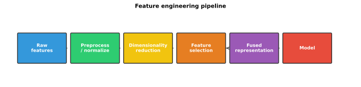
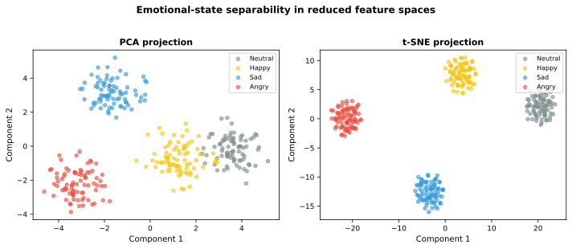
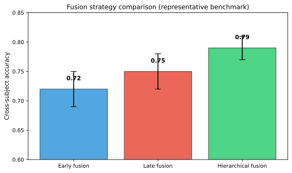

# Feature Engineering and Selection

The preceding sections describe a rich palette of EEG features spanning time, frequency, time-frequency, information-theoretic, relational, multimodal, and nonlinear domains. The challenge is not generating features—it is managing the resulting high-dimensional feature space. This section covers strategies for transforming, selecting, and combining features to produce representations that are compact, discriminative, and generalizable.

**Figure 7.17: Feature engineering pipeline for affective EEG.** Each stage shapes the representation that is ultimately passed to the classifier or regression model.

## The Curse of Dimensionality in Affective EEG

A typical feature set may include:

- DE features from 62 channels × 5 bands = 310 features
- Connectivity features from 62 × 61 / 2 × 5 bands = 9,455 features
- Nonlinear features: 62 channels × 3 measures = 186 features
- **Total**: ~10,000 features

Yet a typical affective EEG dataset may have only a few thousand labeled segments per subject. With $p \gg n$ (more features than samples), models are prone to overfitting, and feature engineering becomes essential.

## Feature Normalization and Transformation

### Z-Score Normalization

The most common normalization for EEG features:

$$\tilde{f}_i = \frac{f_i - \mu}{\sigma}$$

where $\mu$ and $\sigma$ are the mean and standard deviation of feature $i$ across the training set. For cross-subject evaluation, normalization should be applied per subject (within-subject z-scoring) or across all training subjects, depending on the protocol.

### Quantile Normalization

Quantile normalization maps feature distributions to a target distribution (typically Gaussian), making features from different subjects or sessions more comparable:

$$\tilde{f} = \Phi^{-1}\left( \frac{\text{rank}(f) - 0.5}{N} \right)$$

where $\Phi^{-1}$ is the inverse Gaussian CDF. Quantile normalization is more robust to outliers than z-scoring.

### Power Transformations

Box-Cox and Yeo-Johnson transformations can reduce skewness and make feature distributions more Gaussian:

$$f^{(\lambda)} = \begin{cases} \frac{f^\lambda - 1}{\lambda} & \lambda \neq 0 \\ \ln f & \lambda = 0 \end{cases}$$

Many EEG features (especially raw band powers) are positively skewed; log transformation ($\lambda = 0$) is often sufficient.

### Baseline Correction

For within-subject paradigms, subtracting a neutral baseline (e.g., features from a resting-state or pre-stimulus period) can reduce individual differences:

$$\tilde{f}_{\text{trial}} = f_{\text{trial}} - f_{\text{baseline}}$$

Baseline correction is standard in ERP analysis and has been adapted for spectral and DE features in emotion induction paradigms.

## Dimensionality Reduction

### Principal Component Analysis (PCA)

PCA finds orthogonal directions that maximize variance:

$$\mathbf{F} = \mathbf{U} \mathbf{\Sigma} \mathbf{V}^T$$

The first $k$ principal components explain the largest fraction of variance. PCA is unsupervised, fast, and widely used, but it does not consider class labels and may discard discriminative but low-variance directions.

### Linear Discriminant Analysis (LDA)

Unlike PCA, LDA finds directions that maximize class separability:

$$\mathbf{w}^* = \arg\max_{\mathbf{w}} \frac{\mathbf{w}^T \mathbf{S}_B \mathbf{w}}{\mathbf{w}^T \mathbf{S}_W \mathbf{w}}$$

where $\mathbf{S}_B$ is the between-class scatter and $\mathbf{S}_W$ is the within-class scatter. LDA can reduce features to at most $C-1$ dimensions (where $C$ is the number of classes), which is a limitation for binary classification but adequate for typical emotion recognition with 2–5 classes.

### t-SNE and UMAP

For visualization and exploratory analysis, t-SNE and UMAP provide nonlinear dimensionality reduction that preserves local structure:

$$\text{t-SNE: } p_{j|i} = \frac{\exp(-\|x_i - x_j\|^2 / 2\sigma_i^2)}{\sum_{k \neq i} \exp(-\|x_i - x_k\|^2 / 2\sigma_i^2)}$$

UMAP is computationally faster than t-SNE and better preserves global structure, making it increasingly popular for feature visualization in affective EEG research.

| Method | Supervised? | Linearity | Best for |
| --- | --- | --- | --- |
| PCA | No | Linear | General dimensionality reduction, denoising |
| LDA | Yes | Linear | Classification with $C-1$ dimensions |
| t-SNE | No | Nonlinear | Visualization (2D/3D only) |
| UMAP | Semi | Nonlinear | Visualization and feature preprocessing |

**Figure 7.18: PCA and t-SNE projections of EEG features.** Two-dimensional projections of high-dimensional EEG features. PCA preserves global variance; t-SNE emphasizes local neighborhood structure.

## Feature Selection

Feature selection reduces dimensionality by choosing a subset of the original features rather than transforming them. This preserves interpretability—an important consideration in neuroscientific research.

### Filter Methods

Filter methods rank features independently of the downstream classifier using statistical measures:

| Method | Criterion | Pros and cons |
| --- | --- | --- |
| ANOVA F-score | $F = \frac{\text{between-class variance}}{\text{within-class variance}}$ | Fast; assumes normality |
| Mutual information | $I(f; y) = \iint p(f, y) \ln \frac{p(f, y)}{p(f)p(y)} df dy$ | Captures nonlinear dependencies; harder to estimate |
| Chi-squared | $\chi^2$ test of independence | Only for categorical features |
| Correlation-based | $|r(f_i, f_j)|$ — remove redundant features | Simple; purely pairwise |

### Wrapper Methods

Wrapper methods evaluate feature subsets by training and evaluating a classifier:

- **Recursive Feature Elimination (RFE)**: Iteratively train a model (e.g., SVM, random forest) and remove the least important features.
- **Forward/backward selection**: Greedily add or remove features based on validation performance.
- **Genetic algorithms**: Evolve feature subsets using cross-over and mutation.

Wrapper methods can find better feature subsets than filters, but they are computationally expensive and risk overfitting to the validation set.

### Embedded Methods

Embedded methods perform feature selection during model training:

| Method | How it works | Best for |
| --- | --- | --- |
| Lasso (L1 regularization) | Shrinks coefficients of irrelevant features to zero | Linear models |
| Elastic Net | Combines L1 and L2 regularization | Correlated feature groups |
| Tree-based importance | Feature importance from random forests, XGBoost | Nonlinear relationships |
| Attention-based selection | Learn feature weights via attention mechanisms | Deep learning pipelines |

### Stability of Feature Selection

A critical but often overlooked issue is the stability of feature selection. With small sample sizes, the set of selected features can vary dramatically across different subsets of the data. Techniques to improve stability include:

- **Ensemble feature selection**: Apply selection to multiple bootstrap samples and aggregate results.
- **Regularization**: Elastic Net is often more stable than Lasso when features are correlated.
- **Group-level selection**: Select features based on consistency across subjects rather than pooled data.

## Feature Fusion Strategies

When features come from multiple domains (time, frequency, connectivity, nonlinear, multimodal), they must be combined into a unified representation.

### Early Fusion (Feature Concatenation)

$$\mathbf{f}_{\text{fused}} = [\mathbf{f}_{\text{time}} \, \| \, \mathbf{f}_{\text{freq}} \, \| \, \mathbf{f}_{\text{conn}} \, \| \, \ldots]$$

Simple and preserves all information, but can produce very high-dimensional vectors and ignores domain structure.

### Late Fusion (Ensemble)

Train separate models on each feature domain and combine their predictions:

$$\hat{y} = \frac{1}{M} \sum_{m=1}^{M} \hat{y}_m \quad \text{or} \quad \hat{y} = \arg\max \sum_{m} w_m p_m(y \mid \mathbf{f}_m)$$

Late fusion allows domain-specific models, handles missing feature domains gracefully, and is easy to interpret.

### Hierarchical Fusion

First fuse within-domain features (e.g., all spectral features), then fuse across domains:

$$\mathbf{f}_{\text{spectral}} = g_{\text{spectral}}(\mathbf{f}_{\text{band\_power}}, \mathbf{f}_{\text{DE}}, \mathbf{f}_{\text{asymmetry}})$$

$$\mathbf{y} = h(\mathbf{f}_{\text{spectral}}, \mathbf{f}_{\text{connectivity}}, \mathbf{f}_{\text{nonlinear}})$$

This hierarchical approach preserves domain structure and has been shown to work well in practice.

### Learned Fusion

Use a neural network to learn optimal feature combinations:

$$\mathbf{z} = \sigma\left( W_1 \mathbf{f} + b_1 \right)$$
$$\mathbf{y} = \text{softmax}\left( W_2 \mathbf{z} + b_2 \right)$$

Multilayer fusion networks can discover nonlinear interactions between feature domains but require careful regularization with small datasets.

**Figure 7.19: Fusion-strategy performance comparison.** Illustrative performance comparison of fusion strategies. Hierarchical fusion often outperforms simple early or late fusion by preserving domain structure.

## Domain Adaptation and Feature Alignment

Individual differences in EEG are substantial. Features from the same emotional state can differ more between subjects than between emotions within the same subject. Domain adaptation techniques aim to align feature distributions across subjects (or sessions) to improve cross-subject and cross-session generalization.

### Domain-Adversarial Neural Networks (DANN)

DANN learns features that are discriminative for the emotion task but indistinguishable across domains (subjects):

$$\mathcal{L} = \mathcal{L}_{\text{emotion}} - \lambda \, \mathcal{L}_{\text{domain}}$$

The gradient reversal layer encourages the feature extractor to produce subject-invariant representations.

### Transfer Component Analysis (TCA)

TCA learns a feature mapping that minimizes the Maximum Mean Discrepancy (MMD) between source and target domains:

$$\text{MMD}^2(\mathbf{F}_S, \mathbf{F}_T) = \left\| \frac{1}{n_S} \sum_{i=1}^{n_S} \phi(\mathbf{f}_i^S) - \frac{1}{n_T} \sum_{j=1}^{n_T} \phi(\mathbf{f}_j^T) \right\|^2_{\mathcal{H}}$$

TCA is a kernel-based method that does not require labeled target data, making it practical for adapting to new subjects.

### Correlation Alignment (CORAL)

CORAL aligns the second-order statistics (covariance matrices) of source and target feature distributions:

$$\min \| \hat{\Sigma}_S - \hat{\Sigma}_T \|_F^2$$

The aligned source features are obtained by whitening with the source covariance and re-coloring with the target covariance. CORAL is computationally efficient and requires no labeled target data.

## Practical Considerations

| Consideration | Guidance |
| --- | --- |
| Evaluate feature engineering choices | Ablation studies are essential: report performance with subsets of feature domains |
| Cross-validation of feature selection | Feature selection must be done within each cross-validation fold, not on the full dataset |
| Stability reporting | Report the consistency of selected features across folds or bootstrap samples |
| Leakage through normalization | Compute normalization parameters ($\mu$, $\sigma$) on training data only, then apply to test data |
| Feature visualization | Always visualize features (distributions, PCA/t-SNE plots) before modeling |
| Interpretability | Prefer feature selection over dimensionality reduction when interpretability matters |
| Computational budget | Balance feature richness against computational cost, especially for real-time applications |

## Summary

Effective feature engineering and selection are as important as the choice of features themselves. With high-dimensional feature spaces and limited samples, dimensionality reduction, feature selection, and proper normalization are essential for building models that generalize. Feature fusion from multiple domains consistently improves performance, and domain adaptation techniques are increasingly necessary for cross-subject and cross-session deployment. The guiding principle is to treat feature engineering as an integral part of the modeling pipeline—not a preprocessing afterthought—and to evaluate feature choices with the same rigor as model choices.

## References

- Guyon, I., & Elisseeff, A. (2003). An introduction to variable and feature selection. *Journal of Machine Learning Research, 3*, 1157–1182.
- Jolliffe, I. T., & Cadima, J. (2016). Principal component analysis: A review and recent developments. *Philosophical Transactions of the Royal Society A, 374*(2065), 20150202. https://doi.org/10.1098/rsta.2015.0202
- van der Maaten, L., & Hinton, G. (2008). Visualizing data using t-SNE. *Journal of Machine Learning Research, 9*, 2579–2605.
- Sun, B., & Saenko, K. (2016). Deep CORAL: Correlation alignment for deep domain adaptation. *European Conference on Computer Vision*, 443–450. https://doi.org/10.1007/978-3-319-46493-0_28
- Lotte, F., Bougrain, L., Cichocki, A., et al. (2018). A review of classification algorithms for EEG-based brain–computer interfaces: A 10 year update. *Journal of Neural Engineering, 15*(3), 031005. https://doi.org/10.1088/1741-2552/aab2f2
- Rodrigues, J., Teixeira, C. A., & Fred, A. (2020). A review of feature selection methods for EEG-based applications. *Sensors, 20*(16), 4440. https://doi.org/10.3390/s20164440
