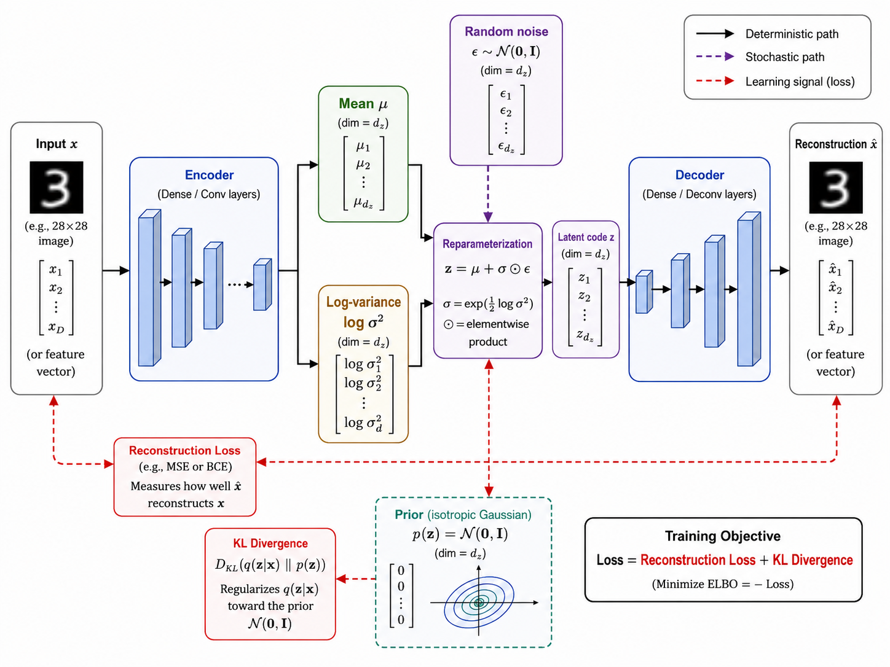
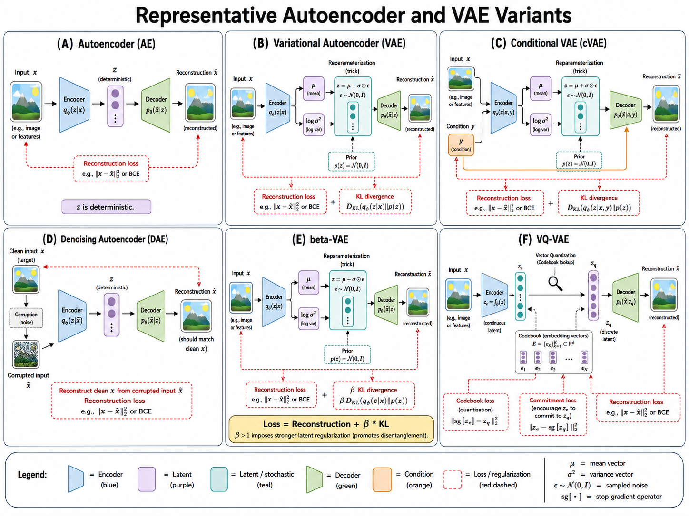
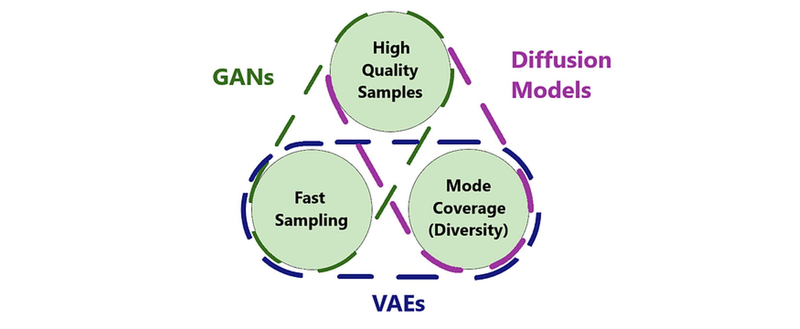

# Variational Autoencoders (VAEs) for EEG

## Overview

Variational Autoencoders learn a probabilistic latent representation of EEG data. Unlike standard autoencoders, VAEs impose structure on the latent space, encouraging it to follow a prior distribution (typically Gaussian). This structured latent space enables controlled generation, interpolation, and factor disentanglement — all highly valuable for EEG-based affective computing.

## Variational Autoencoder Architecture

A variational autoencoder is a latent-variable generative model with an **encoder**, a stochastic **latent space**, and a **decoder**. Given an input $x$, the encoder does not produce one fixed code. Instead, it predicts the mean $\mu$ and variance $\sigma^2$ of an approximate posterior distribution $q_\phi(z\mid x)$. A latent vector $z$ is sampled from this distribution through the reparameterization trick and passed to the decoder, which reconstructs the input or generates a new sample. During training, reconstruction fidelity is balanced against a Kullback--Leibler (KL) divergence term that encourages each encoded distribution to remain close to a simple prior, usually $\mathcal{N}(0, I)$.

This design makes the latent space continuous and organized: nearby points tend to decode to similar samples, and new data can be generated simply by sampling from the prior. For EEG, an encoder can progressively compress multichannel temporal patterns into a compact representation, while a decoder expands that representation back into an EEG segment. The probabilistic bottleneck is particularly useful when recordings contain uncertainty from measurement noise, inter-subject variation, and changing experimental conditions.



**Figure 8.7: Variational autoencoder architecture.** The encoder estimates latent distribution parameters, the reparameterization step samples a differentiable latent code, and the decoder reconstructs or generates an observation.

## Theoretical Foundations

### Standard Autoencoder vs. VAE

**Standard Autoencoder**:

$$\text{Encoder: } z = f_\phi(x)$$
$$\text{Decoder: } \hat{x} = g_\theta(z)$$
$$\mathcal{L}_{\text{AE}} = \|x - \hat{x}\|^2$$

**Variational Autoencoder**:

$$\text{Encoder: } q_\phi(z|x) = \mathcal{N}(\mu_\phi(x), \sigma_\phi^2(x))$$
$$\text{Decoder: } p_\theta(x|z) = \mathcal{N}(g_\theta(z), \sigma^2 I)$$

$$\mathcal{L}_{\text{VAE}} = \mathbb{E}_{q_\phi(z|x)}[\log p_\theta(x|z)] - D_{\text{KL}}(q_\phi(z|x) \| p(z))$$

where $$p(z) = \mathcal{N}(0, I)$$ is the prior.

### The Reparameterization Trick

To enable backpropagation through the sampling step:

$$z = \mu_\phi(x) + \sigma_\phi(x) \odot \epsilon, \quad \epsilon \sim \mathcal{N}(0, I)$$

### Why VAEs for EEG?

**Advantages**:
- **Structured latent space**: Smooth transitions between emotional states
- **Probabilistic**: Captures uncertainty in EEG measurements
- **Disentanglement potential**: Separate emotion, subject identity, noise
- **Generative**: Synthesize new EEG samples for data augmentation
- **Reconstruction**: Natural denoising capability
- **Semi-supervised**: Can leverage unlabeled EEG data

**Limitations**:
- Generated samples may be blurry (averaging effect of Gaussian likelihood)
- Posterior collapse: decoder ignores $$z$$, making latent uninformative
- KL annealing often needed for stable training

## Adaptation to EEG Affective Computing

### β-VAE for Disentanglement

Standard VAE balances reconstruction and KL regularization. β-VAE adds a weight to enhance disentanglement:

$$\mathcal{L}_{\beta\text{-VAE}} = \mathbb{E}_{q_\phi(z|x)}[\log p_\theta(x|z)] - \beta \cdot D_{\text{KL}}(q_\phi(z|x) \| p(z))$$

With $$\beta > 1$$, the model is forced to use the latent space more efficiently, potentially separating:
- $$z_1$$: Emotion valence
- $$z_2$$: Emotion arousal
- $$z_3$$: Subject identity
- $$z_4$$: Noise level

### Conditional VAE (CVAE) for Controlled Generation

Add emotion labels as conditioning:

$$\mathcal{L}_{\text{CVAE}} = \mathbb{E}_{q_\phi(z|x,y)}[\log p_\theta(x|z,y)] - D_{\text{KL}}(q_\phi(z|x,y) \| p(z|y))$$

This enables:
- Generate EEG given a target emotion label
- Control emotional content of generated samples
- Data augmentation for under-represented emotions

### EEG-Specific Architecture

The architectural pattern below reduces temporal resolution while increasing feature capacity, allowing the encoder to summarize local rhythms and cross-channel patterns in a small latent code. The decoder mirrors this process. This symmetry is useful, but it is not the objective by itself: the important design tension is to retain emotion-relevant information while discarding nuisance variation such as sensor noise and subject-specific amplitude differences.

```
Input: EEG segment (n_channels, n_samples)
Example: (14, 2048)
   ↓
[Encoder]
  Conv1D(64, 5) → ReLU → MaxPool(2)
  Conv1D(128, 5) → ReLU → MaxPool(2)
  Conv1D(256, 5) → ReLU → MaxPool(2)
  Flatten → Dense(512) → ReLU
   ↓
μ = Dense(latent_dim)     log(σ²) = Dense(latent_dim)
   ↓                           ↓
   z = μ + σ ⊙ ε,  ε ~ N(0,I)
   ↓
[Decoder]
  Dense(512) → ReLU → Reshape
  Conv1DTranspose(256, 5) → ReLU
  Conv1DTranspose(128, 5) → ReLU
  Conv1DTranspose(64, 5) → ReLU
  Conv1DTranspose(n_channels, 5) → Tanh
   ↓
Output: Reconstructed EEG (n_channels, n_samples)
```

### Suitable Input Features

VAEs work best with structured inputs:

The representation should be chosen to match the scientific question. Raw segments retain waveform morphology and phase information, but make the reconstruction task demanding. Spectrograms foreground band-specific structure at the cost of time-domain detail. Feature vectors are appropriate for compact representation learning, but cannot support faithful waveform synthesis; they should not be presented as generated raw EEG.

**Option 1: Raw EEG Segments**
```python
# Shape: (batch, n_channels, n_samples)
# (32, 14, 2048) — standardized to [-1, 1]

# Advantages: Full information, reconstruction is end-to-end
# Disadvantages: Higher computational cost, longer training
```

**Option 2: Spectrogram Representation**
```python
# Shape: (batch, n_channels, n_freq, n_time)
# (32, 14, 129, 32) — STFT with 256-point window

# Advantages: Frequency structure explicit, easier for CNN
# Disadvantages: Information loss from STFT
```

**Option 3: Pre-extracted Features**
```python
# Shape: (batch, n_features)
# (32, 128) — PSD, statistics, asymmetry features

# Advantages: Compact, fast training
# Disadvantages: Cannot reconstruct raw EEG, limited generative use
```

### Preprocessing Pipeline

Preprocessing is part of the model design, not merely a cleanup step. Filtering removes frequencies outside the study's scope, windowing defines the temporal context the model can learn, and scaling makes the reconstruction and KL terms comparable across channels. The fitted normalization statistics should be estimated on the training split only and then reused for validation, test, and generated data to prevent data leakage.

```python
import numpy as np
import torch
from scipy import signal as scipy_signal

# 1. Load and filter EEG
eeg = load_eeg()  # (n_channels, n_total_samples)
sos = scipy_signal.butter(4, [0.5, 40], btype='band', fs=256, output='sos')
eeg_filtered = scipy_signal.sosfilt(sos, eeg, axis=1)

# 2. Segment into windows
window_size = 2048  # 8 seconds at 256 Hz
stride = 1024       # 50% overlap
segments = []
for start in range(0, eeg_filtered.shape[1] - window_size, stride):
    segments.append(eeg_filtered[:, start:start+window_size])
segments = np.array(segments)  # (n_segments, n_channels, window_size)

# 3. Normalize per-channel to [-1, 1]
for ch in range(segments.shape[1]):
    ch_max = np.abs(segments[:, ch, :]).max()
    segments[:, ch, :] = segments[:, ch, :] / (ch_max + 1e-8)

# 4. Convert to PyTorch Conv1d layout: (batch, channels, time)
segments = torch.from_numpy(segments).float()  # (n_segments, 14, 2048)
```

## Implementation

### VAE Model

The implementation separates the three conceptual outputs of a VAE: a reconstruction, a posterior mean, and a posterior log-variance. Returning all three keeps the probabilistic objective visible rather than hiding it inside the model. The loss combines sample-wise reconstruction error with the KL term; increasing `beta` makes the latent space more constrained and potentially more interpretable, but can also remove fine-grained EEG information if set too high.

```python
import torch
from torch import nn
from torch.nn import functional as F


class EEGVAE(nn.Module):
    """VAE for EEG tensors shaped (batch, channels, samples)."""
    def __init__(self, n_channels=14, n_samples=2048, latent_dim=32):
        super().__init__()
        assert n_samples == 2048, "This example architecture assumes 2048 samples."
        self.latent_dim = latent_dim
        self.encoder = nn.Sequential(
            nn.Conv1d(n_channels, 64, kernel_size=5, stride=2, padding=2),
            nn.BatchNorm1d(64), nn.ReLU(),
            nn.Conv1d(64, 128, kernel_size=5, stride=2, padding=2),
            nn.BatchNorm1d(128), nn.ReLU(),
            nn.Conv1d(128, 256, kernel_size=5, stride=2, padding=2),
            nn.BatchNorm1d(256), nn.ReLU(),
            nn.Flatten(), nn.Linear(256 * 256, 512), nn.ReLU(),
        )
        self.mu = nn.Linear(512, latent_dim)
        self.log_var = nn.Linear(512, latent_dim)
        self.decoder_input = nn.Sequential(nn.Linear(latent_dim, 256 * 256), nn.ReLU())
        self.decoder = nn.Sequential(
            nn.Unflatten(1, (256, 256)),
            nn.ConvTranspose1d(256, 128, 5, stride=2, padding=2, output_padding=1),
            nn.BatchNorm1d(128), nn.ReLU(),
            nn.ConvTranspose1d(128, 64, 5, stride=2, padding=2, output_padding=1),
            nn.BatchNorm1d(64), nn.ReLU(),
            nn.ConvTranspose1d(64, n_channels, 5, stride=2, padding=2, output_padding=1),
            nn.Tanh(),
        )

    def encode(self, x):
        h = self.encoder(x)
        return self.mu(h), self.log_var(h)

    @staticmethod
    def reparameterize(mu, log_var):
        return mu + torch.randn_like(mu) * torch.exp(0.5 * log_var)

    def decode(self, z):
        return self.decoder(self.decoder_input(z))

    def forward(self, x):
        mu, log_var = self.encode(x)
        return self.decode(self.reparameterize(mu, log_var)), mu, log_var

    @torch.no_grad()
    def generate(self, n_samples=1):
        z = torch.randn(n_samples, self.latent_dim, device=next(self.parameters()).device)
        return self.decode(z)

    @torch.no_grad()
    def interpolate(self, x1, x2, n_steps=10):
        mu1, _ = self.encode(x1)
        mu2, _ = self.encode(x2)
        alphas = torch.linspace(0, 1, n_steps, device=x1.device).view(n_steps, 1, 1)
        z = (1 - alphas) * mu1.unsqueeze(0) + alphas * mu2.unsqueeze(0)
        return self.decode(z.flatten(0, 1)).unflatten(0, (n_steps, x1.size(0)))


def vae_loss(x_recon, x, mu, log_var, beta=1.0):
    reconstruction = F.mse_loss(x_recon, x, reduction="sum") / x.size(0)
    kl = -0.5 * torch.sum(1 + log_var - mu.square() - log_var.exp()) / x.size(0)
    return reconstruction + beta * kl, reconstruction, kl
```

### Conditional VAE for Emotion-Conditioned Generation

The CVAE addresses a limitation of unconditional generation: sampling a realistic segment does not guarantee that it belongs to the desired emotion class. The label is repeated across time for the encoder and concatenated with the latent code for the decoder, so the model must explain variation beyond the requested condition through $z$. In practice, assess whether the conditioning worked with an independent emotion classifier and spectral checks, rather than relying on the label supplied at generation time.

```python
class EEGCVAE(nn.Module):
    """Conditional VAE; y is a one-hot tensor shaped (batch, n_emotions)."""
    def __init__(self, n_channels=14, n_samples=2048, latent_dim=32, n_emotions=3):
        super().__init__()
        assert n_samples == 2048, "This example architecture assumes 2048 samples."
        self.latent_dim, self.n_emotions = latent_dim, n_emotions
        self.encoder = nn.Sequential(
            nn.Conv1d(n_channels + n_emotions, 64, 5, stride=2, padding=2), nn.ReLU(),
            nn.Conv1d(64, 128, 5, stride=2, padding=2), nn.ReLU(),
            nn.Flatten(), nn.Linear(128 * 512, 256), nn.ReLU(),
        )
        self.mu = nn.Linear(256, latent_dim)
        self.log_var = nn.Linear(256, latent_dim)
        self.decoder_input = nn.Sequential(
            nn.Linear(latent_dim + n_emotions, 256 * 256), nn.ReLU()
        )
        self.decoder = nn.Sequential(
            nn.Unflatten(1, (256, 256)),
            nn.ConvTranspose1d(256, 128, 5, stride=2, padding=2, output_padding=1), nn.ReLU(),
            nn.ConvTranspose1d(128, 64, 5, stride=2, padding=2, output_padding=1), nn.ReLU(),
            nn.ConvTranspose1d(64, n_channels, 5, stride=2, padding=2, output_padding=1), nn.Tanh(),
        )

    def forward(self, x, y):
        y_tiled = y.unsqueeze(-1).expand(-1, -1, x.size(-1))
        h = self.encoder(torch.cat((x, y_tiled), dim=1))
        mu, log_var = self.mu(h), self.log_var(h)
        z = EEGVAE.reparameterize(mu, log_var)
        x_recon = self.decoder(self.decoder_input(torch.cat((z, y), dim=1)))
        return x_recon, mu, log_var

    @torch.no_grad()
    def generate_emotion(self, emotion_label, n_samples=1):
        device = next(self.parameters()).device
        z = torch.randn(n_samples, self.latent_dim, device=device)
        y = F.one_hot(torch.full((n_samples,), emotion_label, device=device),
                      num_classes=self.n_emotions).float()
        return self.decoder(self.decoder_input(torch.cat((z, y), dim=1)))
```

## Applications in EEG Affective Computing

These applications use the same reconstruction model in different ways, but each rests on an assumption that should be tested. Synthetic augmentation assumes generated samples preserve class-relevant diversity; interpolation assumes local paths in latent space correspond to meaningful changes; and anomaly scores assume normal training data adequately covers ordinary variation. Generated outputs should therefore supplement, not replace, real held-out EEG in evaluation.

### 1. Data Augmentation

Generate synthetic EEG samples for under-represented emotions:

The goal is to reduce a class imbalance without simply creating near-duplicates of training trials. Generate only from a model trained without access to the classifier's held-out data, and compare downstream performance against standard oversampling and signal-domain augmentation. A gain restricted to training accuracy is a warning sign of memorization rather than useful diversity.

```python
# `cvae` is a trained EEGCVAE; emotion_label is an integer class index.
cvae.eval()

# Generate synthetic samples for minority class
synthetic_eeg = cvae.generate_emotion(emotion_label=0, n_samples=500).cpu()

# Mix with real data for classifier training
augmented_X = torch.cat([real_X, synthetic_eeg])
augmented_y = torch.cat([real_y, torch.zeros(500, dtype=torch.long)])
```

### 2. Emotion Space Interpolation

Explore the continuous nature of emotion:

Interpolation is most informative as a diagnostic, not as proof that emotion changes continuously in the brain. Inspect the intermediate power spectra, channel correlations, and predictions of an external emotion classifier. Abrupt or physiologically implausible transitions suggest that the latent coordinates have not captured the intended factors.

```python
# Use the posterior means for interpolation.
vae.eval()
interp_eeg = vae.interpolate(happy_eeg, sad_eeg, n_steps=10)
# Each interpolated EEG should show smooth transition happy → sad
```

### 3. Disentangled Representation Learning

Separate emotion from subject identity using β-VAE:

```python
# Train β-VAE with β > 1
beta_vae = train_beta_vae(eeg_data, beta=4.0)

# After training, some latent dimensions should capture:
# - z[0:4]: Emotion-related factors
# - z[4:8]: Subject identity
# - z[8:16]: Noise and session effects

# Manipulate only emotion dimensions to change emotional content
# while preserving subject identity
```

### 4. Semi-Supervised Emotion Recognition

Leverage unlabeled EEG with VAE pre-training:

Pre-training can help when labels are scarce because reconstruction exposes the encoder to more recordings than a supervised classifier can use. However, reconstruction favors information-rich signals, not necessarily discriminative emotion cues. Freezing the encoder initially makes the transfer test clearer; later unfreezing selected layers with a small learning rate can improve task alignment when enough labels are available.

```python
# Phase 1: pre-train `vae` on all EEG (labeled + unlabeled).
# Freeze the convolutional encoder for the classification phase.
for parameter in vae.encoder.parameters():
    parameter.requires_grad = False

class EmotionClassifier(nn.Module):
    def __init__(self, vae, n_classes=3):
        super().__init__()
        self.encoder = vae.encoder
        self.head = nn.Sequential(
            nn.Linear(512, 128), nn.ReLU(), nn.Dropout(0.3),
            nn.Linear(128, n_classes),
        )

    def forward(self, x):
        return self.head(self.encoder(x))  # logits; use CrossEntropyLoss

classifier = EmotionClassifier(vae)
```

### 5. Anomaly Detection

Detect unusual EEG patterns (artifacts, seizures, etc.):

Reconstruction error is a practical proxy for unfamiliarity, but it is not a clinical diagnosis. It can be high for rare yet valid emotional states and low for artifacts that resemble the training distribution. Select the threshold on a labeled validation set when possible, and examine errors per channel and frequency band to make alerts interpretable.

```python
# `vae` is pre-trained only on normal EEG and set to evaluation mode.
vae.eval()

# For new EEG segment:
x_recon, _, _ = vae(x_new)
recon_error = (x_new - x_recon).square().mean(dim=(1, 2))

# Threshold: flag segments with high reconstruction error
anomaly_threshold = torch.quantile(train_recon_errors, 0.95)
anomalies = recon_error > anomaly_threshold
```

## VAE Variants for EEG

The autoencoder family offers several ways to adapt latent representation learning to the needs of EEG analysis (Figure 8.8). An AE provides a deterministic reconstruction baseline, whereas a VAE introduces a continuous probabilistic latent distribution. The remaining variants modify this core design to support conditional generation (cVAE), robustness to corrupted inputs (DAE), stronger factor disentanglement ($\beta$-VAE), or discrete latent codes (VQ-VAE). These choices determine whether the model is best suited to reconstruction, denoising, controlled emotion synthesis, interpretable factors, or categorical EEG patterns.



**Figure 8.8: Autoencoder and VAE variants.** AE learns deterministic reconstruction; VAE models a continuous probabilistic latent space; cVAE conditions generation on auxiliary information such as an emotion label; DAE reconstructs clean inputs from corrupted observations; $\beta$-VAE strengthens latent regularization to encourage disentanglement; and VQ-VAE replaces continuous codes with entries from a learned discrete codebook.

### VQ-VAE (Vector Quantized VAE)

Discrete latent representations — natural for categorical emotion states:

```python
# Instead of continuous z, use a discrete codebook
# z_continuous → nearest codebook vector → z_discrete
# Useful for clustering EEG patterns into discrete emotional categories
```

### Hierarchical VAE

Multiple levels of latent variables:

```
z_high: global factors (subject, session, overall mood)
z_mid: segment-level factors (emotional state)
z_low: sample-level factors (instantaneous fluctuations)
```

### Temporal VAE

Model EEG sequences with recurrent encoder/decoder:

```python
# Encoder: LSTM processes EEG sequence → μ, σ
# Decoder: LSTM generates sequence from z
# Captures temporal dynamics in latent space
```

## Comparison with Other Generative Models

VAEs, generative adversarial networks (GANs), and diffusion models represent three influential directions in modern generative modeling (Figure 8.9). VAEs learn an explicit, regularized latent distribution and are especially attractive when fast encoding, interpolation, uncertainty-aware representations, or controllable generation are important. GANs learn through competition between a generator and discriminator, often producing sharp samples quickly but with greater sensitivity to training instability and mode collapse. Diffusion models learn to reverse a gradual noising process; they generally provide strong diversity and fidelity, but their iterative sampling procedure is computationally more demanding. In EEG research, the best choice therefore depends on whether the priority is interpretable representation learning (VAE), high-fidelity adversarial synthesis (GAN), or broad and realistic sample coverage (diffusion).



**Figure 8.9: Three directions of generative models.** VAEs use probabilistic encoding and decoding, GANs use adversarial learning, and diffusion models iteratively transform noise into data.

| Aspect | VAE | GAN | Diffusion |
|---|---|---|---|
| **Training stability** | Stable | Can be unstable | Stable |
| **Latent space structure** | Excellent (Gaussian) | None (implicit) | None (implicit) |
| **Sample quality** | Moderate (blurry) | High (sharp) | Highest |
| **Likelihood computation** | Approximate (ELBO) | None | Approximate (variational bound) |
| **Inference (encoding)** | Fast | Requires inversion | Requires inversion |
| **Mode coverage** | Good (covers all modes) | Poor (mode collapse) | Good |
| **Disentanglement** | Excellent (β-VAE) | Limited | Limited |

## Best Practices

1. **Use KL annealing**: Gradually increase KL weight from 0 to 1
   ```python
   kl_weight = min(1.0, epoch / warmup_epochs)
   ```

2. **Monitor posterior collapse**: If KL → 0, try:
   - Reducing decoder capacity
   - Using free bits ($$\max(\lambda, \text{KL})$$) to prevent KL from going too low
   - KL annealing with cyclical schedule

3. **Choose latent dimension wisely**:
   - Too small: insufficient capacity
   - Too large: unused dimensions
   - For EEG: 16-64 dimensions typically work well

4. **Validate generated EEG**:
   - Check PSD of generated vs. real EEG
   - Ensure frequency bands are preserved
   - Verify with domain experts

5. **Architecture for EEG**:
   - Prefer 1D convolutions for raw signals
   - Use 2D convolutions for spectrograms
   - Add channel-wise normalization

## Summary

VAEs provide a principled probabilistic framework for EEG representation learning:

**Key Strengths for EEG**:
- Structured latent space enables emotion interpolation and manipulation
- Disentanglement potential separates emotion from confounding factors
- Natural denoising through reconstruction
- Semi-supervised learning leverages unlabeled EEG
- Stable training compared to GANs

**When to Use VAEs**:
- Need interpretable latent representations of emotional state
- Want to explore continuous emotion space
- Data augmentation with controlled generation
- Semi-supervised learning scenarios
- Anomaly/artifact detection

**When to Prefer Alternatives**:
- Highest sample quality needed → GAN or Diffusion
- Exact likelihood needed → Flow-based models
- Pure data augmentation without interpretation → GAN

---

**Next**: [Generative Adversarial Networks](08-generative-adversarial-networks.md)

## References

- Kingma, D. P., and Welling, M. (2014). Auto-encoding variational Bayes. In *ICLR*.
- Rezende, D. J., Mohamed, S., and Wierstra, D. (2014). Stochastic backpropagation and approximate inference in deep generative models. In *ICML*.
- Sohn, K., Lee, H., and Yan, X. (2015). Learning structured output representation using deep conditional generative models. In *NeurIPS*.
- Higgins, I., Matthey, L., Pal, A., et al. (2017). beta-VAE: Learning basic visual concepts with a constrained variational framework. In *ICLR*.
- van den Oord, A., Vinyals, O., and Kavukcuoglu, K. (2017). Neural discrete representation learning. In *NeurIPS*.
- Chung, J., Kastner, K., Dinh, L., Goel, K., Courville, A., and Bengio, Y. (2015). A recurrent latent variable model for sequential data. In *NeurIPS*.
