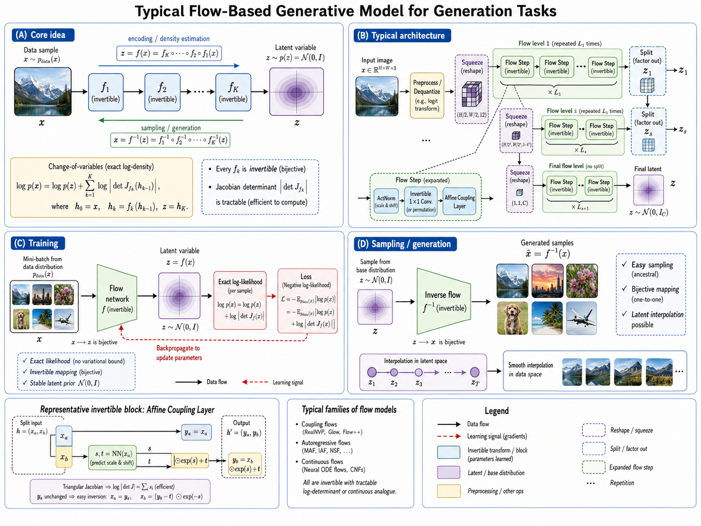
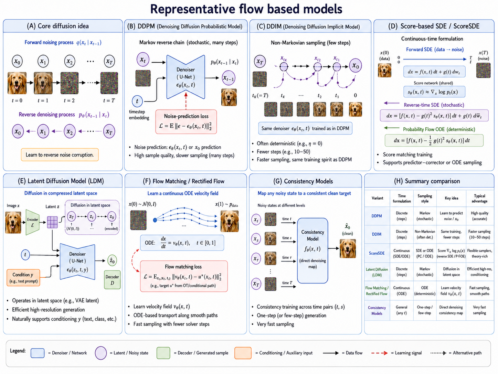

# Flow-based Models and Diffusion Models for EEG

## Overview

Flow-based and diffusion models represent the most recent and powerful class of generative models. **Flow-based models** use invertible transformations with exact likelihood computation, while **diffusion models** learn to reverse a gradual noising process. Both produce state-of-the-art sample quality and have unique advantages for EEG-based affective computing — from clean signal reconstruction to uncertainty-aware emotion prediction.

## Flow-Based and Diffusion Generation Pipeline

Flow-based and diffusion models take two complementary routes to learning a complex data distribution. A **normalizing flow** transforms samples from a simple base distribution, usually a Gaussian, through a sequence of invertible mappings. Because every mapping has a tractable Jacobian determinant, a flow can both generate EEG by mapping latent samples forward and evaluate the exact likelihood of an observed EEG segment by mapping it backward. This makes flows particularly useful when density estimation, anomaly scoring, or reversible latent manipulation is required.

A **diffusion model** instead defines a forward process that gradually adds noise to a clean signal, then trains a neural network to reverse that corruption one step at a time. At generation time, it starts from random noise and repeatedly denoises it until a realistic EEG segment emerges. The gradual reverse process supports expressive, stable generation and naturally accommodates tasks such as denoising, imputation, and conditioning on emotion labels or subject information.



**Figure 8.12: Flow-based and diffusion generation pipelines.** A normalizing flow maps between EEG and a latent distribution through invertible transformations, whereas a diffusion model learns to transform noise into EEG by reversing a staged noising process.

## Model Variants

Several variants tailor these two model families to different requirements in EEG generation and analysis (Figure 8.13). Within flow-based modeling, RealNVP uses efficient affine coupling layers, while Glow augments this design with learned normalization and invertible channel mixing. Within diffusion modeling, conditional diffusion introduces labels or auxiliary signals for controlled synthesis, latent diffusion performs denoising in a compact learned representation to reduce computational cost, and DDIM accelerates sampling by using a non-Markovian, often deterministic reverse trajectory. Together, these variants trade off exact density estimation, conditioning flexibility, sampling speed, and signal fidelity.



**Figure 8.13: Flow-based and diffusion-model variants.** RealNVP and Glow provide invertible density models; conditional diffusion enables controlled EEG synthesis; latent diffusion reduces the cost of generation through a compressed latent space; and DDIM produces high-quality samples with substantially fewer denoising steps.

## Part 1: Flow-based Models

### Theoretical Foundations

Flow-based models transform a simple base distribution $$p(z)$$ (e.g., Gaussian) into a complex data distribution $$p(x)$$ through a series of invertible transformations:

$$x = f_K \circ f_{K-1} \circ \cdots \circ f_1(z)$$
$$z = f_1^{-1} \circ f_2^{-1} \circ \cdots \circ f_K^{-1}(x)$$

By the change of variables formula:

$$\log p(x) = \log p(z) + \sum_{k=1}^K \log \left|\det \frac{\partial f_k}{\partial h_{k-1}}\right|$$

**Key property**: Exact likelihood computation (unlike VAE's ELBO or GAN's implicit distribution).

Intuitively, a flow is a reversible warping of a simple cloud of latent points into the complex geometry of EEG data. Reversibility is the source of its strength and its constraint: every layer must preserve enough information to run backward, so flows cannot freely compress data in the way an autoencoder can. This trade-off makes them attractive for scoring and manipulating observed signals, but can make architectures more memory-intensive for long multichannel sequences.

### Normalizing Flows for EEG

#### RealNVP (Real-valued Non-Volume Preserving)

Uses coupling layers for efficient Jacobian computation:

The split in the following block is a deliberate compromise. One part of the signal is left unchanged while the other part is transformed, making the Jacobian easy to evaluate; alternating the split across layers eventually lets every dimension influence every other dimension. For EEG, the splitting and channel-mixing strategy should avoid systematically isolating specific electrodes or temporal intervals, which could otherwise limit cross-channel dependencies.

**Affine coupling layer**:
```
Split input: x = [x_a, x_b]
  s, t = NN(x_a)        # Neural network predicts scale and translation
  y_b = s ⊙ x_b + t     # Transform only x_b
  y_a = x_a              # x_a unchanged
Output: y = [y_a, y_b]

Inverse is trivial:
  x_b = (y_b - t) / s
  x_a = y_a
```

The Jacobian is triangular, making $$\det$$ computation $$O(d)$$.

#### Glow for EEG

Extends RealNVP with:

1. **ActNorm**: Per-channel normalization with learnable scale/bias
2. **1×1 Invertible Convolution**: Learnable channel mixing (generalizes permutation)
3. **Affine Coupling**: As in RealNVP

```
EEG input (14 channels, 2048 samples)
   ↓
ActNorm → 1×1 Conv → Affine Coupling → [Repeat K times]
   ↓
Latent z ~ N(0, I)
```

### Applications in EEG Affective Computing

Flow applications are valuable when an explicit notion of *typicality* is useful. A high likelihood means the segment resembles the distribution that the model learned, not that it is clinically healthy or emotionally desirable. The examples below therefore require careful definition of the training distribution and validation against task-specific labels.

#### 1. Exact Density Estimation

Compute how likely a given EEG segment is under the learned distribution:

This snippet illustrates why exact likelihood is appealing for quality control: it converts a complex segment into a scalar score without separately training a classifier. Its limitation is that likelihood can be sensitive to preprocessing and may favor simple backgrounds over semantically meaningful signals. Compare scores against known artifacts and genuine but unusual trials before choosing an operating threshold.

```python
# Train flow on normal/resting EEG
flow = GlowEEG()
flow.fit(resting_eeg, epochs=100)

# For new segment: compute log-likelihood
log_p = flow.log_prob(new_eeg_segment)

# Low log_p → anomaly (artifact, unusual brain state, etc.)
if log_p < threshold:
    flag_as_anomalous()
```

This is useful for:
- Artifact detection (eye blinks, muscle activity have low likelihood)
- Seizure detection (abnormal EEG patterns)
- Identifying unusual emotional responses

#### 2. Controlled Generation with Latent Manipulation

Since flows map bijectively between data and latent space:

Latent editing is only meaningful when the chosen direction has been estimated from data, for example by contrasting latent codes from labeled groups while controlling for subject and session. Adding an arbitrary vector may produce a mathematically valid inverse mapping but an implausible physiological signal. Inspect both the edited waveform and its spectral and spatial properties.

```python
# Encode real EEG to latent
z_real = flow.encode(eeg_segment)

# Manipulate latent (e.g., traverse "emotion direction")
z_modified = z_real + alpha * emotion_direction

# Decode back to EEG
modified_eeg = flow.decode(z_modified)
# modified_eeg should have same subject identity but different emotion
```

#### 3. Inpainting Missing EEG Channels

Recover missing channels using the flow's density model:

```python
# Some channels are missing/corrupted
# Use optimization to find most likely complete EEG:
# maximize log p(x_known, x_missing | x_known is fixed)

# This naturally handles:
# - Broken electrodes
# - Artifact-corrupted channels
# - Sparse electrode arrays
```

### Advantages and Limitations

In short, flows are often chosen for what they can measure rather than for maximum sample realism. Their exact density and reversible encoding answer questions that GANs and ordinary diffusion models do not directly answer, while their dimensionality-preserving constraint is the price paid for those guarantees.

| Aspect | Flow Models |
|---|---|
| **Exact likelihood** | ✓ Yes (unique among deep generative models) |
| **Invertibility** | ✓ Efficient encoding and decoding |
| **Sample quality** | Good, but below diffusion |
| **Training** | Stable, but computationally expensive |
| **Architecture constraints** | Must preserve dimensionality and invertibility |
| **EEG fit** | Good for density estimation, anomaly detection |

## Part 2: Diffusion Models

### Theoretical Foundations

Diffusion models define a **forward process** that gradually destroys data by adding noise, and learn a **reverse process** that reconstructs data from noise.

#### Forward Diffusion Process

Start with clean EEG $$x_0$$, progressively add Gaussian noise over $$T$$ steps:

$$q(x_t | x_{t-1}) = \mathcal{N}(x_t; \sqrt{1 - \beta_t} x_{t-1}, \beta_t I)$$

After $$T$$ steps: $$x_T \sim \mathcal{N}(0, I)$$.

Can directly sample $$x_t$$ from $$x_0$$:

$$q(x_t | x_0) = \mathcal{N}(x_t; \sqrt{\bar{\alpha}_t} x_0, (1 - \bar{\alpha}_t) I)$$

where $$\bar{\alpha}_t = \prod_{s=1}^t (1 - \beta_s)$$.

The forward process is fixed rather than learned, which simplifies optimization: the model always knows the clean EEG, the noise level, and the noise realization used to construct a training example. Different timesteps expose the denoiser to different levels of corruption. A well-chosen schedule is important for EEG because noise that destroys low-frequency rhythms too early may make the reverse task needlessly difficult.

#### Reverse Diffusion Process

Learn to reverse the noising process:

$$p_\theta(x_{t-1} | x_t) = \mathcal{N}(x_{t-1}; \mu_\theta(x_t, t), \Sigma_\theta(x_t, t))$$

The network predicts the noise $$\epsilon_\theta(x_t, t)$$ that was added:

$$\mathcal{L}_{\text{simple}} = \mathbb{E}_{t, x_0, \epsilon}\left[\|\epsilon - \epsilon_\theta(x_t, t)\|^2\right]$$

Predicting noise rather than directly predicting the clean sample yields a stable, uniform learning target across noise levels. The timestep input tells the network how much of the observation should be trusted; without it, a single denoiser would have to infer whether a pattern is neural structure or injected noise. This is why time embeddings are a central component of diffusion architectures.

#### Sampling (Generation)

```
Start from pure noise: x_T ~ N(0, I)
For t = T, T-1, ..., 1:
    Predict noise: ε̂ = ε_θ(x_t, t)
    Remove noise: x_{t-1} = remove_noise(x_t, ε̂)
Output: x_0 (clean EEG)
```

### Why Diffusion Models for EEG?

**Advantages**:
- **Highest sample quality**: State-of-the-art generation fidelity
- **Stable training**: No adversarial game, simple MSE loss
- **Flexible conditioning**: Easy to add emotion labels, subject info
- **Excellent denoising**: Natural fit for noisy EEG signals
- **Uncertainty quantification**: Multiple samples from same noise give distribution
- **Progressive generation**: Coarse-to-fine refinement mirrors EEG signal structure

**Challenges**:
- **Slow sampling**: 100-1000 denoising steps (being addressed by DDIM, consistency models)
- **High computational cost**: Training requires many timesteps
- **No latent encoding**: Harder to get compact representations (addressed by latent diffusion)
- **Memory intensive**: Full sequence denoising for long EEG

### Diffusion Architectures for EEG

#### 1. EEG Diffusion (1D U-Net)

Standard diffusion with a 1D U-Net adapted for EEG:

The U-Net combines broad context with precise reconstruction. Its downsampling path captures longer temporal dependencies, the bottleneck can model global relationships, and skip connections return fine timing information to the decoder. For EEG, downsampling must be conservative enough not to erase brief events or distort phase-sensitive patterns; the receptive field should cover the temporal phenomenon of interest.

```
Noisy EEG (14, 2048) + timestep t
   ↓
[Encoder Path]
  Conv1D(64) → DownSample
  Conv1D(128) → DownSample
  Conv1D(256) → DownSample
  Conv1D(512) → DownSample
   ↓
[Bottleneck]
  Conv1D(512) + Self-Attention
   ↓
[Decoder Path]
  Upsample → Conv1D(512) + Skip
  Upsample → Conv1D(256) + Skip
  Upsample → Conv1D(128) + Skip
  Upsample → Conv1D(64) + Skip
   ↓
Output: Predicted noise ε̂ (14, 2048)
```

#### 2. Conditional Diffusion (Classifier-Free Guidance)

Generate EEG conditioned on emotion labels:

```python
# Train with and without conditioning (drop condition 10% of time)
# At sampling:
ε̂_cond = ε_θ(x_t, t, y)       # Conditioned on emotion y
ε̂_uncond = ε_θ(x_t, t, ∅)     # Unconditioned

# Classifier-free guidance:
ε̂ = ε̂_uncond + w * (ε̂_cond - ε̂_uncond)

# w > 1: stronger conditioning (better emotion match, less diverse)
# w = 1: standard conditional generation
```

#### 3. Latent Diffusion Model (LDM)

Diffuse in compressed latent space (like Stable Diffusion):

```
Raw EEG → VAE Encoder → z₀ (compressed 64×)
   ↓
Diffusion in latent space (much faster)
   ↓
z_T → ... → ẑ₀
   ↓
VAE Decoder → Generated EEG
```

**Benefit**: Dramatically faster training and sampling (64× compression).

#### 4. Denoising Diffusion Implicit Models (DDIM)

Deterministic sampling with fewer steps:

```python
# DDIM sampling (10-50 steps instead of 1000)
x_{t-1} = √(ᾱ_{t-1}) * x̂₀ + √(1 - ᾱ_{t-1} - σ_t²) * ε̂_θ + σ_t * z
# With σ_t = 0, sampling is deterministic
# 50 steps often sufficient for good quality
```

### Implementation

#### EEG Diffusion Model

The implementation makes the training objective explicit: sample a timestep, add known noise, and train the U-Net to predict that noise. This differs from a conventional autoencoder, which learns a single reconstruction pass. The sampling method is intentionally separate because generation is an iterative inference procedure; it is normal for it to be much slower than a training forward pass. For practical studies, begin with a small sequence length and fewer steps to verify shapes and spectral behavior before scaling up.

```python
import tensorflow as tf
from tensorflow.keras import layers, Model
import numpy as np

class EEGDiffusion(Model):
    def __init__(self, n_channels=14, seq_len=2048, n_timesteps=1000):
        super().__init__()
        self.n_channels = n_channels
        self.seq_len = seq_len
        self.n_timesteps = n_timesteps
        
        # Noise schedule
        self.betas = self._cosine_beta_schedule(n_timesteps)
        self.alphas = 1.0 - self.betas
        self.alphas_cumprod = np.cumprod(self.alphas)
        
        # 1D U-Net for noise prediction
        self.unet = self._build_unet()
    
    def _cosine_beta_schedule(self, timesteps, s=0.008):
        """Cosine schedule (better than linear for EEG)"""
        steps = timesteps + 1
        x = np.linspace(0, timesteps, steps)
        alphas_cumprod = np.cos(((x / timesteps) + s) / (1 + s) * np.pi * 0.5) ** 2
        alphas_cumprod = alphas_cumprod / alphas_cumprod[0]
        betas = 1 - (alphas_cumprod[1:] / alphas_cumprod[:-1])
        return np.clip(betas, 1e-4, 0.02)
    
    def _build_unet(self):
        """1D U-Net with time embedding"""
        input_eeg = layers.Input(shape=(self.seq_len, self.n_channels))
        t_input = layers.Input(shape=(1,))
        
        # Time embedding
        t_emb = layers.Dense(256)(t_input)
        t_emb = layers.ReLU()(t_emb)
        t_emb = layers.Dense(256)(t_emb)
        
        # Encoder
        x = input_eeg
        skips = []
        
        for filters in [64, 128, 256, 512]:
            # Time-conditioned conv block
            x = layers.Conv1D(filters, 3, padding='same')(x)
            # Add time embedding
            t_proj = layers.Dense(filters)(t_emb)
            t_proj = layers.Reshape((1, filters))(t_proj)
            x = layers.Add()([x, t_proj])
            x = layers.GroupNormalization(groups=8)(x)
            x = layers.ReLU()(x)
            skips.append(x)
            
            if filters < 512:
                x = layers.Conv1D(filters, 3, strides=2, padding='same')(x)
        
        # Bottleneck with attention
        x = layers.Conv1D(512, 3, padding='same')(x)
        x = layers.MultiHeadAttention(num_heads=8, key_dim=64)(x, x)
        x = layers.GroupNormalization(groups=8)(x)
        x = layers.ReLU()(x)
        
        # Decoder
        for filters, skip in zip([256, 128, 64], reversed(skips[:-1])):
            x = layers.Conv1DTranspose(filters, 3, strides=2, padding='same')(x)
            x = layers.Concatenate()([x, skip])
            
            x = layers.Conv1D(filters, 3, padding='same')(x)
            t_proj = layers.Dense(filters)(t_emb)
            t_proj = layers.Reshape((1, filters))(t_proj)
            x = layers.Add()([x, t_proj])
            x = layers.GroupNormalization(groups=8)(x)
            x = layers.ReLU()(x)
        
        # Output
        output = layers.Conv1D(self.n_channels, 3, padding='same')(x)
        
        return Model(inputs=[input_eeg, t_input], outputs=output)
    
    def add_noise(self, x_0, t):
        """Forward diffusion: x_0 → x_t"""
        sqrt_alpha_cumprod = np.sqrt(self.alphas_cumprod[t])
        sqrt_one_minus_alpha_cumprod = np.sqrt(1 - self.alphas_cumprod[t])
        
        epsilon = tf.random.normal(tf.shape(x_0))
        
        # Reshape for broadcasting
        sqrt_alpha_cumprod = tf.reshape(sqrt_alpha_cumprod, [-1, 1, 1])
        sqrt_one_minus_alpha_cumprod = tf.reshape(sqrt_one_minus_alpha_cumprod, [-1, 1, 1])
        
        x_t = sqrt_alpha_cumprod * x_0 + sqrt_one_minus_alpha_cumprod * epsilon
        return x_t, epsilon
    
    def train_step(self, x_0):
        batch_size = tf.shape(x_0)[0]
        
        # Sample random timesteps
        t = tf.random.uniform(
            [batch_size], minval=0, maxval=self.n_timesteps, dtype=tf.int32
        )
        
        # Add noise
        x_t, epsilon = self.add_noise(x_0, t)
        
        # Predict noise
        with tf.GradientTape() as tape:
            epsilon_pred = self.unet([x_t, tf.cast(t[:, None], tf.float32)])
            loss = tf.reduce_mean(tf.square(epsilon - epsilon_pred))
        
        grads = tape.gradient(loss, self.trainable_variables)
        self.optimizer.apply_gradients(zip(grads, self.trainable_variables))
        
        return {'loss': loss}
    
    @tf.function
    def sample(self, batch_size, n_steps=None):
        """Generate new EEG samples"""
        if n_steps is None:
            n_steps = self.n_timesteps
        
        # Start from pure noise
        x = tf.random.normal((batch_size, self.seq_len, self.n_channels))
        
        # Timestep schedule (can use fewer steps with DDIM)
        timesteps = list(range(self.n_timesteps - 1, -1, 
                               -self.n_timesteps // n_steps))
        
        for t in timesteps:
            t_batch = tf.fill([batch_size], t)
            t_input = tf.cast(t_batch[:, None], tf.float32)
            
            # Predict noise
            epsilon_pred = self.unet([x, t_input])
            
            # Denoise step
            alpha = self.alphas[t]
            alpha_cumprod = self.alphas_cumprod[t]
            beta = self.betas[t]
            
            if t > 0:
                noise = tf.random.normal(tf.shape(x))
            else:
                noise = 0
            
            x = (1 / tf.sqrt(alpha)) * (
                x - ((1 - alpha) / tf.sqrt(1 - alpha_cumprod)) * epsilon_pred
            ) + tf.sqrt(beta) * noise
        
        return x
```

### EEG-Specific Diffusion Design Choices

#### Noise Schedule Selection

For EEG (structured, oscillatory signals):

The schedule determines which structures the model learns to recover at each stage. A cosine schedule often reserves more intermediate signal-to-noise levels, giving the network opportunities to learn oscillatory structure before the signal becomes indistinguishable from noise. It remains a design choice: compare schedules using held-out spectral and downstream-task criteria, not training loss alone.

```python
# Cosine schedule preserves low-frequency structure longer
cosine_schedule = cosine_beta_schedule(1000)

# Linear schedule destroys all frequencies uniformly
linear_schedule = linear_beta_schedule(1000)

# For EEG: cosine preferred (preserves rhythmic structure)
```

#### Conditioning Strategies

Conditioning should state what is known at generation time. Emotion labels may support class-balanced augmentation, subject identifiers may support personalized synthesis, and channel metadata can support different montages. Strong conditioning can improve target fidelity but reduce diversity, so assess both condition accuracy and within-condition variability.

```python
# 1. Emotion label conditioning (classifier-free)
ε̂ = unet(x_t, t, emotion_embedding)

# 2. Subject identity conditioning
ε̂ = unet(x_t, t, subject_embedding)
# Generate EEG for specific subject with controlled emotion

# 3. Channel conditioning
ε̂ = unet(x_t, t, channel_embedding)
# Handle variable electrode configurations

# 4. Multi-condition (emotion + subject + session)
ε̂ = unet(x_t, t, emotion_emb + subject_emb + session_emb)
```

## Applications in EEG Affective Computing

The applications below exploit the fact that diffusion models learn a prior over plausible signals. That prior can fill in uncertain or missing content, but it can also overwrite rare real physiology with a more typical-looking alternative. Keep the original recording, communicate uncertainty, and validate any reconstruction against the needs of the downstream scientific or clinical decision.

### 1. EEG Denoising and Artifact Removal

Diffusion models are naturally suited for denoising:

The key design decision is what the model calls “clean.” If training data retain subtle artifacts or omit meaningful but rare brain states, reverse diffusion may preserve the former and suppress the latter. Evaluate denoising with paired or expert-annotated data where possible, and verify that emotion-relevant band power survives the procedure.

```python
# Train diffusion model on clean EEG
diffusion.fit(clean_eeg, epochs=200)

# For artifact-corrupted EEG:
# 1. Add small amount of noise (helps remove artifacts)
# 2. Run reverse diffusion from low noise level
# 3. Model "hallucinates" clean EEG consistent with learned distribution

# This removes:
# - Eye blink artifacts (sharp transients)
# - Muscle activity (high-frequency noise)
# - Electrode pop artifacts
# While preserving emotional EEG patterns
```

### 2. Super-Resolution EEG

Enhance low-density EEG to high-density:

```python
# Input: 4-channel consumer EEG (Muse, Emotiv)
# Output: 64-channel research-grade EEG

# Conditional diffusion:
ε̂ = unet(x_t, t, low_res_channel_info)

# Generates plausible high-density EEG from sparse measurements
# Enables consumer devices for research-grade analysis
```

### 3. Missing Channel Imputation

Recover data from broken/missing electrodes:

```python
# Known channels: 12 of 14
# Missing channels: 2 (e.g., Fp1, O2)

# Diffusion inpainting:
# At each denoising step:
#   - Known channels: keep as is
#   - Missing channels: use model prediction

# Result: Plausible reconstruction preserving emotional content
```

### 4. Conditional Generation for Data Augmentation

Conditional samples are most useful when they increase coverage of an under-represented class without blurring the distinction between real and synthesized data. Train the diffusion model only on the training partition, label generated trials in metadata, and test the final emotion classifier on untouched real subjects. This protects the evaluation from a subtle form of generative-data leakage.

```python
# Train conditional diffusion on all emotions
cond_diffusion = ConditionalEEGDiffusion()

# Generate samples for each emotion class
happy_eeg = cond_diffusion.sample(emotion='happy', n=200)
sad_eeg = cond_diffusion.sample(emotion='sad', n=200)
neutral_eeg = cond_diffusion.sample(emotion='neutral', n=200)

# Use for:
# - Balancing emotion datasets
# - Training downstream classifiers
# - Few-shot learning evaluation
```

### 5. Counterfactual EEG Generation

"What would this subject's EEG look like if they were feeling happy instead of sad?"

Counterfactual outputs are hypothesis-generating visualizations, not observed evidence of an individual's brain response. Their credibility depends on whether inversion preserves subject and session factors while the changed condition alters only validated emotion-related characteristics. Treat these samples as model-based scenarios and report the conditioning strength and inversion settings.

```python
# Encode real EEG with DDIM inversion
# (reverse the sampling process to find latent noise)
x_T = ddim_invert(real_sad_eeg)

# Change emotion condition
# Regenerate with different condition
counterfactual_happy = cond_diffusion.sample(
    x_T=x_T, condition='happy'
)

# counterfactual_happy preserves subject identity,
# session context, but changes emotional content
```

## Comparison of Generative Models

| Aspect | VAE | GAN | Flow | Diffusion |
|---|---|---|---|---|
| **Sample quality** | Good | Very Good | Good | **Excellent** |
| **Training stability** | **Excellent** | Poor-Good | Good | **Excellent** |
| **Exact likelihood** | ✗ (ELBO) | ✗ | **✓** | ✗ (bound) |
| **Latent encoding** | **Excellent** | Poor | **Excellent** | Poor |
| **Sampling speed** | **Fast (1 step)** | **Fast (1 step)** | **Fast (1 step)** | Slow (10-1000 steps) |
| **Mode coverage** | Good | Poor | **Excellent** | **Excellent** |
| **Conditioning ease** | **Excellent** | Good | Moderate | **Excellent** |
| **Denoising ability** | Good | Moderate | Moderate | **Excellent** |
| **Memory usage** | Low | Low | Medium | High |
| **EEG maturity** | Established | Established | Emerging | Growing |

## Practical Recommendations for EEG

### Which Model to Choose?

```
Goal: Representation learning + interpretability
  → VAE (structured latent space, disentanglement)

Goal: Data augmentation (sharp, realistic EEG)
  → GAN (WGAN-GP for stability)

Goal: Exact density estimation + anomaly detection
  → Flow-based models (exact likelihood)

Goal: Denoising + highest quality generation
  → Diffusion models (state-of-the-art)

Goal: Fast real-time generation
  → VAE or GAN (1-step generation)
  → or distilled diffusion (progressive distillation)

Goal: Cross-subject translation
  → GAN (CycleGAN) or Conditional Diffusion

Goal: Uncertainty quantification
  → VAE (probabilistic) or Diffusion (multiple samples)
```

### Hybrid Approaches

**VAE + GAN (VAE-GAN)**:
- VAE encoder/decoder + GAN discriminator
- Structured latent space + sharp generations
- Good for controlled EEG generation

**Latent Diffusion (VAE + Diffusion)**:
- VAE compresses EEG → Diffusion in latent space
- Fast sampling + high quality
- State-of-the-art for image generation; emerging for EEG

**Flow + Diffusion**:
- Flow provides fast encoding/decoding
- Diffusion provides high-quality refinement
- Best of both worlds

## Best Practices

1. **Start with DDIM sampling**: 50 steps often sufficient for EEG
2. **Use cosine noise schedule**: Preserves rhythmic EEG structure
3. **Apply classifier-free guidance**: $$w \in [1.5, 3.0]$$ for EEG
4. **Normalize to $$[-1, 1]$$**: Standard for diffusion models
5. **Validate spectral content**: Check PSD, band powers match real EEG
6. **Use EMA (Exponential Moving Average)** of model weights for sampling
7. **Monitor loss curves**: Smooth decreasing loss indicates good training
8. **Progressive distillation** for deployment: Train student to do 1-4 step sampling

## Summary

Flow-based and diffusion models represent the frontier of generative modeling for EEG:

**Flow-based Models**:
- Unique exact likelihood computation
- Natural anomaly/artifact detection
- Invertible mapping enables controlled manipulation
- Best for: density estimation, missing channel imputation, interpretable manipulation

**Diffusion Models**:
- State-of-the-art sample quality
- Excellent denoising and super-resolution
- Stable training with simple MSE objective
- Flexible conditioning strategies
- Best for: data augmentation, denoising, super-resolution, conditional generation

**Emerging Trend**: Latent diffusion models (compress EEG → diffuse in latent space → decode) combine the best of VAEs and diffusion models, offering fast sampling with high quality — likely the future direction for EEG generative modeling.

---

**Related Reading**: See [Variational Autoencoders](07-variational-autoencoders.md) and [Generative Adversarial Networks](08-generative-adversarial-networks.md) for complementary generative approaches.

## References

- Dinh, L., Sohl-Dickstein, J., and Bengio, S. (2017). Density estimation using Real NVP. In *ICLR*.
- Kingma, D. P., and Dhariwal, P. (2018). Glow: Generative flow with invertible 1×1 convolutions. In *NeurIPS*.
- Papamakarios, G., Nalisnick, E., Rezende, D. J., Mohamed, S., and Lakshminarayanan, B. (2021). Normalizing flows for probabilistic modeling and inference. *JMLR*, 22(57), 1–64.
- Ho, J., Jain, A., and Abbeel, P. (2020). Denoising diffusion probabilistic models. In *NeurIPS*.
- Song, Y., Sohl-Dickstein, J., Kingma, D. P., Kumar, A., Ermon, S., and Poole, B. (2021). Score-based generative modeling through stochastic differential equations. In *ICLR*.
- Song, J., Meng, C., and Ermon, S. (2021). Denoising diffusion implicit models. In *ICLR*.
- Ho, J., and Salimans, T. (2022). Classifier-free diffusion guidance. *arXiv:2207.12598*.
- Nichol, A. Q., and Dhariwal, P. (2021). Improved denoising diffusion probabilistic models. In *ICML*.
