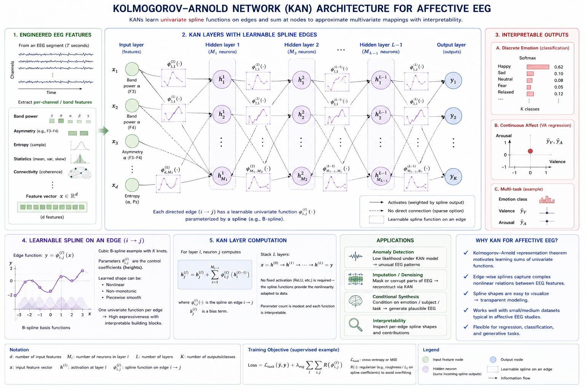
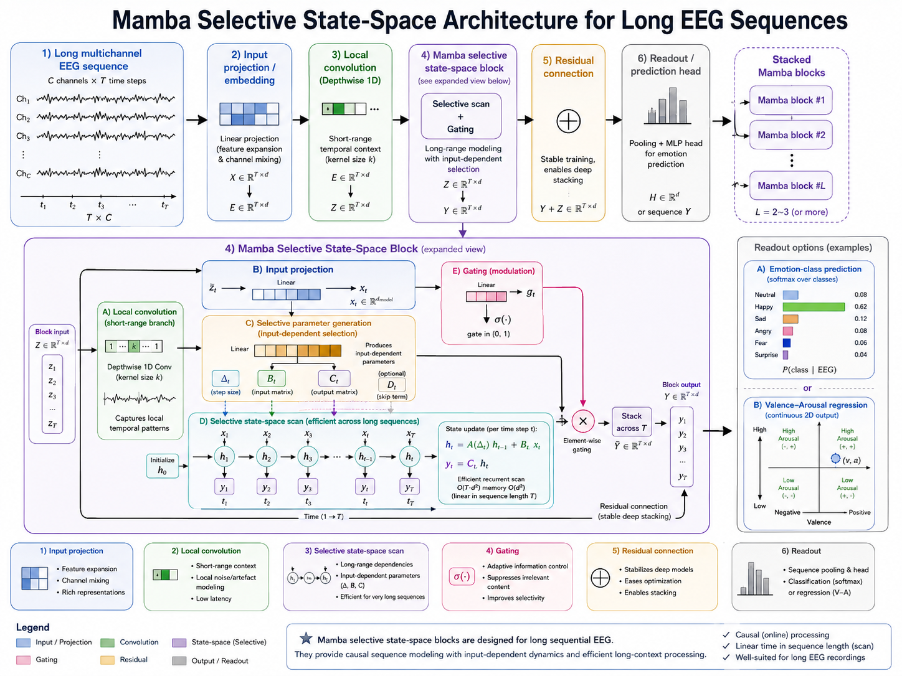

# Trending Architectures for EEG-based Affective Computing

## Overview

The landscape of deep learning is evolving rapidly. Beyond the established architectures (MLP, CNN, RNN, Transformer, GNN), a new wave of models is emerging with fundamentally different design principles. This section surveys trending architectures that are beginning to impact EEG-based affective computing, discussing their theoretical motivation, practical potential, and current limitations.

## Kolmogorov-Arnold Networks (KANs)

### Motivation

Traditional MLPs use fixed activation functions (e.g., ReLU, sigmoid) on nodes and learn only the linear weights between layers. KANs invert this paradigm: they use **learnable activation functions on edges** while nodes perform simple summation.



**Figure 8.10: KAN architecture for affective EEG.** KANs replace fixed activations on nodes with learnable spline functions on edges, yielding compact, interpretable feature models for affective EEG.

### Theoretical Foundation

Based on the **Kolmogorov-Arnold representation theorem**:

Any multivariate continuous function $f(x_1, \ldots, x_n)$ can be represented as:

$$f(x_1, \ldots, x_n) = \sum_{q=1}^{2n+1} \Phi_q\left(\sum_{p=1}^n \phi_{q,p}(x_p)\right)$$

where $\phi_{q,p}$ and $\Phi_q$ are univariate continuous functions.

A KAN layer replaces the linear weight $w$ with a learnable univariate function $\phi(x)$:

**MLP**: $$\text{output} = \sigma(Wx + b)$$

**KAN**: $$\text{output}_j = \sum_{i} \phi_{ij}(x_i)$$

where each $\phi_{ij}$ is a learnable spline function.

### Learnable Activation Functions

KANs typically parameterize $\phi(x)$ using B-splines:

$$\phi(x) = w_b \cdot \text{silu}(x) + w_s \cdot \sum_i c_i B_i(x)$$

where:
- $B_i(x)$ are B-spline basis functions
- $c_i$ are learnable coefficients
- $w_b, w_s$ control the mix of base activation and spline component
- $\text{silu}(x) = x \cdot \sigma(x)$ is the base activation

### Key Properties

| Property | MLP | KAN |
|---|---|---|
| **Learnable parameters** | Weights on connections | Activation functions on edges |
| **Expressiveness** | Good with large width | Good with small width |
| **Interpretability** | Low (black box) | Higher (spline visualization) |
| **Scaling law** | Power law in parameters | Faster scaling (fewer params) |
| **Training speed** | Fast | Currently slower (10×) |
| **Symbolic regression** | Difficult | Natural fit |

### Adaptation to EEG Affective Computing

**Potential advantages**:
- **Interpretability**: Visualize which input features → which frequencies are learned as activation patterns
- **Parameter efficiency**: Small KAN may match larger MLP on limited EEG data
- **Feature discovery**: Splines can naturally represent frequency-selective responses (matches how brain processes rhythms)
- **Symbolic insight**: May extract human-readable rules about EEG-emotion relationships

**Current challenges**:
- Training speed (active research area)
- Limited tooling (no stable Keras/PyTorch ecosystem yet)
- Validation on real EEG tasks is nascent
- Batch size / GPU optimization not mature

### Suitable Input Features

KANs work best with pre-extracted features (similar to MLPs):
- Frequency band powers (5 bands × 14 channels = 70 features)
- Frontal asymmetry indices
- Statistical moments (mean, variance, skewness, kurtosis)
- Entropy measures

The small number of features per input makes KANs tractable and the spline activations can discover non-linear feature interactions.

### Conceptual Architecture

```
Input: (128 hand-crafted features)
   ↓
KAN Layer 1: 128 inputs → 64 outputs
  - 128×64 = 8192 learnable spline functions φᵢⱼ(x)
  - Each φ: B-spline of order k=3, G=5 grid points
   ↓
KAN Layer 2: 64 → 32
  - 64×32 = 2048 learnable splines
   ↓
KAN Layer 3: 32 → 3 (emotion classes)
  - 32×3 = 96 learnable splines
   ↓
Output: softmax over 3 classes
```

**Total parameters**: ~10,336 spline functions (each with ~8 coefficients) ≈ 82K params
**Equivalent MLP**: Would need similar or more parameters for comparable expressiveness.

### Symbolic Regression for EEG Biomarkers

A unique KAN capability: after training, simplify the learned splines to symbolic formulas:

```python
# After training KAN on EEG → emotion:
# φ₁(x) learned: 0.3·x² - 0.1·x + 0.5
# φ₂(x) learned: sin(2π·0.5·x)  (frequency detector!)
# φ₃(x) learned: e^(-|x|)

# Prune and symbolic-ify:
# emotion_score ≈ 0.3·(alpha_power)² - 0.1·(theta/beta ratio)
#                     + sin(2π·0.5·frontal_asymmetry)
```

This could discover interpretable EEG biomarkers for emotions — a holy grail in affective neuroscience.

### Current Limitations for EEG

- **No temporal modeling**: KAN is a static function approximator; needs coupling with temporal architectures
- **Experimental codebase**: `pykan` library is research-grade
- **Scalability**: Current implementations struggle with >100 input features
- **Few EEG benchmarks**: Waiting for community validation

## State Space Models (SSMs) and Mamba

### Motivation

Transformers have $O(T^2)$ attention complexity. State Space Models offer $O(T)$ sequence modeling with competitive performance — a game-changer for long EEG recordings.



**Figure 8.11: Mamba selective state-space architecture for affective EEG.** Selective state-space models provide linear-scaling sequence processing for long EEG recordings.

### Theoretical Foundation

A continuous-time SSM maps a 1D input $u(t)$ to output $y(t)$ through a latent state $x(t)$:

$$\dot{x}(t) = A x(t) + B u(t)$$
$$y(t) = C x(t) + D u(t)$$

Discretized with step size $\Delta$:

$$x_k = \bar{A} x_{k-1} + \bar{B} u_k$$
$$y_k = C x_k$$

where $\bar{A} = e^{\Delta A}$, $\bar{B} = (e^{\Delta A} - I) A^{-1} B$.

### Mamba: Selective SSM

**Key innovation**: Make SSM parameters input-dependent (selective):

$$\bar{A}(x), \bar{B}(x), \Delta(x) = f_{\text{params}}(x)$$

This allows the model to:
- **Selectively remember** or ignore information based on input
- Focus on emotionally relevant EEG segments
- Adapt filtering behavior to signal content

### Mamba Architecture Block

```
Input: (T, d)  # T time steps, d channels
   ↓
Linear projection → (T, 2d)
   ↓
1D Convolution (local mixing)
   ↓
SiLU activation
   ↓
Selective SSM (Mamba core)
  - Δ = softplus(Linear(x) + bias)
  - B = Linear(x)
  - C = Linear(x)
  - Discretize A with Δ
  - Parallel scan: xₖ = Āₖxₖ₋₁ + B̄ₖuₖ
   ↓
SiLU gating (elementwise with residual)
   ↓
Linear projection → (T, d)
   ↓
+ Residual connection
```

### Adaptation to EEG Affective Computing

**Key advantages for EEG**:

1. **Linear scaling**: $O(T)$ complexity enables processing entire sessions (30+ minutes at 256 Hz ≈ 460,000 samples)
2. **Selectivity**: Mamba learns to attend to emotionally salient segments (e.g., video climax)
3. **Continuous-time heritage**: SSMs naturally model continuous physiological signals
4. **Efficient inference**: Fast autoregressive generation for real-time emotion tracking
5. **Long-range dependencies**: No attention bottleneck; captures slow emotional drifts

**Comparison with Transformers for EEG**:

| Aspect | Transformer | Mamba/SSM |
|---|---|---|
| **Complexity** | $O(T^2)$ | $O(T)$ |
| **Max practical length** | ~4,096 samples | >100,000 samples |
| **Memory usage** | Quadratic | Linear |
| **Training speed** | Fast (parallel) | Fast (parallel scan) |
| **Long-range modeling** | Excellent (global attention) | Excellent (selective memory) |
| **Interpretability** | Attention maps | Less interpretable |
| **Maturity for EEG** | Established | Emerging |

### Suitable Input Features

**Raw multichannel EEG (ideal for Mamba)**:
```python
# Shape: (batch, T, channels)
# T = 30 seconds × 256 Hz = 7,680  (easily handled)
# T = 5 minutes × 256 Hz = 76,800  (difficult for Transformer, fine for Mamba)
```

**Preprocessed features**:
```python
# Per-time-step spectral features
# Shape: (batch, T, n_bands × n_channels)
# T = 120 time windows (2 sec each for 4 min session)
```

**Multi-scale SSM**:
```python
# Process EEG at multiple temporal resolutions
# Fast stream: 256 Hz raw
# Slow stream: Downsampled envelope
# → Multiple parallel SSM branches
```

### Conceptual Mamba Model for EEG Emotion Recognition

```python
# Note: This uses the mamba-ssm library (research code)
# pip install mamba-ssm (requires CUDA)

import torch
import torch.nn as nn
from mamba_ssm import Mamba

class EEGMamba(nn.Module):
    def __init__(self, n_channels=14, d_model=256, n_layers=4, n_emotions=3):
        super().__init__()
        
        # Project EEG channels to model dimension
        self.input_proj = nn.Linear(n_channels, d_model)
        
        # Stack of Mamba blocks
        self.mamba_blocks = nn.ModuleList([
            MambaBlock(d_model) for _ in range(n_layers)
        ])
        
        # Layer norm
        self.norm = nn.LayerNorm(d_model)
        
        # Classification head
        self.classifier = nn.Sequential(
            nn.Linear(d_model, 128),
            nn.ReLU(),
            nn.Dropout(0.3),
            nn.Linear(128, n_emotions)
        )
    
    def forward(self, x):
        """
        x: (batch, T, n_channels) - e.g., (32, 7680, 14)
        """
        x = self.input_proj(x)  # (B, T, d_model)
        
        for block in self.mamba_blocks:
            x = block(x)  # (B, T, d_model)
        
        x = self.norm(x)
        
        # Pool across time (mean of last 25% to focus on final state)
        T = x.shape[1]
        x = x[:, -T//4:, :].mean(dim=1)  # (B, d_model)
        
        return self.classifier(x)

class MambaBlock(nn.Module):
    def __init__(self, d_model):
        super().__init__()
        self.mamba = Mamba(
            d_model=d_model,
            d_state=16,      # SSM state dimension
            d_conv=4,        # Conv kernel size
            expand=2,        # Expansion factor
        )
        self.norm = nn.LayerNorm(d_model)
    
    def forward(self, x):
        return x + self.mamba(self.norm(x))
```

### Preprocessing Considerations

```python
# Mamba processes raw sequences → minimal preprocessing needed

# 1. Bandpass filter to remove DC drift and high-freq noise
signal = bandpass_filter(signal, 0.5, 40)

# 2. Per-channel normalization
for ch in range(n_channels):
    signal[ch] = (signal[ch] - signal[ch].mean()) / (signal[ch].std() + 1e-6)

# 3. No segmentation needed! Mamba handles long sequences
#    Optionally chunk for more training samples
#    session_signal shape: (T_total, n_channels)

# 4. Create sliding windows for training:
#    window_size = 7680  # 30 seconds at 256 Hz
#    stride = 3840        # 50% overlap
```

### Current Status

- **Mamba-1** (Dec 2023): Introduced selective SSM, matched Transformers on language
- **Mamba-2** (May 2024): Connection to attention, faster training, SSD framework
- **EEG applications**: Early papers showing competitive/better results than Transformer-LSTM hybrids
- **Limitations**: GPU-optimized (CUDA required), research ecosystem developing

## Spiking Neural Networks (SNNs)

### Motivation

The brain communicates via spikes, not continuous values. SNNs are **neuromorphic** — they process information as discrete spike events, making them the most biologically plausible architecture and extremely energy-efficient.

### Key Concepts

**Leaky Integrate-and-Fire (LIF) neuron**:

$$\tau \frac{dV}{dt} = -(V - V_{\text{rest}}) + I(t)$$

When membrane potential $V$ reaches threshold $V_{\text{th}}$:
1. Neuron fires a spike
2. $V$ resets to $V_{\text{rest}}$
3. Refractory period begins

**Spike encoding**:
```python
# Rate coding: firing rate ∝ signal amplitude
# Temporal coding: spike timing carries information
# Population coding: groups of neurons encode features
```

### Adaptation to EEG

**Why SNNs fit EEG**:
- Brain signals are fundamentally spiking → natural match
- Ultra-low power: suitable for wearable EEG emotion monitoring
- Temporal precision: millisecond-scale dynamics match EEG resolution
- Event-driven processing: only compute when spikes occur (sparse computation)
- Online learning: Can adapt continuously during use

**Spike encoding strategies for EEG**:

1. **Rate coding**: EEG amplitude → firing rate
```python
spike_rate = (signal - min_threshold) / (max_threshold - min_threshold) * max_rate
```

2. **Delta modulation**: Spike when signal changes significantly
```python
spike[t] = 1 if |signal[t] - signal[t-1]| > threshold else 0
```

3. **Phase coding**: Spike at specific phases of oscillatory activity
```python
# Spike at alpha/theta phase peaks
spike[t] = 1 if phase[t] ≈ target_phase else 0
```

### SNN Architecture for EEG Emotion

```
EEG → Spike Encoder → SNN Layers → Readout → Emotion
│                        │
│  Rate/Temporal/       │  LIF neurons
│  Phase encoding       │  Synaptic plasticity
│                        │  Sparse activity
```

### Energy Efficiency Comparison

| Architecture | Operations/sample | Relative Energy | Hardware |
|---|---|---|---|
| **CNN** | ~10M FLOPs | 1× | GPU/CPU |
| **LSTM** | ~50M FLOPs | 5× | GPU/CPU |
| **Transformer** | ~100M FLOPs | 10× | GPU |
| **SNN** (neuromorphic) | ~0.1M spikes | 0.01× | Neuromorphic chip |

This makes SNNs compelling for **wearable EEG devices** that need real-time, all-day emotion monitoring.

### Current Limitations

- **Training difficulty**: Non-differentiable spikes → surrogate gradients needed
- **Software ecosystem**: Less mature than standard deep learning frameworks
- **Accuracy gap**: Often slightly below equivalent ANNs on complex tasks
- **Hardware dependency**: Full efficiency only on neuromorphic chips (Loihi, TrueNorth)
- **Limited pre-training**: No large-scale SNN pre-trained models for EEG

## Foundation Models and Large EEG Models

### Motivation

In NLP and vision, scaling laws have shown that larger models trained on massive data consistently improve. The EEG community is beginning to explore this paradigm.

### Key Approaches

#### EEG Pre-training Objectives

1. **Masked Signal Modeling** (analogous to BERT):
```
Mask random time segments → predict masked EEG
→ Model learns general EEG representations
```

2. **Contrastive Learning** (SimCLR-style):
```
Augment EEG segment → encode → maximize similarity with original
→ Model learns invariant representations
```

3. **Next-Segment Prediction**:
```
Given EEG[t], predict EEG[t+1]
→ Model learns temporal dynamics
```

4. **Cross-Modal Alignment**:
```
Align EEG with emotion labels, video features, or physiological signals
→ Multi-modal foundation
```

#### Architecture

```
[Massive Pre-training on 100K+ hours of EEG]
        ↓
Pre-trained EEG Encoder (Transformer/Mamba)
        ↓
[Fine-tune on specific task with small labeled data]
        ↓
Emotion Recognition | Stress Detection | Fatigue Monitoring
```

#### EEG-Specific Challenges

| Challenge | NLP/Vision | EEG |
|---|---|---|
| **Data volume** | Billions of samples | Typically <1000 sessions |
| **Standardization** | Standard tokenizers/resolutions | Varying electrode counts, sampling rates |
| **Labels** | Abundant | Sparse, subjective |
| **Domain shift** | Moderate | Severe (across subjects/devices) |
| **Privacy** | Manageable | Highly sensitive (brain data) |

### Notable Initiatives

- **BIOT** (Biosignal Transformer): Pre-training on multiple biosignal datasets
- **EEGNet pre-training**: Transfer from large motor imagery datasets
- **BENDR** (BErt-like EEG Representations): Masked modeling on Temple University EEG corpus
- **LaBraM** (Large Brain Model): Pre-training on multi-center EEG data

### Adaptation to Affective Computing

```python
# Example workflow:
# 1. Load pre-trained EEG foundation model
encoder = load_pretrained_eeg_model('biot-base')

# 2. Freeze most layers
for param in encoder.parameters():
    param.requires_grad = False

# 3. Add emotion classification head
classifier = nn.Sequential(
    nn.Linear(encoder.hidden_dim, 128),
    nn.ReLU(),
    nn.Linear(128, 3)  # valence classes
)

# 4. Fine-tune on small affective EEG dataset
fine_tune(encoder, classifier, emotion_dataset)
```

## Neural Ordinary Differential Equations (Neural ODEs)

### Motivation

Standard neural networks have discrete layers. Neural ODEs model continuous depth, treating network depth as a continuous variable — ideal for continuous-time signals like EEG.

### Formulation

A residual network layer:
$$h_{t+1} = h_t + f(h_t, \theta_t)$$

A Neural ODE takes the limit as step size → 0:
$$\frac{dh(t)}{dt} = f(h(t), t, \theta)$$

The output is obtained by solving this ODE:
$$h(T) = h(0) + \int_0^T f(h(t), t, \theta) dt$$

### Advantages for EEG

- **Continuous time**: Natural for analog EEG signals
- **Adaptive computation**: ODE solver adjusts step size based on signal complexity
- **Irregular sampling**: Handle missing EEG samples naturally
- **Memory efficiency**: Constant memory regardless of "depth"
- **Invertible**: Can reverse the dynamics (useful for generation)

### Conceptual Application

```python
# Neural ODE for continuous emotion dynamics:
# Given EEG features at time t, model the emotion state trajectory
# dh_emotion/dt = f(eeg(t), h_emotion(t), θ)
# → Predict emotion trajectory continuously
```

## Additional Emerging Trends

### Hypernetworks

A small network generates the weights of the main network:

```
EEG metadata (subject ID, session, device)
        ↓
Hypernetwork
        ↓
Main network weights
        ↓
Emotion prediction

→ One model adapts to all subjects without retraining
```

**EEG relevance**: Subject-specific model adaptation without separate training.

### Neural Architecture Search (NAS)

Automatically discover optimal architectures for EEG:

```
Search space: Conv/LSTM/Attention layers, filter sizes, depths
Search algorithm: Evolutionary, gradient-based, reinforcement learning
Objective: Maximize emotion recognition accuracy
→ Discover EEG-specific architectures
```

### Physics-Informed Neural Networks (PINNs)

Incorporate neurophysiological constraints:

$$\mathcal{L} = \mathcal{L}_{\text{data}} + \lambda \mathcal{L}_{\text{physics}}$$

where $\mathcal{L}_{\text{physics}}$ enforces known EEG properties (e.g., Maxwell's equations for volume conduction, frequency band constraints).

**EEG relevance**: More robust, more interpretable, better generalization.

### Liquid Neural Networks

Inspired by C. elegans nervous system:

$$\frac{dx}{dt} = -\left(\frac{1}{\tau} + A\right)x(t) + S \cdot f(x(t), I(t), \theta)$$

where $\tau$ is a time constant, $A$ is a fixed sparse random matrix, and $S$ is a learned sensory mapping.

**EEG relevance**: Compact, causal, interpretable temporal dynamics with strong generalization — ideal for real-time emotion monitoring.

## Comparative Overview of Trending Architectures

| Architecture | Maturity | EEG Fit | Key Strength | Current Limitation |
|---|---|---|---|---|
| **KAN** | Research | Moderate (static) | Interpretability, symbolic extraction | Slow training, no temporal |
| **Mamba/SSM** | Early adoption | Excellent | Long sequences, O(T) complexity | CUDA-dependent |
| **SNN** | Research → Product | Excellent | Energy efficiency, biological | Training difficulty |
| **Foundation Models** | Early adoption | High potential | Transfer learning, scaling | Data scarcity |
| **Neural ODE** | Research | Good | Continuous time, irregular sampling | Slow inference |
| **Hypernetworks** | Research | Moderate | Subject adaptation | Limited validation |
| **NAS** | Early adoption | Moderate | Architecture discovery | Computational cost |
| **PINNs** | Research | Good | Physically constrained | Requires domain model |
| **Liquid NN** | Research | Good | Compact causal models | Limited tooling |

## Decision Framework for Trending Architectures

```
What is your primary constraint?
├─ Interpretability is critical
│  └─→ KAN (learnable symbolic activations)
│      or SNN (biological plausibility)
│
├─ Very long EEG recordings (minutes → hours)
│  └─→ Mamba/SSM (O(T) complexity)
│
├─ Limited labeled data
│  └─→ Foundation Models (pre-train + fine-tune)
│      or Hypernetworks (few-shot adaptation)
│
├─ Energy/power constrained (wearable)
│  └─→ SNN (neuromorphic) + neuromorphic chip
│
├─ Irregular or missing samples
│  └─→ Neural ODE (continuous-time)
│
├─ Need to discover novel architecture
│  └─→ Neural Architecture Search
│
└─ Need physical/biological guarantees
   └─→ Physics-Informed Neural Networks
```

## Preprocessing Considerations for Trending Models

| Architecture | Preferred Input | Preprocessing Needs |
|---|---|---|
| **KAN** | Hand-crafted features (PSD, statistics) | Full feature extraction pipeline |
| **Mamba** | Raw EEG, minimal preprocessing | Bandpass filter, normalization only |
| **SNN** | Spike-encoded signals | Spike encoding (rate/temporal/phase) |
| **Foundation** | Standardized EEG format | Montage normalization, resampling |
| **Neural ODE** | Continuous signals | Minimal, handles irregular sampling |

## Practical Recommendations

### When to Adopt Trending Architectures

**Adopt now** (2024-2025):
- **Mamba/SSM**: For long recordings, competitive with Transformers
- **Foundation Models**: If you can leverage pre-trained EEG encoders

**Watch closely** (2025-2026):
- **KAN**: Wait for faster implementations and EEG benchmarks
- **SNN**: Wait for better training methods and wider hardware support

**Research only** (2025+):
- **Neural ODE**: Interesting but not yet practical for production
- **Liquid NN**: Exciting theory, need EEG-specific validation
- **Hypernetworks**: Subject adaptation is promising but nascent

### Integration with Established Models

The most practical approach combines trending models with established ones:

```
Option A: Mamba + CNN
  CNN extracts spatial features → Mamba models long temporal dynamics

Option B: KAN + LSTM  
  LSTM extracts temporal features → KAN provides interpretable classification

Option C: Pre-trained Foundation + Fine-tuned KAN
  Foundation model extracts general EEG features → KAN provides interpretable
  emotion-specific mapping
```

## Summary

Trending architectures are reshaping the possibility space for EEG-based affective computing:

**Most promising for near-term impact**:
1. **Mamba/SSM**: Solves the long-sequence problem elegantly — process entire EEG sessions
2. **Foundation Models**: Transfer learning from large pre-trained EEG encoders
3. **KAN**: Interpretability breakthrough for discovering EEG-emotion biomarkers

**Most promising for wearable/edge deployment**:
4. **SNN**: Energy efficiency orders of magnitude below conventional networks
5. **Liquid NN**: Compact causal models for real-time monitoring

**Key takeaway**: No single architecture dominates. The most effective approach combines:
- Established models (CNN, LSTM) for proven components
- Trending models (Mamba, KAN) for specific strengths
- Hybrid designs that leverage the best of both worlds

The field is evolving rapidly — what is trending today may become standard tomorrow. Stay connected to the research literature and be ready to incorporate validated advances into your EEG affective computing pipeline.

---

**Related Reading**: See previous sections for foundational architectures that can be combined with these trending approaches.
