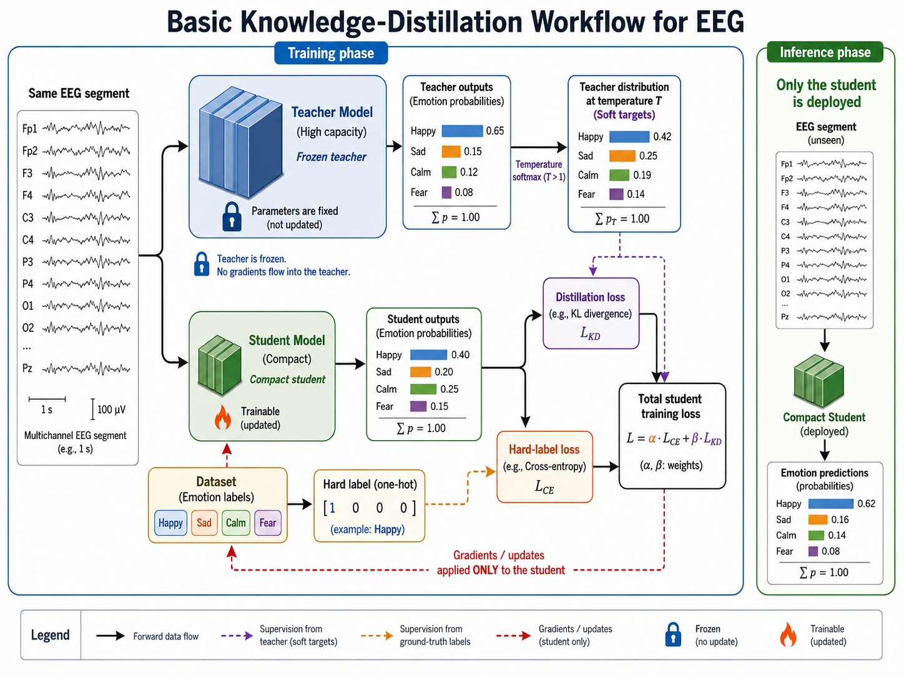
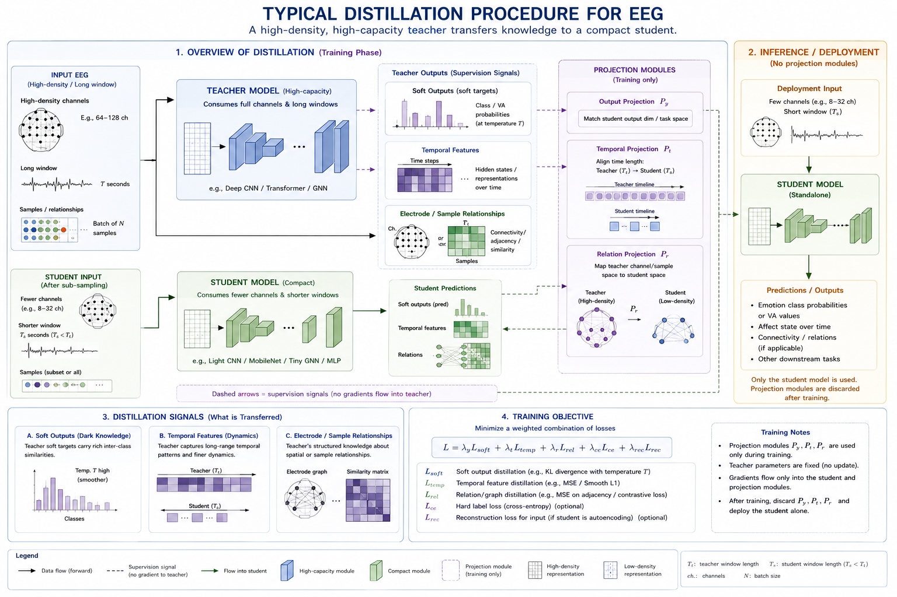

# Knowledge Distillation for EEG-based Affective Computing

Knowledge distillation transfers useful behavior from a large or otherwise strong **teacher** model to a smaller **student** model. The student is trained not only from hard emotion labels, but also from the teacher's richer output distribution or internal representation. Its central use in affective EEG is practical: retain as much predictive value as possible while meeting the latency, memory, energy, or privacy constraints of a wearable, mobile, or real-time BCI.

Distillation is not guaranteed compression. A weak, biased, poorly calibrated, or leakage-contaminated teacher can transfer its errors efficiently. Treat the teacher as another learned source of supervision whose validity must be established under the same evaluation protocol as the student.

## Teacher-Student Training

For an input EEG segment $$x$$, let the teacher and student produce logits $$z_t(x)$$ and $$z_s(x)$$. Temperature $$T > 1$$ turns logits into softer class distributions:

$$
p_t^{(T)} = \mathrm{softmax}\left(\frac{z_t}{T}\right),
\qquad
p_s^{(T)} = \mathrm{softmax}\left(\frac{z_s}{T}\right).
$$

The soft distribution preserves information that a one-hot label discards. For example, a teacher may assign meaningful probability to both high-arousal and positive-valence classes for an ambiguous segment, revealing class similarity or uncertainty. At deployment, the student normally uses $$T=1$$.



**Figure 8.14: Basic knowledge-distillation workflow.** The teacher is used only while training, so its computational cost need not be paid on the target device.

The common objective combines ordinary supervised loss with a divergence between softened outputs:

$$
\mathcal{L}_{\text{KD}} =
+(1 - \alpha)\,\mathcal{L}_{\text{CE}}\bigl(y, \mathrm{softmax}(z_s)\bigr)
+ \alpha T^2\, D_{\text{KL}}\left(p_t^{(T)}\,\Vert\,p_s^{(T)}\right),
$$

where $$y$$ is the observed label, $$\alpha \in [0,1]$$ controls the teacher contribution, and $$T^2$$ keeps the gradient scale comparable as temperature changes. Cross-entropy anchors the student to recorded labels; the distillation term asks it to reproduce the teacher's class structure. Tune $$T$$ and $$\alpha$$ on a validation partition that is independent at the intended held-out unit, such as subject or session.

## What Can Be Distilled?

Logit matching is the simplest choice, but it is not the only transfer signal. EEG models often have different input resolutions, channel counts, or architectures, so the most suitable target depends on what the teacher has learned and what the student can represent.

| Distillation target | Transfer signal | EEG use case | Main caution |
| --- | --- | --- | --- |
| Response / logit | Soft class or regression outputs | Compress a high-capacity teacher into a wearable classifier | Cannot recover information absent from final outputs |
| Feature | Hidden activations after projection or normalization | Transfer spectral-temporal features from a Transformer or CNN | Layer correspondence and feature scale need explicit design |
| Attention | Attention maps, spatial masks, or temporal saliency | Encourage focus on valid channels and relevant intervals | Attention agreement is not evidence of neuroscientific validity |
| Relation | Pairwise sample, channel, or feature similarities | Preserve connectivity-aware or embedding geometry | Relation matrices can be costly and encode spurious subject identity |
| Multi-teacher | Weighted or gated supervision from several teachers | Combine temporal, spatial, or modality-specific expertise | Conflicting teachers require validation, not blind averaging |

### Feature and Relation Distillation

Feature distillation aligns intermediate representations. If $$h_t$$ and $$h_s$$ are teacher and student features, a learned projection $$g$$ can reconcile dimensions:

$$
\mathcal{L}_{\text{feat}} =
\left\|\mathrm{norm}\bigl(g(h_s)\bigr) - \mathrm{norm}(h_t)\right\|_2^2.
$$

Relation distillation instead preserves how samples, channels, or time patches relate. For a mini-batch embedding matrix $$H$$, one option matches normalized Gram matrices:

$$
\mathcal{L}_{\text{rel}} =
\left\|
\frac{H_s H_s^\top}{\|H_s H_s^\top\|_F}
- \frac{H_t H_t^\top}{\|H_t H_t^\top\|_F}
\right\|_F^2.
$$

This is useful when a large teacher learns stable relationships between EEG windows or electrodes but the student uses a different architecture. It does not establish that the learned relation is physiological connectivity; that claim needs separate validation.



**Figure 8.15: EEG-specific distillation signals.** Distillation can transfer predictions, representations, and relations. The student may use a smaller input or architecture, but each mismatch must be represented explicitly rather than hidden by zero filling or undocumented channel dropping.

## Distillation Designs for Affective EEG

Several designs are especially relevant:

- **Offline compression:** Train a strong CNN-Transformer, GNN, or ensemble offline, then distil it into a compact CNN, temporal convolutional network, or small Transformer for deployment.
- **Cross-montage distillation:** A teacher uses high-density laboratory EEG, while the student receives a documented subset compatible with a wearable montage. Evaluate on recordings with the student montage truly masked, not merely simulated by changing an input shape after feature extraction.
- **Cross-resolution distillation:** A teacher consumes longer windows or higher sampling rates; a student learns from shorter causal windows. Include latency and the information unavailable to the student in the experiment description.
- **Self-distillation:** Earlier checkpoints, deeper heads, or an exponential-moving-average version of the same model supervise a student of equal size. This can regularize a small-data model, but it does not reduce inference cost unless the final architecture changes.
- **Cross-modal or privileged-information distillation:** A training-only teacher sees EEG plus peripheral physiology, video, task events, or high-quality artifact annotations; the deployed student sees EEG only. This is attractive when extra modalities are unavailable or inappropriate at deployment.
- **Federated or privacy-aware distillation:** Instead of sharing raw recordings, sites may share logits, prototypes, or a public-data teacher signal. This can reduce raw-data exchange but does not automatically prevent membership, attribute, or model-inversion leakage.

For continuous valence-arousal targets, replace class KL divergence with a distributional or uncertainty-aware regression target, such as matching teacher and student Gaussian means and variances. Do not convert continuous labels into arbitrary classes only to use a standard classification-distillation loss.

## A Practical Training Recipe

1. **Define the deployment budget first.** Fix student input channels, sampling rate, window length, parameter budget, latency, and energy target before selecting a teacher.
2. **Train and validate the teacher cleanly.** Fit normalization, artifact handling, feature extraction, and teacher hyperparameters using training data only. Freeze the teacher after selection.
3. **Create matched student inputs.** Derive the student montage or shorter window from raw held-out data using the same causal preprocessing that deployment will use.
4. **Start with logit distillation.** Compare a student trained with cross-entropy alone against the same student with temperature $$T$$, weight $$\alpha$$, and no other changed training choices.
5. **Add one transfer target at a time.** Introduce feature, attention, or relation loss only when it improves an independent validation result and the target has a clear correspondence.
6. **Evaluate the deployed student, not the training graph.** Report held-out task quality together with latency, memory, parameter count, throughput, and energy when available.

The following sketch shows a classification objective in PyTorch. The teacher is evaluated without gradients; the hard-label and soft-target paths both update the student.

```python
import torch.nn.functional as F

temperature = 3.0
alpha = 0.5

with torch.no_grad():
    teacher_logits = teacher(teacher_eeg)

student_logits = student(student_eeg)
hard_loss = F.cross_entropy(student_logits, labels)
soft_loss = F.kl_div(
    F.log_softmax(student_logits / temperature, dim=1),
    F.softmax(teacher_logits / temperature, dim=1),
    reduction="batchmean",
)
loss = (1.0 - alpha) * hard_loss + alpha * temperature**2 * soft_loss
```

The example deliberately separates `teacher_eeg` and `student_eeg`: they may be identical for ordinary compression, or they may differ in channels, sampling rate, and window length for a deployment-oriented transfer. Any projection for feature matching belongs in the training graph and is discarded with the teacher.

## Evaluation and Failure Modes

| Question | Minimum evidence |
| --- | --- |
| Does distillation improve prediction? | Compare against the same student trained without distillation under identical splits and tuning budget |
| Is the student deployable? | Report parameter count, peak memory, latency, throughput, and device or hardware context |
| Does it transfer across people or sessions? | Subject-held-out and, when relevant, session-held-out evaluation; no window-level leakage |
| Does a reduced montage work? | Test the real student-channel subset and report performance by subject and signal quality |
| Does the teacher add useful uncertainty? | Calibration, negative log-likelihood or Brier score, and ambiguity/error analysis |
| Does the model preserve EEG-relevant behavior? | Spectral, temporal, channel-robustness, and artifact-sensitivity checks alongside task metrics |

Common failures include a teacher that is only strong under a leaky trial-random split, a student accidentally receiving features computed with unavailable channels, loss weights that overwhelm the labels, and reporting teacher-student agreement as though it were ground-truth accuracy. Distillation can also preserve demographic, site, device, or annotation bias. Audit errors by subject, session, recording hardware, and signal quality whenever metadata permits.

## Practical Recommendations

- Use knowledge distillation when a validated high-capacity model must be reduced for an explicit deployment or data-availability constraint.
- Establish a matched compact-student baseline before adding a teacher; compression value is the difference from that baseline, not from the teacher alone.
- Prefer logit distillation first, then add feature or relation losses only for a declared architecture or input mismatch.
- Make teacher and student preprocessing, channel availability, causal context, and normalization comparable to the intended deployment path.
- Select temperature, loss weights, and teacher checkpoints using subject- or session-aware validation rather than test results.
- Report efficiency and calibrated, held-out task quality together; a smaller model that is inaccurate, biased, or poorly calibrated is not a successful deployment model.

## References

- Hinton, G., Vinyals, O., and Dean, J. (2015). Distilling the knowledge in a neural network. arXiv:1503.02531.
- Romero, A., Ballas, N., Kahou, S. E., et al. (2015). FitNets: Hints for thin deep nets. International Conference on Learning Representations.
- Zagoruyko, S., and Komodakis, N. (2017). Paying more attention to attention: Improving the performance of convolutional neural networks via attention transfer. International Conference on Learning Representations.
- Park, W., Kim, D., Lu, Y., and Cho, M. (2019). Relational knowledge distillation. IEEE/CVF Conference on Computer Vision and Pattern Recognition.
- Gou, J., Yu, B., Maybank, S. J., and Tao, D. (2021). Knowledge distillation: A survey. International Journal of Computer Vision, 129, 1789-1819.