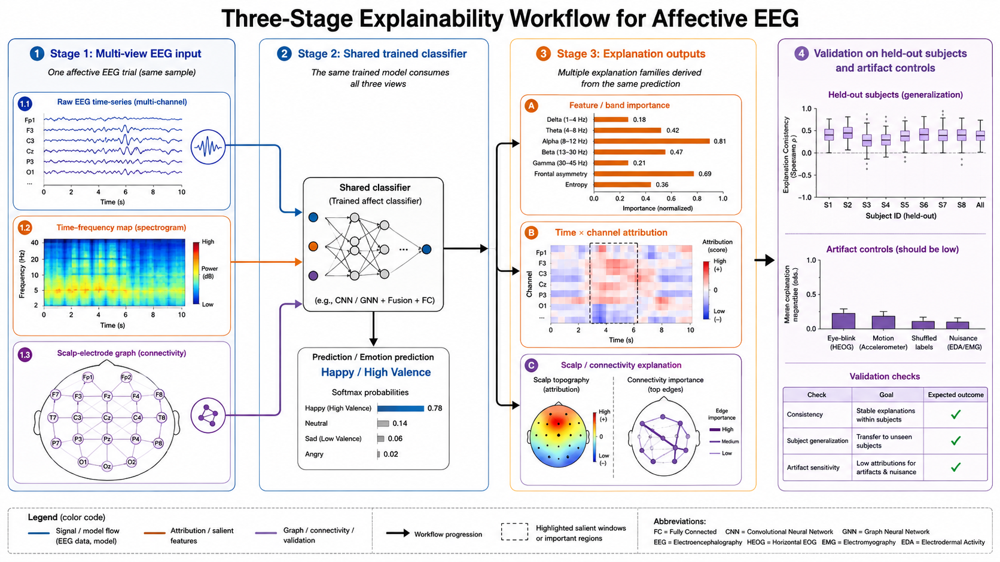
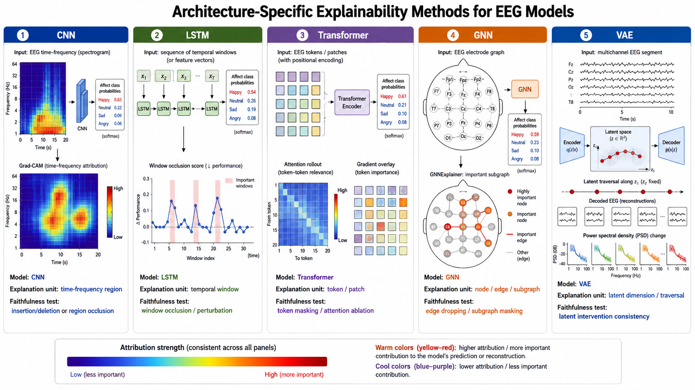
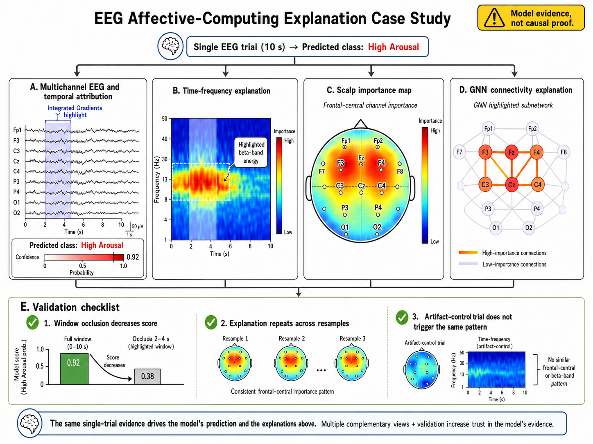

# Interpretability and Explainability for EEG Deep Learning

## Overview

Deep models can achieve strong affect-recognition performance while leaving an important question unanswered: **which numerical patterns caused a particular prediction?** Interpretability and explainability methods make that question testable by attributing a model output to input features, time intervals, channels, graph edges, or internal representations. For EEG, this is useful for scientific interpretation, quality control, debugging, and deciding whether a model has learned neural patterns rather than artifacts or subject identity.

An explanation is evidence about a *model's behavior*; it is not, by itself, evidence of a causal brain mechanism. A high attribution for an alpha-band feature can mean the classifier relied on that feature under the training distribution, but it does not establish that alpha power caused the reported emotion. Explanations should therefore be evaluated as carefully as predictive models, with held-out data, stability checks, and domain-informed validation.

## What Should an Explanation Answer?

Explanations can be **local**, accounting for one prediction, or **global**, summarizing a model's behavior across a cohort. They can also focus on different units of analysis:

- **Feature importance:** Which engineered features, bands, or summary statistics changed the prediction?
- **Temporal importance:** Which samples or windows within a trial mattered?
- **Spatial importance:** Which electrodes or scalp regions contributed?
- **Connectivity importance:** Which graph edges or channel interactions mattered?
- **Representation importance:** Which latent factors, tokens, or hidden units were used?

The same prediction can be examined from several complementary perspectives. Feature attribution asks which summary measures affected the score; temporal attribution identifies when informative evidence appeared; spatial attribution shows where it arose on the scalp; and connectivity attribution examines interactions between channels. Agreement across these views is more informative than relying on a single heat map, because each view can expose a different shortcut or preprocessing artifact.

**Figure 8.15: From EEG prediction to multi-level explanation.** A trained model can be interrogated at the feature, temporal, spatial, and connectivity levels; each explanation must then be checked for stability and physiological plausibility.

Read the outputs as a chain of evidence rather than as a direct statement about the brain. For example, a model may assign high importance to a frontal alpha-band interval, but that finding is credible only if it remains stable across resamples, affects the prediction under a realistic perturbation, and is not reproduced by artifact-control trials. The validation step in the figure is therefore essential: it distinguishes a visually appealing attribution from an explanation that is useful for model auditing.

## Broadly Applicable Explainability Methods

The following methods can be applied to many deep-learning architectures. The appropriate choice depends on whether gradients are available, how correlated the inputs are, and whether the goal is a fast local explanation or a robust global summary.

### Gradient-Based Attribution

**Saliency maps** use the gradient of a selected class score with respect to each input value. A large magnitude indicates that a small local change would strongly change the score. They are inexpensive and work naturally for raw EEG, spectrograms, and feature vectors, but raw gradients can be noisy and reflect sensitivity rather than the effect of a realistic perturbation.

**SmoothGrad** and related noise-averaging methods reduce visual noise by averaging saliency maps over small perturbations of the same input. This makes broad temporal or channel patterns easier to read, although the perturbation scale must respect the signal's physical units.

**Integrated Gradients (IG)** accumulates gradients along a path from a reference baseline to the observed input. It addresses a common saliency failure—near-zero gradient in a saturated unit—and has a useful completeness property: attributions approximately sum to the difference between the prediction for the input and the baseline. The baseline is a scientific choice for EEG: a zero signal, a per-channel mean, and an eyes-open resting segment answer different questions.

**DeepLIFT** and related backpropagation rules compare activations with a reference activation. They can provide fast, less noisy attributions for deep networks, but their interpretation still depends on a carefully chosen reference and the implementation's handling of nonlinear layers.

### Perturbation and Occlusion Methods

Perturbation methods ask a more direct question: *what happens if this information is removed or replaced?* A temporal-window occlusion test can replace a short segment with a baseline, a channel-ablation test can mask one electrode, and a band-occlusion test can suppress one frequency range. The drop in class score estimates the model's reliance on that unit.

These methods are architecture-agnostic and intuitive, but naive masking can create unrealistic discontinuities that the model has never seen. Prefer physiologically plausible replacements—for example, band-limited noise, a neighboring clean segment, or conditional imputation—and report the perturbation policy. Permutation importance is useful for tabular features, but permuting a correlated EEG feature can generate impossible combinations and overstate its apparent contribution.

### Additive Feature-Attribution Methods: LIME and SHAP

**LIME** fits a simple local surrogate model around one prediction by perturbing interpretable units such as frequency-band power, time windows, or channels. It is model-agnostic and readable, but results may change with the sampling distribution and the definition of the interpretable units.

**SHAP values** estimate each feature's average marginal contribution across possible feature coalitions. `KernelSHAP` is model-agnostic; `DeepSHAP` uses deep-model structure for faster approximation. SHAP is especially effective for a model trained on numerical EEG features such as differential entropy, PSD, asymmetry, or connectivity summaries. With strongly correlated channels and bands, however, SHAP values distribute credit according to a background distribution rather than recovering a unique biological cause. Group correlated features and state the chosen background set explicitly.

### Global Response and Example-Based Methods

**Partial-dependence plots (PDPs)** and **accumulated local effects (ALE)** show how predicted affect changes as a feature varies. ALE is generally safer when features are correlated, as EEG features often are. **Prototype and nearest-neighbor explanations** retrieve training examples or latent exemplars that resemble a test trial, making it easier to inspect whether the prediction is supported by comparable recordings. **Counterfactual explanations** seek the smallest plausible change that would alter a prediction; in EEG, constrain changes to meaningful units such as a band, channel group, or time window, not arbitrary individual samples.

### Choosing a Broad Method

| Goal | Useful starting methods | Main caution |
|---|---|---|
| Fast local explanation of a differentiable model | Saliency, SmoothGrad, Integrated Gradients | Baseline and gradient noise can change the map |
| Test whether a channel, band, or window is necessary | Occlusion, conditional permutation | Unrealistic masking can produce misleading drops |
| Explain numerical feature models | SHAP, LIME, ALE | Correlated features share or distort credit |
| Summarize cohort-level behavior | Aggregated IG/SHAP, ALE, prototypes | Average maps can hide subject heterogeneity |
| Find plausible changes that alter a decision | Constrained counterfactuals | Do not treat model changes as causal interventions |

## Architecture-Specific Approaches

Architecture-specific methods expose the representations that a particular model builds. They can be more spatially or temporally precise than generic attribution, but should be compared with a broad method such as occlusion or IG rather than trusted in isolation.

### CNNs: CAM, Grad-CAM, and Layer-Wise Relevance

**Class activation mapping (CAM)** converts the final convolutional feature maps into a class-specific heat map when the classifier uses global average pooling. **Grad-CAM** generalizes this idea by weighting intermediate feature maps with the gradient of a target class score, so it can be used with more CNN designs. For EEG spectrograms, Grad-CAM can highlight time-frequency regions; for topographic inputs, it can highlight scalp regions. Its resolution is limited by the chosen convolutional layer, so a map from a deep layer is usually more semantic but less precise.

**Layer-wise relevance propagation (LRP)** redistributes a prediction score backward through the network. It can produce detailed input-level relevance maps and is often used for EEGNet-like architectures, but the propagation rule must be compatible with the layer types and normalization used by the model. Guided Grad-CAM or guided backpropagation can sharpen a map, but sharpness should not be mistaken for increased faithfulness.

### RNNs and Temporal Convolutional Models: Time-Aware Attribution

For LSTMs, GRUs, and temporal CNNs, apply IG, saliency, or occlusion over contiguous windows rather than isolated samples. This respects temporal autocorrelation and yields explanations that are easier to compare with events, stimulus epochs, and frequency changes. If a recurrent model uses temporal attention, the attention weights can be visualized as a *routing summary*, but they are not automatically causal feature importance. Test them by masking highly attended and weakly attended windows and comparing the prediction change.

### Transformers: Attention, Rollout, and Gradient-Weighted Attention

Self-attention matrices show which tokens exchange information, but an attention weight alone does not say how much that interaction affected the final class score. Use **attention rollout** to trace information through multiple layers, or combine attention with output gradients to obtain **gradient-weighted attention**. Compare attention-derived maps with IG or token occlusion. For EEG tokens, reshape the result into time, channel, or time-frequency coordinates before interpretation; attention on padding or artifact tokens is a warning that masking or preprocessing is faulty.

### GNNs: Node, Edge, and Subgraph Explanations

GNN explanations can identify important electrodes, functional connections, or compact subnetworks. **GNNExplainer** optimizes a node-feature and edge mask for one prediction; **PGExplainer** learns an explainer that can generalize masks across examples; **GraphMask** learns sparse message gates; and attention coefficients in GATs offer a supplementary, not sufficient, view of edge use. Validate a proposed connectivity pattern by deleting or reweighting the identified edges, and distinguish graph-construction choices from connections learned by the network.

### Generative and Latent-Variable Models: Latent Traversal and Reconstruction Error

For VAEs, flows, and diffusion models, explanations may concern *why a sample looks typical* rather than why it receives a class label. Latent traversal changes one coordinate or a supervised direction and decodes the result; reconstruction or likelihood error can localize unfamiliar time-channel regions. For GANs, latent editing and discriminator attribution can be informative, but generated EEG must be checked for spectral and spatial realism. These analyses reveal model geometry and sensitivity, not necessarily disentangled neurophysiological factors.

Architecture-specific explanations should be read at the unit the model actually uses to make its decision. A CNN may base its evidence on a learned time-frequency pattern, an RNN on a sequence of windows, a Transformer on token interactions, and a GNN on messages passing along edges. Translating these internal units back into EEG time, frequency, channels, and connectivity makes the explanation inspectable—but does not eliminate the need for an independent faithfulness test.

**Figure 8.16: Architecture-specific explanation units.** CNN explanations emphasize feature maps, recurrent explanations emphasize windows and state evolution, Transformer explanations combine token interactions with output sensitivity, GNN explanations emphasize nodes and edges, and generative models emphasize latent directions or reconstruction behavior.

The figure also suggests a practical comparison rule: use a broad method, such as Integrated Gradients or realistic occlusion, to challenge a model-specific visualization. If the two methods consistently identify the same time interval, scalp region, or edge set, confidence in the model-behavior claim increases. If they disagree, report that uncertainty and investigate whether the difference arises from the chosen layer, baseline, graph construction, or explanation method.

## Using Explainability in EEG Affective Computing

### 1. Identifying Emotion-Relevant Bands and Features

For a feature-based classifier, compute SHAP or grouped permutation importance for band power, differential entropy, hemispheric asymmetry, and connectivity features. Aggregate signed attributions separately for each emotion and report their variability across subjects. This can reveal whether the model relies on plausible frontal asymmetry or alpha/beta patterns, while also exposing shortcuts such as a single high-variance feature derived from one recording session.

### 2. Localizing Informative Time Periods

For raw-EEG, RNN, or Transformer models, use Integrated Gradients or window occlusion on a correctly classified trial. Overlay importance on the waveform and on a time-frequency representation. An interpretation is stronger when a high-attribution interval corresponds to a stable spectral change and the prediction drops under a realistic replacement of that interval. It is weaker when attributions cluster at the start or end of every segmented trial, which may indicate padding, filtering transients, or segmentation artifacts.

### 3. Mapping Channel and Scalp Contributions

Sum input attributions over time or frequency within each channel, then visualize the result as a scalp topography. Use a fixed color scale across emotions and subjects; otherwise maps cannot be compared. Channel importance should be complemented by channel-ablation tests, because a channel can receive low individual attribution while still be redundant with a correlated neighbor.

### 4. Explaining Functional Connectivity Models

For a GNN trained on coherence, phase-locking, or learned adjacency matrices, generate node and edge masks for individual trials and then aggregate them only after aligning the electrode montage. Compare the highlighted subnetworks with known connectivity hypotheses, but test whether they survive changes in graph threshold, reference montage, and connectivity estimator. This separates a robust model finding from an artifact of graph construction.

### 5. Auditing Artifacts, Subject Identity, and Dataset Shift

Explanations are often most valuable when the model is wrong. Compare attribution maps for correct predictions, errors, and recordings with known eye blinks or muscle activity. If high importance consistently follows non-neural artifacts, trial order, or a few subject-specific channels, revise preprocessing or the evaluation split before claiming affect recognition. On new subjects or devices, explainability can reveal whether a performance drop comes from changed signal quality, changed montage, or a genuinely different affective pattern.

This type of case study makes a prediction auditable across several representations of the same trial. A temporal attribution can identify the relevant interval, a spectral map can indicate which rhythms were emphasized, a scalp map can show the electrode distribution, and a connectivity explanation can expose the interactions used by a graph model. These views should be interpreted jointly: a feature is more convincing when its temporal, spectral, and spatial signatures tell a consistent story.

**Figure 8.17: Example explanation workflow for an affective EEG prediction.** Temporal, spectral, spatial, and connectivity explanations can be triangulated, then challenged with resampling and artifact-control tests before they are reported as model evidence.

The validation panel is as important as the highlighted patterns. A faithful case study should demonstrate that perturbing the identified evidence changes the score, that the result repeats under modest resampling or retraining, and that a known artifact does not produce the same attribution signature. These checks turn the case study from an illustrative visualization into a defensible account of model behavior.

## Evaluating Explanation Quality

An explanation should be evaluated on at least four dimensions:

1. **Faithfulness:** Does masking, ablating, or perturbing highly attributed units change the prediction more than perturbing low-attribution units?
2. **Stability:** Does the explanation persist across small input noise, retraining seeds, and bootstrap resamples?
3. **Specificity:** Is the map specific to the predicted class and trial, rather than a generic response to signal energy or sequence boundaries?
4. **Plausibility and utility:** Does it align with well-defined EEG knowledge or help detect a meaningful model failure? Plausibility alone is not proof of faithfulness.

Sanity checks are essential. Randomizing model weights or labels should change a faithful attribution map; if it does not, the method may primarily visualize the input. Likewise, compare explanations from a well-performing model with those from a baseline trained on deliberately degraded labels. Report negative controls alongside appealing positive examples.

## Practical Reporting Checklist

- State the prediction target, model checkpoint, input representation, and explanation unit (sample, window, band, channel, or edge).
- Declare the baseline or background distribution for IG, DeepLIFT, SHAP, and occlusion methods.
- Use subject- or session-held-out data for both predictive and explanation analyses.
- Aggregate local maps with uncertainty intervals; do not report only one visually compelling trial.
- Test faithfulness with masking or ablation and stability across seeds or resamples.
- Check artifact sensitivity, montage dependence, and potential subject-identity shortcuts.
- Describe explanations as model-dependent associations, not causal neural mechanisms.

## Summary

Explainability connects numerical model behavior to questions that matter in EEG affective computing: what pattern was used, where it occurred, whether it generalizes, and whether it is plausibly neural. Start with a broadly applicable method such as Integrated Gradients, occlusion, or SHAP; add architecture-specific analyses such as Grad-CAM, attention rollout, or GNNExplainer when they match the model; and validate every explanation with perturbation, stability, and artifact-control tests. The strongest conclusion comes from agreement among several methods and from evidence that the identified pattern truly affects the model's prediction.

## References

- Simonyan, K., Vedaldi, A., and Zisserman, A. (2014). Deep inside convolutional networks: Visualising image classification models and saliency maps. *ICLR Workshop*.
- Sundararajan, M., Taly, A., and Yan, Q. (2017). Axiomatic attribution for deep networks. In *ICML*.
- Selvaraju, R. R., Cogswell, M., Das, A., et al. (2017). Grad-CAM: Visual explanations from deep networks via gradient-based localization. In *ICCV*.
- Shrikumar, A., Greenside, P., and Kundaje, A. (2017). Learning important features through propagating activation differences. In *ICML*.
- Smilkov, D., Thorat, N., Kim, B., Viégas, F., and Wattenberg, M. (2017). SmoothGrad: Removing noise by adding noise. *arXiv:1706.03825*.
- Ribeiro, M. T., Singh, S., and Guestrin, C. (2016). “Why should I trust you?” Explaining the predictions of any classifier. In *KDD*.
- Lundberg, S. M., and Lee, S.-I. (2017). A unified approach to interpreting model predictions. In *NeurIPS*.
- Adebayo, J., Gilmer, J., Muelly, M., et al. (2018). Sanity checks for saliency maps. In *NeurIPS*.
- Abnar, S., and Zuidema, W. (2020). Quantifying attention flow in Transformers. In *ACL*.
- Ying, R., Bourgeois, D., You, J., Zitnik, M., and Leskovec, J. (2019). GNNExplainer: Generating explanations for graph neural networks. In *NeurIPS*.
- Luo, D., Cheng, W., Nie, Y., Yu, W., and Zhang, X. (2020). Parameterized explainer for graph neural network. In *NeurIPS*.
