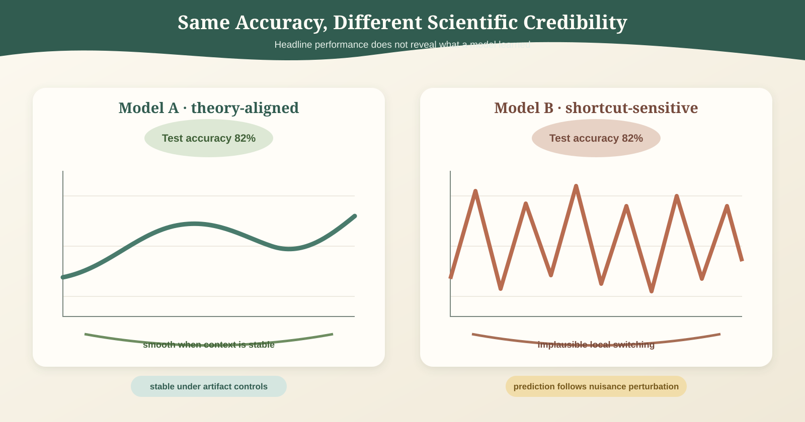
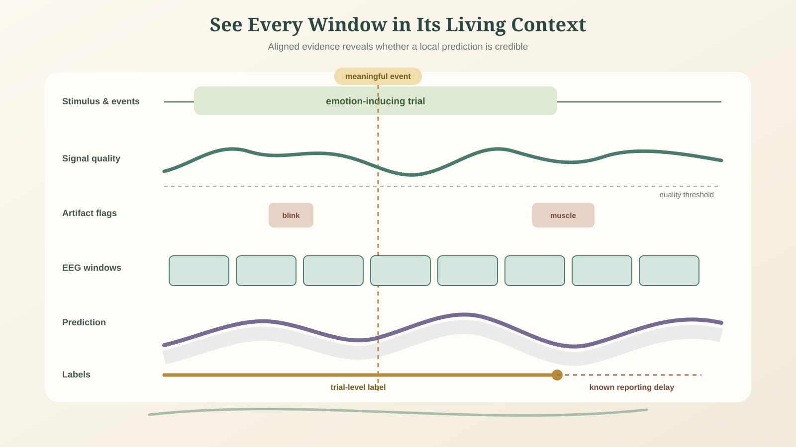
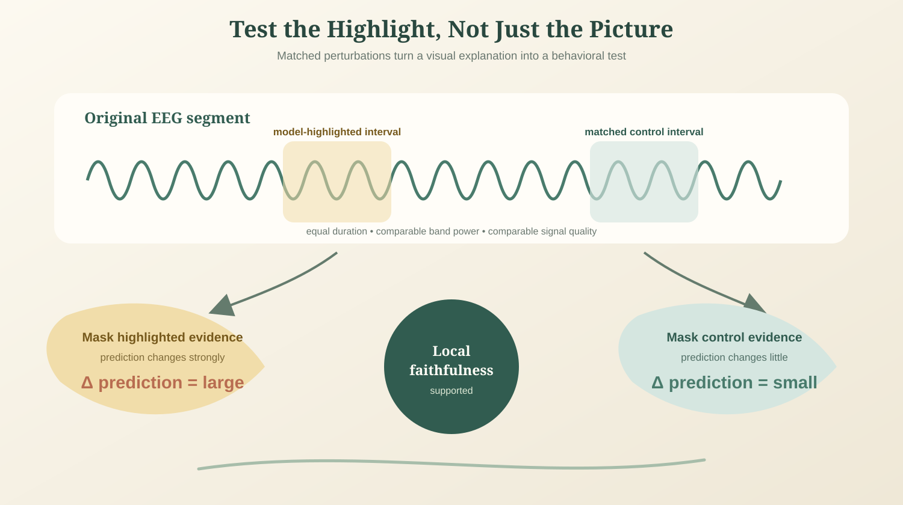
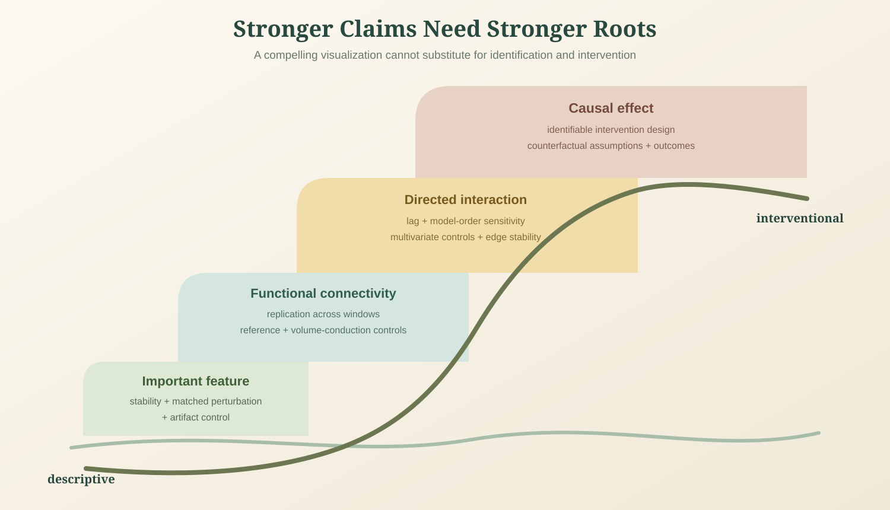
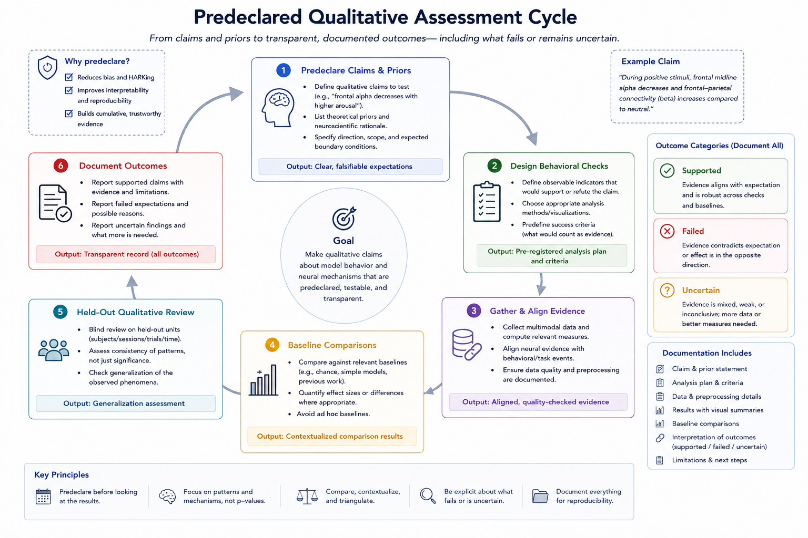

# Qualitative Assessment and Theory-Aligned Validation

Accuracy, macro F1, correlation, and uncertainty intervals are necessary for evaluating an affective EEG model, but they are not sufficient. Two models can achieve nearly identical scores while relying on very different evidence. One may use stable, task-relevant neural structure; another may exploit a stimulus artifact, recording order, subject identity, or a shortcut created by preprocessing. Aggregate metrics alone cannot distinguish these possibilities.

Qualitative assessment asks whether the model's behavior is credible when viewed through scientific, clinical, psychological, and deployment-oriented expectations. It does not replace quantitative testing with attractive visualizations or expert intuition. Instead, it turns domain priors into explicit behavioral checks that a model can pass, fail, or satisfy only under limited conditions.

*Figure 1. Equal headline accuracy can conceal fundamentally different prediction logic. A theory-aligned model follows a plausible trajectory and remains stable under artifact controls, whereas a shortcut-sensitive model produces implausible jumps and responds to nuisance perturbations.*

## From Score to Behavioral Claim

A metric summarizes agreement with a target under one evaluation protocol. It does not establish:

- which signal components influenced a prediction;
- whether the same evidence would work in a new session, subject, or context;
- whether the temporal trajectory is psychologically plausible;
- whether a learned graph or attention pattern has a stable interpretation;
- whether a prediction is driven by neural signal rather than stimulus, motion, or recording artifacts;
- or whether an intervention based on the prediction would be appropriate.

A theory-aligned evaluation therefore starts with a claim and a falsifiable behavioral expectation. If a model claims to track a continuous affective state, it should be checked for temporal continuity, bounded fluctuation, event sensitivity, and uncertainty during ambiguous periods. If it claims an interpretable or causal graph, its highlighted relations should be stable, survive controls, and respond predictably to relevant perturbations.

## Use Priors as Testable Expectations

Chapter 10's [Psychological Priors](../10-special-topics/01-psychological-priors.md) describes inertia, continuity, bounded variation, baseline regulation, sparse event-driven transitions, delayed self-report, and individual differences. These ideas should guide assessment, but they are soft expectations rather than universal constraints. A strong stimulus can produce a legitimate abrupt transition; a model should not be rewarded merely for being smooth.

| Prior or expectation | Qualitative question | Example evidence |
| --- | --- | --- |
| Emotion inertia and continuity | Do predictions change gradually when the recording contains no known transition? | Trajectory overlays with signal quality, events, and confidence |
| Sparse event-driven change | Does the model respond near meaningful stimuli or behavioral changes rather than at arbitrary times? | Event-aligned trajectories and change-point review |
| Bounded fluctuation | Are large moment-to-moment changes supported by evidence or dominated by noise? | Distribution of local trajectory changes and selected case studies |
| Subject-specific baseline | Does the model confuse a stable personal baseline with an affective change? | Within-subject baseline comparison across sessions |
| Delayed self-report | Does local EEG evidence align more plausibly with a delayed or aggregated label than with a naive trial-wide label? | Lag-sensitivity analysis with predeclared alignment hypotheses |

These checks should include counterexamples. Show cases where the prior does not hold, explain why, and determine whether the model correctly identifies an event or merely smooths disagreement away.

## Inspect Local Segments in Their Trial Context

A model can score well on windows that inherit a trial-level label while making locally implausible predictions. Chapter 10's [Local-Segment and Global-Trial Label Inconsistency](../10-special-topics/05-local-segment-and-global-trial-label-inconsistency.md) explains why this occurs: a final rating may summarize a long, changing episode rather than label every short window exactly.

Qualitative review should therefore display local predictions in their source context:

- the continuous EEG quality trace and artifact flags;
- stimulus, event, and task timeline;
- window boundaries and overlap;
- local predictions with confidence or uncertainty;
- trial-level and any continuous labels, including known annotation delay;
- and any preprocessing or channel exclusions applied to the segment.

A useful case set contains representative correct predictions, confident errors, uncertain cases, boundary cases, and examples from different subjects or sessions. Selecting only appealing successes is not qualitative evaluation; it is illustration. Predefine selection rules or sample cases systematically from performance strata.

*Figure 2. Local predictions should be reviewed inside their full trial context. Aligned tracks expose whether a change coincides with meaningful events, declining signal quality, artifacts, window boundaries, or delayed annotation.*

## Examine What the Model Uses

Attribution, attention, saliency, prototypes, counterfactual perturbations, and learned graph edges can generate hypotheses about model behavior. They should be treated as evidence to be tested, not as explanations by default.

For each explanation method, ask:

- Is the highlighted channel, band, time interval, or graph edge stable across seeds, folds, and nearby preprocessing choices?
- Does perturbing the highlighted evidence change the prediction more than perturbing matched control evidence?
- Does the model remain dependent on an explanation after controlling for signal quality, stimulus identity, and recording context?
- Is the explanation consistent with the input representation, or is it an artifact of a visualization method?

Paired perturbations are especially useful. For example, mask a model-highlighted alpha-band interval and a matched non-highlighted interval with equal duration and signal quality; compare the change in prediction. This tests local faithfulness rather than assuming that an attention weight or saliency map is causal.

*Figure 3. A visual explanation gains behavioral support when perturbing highlighted evidence changes the prediction more than perturbing a matched control interval. Equal duration and signal quality make the comparison informative.*

## Test Causal and Interpretability Claims

Chapter 10's [Causal Discovery, Inference, and Interpretable Learning](../10-special-topics/08-causal-discovery-inference-and-interpretable-learning.md) distinguishes directed predictive interaction from network mechanism and intervention effect. Qualitative assessment should retain this distinction.

A directed EEG graph or causal explanation deserves stronger scrutiny than an ordinary feature attribution. Review whether it is stable across time blocks, subjects, preprocessing choices, reference schemes, and model seeds; whether known common drivers or artifacts change the result; and whether it predicts the effect of a controlled perturbation. For claims about intervention, randomized or otherwise identifiable designs are needed. A visually compelling directed edge is not enough.

| Claim | Minimum qualitative validation |
| --- | --- |
| Important feature or channel | Stability, matched perturbation, and artifact control |
| Functional connectivity pattern | Replication across windows and sensitivity to reference and volume-conduction controls |
| Directed interaction | Lag/model-order sensitivity, multivariate controls, and edge stability |
| Causal effect | Intervention design, counterfactual assumptions, and outcome measurement |
| Causality-preserving distillation | Student and teacher agreement under shift or controlled perturbation, not only in-distribution logits |

*Figure 4. Validation burden rises with claim strength. Feature importance requires stability and perturbation tests; connectivity and directionality require additional controls; causal effects require an identifiable intervention design and explicit counterfactual assumptions.*

## Assess Emotion-Space Consistency

Chapter 10's [Structured Geometry of Emotion Spaces](../10-special-topics/09-structured-geometry-of-emotion-spaces.md) argues that continuous affect may have nonuniform geometry and discrete emotions may form a graph rather than unrelated labels. This creates additional qualitative checks.

For continuous predictions, inspect whether trajectories follow plausible neighborhoods in the declared emotion space. When a model moves between distant states, determine whether a relevant event, uncertainty increase, or contextual change supports the move. For a curved manifold, compare geodesic neighborhoods and trajectories with a Euclidean baseline rather than interpreting a curved embedding by appearance alone.

For discrete predictions, inspect confusion and transition patterns against the declared label graph. Confusing nearby or overlapping states may be less concerning than confusing distant or opposed states, but that depends on the task and graph definition. Curvature, communities, or hierarchical label relations are useful only if they are stable across held-out data and improve a predeclared behavior, such as fine-grained recall or transition consistency.

## Include Clinical and Psychological Expertise Carefully

Domain experts can identify implausible patterns, missing confounders, or unsafe interpretations that generic metrics overlook. Their role is most reliable when the review protocol is structured:

- define questions before showing model outputs;
- blind reviewers to model identity or performance when possible;
- collect independent ratings from more than one qualified reviewer;
- record disagreements rather than forcing consensus;
- and distinguish a clinical plausibility judgment from evidence of causal mechanism or diagnostic validity.

For clinical or assistive applications, include intended users and practitioners in reviewing failure cases, feedback burden, and whether model behavior supports rather than obstructs real workflow. An accurate passive estimate can still be unhelpful or harmful if an interface responds at the wrong time or in a way users cannot correct.

## Design a Qualitative Assessment Protocol

A practical protocol can be built alongside quantitative evaluation:

1. State the model's scientific, clinical, or deployment claims and the priors relevant to each claim.
2. Define behavioral checks, counterfactual perturbations, and case-selection strata before final testing.
3. Generate aligned views of signal quality, context, predictions, confidence, labels, and explanations for held-out data.
4. Compare the model with theory-agnostic, context-only, and appropriate structured-prior baselines.
5. Review successes, failures, and disagreement cases across independent subjects, sessions, and conditions.
6. Document which expectations held, which failed, and which remain uncertain rather than converting all observations into post hoc stories.

This protocol is especially important when a model may influence a person through feedback, adaptation, or clinical decision support. Qualitative evidence can reveal whether a numerically strong model behaves in a manner that is intelligible and safe enough to justify further use.

*Figure 5. A predeclared qualitative assessment cycle links claims and priors to behavioral checks, aligned evidence, baseline comparisons, held-out review, and documented outcomes—including expectations that fail or remain uncertain.*

## Reporting Checklist

Alongside F1, accuracy, correlation, and confidence intervals, report:

- the priors and real-world claims selected for qualitative assessment;
- the held-out case-selection method and number of cases reviewed;
- plots or summaries showing predictions with signal quality, context, labels, and uncertainty;
- explanation stability across seeds, splits, and preprocessing variants;
- results of matched perturbation, artifact, and confound controls;
- deviations from temporal, geometric, or causal expectations and the proposed interpretation;
- expert or user review procedure, disagreements, and limits of expertise;
- and a clear separation between observed behavior, plausible hypothesis, and causal conclusion.

Qualitative assessment does not make a model trustworthy by declaration. It makes the reasons for trust, doubt, and further testing visible. In affective EEG, that visibility is essential because the target is human experience, the signals are indirect, and similar numerical scores can conceal fundamentally different prediction logic.

## References

- Doshi-Velez, F., and Kim, B. (2017). Towards a rigorous science of interpretable machine learning. arXiv:1702.08608.
- Rudin, C. (2019). Stop explaining black box machine learning models for high stakes decisions and use interpretable models instead. Nature Machine Intelligence, 1, 206-215.
- Kuppens, P., Allen, N. B., and Sheeber, L. B. (2010). Emotional inertia and psychological maladjustment. Psychological Science, 21(7), 984-991.
- Pearl, J. (2009). Causality: Models, Reasoning, and Inference. Cambridge University Press.
- Lipton, Z. C. (2018). The mythos of model interpretability. Communications of the ACM, 61(10), 36-43.
