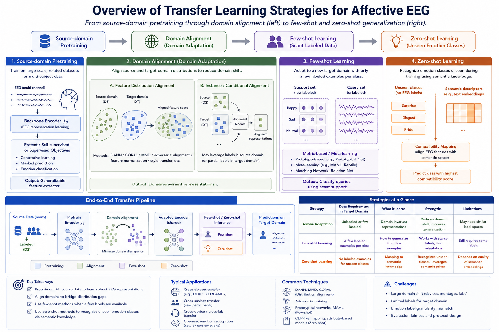
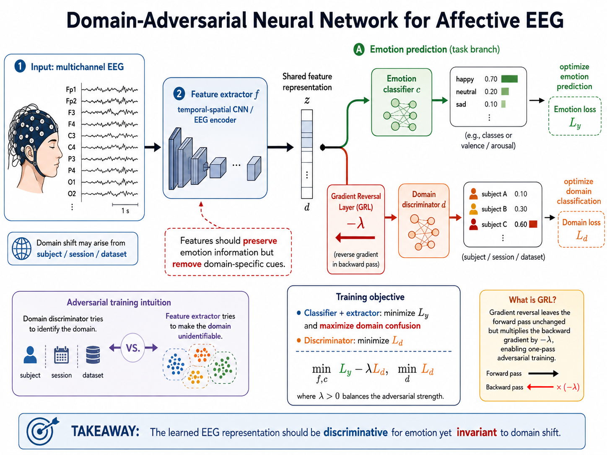
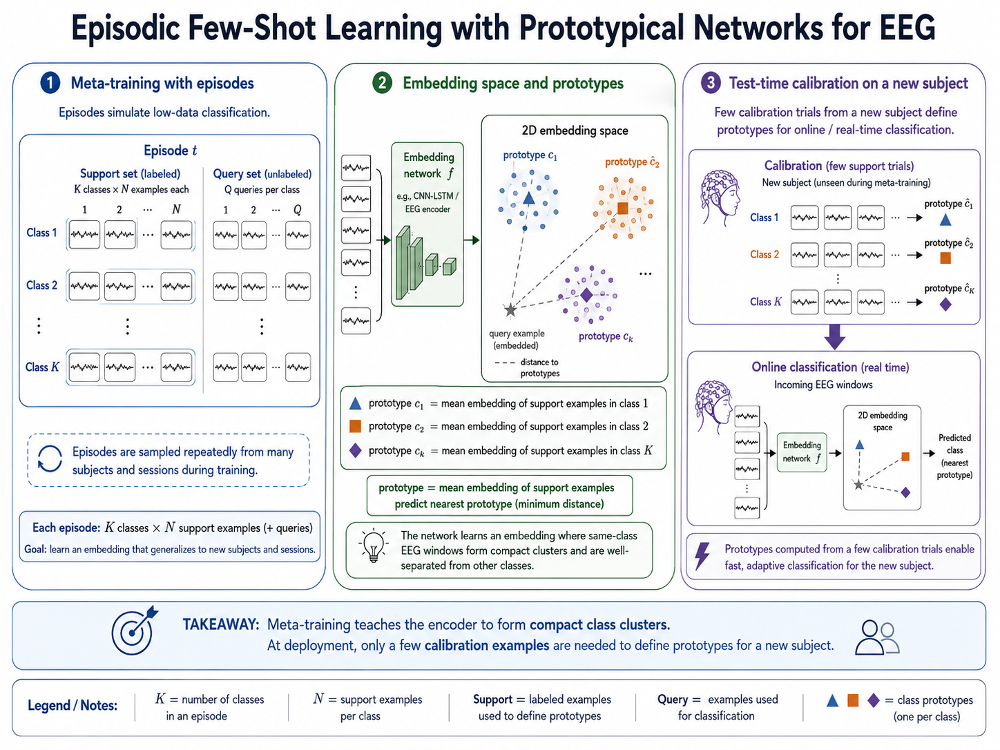
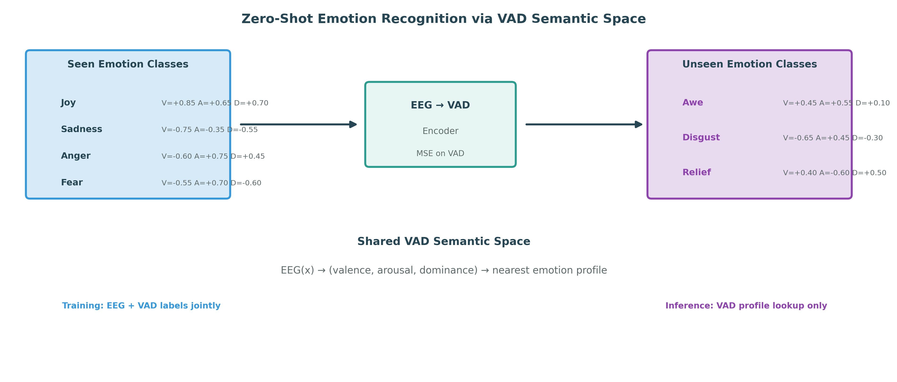
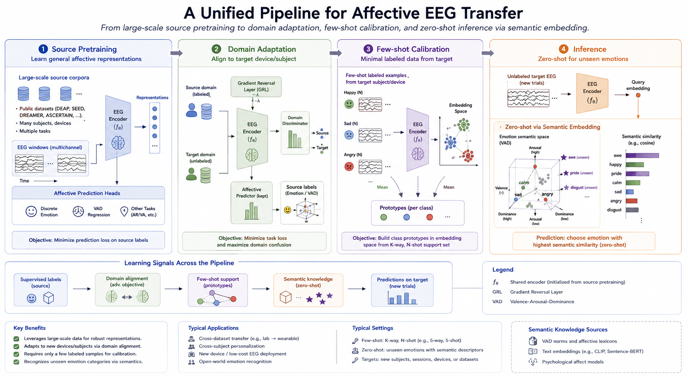

# Transfer Learning and Few/Zero-Shot Learning

A well-trained affective EEG model on one dataset rarely transfers seamlessly to another subject, session, device, or population. Individual neurophysiology, electrode placement, recording environment, and emotional expression all shift the data distribution in ways that violate the standard i.i.d. assumption. Transfer learning and its more extreme relatives—few-shot and zero-shot learning—address this brittleness by reusing knowledge across domains, tasks, or label budgets.

This section covers the three interconnected paradigms that are most relevant when labeled data from the target condition are scarce or absent: **domain adaptation** (aligning distributions), **few-shot learning** (learning from a handful of labeled examples), and **zero-shot learning** (recognizing unseen classes without any labeled instances). We treat them together because in affective EEG they are often combined: a model may first adapt its feature space across subjects via domain adaptation, then classify a new emotion category from only three calibration trials via few-shot inference.

### Recent Unified Representation Learning: EMOD

Recent work also shows that transfer can be addressed before target-specific adaptation by pretraining one representation across heterogeneous affective-EEG datasets. **EMOD** (Chen et al., 2026) maps discrete and continuous emotion annotations into a shared valence–arousal (V–A) space and uses a soft-weighted supervised contrastive objective: samples with emotionally similar V–A labels are encouraged to lie nearby even when their original dataset-specific labels differ. Its Triple-Domain Encoder and Spatial-Temporal Transformer are designed to accommodate variation in temporal, spectral, spatial, and dataset-format structure. The study pretrains on eight public datasets and reports evaluation on three benchmarks, making it a useful recent example of label-semantic alignment coupled with cross-dataset representation learning.

EMOD is especially relevant when source and target datasets use different emotion taxonomies or a mixture of discrete and dimensional annotations—the setting in which label identity alone is an inadequate transfer signal. Its V–A geometry can be viewed as a softer alternative to forcing one-to-one label correspondence; it also suggests a natural initialization for the domain adaptation and few-shot calibration procedures discussed below. Because its broad pretraining and reusable encoder are foundation-model-adjacent rather than simply dataset-specific transfer, see [Chapter 10, Section 03: EEG Foundation Models](../10-special-topics/03-eeg-foundation-models.md) for the broader design criteria, adaptation mechanisms, and limitations of EEG foundation models.

*Figure 1. Transfer learning for affective EEG spans a spectrum from full source-domain supervision (left) to target-domain generalization with few or no labels (right). Domain adaptation aligns feature distributions; few-shot learning classifies from scant examples; zero-shot learning recognizes unseen emotion classes through semantic descriptors.*

---

## Why Transfer Is Necessary in Affective EEG

The standard supervised pipeline assumes that training and test data are drawn from the same distribution $p(x, y)$. This assumption is routinely violated in EEG-based affective computing for several reasons:

- **Cross-subject variability**: Each individual's EEG signature of the same emotion differs in topography, power, and temporal dynamics due to skull thickness, cortical folding, baseline arousal, and trait affectivity.
- **Session drift**: Impedance changes, electrode gel degradation, fatigue, circadian rhythm, and habituation all shift the distribution within a single participant over time.
- **Device and montage mismatch**: Consumer headsets differ from research-grade amplifiers in channel count, sampling rate, reference electrode, and noise profile.
- **Cultural and contextual differences**: Emotion expression and elicitation vary across cultures, experimental paradigms, and stimulus modalities.
- **Dataset size imbalance**: A target dataset may contain only 5–15 subjects with limited trials, while publicly available corpora like DEAP, SEED, or DREAMER offer larger but distributionally distinct source data.

Transfer learning provides a principled framework for leveraging these larger source datasets to improve performance on a smaller, distributionally shifted target.

---

## Domain Adaptation

Domain adaptation aligns the feature distributions of a labeled source domain $\mathcal{D}_S = \{(x_i^S, y_i^S)\}_{i=1}^{n_S}$ and an unlabeled or sparsely labeled target domain $\mathcal{D}_T = \{(x_j^T)\}_{j=1}^{n_T}$ (optionally with a few labels $y_j^T$). The goal is a predictor that performs well on the target despite the distribution shift $p_S(x, y) \neq p_T(x, y)$.

### Discrepancy-Based Methods

Discrepancy-based methods minimize an explicit distribution distance between source and target feature representations. Let $\phi(\cdot)$ be a feature extractor shared across domains. The total loss combines a source classification term with a distribution-matching regularizer:

$$
\mathcal{L} = \frac{1}{n_S}\sum_{i=1}^{n_S} \ell\big(f(\phi(x_i^S)), y_i^S\big) \;+\; \lambda \cdot d\big(\Phi_S, \Phi_T\big)
$$

where $\Phi_S = \{\phi(x_i^S)\}$ and $\Phi_T = \{\phi(x_j^T)\}$.

**Maximum Mean Discrepancy (MMD).** MMD measures the distance between mean embeddings of two distributions in a reproducing kernel Hilbert space (RKHS):

$$
\operatorname{MMD}^2(\Phi_S, \Phi_T) = \left\| \frac{1}{n_S}\sum_{i=1}^{n_S} \psi(\phi(x_i^S)) - \frac{1}{n_T}\sum_{j=1}^{n_T} \psi(\phi(x_j^T)) \right\|_{\mathcal{H}}^2
$$

where $\psi$ is a kernel mapping (typically Gaussian RBF). MMD is widely used in EEG domain adaptation because it is nonparametric, differentiable, and can be applied to single-layer or multi-layer representations. The Deep Coral and Deep MMD variants apply it to activations at multiple network depths.

**CORrelation ALignment (CORAL).** CORAL aligns the second-order statistics of source and target features without kernel selection:

$$
\mathcal{L}_{\text{CORAL}} = \frac{1}{4d^2} \left\| C_S - C_T \right\|_F^2
$$

where $C_S$ and $C_T$ are the $d \times d$ covariance matrices of $\Phi_S$ and $\Phi_T$. CORAL is computationally lighter than MMD and is effective when covariance shift dominates.

**Central Moment Discrepancy (CMD).** CMD extends the idea to higher-order moments, matching means, covariances, and beyond, which can capture more subtle distribution differences in EEG feature spaces.

| Discrepancy method | What it aligns | Computational cost | Typical EEG use |
| --- | --- | --- | --- |
| MMD | Kernel mean embedding | $\mathcal{O}(n^2)$ | Cross-subject, cross-session |
| CORAL | Covariance (2nd moment) | $\mathcal{O}(d^2)$ | Cross-device, subject adaptation |
| CMD | Higher-order moments | $\mathcal{O}(n)$ per moment order | Fine-grained session alignment |

### Adversarial Domain Adaptation

Adversarial methods frame domain alignment as a minimax game between a feature extractor $\phi$ and a domain discriminator $D$:

$$
\min_\phi \max_D \; \mathcal{L}_{\text{cls}} - \lambda \cdot \left(\mathbb{E}_{x \sim \mathcal{D}_S}\big[\log D(\phi(x))\big] + \mathbb{E}_{x \sim \mathcal{D}_T}\big[\log(1 - D(\phi(x)))\big]\right)
$$

The discriminator is trained to identify which domain a feature vector comes from; the feature extractor is trained simultaneously to maximize classification accuracy while *fooling* the discriminator. At equilibrium, features from both domains become indistinguishable to $D$, implying distributional alignment.

**Gradient Reversal Layer (GRL).** The original DANN (Domain-Adversarial Neural Network) implements this with a gradient reversal layer that flips the sign of gradients flowing from $D$ to $\phi$ during backpropagation, enabling end-to-end training in a single forward-backward pass.

**Domain-Adversarial Adaptation for EEG.** In affective EEG, the discriminator is typically trained to distinguish subjects, sessions, or datasets. The feature extractor can be a CNN, an LSTM, or a GNN, and the classifier and discriminator share the same feature backbone.

*Figure 2. Domain-adversarial neural network adapted for affective EEG. The feature extractor (e.g., a temporal-spatial CNN) produces representations that must (a) predict the emotion label accurately via the classifier head and (b) make the domain (subject/session/dataset) unidentifiable to the discriminator. The gradient reversal layer enables one-pass training.*

**Wasserstein Distance and Optimal Transport.** Instead of adversarial confusion, some works use the Wasserstein distance or entropic optimal transport to align source and target feature distributions. These methods are particularly attractive for EEG because they respect the geometry of the feature space and can incorporate spatial (electrode) structure into the transport cost.

### Practical Guidelines for EEG Domain Adaptation

1. **Align per-layer or per-block.** Deep features at different layers capture different levels of abstraction. Early layers encode device-specific spectral patterns; later layers encode semantic affect representations. Aligning only the penultimate layer is common but often insufficient for large domain gaps.
2. **Choose the domain definition carefully.** The discriminator target should reflect the intended generalization claim. Discriminating subjects is standard for subject-independent evaluation; discriminating datasets is appropriate for cross-corpus transfer.
3. **Tune the adaptation weight $\lambda$.** Too little adaptation leaves the domain gap open; too much adaptation can collapse emotion-discriminative structure. Use target validation data (without labels) to tune $\lambda$, or adopt an annealing schedule that increases $\lambda$ over training.
4. **Watch for negative transfer.** When the source and target domains are too dissimilar, transfer can hurt target performance relative to training from scratch on the target alone. Always report a target-only baseline.
5. **Semi-supervised adaptation.** When a small number of target labels are available, combine domain-adversarial or discrepancy losses with supervised fine-tuning on the available target examples. This often yields the best practical results.

---

## Few-Shot Learning

Few-shot learning addresses the scenario where the target domain provides only $K$ labeled examples per class (the $K$-way $N$-shot setting). In affective EEG, this arises naturally: after a short calibration session with $N$ trials per emotion category, the model should classify subsequent trials from the same subject or a new subject.

### Metric-Based Few-Shot Learning

Metric-based methods learn an embedding space where classification reduces to comparing distances to labeled exemplars.

**Prototypical Networks.** For each class $k$, compute a prototype $\mathbf{c}_k$ as the mean embedding of its $N$ support examples:

$$
\mathbf{c}_k = \frac{1}{N} \sum_{i: y_i = k} \phi(x_i)
$$

A query example $x_q$ is classified by softmax over negative squared Euclidean distances to prototypes:

$$
p(y_q = k \mid x_q) = \frac{\exp\big(-\|\phi(x_q) - \mathbf{c}_k\|^2\big)}{\sum_{k'} \exp\big(-\|\phi(x_q) - \mathbf{c}_{k'}\|^2\big)}
$$

Training uses episodic sampling: each episode draws a random subset of classes and examples to mimic the few-shot test scenario. This meta-training regime teaches the embedding $\phi$ to produce well-separated class clusters.

**Matching Networks.** Matching networks extend this idea with an attention mechanism over support examples, computing a weighted combination rather than a single prototype. The attention kernel is typically cosine similarity with a learned scale factor.

**Relation Networks.** Instead of a fixed distance metric, relation networks learn a *relation module* $g$ that takes a concatenated query–support pair and outputs a scalar relation score. This can capture nonlinear class boundaries that Euclidean distance misses.

*Figure 3. Episodic few-shot learning with prototypical networks for EEG. During meta-training, episodes sample $K$ classes each with $N$ support examples. The embedding network (e.g., a CNN-LSTM) maps EEG windows to a space where each class forms a compact cluster around its prototype. At test time, a new subject's few calibration trials define prototypes for real-time classification.*

### Optimization-Based Few-Shot Learning

**MAML (Model-Agnostic Meta-Learning).** MAML learns an initialization $\theta$ such that a small number of gradient steps on new task data produces a good task-specific model. The meta-objective is:

$$
\min_\theta \sum_{\mathcal{T}_i \sim p(\mathcal{T})} \mathcal{L}_{\mathcal{T}_i}\big(\theta - \alpha \nabla_\theta \mathcal{L}_{\mathcal{T}_i}(\theta)\big)
$$

where each task $\mathcal{T}_i$ is a subject or session. The inner loop adapts $\theta$ to the task with one or few gradient steps; the outer loop optimizes the initialization so that adaptation is effective across tasks.

**Reptile.** A simpler alternative to MAML, Reptile repeatedly samples a task $\mathcal{T}_i$, performs $k$ steps of SGD on it, and moves the initialization toward the resulting parameters:

$$
\theta \leftarrow \theta + \beta \cdot (\theta_i^{(k)} - \theta)
$$

Reptile avoids second-derivative computation, making it more practical for large EEG models.

### Few-Shot Domain Adaptation for EEG

In practice, few-shot learning and domain adaptation are often combined for cross-subject affective EEG:

1. **Pretrain** an encoder on a large multi-subject source corpus via supervised or self-supervised learning.
2. **Adapt** the encoder to the target subject via domain-adversarial training or MMD on unlabeled target data.
3. **Fine-tune** with the few available labeled calibration trials using prototypical or MAML-style adaptation.

| Few-shot approach | Strengths for EEG | Limitations |
| --- | --- | --- |
| Prototypical networks | Simple, fast inference, interpretable prototypes | Assumes unimodal class clusters |
| Matching networks | Attention over support, flexible | Slower at inference, needs more support examples |
| Relation networks | Learned nonlinear metric, powerful | More parameters, risk of overfitting on small EEG datasets |
| MAML | Model-agnostic, works with any architecture | Second-order gradients are expensive; sensitive to learning rate |
| Reptile | First-order only, scalable | May be less sample-efficient than MAML |

---

## Zero-Shot Learning

Zero-shot learning (ZSL) classifies instances from classes that were never seen during training. In affective EEG, this could mean recognizing an emotion category (e.g., "nostalgia," "awe") that was absent from the training set, or classifying a subject whose data were entirely held out from both training and adaptation.

### Semantic Embedding Approaches

ZSL bridges seen and unseen classes through a shared semantic space. Each class $k$ is described by a semantic vector $\mathbf{a}_k$ (attributes, word embeddings, or expert annotations). The model learns a compatibility function $s(x, \mathbf{a})$ that scores how well an EEG instance matches a class description.

During training, the model sees pairs $(x_i, \mathbf{a}_{y_i})$ for seen classes only. At test time, given an unseen class with descriptor $\mathbf{a}_{\text{unseen}}$, classification selects:

$$
\hat{y} = \arg\max_k \; s(x, \mathbf{a}_k)
$$

**Attribute-Based ZSL for Emotion.** Emotion categories can be described by their coordinates in the valence-arousal-dominance (VAD) space, by appraisal dimensions (novelty, goal-relevance, coping-potential), or by linguistic embeddings (GloVe, BERT) of the emotion word. For example:

- "Joy": valence $= 0.85$, arousal $= 0.65$, dominance $= 0.70$
- "Sadness": valence $= -0.75$, arousal $= -0.35$, dominance $= -0.55$
- "Anger": valence $= -0.60$, arousal $= 0.75$, dominance $= 0.45$

An EEG encoder trained to predict VAD coordinates from brain signals can, in principle, recognize *any* emotion whose VAD profile is known, even if that emotion never appeared in the training data.

*Figure 4. Zero-shot emotion recognition through a shared valence-arousal-dominance semantic space. An EEG encoder is trained to predict VAD coordinates from brain signals using seen emotion classes. At test time, an unseen emotion (e.g., "awe") is recognized by comparing the predicted VAD coordinates to its known semantic profile.*

### Generalized Zero-Shot Learning

In the more realistic *generalized* ZSL setting, test instances may belong to either seen or unseen classes. This is harder because models tend to be biased toward seen classes. Calibration methods (e.g., reducing seen-class logits by a learned constant) or generative methods (synthesizing features for unseen classes) can mitigate this bias.

### EEG-Specific Challenges for Zero-Shot Learning

1. **Semantic granularity**: VAD coordinates are continuous, but emotion categories are discrete labels projected onto a continuous space. The mapping is lossy, and nearby coordinates may correspond to subtly different emotions.
2. **Hubness**: In high-dimensional embedding spaces, some vectors become "hubs" that are nearest neighbors to many queries, degrading ZSL accuracy. Normalization and hubness-reduction techniques help.
3. **Cross-subject zero-shot**: Recognizing an unseen subject's emotions without any calibration data is an extreme form of ZSL. Semantic grounding through VAD or linguistic embeddings provides one path, but subject-specific baselines remain a major source of variance.

---

## Combining Transfer, Few-Shot, and Zero-Shot Learning

In real affective EEG deployments, these paradigms are rarely used in isolation. A typical pipeline might look like:

1. **Pretraining**: Train a large encoder on SEED, DEAP, and DREAMER with supervised and self-supervised objectives.
2. **Domain adaptation**: Adapt the encoder to a new consumer headset using CORAL or domain-adversarial training on unlabeled recordings from the target device.
3. **Few-shot calibration**: Collect 3–5 trials per emotion category from a new user. Use prototypical networks or MAML to fine-tune a lightweight classifier head.
4. **Zero-shot extension**: For emotion categories not covered in calibration, fall back to VAD-coordinate-based zero-shot inference.

*Figure 5. A unified pipeline for affective EEG transfer. Source pretraining on large corpora is followed by domain adaptation to the target device/subject, few-shot calibration from minimal labeled examples, and zero-shot inference for unseen emotion categories via semantic embedding.*

### The Cross-Subject Generalization Spectrum

| Setting | Target labels available | Typical approach | Key challenge |
| --- | --- | --- | --- |
| Full supervision | All target labels | Supervised training or fine-tuning | Label cost and subject burden |
| Domain adaptation | None (unsupervised) | MMD, CORAL, adversarial alignment | Negative transfer when domains differ too much |
| Semi-supervised adaptation | $\sim$10–30% of target labels | Adversarial + supervised loss | Selecting which examples to label |
| Few-shot | $N$ per class ($N \leq 10$) | Prototypical, MAML, fine-tuning | Episode design and overfitting |
| One-shot | 1 per class | Siamese, matching, MAML | Extreme variance across single exemplars |
| Zero-shot | 0 per class | Semantic embedding (VAD, language) | Semantic gap and hubness |

---

## Evaluation Protocols for Transfer and Few-Shot Learning

### Leakage Controls

Transfer learning introduces new leakage paths beyond standard train-test splits:

- **Source-target contamination**: Test subjects' data must not appear in source pretraining, domain-adaptation statistics, or prototype computation unless the protocol explicitly allows transductive or semi-supervised access.
- **Episode construction**: In meta-learning, episodes must be constructed within the training meta-set only. Test classes or subjects must be held out from all episode sampling.
- **Semantic descriptor leakage**: For ZSL, unseen-class descriptors (VAD coordinates, word vectors) may be used to construct the compatibility function but must not be used to train or tune the encoder on labeled instances of those classes.

### Recommended Baselines

Every transfer or few-shot paper on affective EEG should report:

1. **Source-only**: Train on source, evaluate on target with no adaptation.
2. **Target-only (oracle)**: Train on the full target labeled set (upper bound).
3. **Random features + classifier**: A simple baseline (e.g., FFT features + SVM) trained on target labeled data.
4. **Fine-tuning**: Pretrain on source, fine-tune all layers on available target labels.
5. **The proposed method**.

### Metrics Beyond Accuracy

- **Adaptation gain**: $\text{Acc}_{\text{adapted}} - \text{Acc}_{\text{source-only}}$
- **Few-shot learning curves**: Accuracy as a function of $N$ (shots per class)
- **Generalized ZSL harmonic mean**: $H = 2 \cdot \frac{\text{Acc}_{\text{seen}} \cdot \text{Acc}_{\text{unseen}}}{\text{Acc}_{\text{seen}} + \text{Acc}_{\text{unseen}}}$
- **Per-subject variance**: Report standard deviation across subjects, not just the mean

---

## Practical Recommendations

1. **Start with discrepancy-based adaptation before adversarial.** CORAL and MMD are simpler to tune, more stable, and often perform competitively with adversarial methods on EEG data.
2. **Leverage self-supervised pretraining as initialization.** A model pretrained with masked reconstruction or contrastive learning on large EEG corpora provides a stronger starting point for both domain adaptation and few-shot fine-tuning than random initialization.
   When emotion datasets use incompatible label schemes, a label-aware shared semantic space—such as V–A-guided contrastive pretraining in EMOD—can complement self-supervision by retaining graded relationships among emotions rather than treating all class mismatches as equally unrelated.
3. **Use episodic training for few-shot even during pretraining.** Training a prototypical or matching network on the source dataset in an episodic manner prepares the embedding for few-shot transfer better than standard supervised pretraining.
4. **Validate the semantic space for ZSL.** Before deploying ZSL, verify that the chosen semantic space (VAD, word embeddings, expert attributes) separates unseen classes in a way that is consistent with expert knowledge and pilot behavioral data.
5. **Report negative transfer.** When transfer hurts, say so. Understanding when and why transfer fails is as valuable as demonstrating when it succeeds.
6. **Combine paradigms pragmatically.** A simple pipeline of CORAL adaptation + prototypical few-shot fine-tuning often outperforms more complex unified frameworks in practice.

---

## References

- Ben-David, S., Blitzer, J., Crammer, K., and Pereira, F. (2010). A theory of learning from different domains. *Machine Learning*, 79(1–2), 151–175.
- Ganin, Y., Ustinova, E., Ajakan, H., Germain, P., Larochelle, H., Laviolette, F., Marchand, M., and Lempitsky, V. (2016). Domain-adversarial training of neural networks. *Journal of Machine Learning Research*, 17(1), 2096–2030.
- Snell, J., Swersky, K., and Zemel, R. (2017). Prototypical networks for few-shot learning. *Advances in Neural Information Processing Systems*, 30.
- Finn, C., Abbeel, P., and Levine, S. (2017). Model-agnostic meta-learning for fast adaptation of deep networks. *Proceedings of the 34th International Conference on Machine Learning*, 1126–1135.
- Sun, B., Feng, J., and Saenko, K. (2016). Return of frustratingly easy domain adaptation. *Proceedings of the AAAI Conference on Artificial Intelligence*, 30(1).
- Long, M., Cao, Y., Wang, J., and Jordan, M. I. (2015). Learning transferable features with deep adaptation networks. *Proceedings of the 32nd International Conference on Machine Learning*, 97–105.
- Li, J., Qiu, S., Shen, Y., Liu, C., and He, H. (2020). Multisource transfer learning for cross-subject EEG emotion recognition. *IEEE Transactions on Cybernetics*, 50(7), 3281–3293.
- Zheng, W. L., and Lu, B. L. (2016). Personalizing EEG-based affective models with transfer learning. *Proceedings of the 25th International Joint Conference on Artificial Intelligence*, 2732–2738.
- Lan, Z., Sourina, O., Wang, L., Scherer, R., and Müller-Putz, G. R. (2018). Domain adaptation techniques for EEG-based emotion recognition: A comparative study on two public datasets. *IEEE Transactions on Cognitive and Developmental Systems*, 11(1), 85–94.
- Chen, Y., Zhao, S., Li, S., & Pan, G. (2026). EMOD: A unified EEG emotion representation framework leveraging V-A guided contrastive learning. *Proceedings of the AAAI Conference on Artificial Intelligence, 40*(21), 17427–17435. https://doi.org/10.1609/aaai.v40i21.38796
- Vanschoren, J. (2018). Meta-learning: A survey. *arXiv preprint arXiv:1810.03548*.
- Xian, Y., Schiele, B., and Akata, Z. (2017). Zero-shot learning—the good, the bad, and the ugly. *Proceedings of the IEEE Conference on Computer Vision and Pattern Recognition*, 4582–4591.
- Nicholson, A. M., and Goh, S. K. (2019). A survey of zero-shot learning: Settings, methods, and applications. *ACM Transactions on Intelligent Systems and Technology*, 10(2), 1–35.
