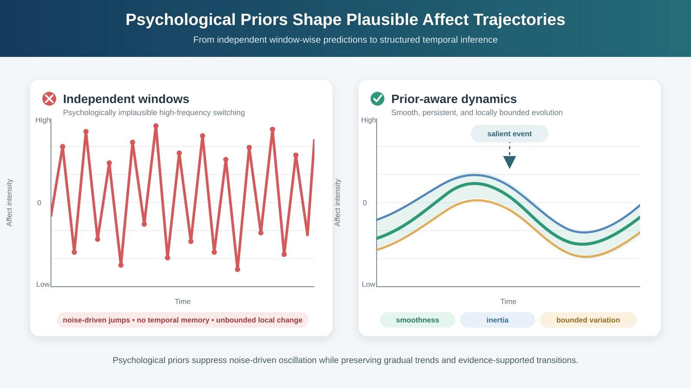
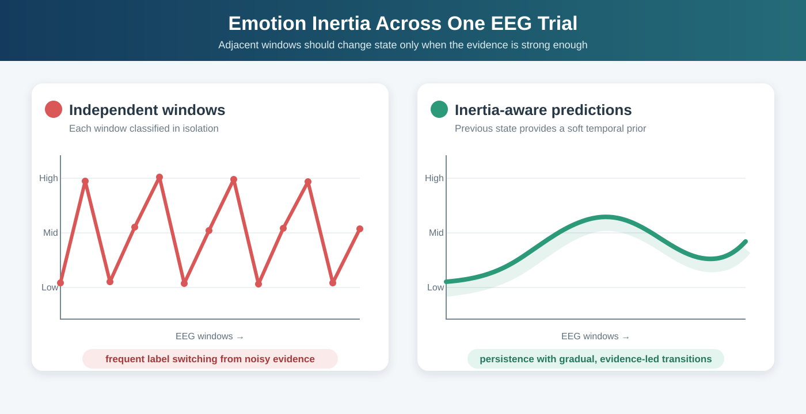
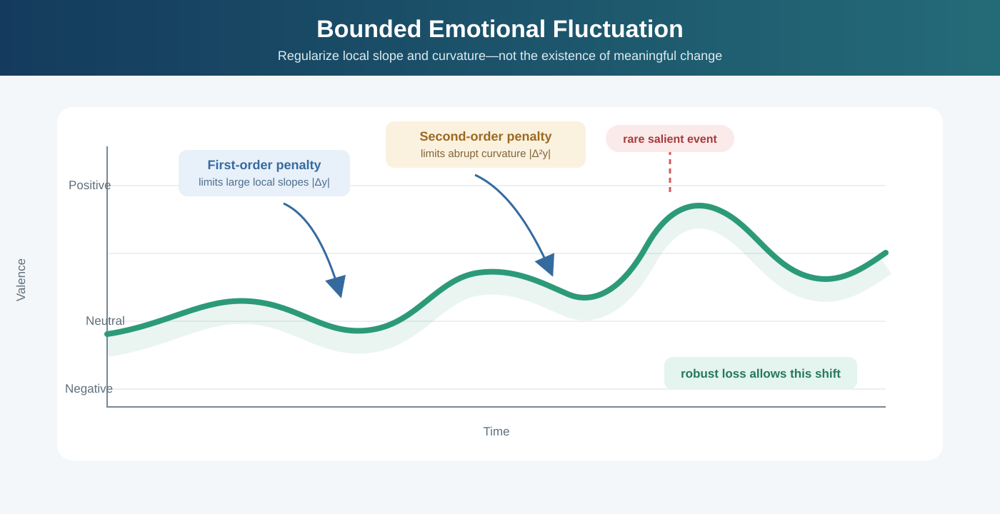
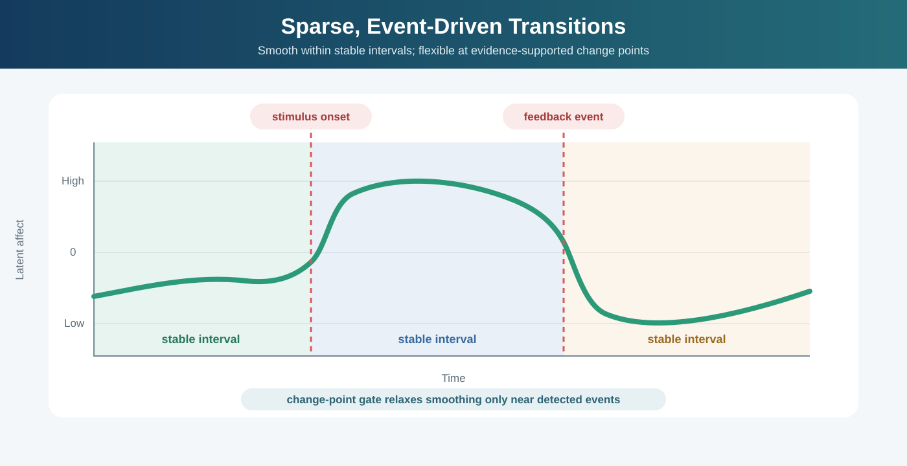
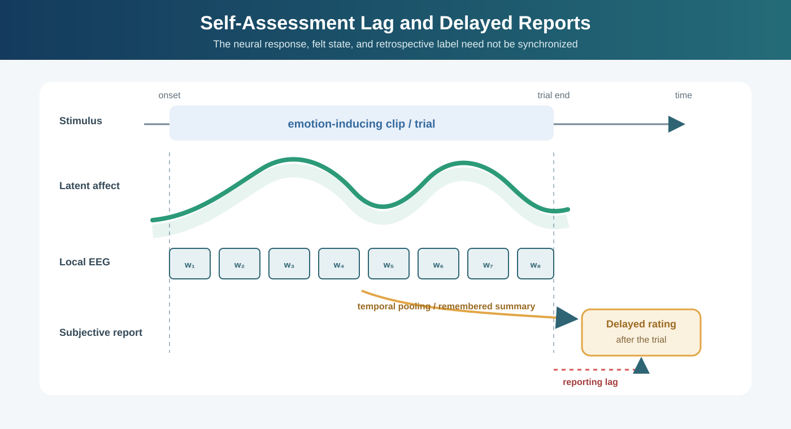
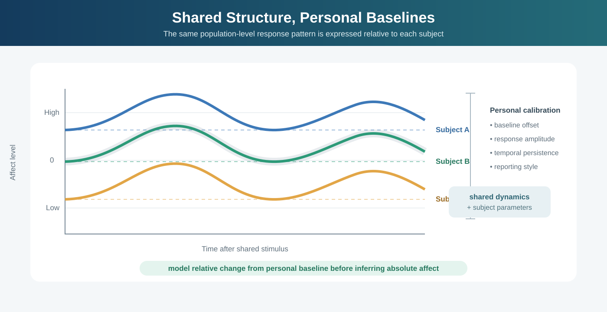
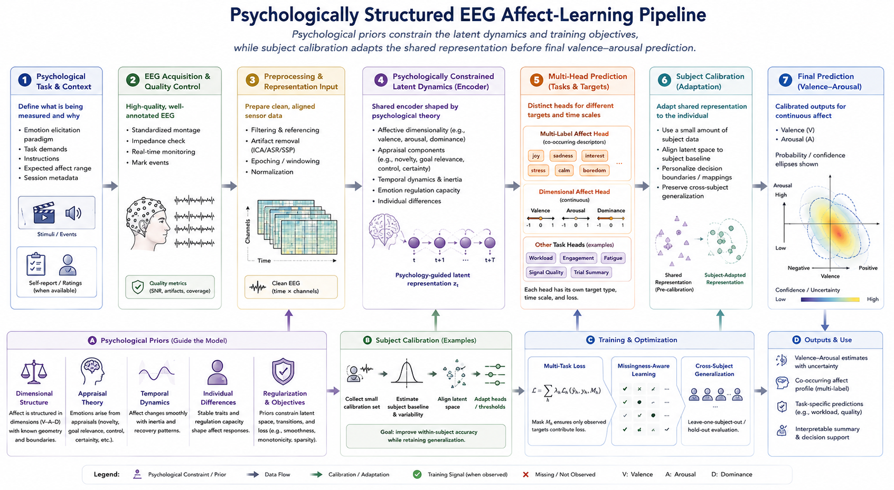

# Psychological Priors for EEG-Based Affective Learning

Purely data-driven affect recognition often treats each time window as an almost independent pattern-classification problem. That simplification is convenient, but it clashes with basic psychological observations about how emotions evolve: affect usually persists for some time, changes are typically gradual rather than arbitrary, large swings are possible but uncommon, and the same stimulus can induce systematically different trajectories across subjects. These regularities can be treated as psychological priors. In practice, they can be embedded into EEG learning systems through temporal regularization, latent-state models, constrained decoding, structured losses, and subject-adaptive components.

This section summarizes several useful priors and the kinds of modeling choices they motivate.

*Figure 1. Psychological priors transform independent, noise-sensitive window-wise predictions into temporally coherent affect trajectories. Smoothness and inertia discourage rapid label switching, while bounded variation limits local changes without preventing evidence-supported transitions.*

## Emotion Inertia

Emotion inertia refers to the tendency of affective states to persist over time. In experience-sampling and clinical psychology, high inertia means that the current affective state is strongly predicted by the immediately preceding state. For EEG-based affect modeling, this implies that adjacent windows should not be treated as statistically independent labels unless the task explicitly focuses on abrupt event-triggered transitions.

This prior can be embedded in several ways:

- Add temporal smoothness penalties on the latent affect trajectory or on consecutive predictions.
- Use recurrent, state-space, or temporal-convolutional architectures that explicitly model carry-over from previous states.
- Decode frame-level predictions with a Hidden Markov Model, Conditional Random Field, or Viterbi-style smoothing step.
- Penalize rapid label switching unless there is strong evidence in the signal.

The main caveat is that inertia should be modeled as a soft prior rather than a hard rule. Some paradigms intentionally elicit sharp changes, and overly strong inertia can smear onset dynamics and reduce sensitivity to salient events.

*Figure 2. Independent window-wise classification can produce rapid noise-driven label switching. An inertia-aware model treats the preceding state as a soft prior, yielding persistent predictions while retaining gradual, evidence-led transitions.*

### References

- Kuppens, P., Allen, N. B., and Sheeber, L. B. (2010). Emotional inertia and psychological maladjustment. Psychological Science, 21(7), 984-991.
- Davidson, R. J. (1998). Affective style and affective disorders: Perspectives from affective neuroscience. Cognition and Emotion, 12(3), 307-330.

## Emotion Continuity and Temporal Smoothness

Emotion continuity is the closely related but slightly broader idea that affective trajectories usually evolve along continuous paths in time. Even when discrete labels are used for supervision, the underlying psychological process is often better viewed as a gradually moving latent state than as a sequence of independent jumps.

For learning systems, this suggests that predictions should be temporally coherent in representation space as well as label space. Useful implementations include:

- Contrastive or metric-learning objectives that keep neighboring time segments close in latent space.
- Total-variation or first-order difference regularizers on estimated valence, arousal, or dominance trajectories.
- Neural ordinary differential equation or state-space formulations where affect evolves under continuous dynamics.
- Multi-scale temporal encoders that combine short-window EEG features with slower contextual state summaries.

This prior is especially important when labels are sparse, delayed, or weakly aligned with physiology. Temporal continuity can act as an inductive bias that stabilizes learning under noisy supervision.

### References

- Russell, J. A. (1980). A circumplex model of affect. Journal of Personality and Social Psychology, 39(6), 1161-1178.
- Barrett, L. F., and Bliss-Moreau, E. (2009). Affect as a psychological primitive. Advances in Experimental Social Psychology, 41, 167-218.

## Bounded Emotional Fluctuation

Although emotional states are dynamic, their moment-to-moment fluctuations are usually bounded. Most consecutive changes are modest, while extreme jumps are relatively rare and often tied to salient internal or external events. This makes a bounded-variation prior psychologically reasonable.

In a learning framework, bounded fluctuation can be expressed by constraining the local slope or curvature of the predicted affect trajectory:

- Penalize large first-order or second-order temporal derivatives.
- Use robust transition penalties that allow occasional large shifts but discourage them by default.
- Add trust-region constraints during sequential decoding so that state updates remain within a plausible neighborhood.
- Model rare abrupt changes with explicit change-point variables rather than allowing arbitrary frame-to-frame oscillation.

This kind of prior is helpful when EEG features are noisy and model outputs otherwise become jittery. It improves interpretability and prevents implausible high-frequency switching that is more likely to reflect measurement noise than genuine affective dynamics.

*Figure 3. Bounded-variation regularization limits implausible local slopes and curvature. Robust penalties still permit a larger shift when supported by a salient event.*

### References

- Kuppens, P., Oravecz, Z., and Tuerlinckx, F. (2010). Feelings change: Accounting for individual differences in the temporal dynamics of affect. Journal of Personality and Social Psychology, 99(6), 1042-1060.
- Houben, M., Van Den Noortgate, W., and Kuppens, P. (2015). The relation between short-term emotion dynamics and psychological well-being: A meta-analysis. Psychological Bulletin, 141(4), 901-930.

## Homeostatic Return and Baseline Regulation

Affective systems do not only move; they also tend to regulate. After perturbation, emotional responses often show some degree of return toward an individual baseline or equilibrium region. In other words, persistence coexists with regulation: affect can drift away from baseline, but it does not usually wander without bound.

This suggests a mean-reverting prior for continuous affect estimation:

- Add subject-specific baseline states and regularize predictions toward them over longer horizons.
- Use Ornstein-Uhlenbeck-like or other mean-reverting latent dynamics in state-space models.
- Separate transient stimulus-locked components from slower tonic affective baselines.
- Learn personal calibration layers so that regulation is defined relative to each subject rather than a global reference.

This prior is valuable for long recordings, ambulatory monitoring, and cross-session modeling, where ignoring baseline drift can produce unstable predictions and poor personalization.

### References

- Kuppens, P., Allen, N. B., and Sheeber, L. B. (2010). Emotional inertia and psychological maladjustment. Psychological Science, 21(7), 984-991.
- Davidson, R. J. (2000). Affective style, psychopathology, and resilience: Brain mechanisms and plasticity. American Psychologist, 55(11), 1196-1214.

## Sparse Abrupt Changes and Event-Driven Transitions

Continuity does not mean that affective transitions are absent. Rather, abrupt changes are often sparse and event-driven. A strong stimulus, task switch, memory recall, feedback signal, or social cue can trigger a meaningful state transition. This leads to a useful hybrid prior: smooth evolution most of the time, punctuated by occasional change points.

This prior can be embedded by combining smooth temporal models with explicit transition mechanisms:

- Use switching state-space models or hierarchical HMMs with rare transition probabilities.
- Introduce a change-point detector whose output gates the amount of temporal smoothing.
- Couple EEG with stimulus timing, behavioral markers, or peripheral physiology to identify plausible transition locations.
- Train with segment-level consistency losses inside stable intervals and relaxed constraints around detected events.

This is often more realistic than enforcing uniform smoothness everywhere, especially in emotion induction paradigms with clips, feedback, or trial-level manipulations.

*Figure 4. Hybrid temporal modeling enforces consistency within stable intervals and relaxes smoothing near detected, stimulus-aligned change points.*

### References

- Scherer, K. R. (2009). The dynamic architecture of emotion: Evidence for the component process model. Cognition and Emotion, 23(7), 1307-1351.
- Gross, J. J. (2015). Emotion regulation: Current status and future prospects. Psychological Inquiry, 26(1), 1-26.

## Self-Assessment Lag and Delayed Subjective Reports

In many affective EEG datasets, labels are obtained through self-assessment after a clip, trial, or stimulus episode has already unfolded. This creates a psychologically important time-lag prior: the reported label may trail the underlying affective and neural dynamics rather than coincide with them exactly. Subjective awareness, retrospective summarization, and the act of mapping an internal feeling onto a rating scale all take time. As a result, the label attached to a trial may reflect a delayed, integrated, or memory-shaped appraisal rather than the exact state present at each local EEG segment.

This matters because the brain's response, the participant's felt state, and the participant's later report are not necessarily synchronized. Affective changes can occur rapidly in physiology, while self-reported labels may be shifted later in time, smoothed across the episode, or biased toward salient peaks and end-of-trial impressions. This makes label alignment a modeling problem, not just a bookkeeping detail.

Useful modeling consequences include:

- Allow temporal offsets between local EEG evidence and the associated subjective label.
- Learn soft alignment or lag-aware attention between segment-level features and trial-level reports.
- Use sequence models whose latent affect trajectory is later aggregated into a delayed subjective judgment.
- Down-weight the assumption that every local window shares the same instantaneous label as the final self-report.
- Evaluate whether predictions align better with shifted or temporally pooled labels than with naive synchronous targets.

This prior is especially relevant for datasets such as DEAP, SEED, and similar paradigms where ratings are often collected after the stimulus presentation rather than continuously during it. It also interacts naturally with the local-segment versus global-trial inconsistency issue: a local segment may differ from the reported label not because it is mislabeled, but because the report reflects a later and temporally aggregated subjective summary.

*Figure 5. Local EEG windows sample an evolving affective state during the trial, whereas the reported label is collected afterward and may reflect temporal pooling, memory, and reporting lag.*

### References

- Kahneman, D., Fredrickson, B. L., Schreiber, C. A., and Redelmeier, D. A. (1993). When more pain is preferred to less: Adding a better end. Psychological Science, 4(6), 401-405.
- Barrett, L. F. (2006). Solving the emotion paradox: Categorization and the experience of emotion. Personality and Social Psychology Review, 10(1), 20-46.
- Mauss, I. B., and Robinson, M. D. (2009). Measures of emotion: A review. Cognition and Emotion, 23(2), 209-237.

## Subject-Specific Baselines and Individual Differences

The same EEG pattern does not imply the same affective meaning for every individual. People differ in resting rhythms, reactivity, regulation style, trait affect, and the mapping between physiological response and reported emotion. A useful prior, therefore, is that part of the affective process is shared across subjects, while another part is person-specific.

This directly motivates personalized or partially personalized models:

- Factor representations into subject-invariant and subject-specific components.
- Use domain adaptation, meta-learning, or test-time calibration to reduce inter-subject mismatch.
- Condition temporal priors on subject identity, baseline EEG, or trait-level descriptors.
- Estimate relative change from each subject's baseline before inferring absolute affect.

Ignoring this prior often leads to models that perform well within subject but generalize poorly across subjects. Respecting it can improve both robustness and interpretability.

*Figure 6. Subjects can share a population-level response shape while differing in baseline offset, response amplitude, temporal persistence, and reporting style. Personal calibration separates these factors from the common structure.*

### References

- Pessoa, L. (2013). The Cognitive-Emotional Brain: From Interactions to Integration. MIT Press.
- Coan, J. A., and Allen, J. J. B. (2004). Frontal EEG asymmetry as a moderator and mediator of emotion. Biological Psychology, 67(1-2), 7-49.

## Structural Priors from Dimensional Emotion Theory

When affect is represented in valence-arousal or valence-arousal-dominance space, psychological theory provides additional geometric priors. Not all regions of this space are equally likely in a given task, and transitions in this space are usually smoother and more interpretable than arbitrary jumps across discrete categories.

Practical consequences for model design include:

- Predict continuous affect dimensions first, then derive coarse categories if needed.
- Use ordinal or metric losses that respect distances between emotional states.
- Constrain transitions to psychologically plausible neighborhoods in the latent affect manifold.
- Learn embeddings whose geometry reflects known relations among affective labels.

This is particularly attractive for EEG because physiological responses often vary continuously even when labels are discretized for convenience.

References:

- Russell, J. A. (1980). A circumplex model of affect. Journal of Personality and Social Psychology, 39(6), 1161-1178.
- Posner, J., Russell, J. A., and Peterson, B. S. (2005). The circumplex model of affect: An integrative approach to affective neuroscience, cognitive development, and psychopathology. Development and Psychopathology, 17(3), 715-734.

## Implications for EEG Model Design

Taken together, these priors suggest that EEG-based affective learning should usually be framed as structured temporal inference rather than isolated-window classification. A practical recipe is to combine:

- a strong local EEG encoder,
- a temporally structured latent dynamics module,
- subject-aware calibration or adaptation,
- and losses that reward smoothness, plausible transitions, and robustness to label noise.

The key point is not that one psychological prior is always correct, but that affective learning improves when the model is prevented from representing behavior that is psychologically implausible. In many settings, even weak priors about persistence, continuity, bounded variation, and individual baselines can substantially improve sample efficiency, interpretability, and out-of-distribution robustness.

*Figure 7. A psychologically structured EEG affect-learning pipeline. Psychological priors constrain the latent dynamics and training objectives, while subject calibration adapts the shared representation before final valence–arousal prediction.*
