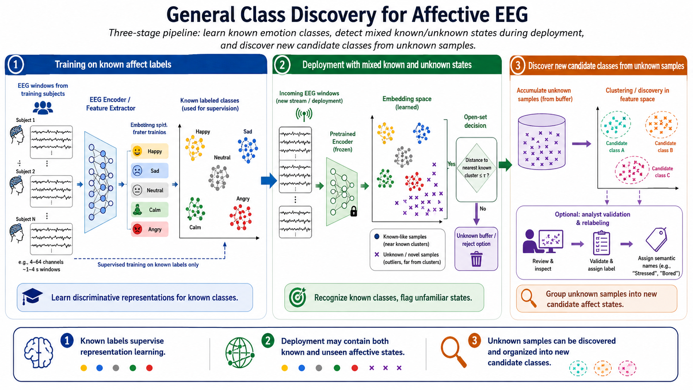

# General Class Discovery for Unseen Affective Labels

Most EEG-based affect recognition systems assume a closed label space: every class that appears at deployment was already represented during training. That assumption is convenient for benchmark design, but it is often wrong in real applications. A system trained on a small set of affective categories or coarse valence-arousal bins may later encounter states that were not explicitly labeled in the training set, such as boredom, mixed affect, cognitive overload, calm engagement, frustration, or user-specific idiosyncratic responses. In these settings, forcing every input into one of the known training labels creates systematic errors and overconfident predictions.

General class discovery (GCD) addresses this problem. The goal is to recognize samples belonging to known classes while also discovering and organizing samples from previously unseen classes. In affective EEG, this is especially relevant because affect taxonomies are incomplete, labels are noisy, and the mapping from physiology to emotion is highly context-dependent. A deployed model should therefore do more than classify known categories; it should also detect when its label vocabulary is insufficient and structure the unfamiliar data in a useful way.

*Figure 1. General class discovery for affective EEG. The model first learns known classes, then detects unknown samples at deployment, and finally clusters them into coherent candidate classes for validation.*

## Why Closed-Set Assumptions Break in Affective EEG

There are several reasons why unseen classes are common in practice:

- **Incomplete annotation schemes**: Many datasets collapse rich affective experience into a few discrete labels or into coarse high/low bins.
- **Application mismatch**: Labels used in laboratory benchmarks may not match the affective distinctions needed in tutoring, driving, mental-health monitoring, or human-robot interaction.
- **Subject-specific expression**: Two subjects may share a nominal label while differing substantially in physiology, and one subject may exhibit stable states that were never named in the training taxonomy.
- **Context drift**: The semantics of a state can shift across tasks, cultures, sessions, or stimulus types.
- **Mixed and ambiguous states**: Real emotions are often blended rather than cleanly partitioned into benchmark-friendly categories.

These factors mean that unknown classes are not rare anomalies. They are a structural feature of affective computing problems.

## Problem Formulation

In the GCD setting, the training data usually contains labeled examples from a set of known classes $\mathcal{Y}_K$, while deployment or auxiliary unlabeled data may contain both known and unknown classes. The unknown classes belong to a disjoint set $\mathcal{Y}_U$ that is not available during supervised training.

The objective is to learn a representation and decision procedure that can:

1. classify samples from known classes correctly,
2. identify samples that do not fit the known label set,
3. group the unknown samples into coherent clusters that correspond to new semantic classes,
4. and optionally incorporate those newly discovered classes into later rounds of training.

This makes GCD intermediate between several neighboring problems:

- **Open-set recognition** asks whether a sample is known or unknown, but does not usually organize unknowns into new classes.
- **Novel class discovery** focuses on clustering unknown classes from unlabeled data, often assuming no known-class prediction requirement at deployment.
- **Class-incremental learning** adds new classes over time, but usually after labels for those new classes become available.
- **Open-world learning** combines recognition, rejection, discovery, and continual expansion of the label space.

For affective EEG, GCD is a useful framing because practical systems often need all of these abilities at once.

## Affective EEG Examples Where GCD Matters

Several realistic scenarios motivate this section:

- A driver-state model trained on alert, fatigued, and stressed states encounters mind-wandering or irritation that was never labeled in the training corpus.
- An educational EEG system trained on boredom and engagement observes confusion, overload, or curiosity in a new course design.
- A mental-health monitoring system trained on broad positive/negative affect discovers recurring subject-specific dysphoric or dysregulated states not represented in benchmark labels.
- A consumer neurotechnology application trained on a fixed emotion inventory is deployed in a new culture where self-reported categories partition experience differently.

In each case, assigning every trial to the nearest known label is worse than explicitly modeling the possibility of new classes.

## Modeling Pipeline for General Class Discovery

A practical GCD pipeline for EEG-based affective computing often has four stages.

### 1. Learn a Transferable Representation

The first requirement is an embedding space where known classes are separable, but the geometry also supports the emergence of unseen structure. This usually calls for stronger representation learning than standard cross-entropy alone:

- supervised contrastive learning on known classes,
- self-supervised pretraining on large unlabeled EEG corpora,
- multimodal pretraining using EEG plus peripheral or behavioral signals,
- and temporal objectives that keep nearby windows coherent while preserving state transitions.

Good embeddings matter because unknown-class discovery is mostly a geometric problem. If the representation collapses all unfamiliar states toward the nearest known prototype, later clustering will fail.

### 2. Separate Likely Known from Likely Unknown Samples

The system then needs an uncertainty or out-of-class mechanism. Common options include:

- thresholding classifier confidence, energy scores, or margin scores,
- distance-to-prototype or distance-to-class-manifold criteria,
- density estimation in representation space,
- ensemble disagreement or Bayesian uncertainty surrogates,
- and reconstruction-based checks using autoencoders or class-conditional generative models.

For EEG, calibration is critical. Window-level predictions can be noisy, and overconfident softmax outputs are common even for mismatched inputs. Unknown detection should therefore be evaluated separately from closed-set accuracy.

### 3. Cluster the Unknown Portion

Once candidate unknown samples are isolated, the next step is to partition them into potential new classes. Useful tools include:

- k-means or Gaussian mixture models when the number of new classes is roughly known,
- density-based clustering such as DBSCAN or HDBSCAN when the unknown structure is irregular,
- spectral clustering when relationships are better captured by graphs,
- constrained clustering with temporal or subject-level consistency,
- and deep clustering methods that jointly refine embeddings and cluster assignments.

In affective EEG, temporal adjacency can be a strong auxiliary signal: windows close in time during a stable episode should usually not be assigned to unrelated discovered classes. Subject information can also help, but it must be used carefully to avoid confusing person identity with affect identity.

### 4. Interpret and Consolidate New Classes

Clusters alone are not enough. In applied affective computing, discovered groups must be inspected, validated, and connected back to domain meaning. Consolidation may involve:

- comparing clusters against self-reports, stimulus metadata, task events, or clinician annotations,
- checking whether the discovered groups are stable across sessions and subjects,
- merging spurious clusters caused by artifacts or subject identity,
- assigning provisional semantic names or dimensional descriptions,
- and retraining the recognizer with the expanded label set.

This final step is where GCD becomes scientifically useful rather than merely algorithmically interesting.

## Relation to Label Noise and Weak Supervision

In affective EEG, unknown classes and noisy labels can look similar. A sample may appear to be "unknown" because it truly belongs to a missing class, or because its annotation is inconsistent, delayed, weakly aligned with physiology, or flattened by a coarse labeling scheme. GCD methods should therefore be combined with techniques for robust learning under annotation uncertainty:

- soft labels or probabilistic labels,
- confidence-aware pseudo-labeling,
- co-training or teacher-student filtering,
- mixture models that separate clean from ambiguous points,
- and dimensional affect targets that preserve structure before discretization.

The key distinction is conceptual: label-noise methods assume the target taxonomy is basically correct but imperfectly observed, whereas GCD assumes the taxonomy itself may be incomplete.

## EEG-Specific Challenges

General class discovery is harder in EEG than in many vision benchmarks because the discovered structure can be driven by nuisance factors rather than by genuine latent classes. Important failure modes include:

- **Subject identity leakage**: clusters may separate people instead of affective states.
- **Session and device shifts**: unknown clusters may reflect hardware, montage, or preprocessing differences.
- **Artifact-driven discovery**: eye blinks, muscle activity, and motion can form tight but meaningless clusters.
- **Temporal fragmentation**: sliding-window pipelines can split a coherent state into many unstable micro-clusters.
- **Low sample support**: some new affective states may be rare and only weakly represented.

These issues imply that GCD for EEG should rarely rely on embeddings alone. It benefits from nuisance-invariant learning, artifact control, temporal smoothing, and careful post hoc validation.

## Evaluation Principles

Closed-set accuracy is insufficient for this topic. A credible evaluation protocol should usually report separate evidence for:

- performance on known classes,
- accuracy of known-vs-unknown discrimination,
- clustering quality on the unknown subset,
- and downstream utility after adding discovered classes back into the training pipeline.

Depending on the setup, useful metrics include AUROC or AUPRC for unknown detection, clustering accuracy or normalized mutual information for discovered classes, adjusted Rand index, and macro-averaged metrics after label-space expansion. It is also useful to report stability across random seeds, subjects, and sessions, because fragile clusters are hard to interpret scientifically.

For affective EEG, benchmark design matters greatly. If unknown classes are simulated by withholding some known labels during training, the held-out classes should differ in psychologically meaningful ways rather than only trivially in subject composition.

## Practical Design Recommendations

Several design choices are especially defensible in this domain:

- start from self-supervised or multimodal pretrained EEG representations rather than purely supervised closed-set embeddings,
- evaluate rejection and discovery explicitly instead of reporting only top-1 classification accuracy,
- include temporal and subject-aware constraints during unknown clustering,
- test whether discovered classes survive artifact removal and domain-shift controls,
- and prefer iterative human-in-the-loop consolidation over fully automatic naming of new affective states.

When labels are dimensional rather than categorical, another strong strategy is to perform GCD in a latent continuous affect space first, then decide whether the discovered regions justify new discrete categories.

## Relation to Broader Open-World Affective Learning

General class discovery is best understood as one component of a larger open-world affective learning agenda. A robust deployed system should be able to:

- recognize what it already knows,
- abstain when evidence is insufficient,
- discover recurrent unfamiliar states,
- and incorporate those states without catastrophic forgetting.

This is a more realistic long-term objective than assuming that one benchmark taxonomy exhausts human affect. For EEG-based affective computing, GCD provides a concrete path toward systems that remain useful even when the world contains more emotional structure than the training labels captured.

### References

- Vaze, S., Han, K., Vedaldi, A., and Zisserman, A. (2022). Generalized category discovery. Proceedings of the IEEE/CVF Conference on Computer Vision and Pattern Recognition, 7492-7501.
- Hsu, Y.-C., Shen, Y., Jin, H., and Kira, Z. (2018). Generalized open set recognition using invariant risk minimization. arXiv preprint arXiv:1811.08581.
- Fini, E., Da Costa, V. G. T., Alameda-Pineda, X., Ricci, E., and Alameda-Pineda, X. (2021). A unified objective for novel class discovery. Proceedings of the IEEE/CVF International Conference on Computer Vision, 9284-9292.
- Scheirer, W. J., de Rezende Rocha, A., Sapkota, A., and Boult, T. E. (2013). Toward open set recognition. IEEE Transactions on Pattern Analysis and Machine Intelligence, 35(7), 1757-1772.
- Bendale, A., and Boult, T. E. (2016). Towards open set deep networks. Proceedings of the IEEE Conference on Computer Vision and Pattern Recognition, 1563-1572.