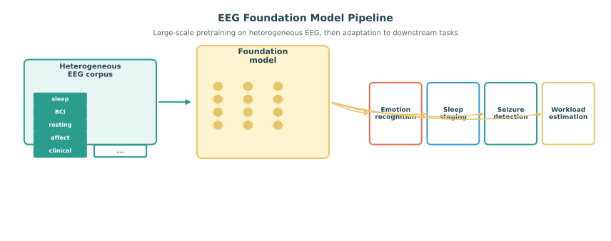

# EEG Foundation Models

Recent progress in machine learning has made foundation models a central idea across language, vision, speech, and multimodal learning. The core premise is to train a large, general-purpose model on broad and diverse data so that the resulting representations can be adapted efficiently to many downstream tasks. For EEG-based affective computing, this idea is especially attractive because labeled emotional EEG datasets are small, annotation quality is uneven, and the signals themselves are noisy, heterogeneous, and strongly subject-dependent. A sufficiently strong EEG foundation model could provide reusable representations that reduce the cost of task-specific supervision and improve transfer across datasets, subjects, sessions, and devices.

This section discusses what an EEG foundation model would mean in practice, why the concept is promising for affective computing, what design choices are currently most plausible, and what limitations remain.

*Figure 1. Foundation-model pipeline for EEG. Pretraining on diverse EEG data produces reusable representations that can be fine-tuned or probed for many downstream tasks, including affective computing.*

## What Counts as a Foundation Model for EEG?

The term should not be used loosely. A model is not a foundation model merely because it is large or based on a Transformer. In this context, the term usually implies several properties:

- training on broad and diverse EEG data rather than on a single narrow benchmark,
- learning general representations that transfer across multiple downstream tasks,
- adaptation by fine-tuning, linear probing, prompting, or lightweight adapters,
- and some degree of robustness to differences in subjects, sessions, recording protocols, and label spaces.

For EEG, this definition is harder to satisfy than in text because there is no single universal tokenization, no comparably large standardized corpus, and no stable semantics that are independent of hardware, montage, task, and preprocessing. As a result, EEG foundation models are better viewed as an emerging direction than as a fully mature category.

## Why Foundation Models Matter for Affective EEG

Affective EEG is a natural candidate for foundation-model ideas because many of its core difficulties are data-centric rather than purely architectural.

### 1. Labeled Affective Data Are Scarce

Emotion datasets are typically much smaller than datasets used in computer vision or natural language processing. They also involve expensive data collection, stimulus design, and annotation. Self-reports are noisy, delayed, and sometimes inconsistent across sessions or subjects. Pretraining on broader unlabeled EEG collections can therefore provide useful representations before scarce emotion labels are introduced.

### 2. Transfer Is a First-Class Requirement

Most affective EEG systems must generalize across subjects, sessions, tasks, and recording conditions. A representation learned only for one benchmark often does not transfer well. Foundation-style pretraining offers a path toward more reusable features that capture shared electrophysiological structure while preserving enough flexibility for adaptation.

### 3. Affective Tasks Benefit from Context Beyond Emotion Labels

Emotion is intertwined with attention, memory, cognitive load, fatigue, and other mental processes. A model pretrained on diverse EEG tasks may learn neural dynamics that are not emotion-specific but still improve affective inference. This is a major conceptual advantage over training only on narrow closed-set emotion labels.

## Data Sources for EEG Foundation Models

Unlike language models, EEG foundation models cannot rely on a single web-scale corpus. They must aggregate across heterogeneous data sources. Plausible pretraining data include:

- large public EEG datasets spanning sleep, BCI, cognitive tasks, epilepsy, resting state, and affective paradigms,
- clinical EEG archives with broad physiological variation,
- long-duration wearable EEG recordings from naturalistic environments,
- multimodal datasets pairing EEG with video, audio, eye tracking, peripheral physiology, or text,
- and unlabeled in-house recordings collected under multiple tasks or protocols.

The challenge is that these sources differ in channel layouts, sampling rates, hardware, reference schemes, artifact profiles, and subject populations. Building an EEG foundation model is therefore as much a dataset harmonization problem as a modeling problem.

## Core Modeling Strategies

Several pretraining paradigms are especially relevant.

### Self-Supervised Learning

Self-supervised learning is currently the most defensible route because it does not depend on a unified label space. Typical objectives include:

- masked signal modeling, where parts of the EEG sequence are hidden and reconstructed,
- contrastive learning across augmented views of the same segment,
- predictive coding over future temporal context,
- cross-channel reconstruction or channel-inference tasks,
- and multimodal alignment objectives that tie EEG to audio, video, language, or physiology.

These approaches aim to capture general neural structure before any affective labels are used.

Representation learning for affective EEG provides an important bridge between task-specific emotion models and broader foundation models. For example, [EMOD](https://doi.org/10.1609/aaai.v40i21.38796) uses a unified valence-arousal space and V-A-guided soft-weighted supervised contrastive learning to organize heterogeneous emotion annotations into a transferable embedding. Its pretraining across eight public EEG datasets illustrates a useful intermediate step: representations can become reusable across datasets and label schemes before the field attempts truly broad, multi-task EEG foundation models. The work is discussed in more detail in [Chapter 09's section on representation learning](../09-training-and-evaluation/02-training-paradigms-for-affective-eeg.md#representation-learning-for-affective-eeg).

This connection also clarifies the boundary between the two ideas. Affective representation learning may use labels and target emotion structure, whereas a foundation model is expected to support a wider range of downstream tasks and domains. An EMOD-like affective encoder could serve as an initialization, an adapter, or an affect-specific branch of a larger foundation model, but transfer claims still require subject-, dataset-, and task-disjoint evaluation where appropriate. The representation should be tested with frozen probing, low-label adaptation, and robustness analyses rather than inferred from one benchmark score.

### Generative Pretraining

Generative models such as VAEs, autoregressive models, diffusion models, or masked autoencoders can learn compressed latent spaces or plausible signal priors. For affective applications, generative pretraining may be useful for denoising, missing-channel imputation, uncertainty estimation, and adaptation to low-resource downstream tasks.

### Supervised Multi-Task Pretraining

When enough labeled datasets are available, another option is to pretrain jointly on many tasks, such as sleep staging, motor imagery, seizure detection, vigilance estimation, workload prediction, and emotion recognition. This can produce shared representations, but it also raises the risk that some high-resource tasks dominate the representation in ways that do not help affective inference.

## Architectural Choices

There is no single agreed-upon architecture for EEG foundation models, but several ingredients are common.

- **Temporal encoders**: Transformers, temporal convolutional networks, state-space models, and hybrid CNN-Transformer designs are all plausible.
- **Spatial structure**: Channel encodings, graph structure, and montage-aware attention help represent electrode relationships.
- **Patch or token design**: Models may tokenize EEG by time windows, channel-time patches, frequency patches, or latent segments.
- **Multi-resolution processing**: EEG contains useful structure at multiple temporal scales, from fast oscillations to slow state evolution.
- **Adapter layers**: Lightweight task-specific modules can make downstream transfer cheaper than full fine-tuning.

For affective EEG, architecture choice should be guided less by trend-following and more by whether the model can preserve temporal dynamics, cross-channel structure, and robustness to nuisance variation.

## Pretraining Objectives That Are Especially Relevant to Emotion

Not all pretraining signals are equally useful for affective computing. Several objectives seem particularly aligned with downstream emotion tasks:

- temporal context prediction, because affect evolves over time rather than appearing as isolated frames,
- cross-modal alignment with stimuli or peripheral signals, because emotions are often elicited and expressed multimodally,
- subject-invariant representation learning, because inter-subject variation is a major bottleneck,
- and event- or state-boundary sensitivity, because affective transitions matter as much as stable states.

One promising direction is to combine generic EEG pretraining with affect-aware auxiliary objectives during adaptation, rather than expecting fully task-agnostic pretraining to solve the whole problem.

## Adaptation to Downstream Affective Tasks

Once pretrained, a foundation model can be reused in multiple ways:

- **Linear probing**: freeze the backbone and train a lightweight classifier or regressor on valence, arousal, or discrete emotions.
- **Full fine-tuning**: adapt the entire model when enough downstream data is available.
- **Parameter-efficient tuning**: use adapters, LoRA-style updates, or prompt-like conditioning to reduce computational cost.
- **Few-shot personalization**: combine the shared pretrained backbone with small subject-specific calibration modules.

For EEG affective computing, parameter-efficient and personalized adaptation are especially attractive because many deployment settings have limited labels per person and need low-cost recalibration.

## Potential Benefits

If successful, EEG foundation models could improve affective systems in several ways:

- better sample efficiency on small emotion datasets,
- stronger cross-subject and cross-session transfer,
- more stable representations under noisy supervision,
- richer initialization for open-set, open-world, or general class discovery settings,
- and easier multimodal fusion because pretrained embeddings can already encode broad neural context.

In particular, foundation models may help shift the field away from repeatedly training small benchmark-specific models from scratch.

## Important Limitations and Risks

The concept is promising, but several caveats are essential.

### Data Heterogeneity Is Extreme

Different EEG datasets may disagree not only in labels, but in what was measured, how it was recorded, and what physiological processes dominate the signal. Without careful harmonization, scale alone may produce brittle representations rather than general ones.

### Bigger Is Not Automatically Better

Large models can overfit nuisance structure, become computationally impractical, and be hard to interpret. In EEG, where datasets are modest and signal semantics are fragile, architectural scaling laws are much less established than in language.

### Benchmark Leakage and Inflated Claims

If the same subjects, paradigms, or preprocessing pipelines appear across pretraining and evaluation, downstream gains may reflect leakage rather than true generalization. Claims about foundation models therefore require unusually careful protocol design.

### Ethical and Governance Concerns

Large EEG corpora raise privacy questions, especially when recordings are clinical, longitudinal, or paired with sensitive behavioral metadata. Governance, consent, de-identification, and dataset documentation matter as much as model accuracy.

## Evaluation Principles

Foundation-model claims should be evaluated at the representation level, not only at the final downstream score. Useful evidence includes:

- transfer across multiple affective datasets rather than a single benchmark,
- robustness to subject, session, and device shift,
- performance under low-label and few-shot conditions,
- ablations comparing frozen, fine-tuned, and parameter-efficient adaptation,
- and comparisons against strong task-specific baselines rather than only weak shallow models.

For affective EEG, it is also important to test whether the pretrained representation improves calibration, uncertainty estimation, and out-of-distribution behavior, not just closed-set accuracy.

## Relation to Open-World Affective Learning

EEG foundation models and open-world learning are complementary. A better pretrained representation does not by itself solve unknown-label, label-noise, or continual-learning problems, but it makes them more tractable. In particular, a strong general backbone can help:

- separate known from unknown affective states,
- support clustering in general class discovery,
- provide robust priors for semi-supervised learning,
- and reduce the amount of task-specific supervision needed when new states or populations appear.

This makes foundation models relevant not only for improving average benchmark scores, but also for building affective systems that remain usable in changing real-world environments.

## Practical Outlook

In the near term, the most realistic path is probably not a single universal EEG model trained once for all purposes. A more plausible trajectory is a family of moderately large pretrained backbones, trained on diverse but curated EEG corpora, then adapted to clusters of related tasks such as affect, cognitive monitoring, sleep, or clinical analysis. Over time, better dataset curation, channel-standardization strategies, self-supervised objectives, and multimodal pretraining may push the field closer to true EEG foundation models.

For affective computing, the key question is not whether the field can imitate language models superficially, but whether it can build reusable neural representations that materially improve transfer, robustness, personalization, and open-world reasoning.

### References

- Kostas, D., Aroca-Ouellette, S., and Rudzicz, F. (2021). BENDR: Using transformers and a contrastive self-supervised learning task to learn from massive amounts of EEG data. Frontiers in Human Neuroscience, 15, 653659.
- Cui, W., Wang, Z., Wang, J., and others. (2024). Large brain model for learning generic representations with tremendous EEG data in BCI. arXiv preprint arXiv:2405.18765.
- Yang, C., Yang, X., and others. (2024). EEGPT: Towards scalable and generalizable EEG foundation models. arXiv preprint arXiv:2408.00806.
- Banville, H., Chehab, O., Hyvarinen, A., Engemann, D.-A., and Gramfort, A. (2021). Uncovering the structure of clinical EEG signals with self-supervised learning. Journal of Neural Engineering, 18(4), 046020.
- Chen, Y., Zhao, S., Li, S., and Pan, G. (2026). EMOD: A Unified EEG Emotion Representation Framework Leveraging V-A Guided Contrastive Learning. Proceedings of the AAAI Conference on Artificial Intelligence, 40(21), 17427-17435. https://doi.org/10.1609/aaai.v40i21.38796
- Wang, Y., Jung, T.-P., and others. (2024). Large language model-inspired neural foundation models for brain signals: opportunities and challenges. arXiv preprint arXiv:2403.XXXX.