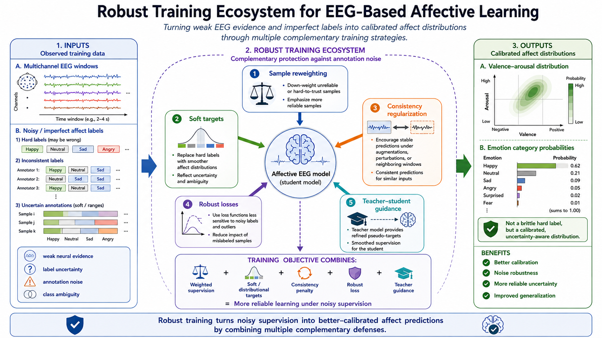
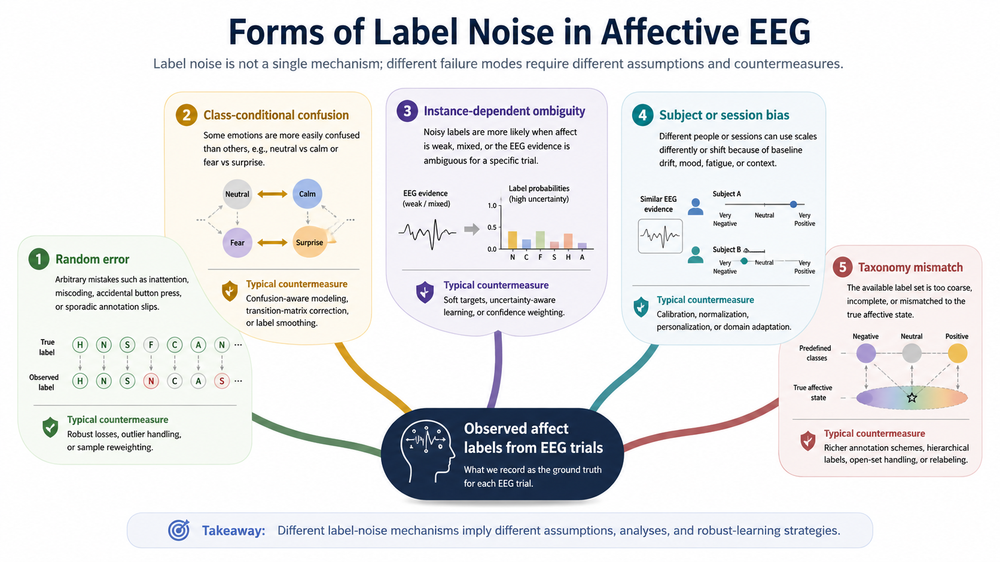
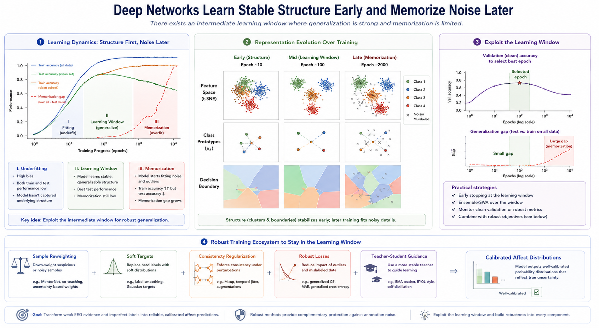
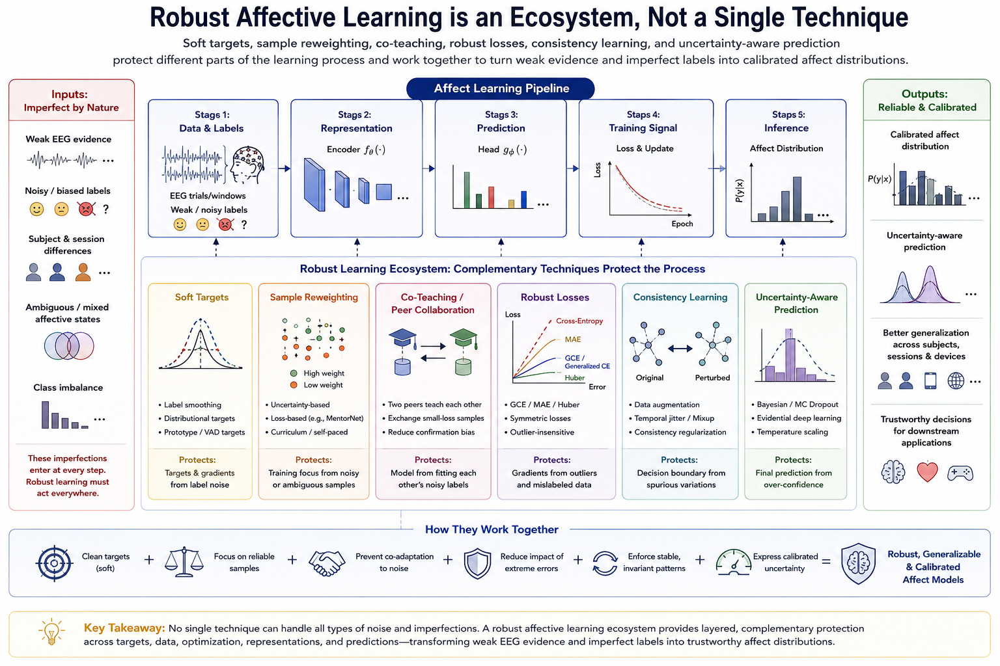
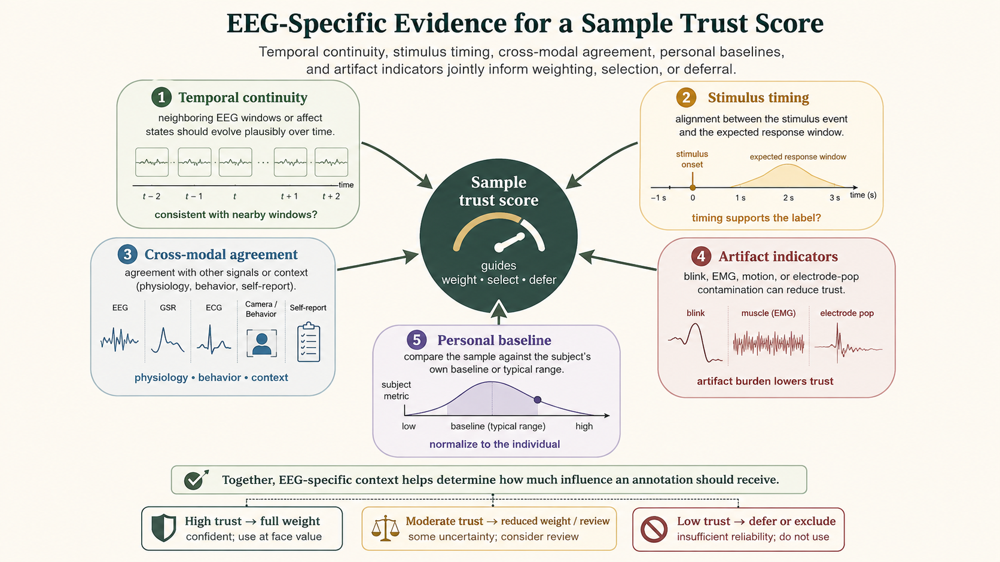

# Robust Learning Under Noisy Labels

Label noise is not a marginal inconvenience in EEG-based affective computing. It is often a defining property of the problem. Emotional self-reports can be delayed, ambiguous, coarse, inconsistent across sessions, and strongly shaped by individual differences. External annotations can be mismatched to internal experience, and stimulus-intended labels may only weakly approximate what the participant actually felt. When these imperfect labels are paired with low-SNR EEG measurements, the result is a particularly difficult learning regime: noisy inputs supervised by noisy targets.

This section focuses on the modeling question that follows once this fact is accepted: how should an EEG affect model be trained when some of the labels are wrong, ambiguous, weakly aligned, or systematically biased? The goal is not to eliminate label noise entirely, which is usually impossible, but to build systems that remain useful despite it.

*Figure 1. A robust training ecosystem transforms weak EEG evidence and imperfect labels into calibrated affect distributions. Sample reweighting, soft targets, consistency regularization, robust losses, and teacher–student guidance provide complementary protection against annotation noise.*

## Why Label Noise Is Especially Harmful in Affective EEG

All supervised learning is affected by mislabeled or ambiguous examples, but affective EEG is unusually vulnerable for several reasons:

- **The signal is already weak and noisy**: EEG has low spatial resolution, low signal-to-noise ratio, and strong artifact contamination.
- **The targets are psychologically fuzzy**: emotional categories and rating scales do not perfectly map onto latent neural states.
- **Subject variability is large**: the same numeric rating can correspond to different physiological regimes across people.
- **Datasets are small**: many benchmarks are too small to average out annotation errors.
- **Evaluation labels are noisy too**: test-set performance may understate or overstate true model quality.

This means naive empirical risk minimization can overfit labeling mistakes quickly, especially with flexible deep networks.

## Forms of Label Noise in Practice

It is useful to separate different failure modes, because different countermeasures address different kinds of noise.

### Random Annotation Error

Some labels are simply wrong because of inattention, misunderstanding, delayed recall, or accidental miscoding. This is the classical noisy-label setting and is often modeled as random corruption.

### Class-Conditional Noise

Some emotional states are more confusable than others. For example, high-arousal negative states may be mislabeled as stress, fear, anger, or frustration depending on the annotation scheme. In this case, the probability of corruption depends on the true class.

### Instance-Dependent Noise

The hardest examples are often the most likely to be mislabeled. Mixed states, weak inductions, boundary cases, and low-quality EEG segments tend to produce uncertain reports. This is more realistic than purely random corruption and much harder to correct.

### Systematic Subject or Session Bias

Some subjects use scales differently, avoid extreme ratings, or shift their internal baseline over time. In such cases, the noise is structured rather than independent.

### Taxonomy Mismatch

Sometimes the problem is not that labels are wrong, but that the label space is too coarse or incomplete. In that case, standard noisy-label methods overlap with open-set and general class discovery ideas.

*Figure 2. Label noise is not a single mechanism. Random errors, class-conditional confusion, instance-dependent ambiguity, subject or session bias, and taxonomy mismatch require different assumptions and countermeasures.*

## Failure Modes of Standard Training

Modern neural networks often fit clean patterns first and noisy patterns later. This phenomenon creates both an opportunity and a risk. Early in training, the model may learn useful structure; later, it may begin memorizing mislabeled or ambiguous examples. In affective EEG, this can lead to:

- inflated confidence on unstable emotional boundaries,
- poor cross-subject transfer because idiosyncratic label errors are memorized,
- unstable decision regions around mixed or weakly induced affective states,
- and misleading benchmark improvements that do not survive cleaner evaluation.

For this reason, robust learning methods often try to control which examples influence training, how strongly they influence it, and how much certainty the model is allowed to express.

*Figure 3. Flexible networks often learn stable structure early and memorize noisy examples later. Robust methods exploit the intermediate learning window through reweighting, sample selection, regularization, or early stopping.*

## Families of Robust Learning Strategies

No single technique solves the whole problem. Robust learning usually combines several ideas.

### 1. Soft Targets and Label Smoothing

One simple response is to stop pretending the supervision is perfectly crisp. Instead of one-hot targets, the model can train on softened or probabilistic labels.

- **Label smoothing** discourages extreme confidence and reduces sensitivity to isolated wrong labels.
- **Soft labels from repeated annotations** preserve disagreement information directly.
- **Distributional supervision** is useful when valence or arousal ratings are variable across raters or trials.

This approach is especially appropriate when label ambiguity is genuine rather than accidental.

### 2. Sample Reweighting and Curriculum Ideas

Another strategy is to down-weight samples that appear unreliable.

- Use per-sample loss magnitude to identify suspicious labels.
- Weight samples by annotator confidence, agreement, or physiological consistency.
- Start from easier, cleaner examples and introduce harder ones gradually.
- Use mentor networks or learned weighting modules to estimate trustworthiness.

The risk is that difficult but valid affective states may be mistaken for noise and suppressed. Robust weighting should therefore be paired with careful validation.

### 3. Small-Loss Selection and Co-Teaching

Methods such as small-loss filtering or co-teaching exploit the empirical observation that clean samples are often learned earlier than corrupted ones.

- **Small-loss selection** trains preferentially on examples whose current loss is low.
- **Co-teaching** trains two networks simultaneously, each selecting likely clean samples for the other.
- **Co-regularization** encourages agreement between models or views while reducing over-reliance on a single noisy signal.

These methods can work well when the corruption rate is moderate, but they become less reliable if hard-but-correct samples systematically produce larger loss, which is common in affective EEG.

### 4. Robust Loss Functions

Some losses are less sensitive to corrupted labels than standard cross-entropy.

- mean absolute error and generalized cross-entropy reduce the dominance of highly misfit samples,
- symmetric or bootstrap-style losses interpolate between observed labels and model predictions,
- focal-style variants can be adapted to handle uncertainty rather than only imbalance.

The tradeoff is usually between robustness and optimization ease. A loss that resists memorizing noise may also train more slowly or underfit clean structure if used carelessly.

### 5. Consistency Regularization and Semi-Supervised Learning

Because labels are scarce and noisy, it is often more effective to constrain the model using unlabeled structure rather than trusting every annotation equally.

- enforce prediction consistency under signal augmentations,
- use teacher-student or mean-teacher objectives,
- propagate pseudo-labels only when confidence is high,
- and combine labeled affective data with large unlabeled EEG corpora.

This is especially compatible with foundation-model or self-supervised pretraining strategies discussed elsewhere in this chapter.

### 6. Uncertainty-Aware and Probabilistic Modeling

Robust systems should not only predict an emotion label; they should also express uncertainty about whether the supervision itself was reliable.

- predict full distributions over valence or arousal rather than point estimates,
- separate aleatoric uncertainty from epistemic uncertainty where feasible,
- use evidential or Bayesian approximations to detect fragile predictions,
- and abstain or defer when evidence is insufficient.

This is often more honest and more useful than forcing exact categorical decisions on inherently ambiguous trials.

*Figure 4. Robust affective learning is an ecosystem rather than a single technique. Soft targets, sample reweighting, co-teaching, robust losses, consistency learning, and uncertainty-aware prediction protect different parts of the learning process.*

## EEG-Specific Signals for Robustness

EEG affective computing has access to side information that generic noisy-label literature often ignores. That side information can help estimate whether a label is trustworthy.

- **Temporal continuity**: labels that imply abrupt oscillations over adjacent windows may be less plausible.
- **Stimulus alignment**: annotations inconsistent with induction timing may warrant lower weight.
- **Cross-modal agreement**: EEG labels supported by peripheral physiology, facial behavior, or task context may be more reliable.
- **Subject baseline modeling**: apparent label conflicts may disappear after person-specific normalization.
- **Artifact indicators**: windows dominated by eye blinks, muscle activity, or electrode pops should not contribute equally.

In practice, robust affective learning often works best when label modeling is combined with data-quality modeling.

*Figure 5. EEG-specific context can estimate how much influence an annotation deserves. Temporal continuity, stimulus timing, cross-modal agreement, personal baselines, and artifact indicators jointly inform weighting, selection, or deferral.*

## Temporal and Structured Robustness

Since affect unfolds over time, robust learning should often be applied at the sequence level rather than only at the single-window level.

- smooth pseudo-labels across short stable intervals,
- infer latent affect trajectories with noisy observation models,
- identify change points instead of treating every local inconsistency as a mislabeled frame,
- and use structured decoders that separate transient annotation noise from stable latent state.

This is a major advantage of treating affect recognition as temporal inference rather than independent classification.

## Robust Evaluation Under Noisy Labels

If the test labels are also noisy, evaluation itself becomes part of the problem. Useful practice includes:

- reporting annotator agreement or reliability bounds alongside model scores,
- evaluating with ordinal, ranking, or tolerance-aware metrics when boundary fuzziness is high,
- testing on cleaner subsets or consensus-labeled subsets when available,
- checking calibration and abstention behavior rather than only accuracy,
- and validating whether gains hold across subjects and sessions rather than on one random split.

Claims of robustness are weak if they only show marginal improvement on a single noisy benchmark without any analysis of label quality.

## Relation to Other Chapter 10 Topics

Robust learning under noisy labels interacts naturally with the other topics in this chapter.

- **Psychological priors** can regularize implausible predictions and reduce overfitting to noisy local labels.
- **General class discovery** helps when apparent noise actually reflects missing or mis-specified classes.
- **EEG foundation models** can provide better pretrained representations that reduce reliance on scarce noisy supervision.

Taken together, these ideas suggest that robust affective learning is rarely a matter of swapping in a single clever loss. It is usually a system-level design problem involving representation quality, temporal structure, uncertainty modeling, and annotation-aware evaluation.

## Practical Recommendations

For most EEG affective projects, a defensible robust-learning recipe would include the following:

- begin with strong self-supervised or transfer learning rather than training from scratch,
- use soft or dimensional labels whenever the annotation protocol supports them,
- filter or down-weight low-quality EEG segments and low-confidence annotations,
- prefer sequence-aware objectives over purely independent window classification,
- monitor calibration and disagreement, not just average accuracy,
- and document annotation procedures carefully so that robustness claims are interpretable.

The goal is not to pretend that noisy labels can be fully repaired after the fact. The goal is to ensure that the model learns stable affective structure without becoming brittle to the inevitable imperfections of human annotation.

### References

- Frenay, B., and Verleysen, M. (2014). Classification in the presence of label noise: A survey. IEEE Transactions on Neural Networks and Learning Systems, 25(5), 845-869.
- Han, B., Yao, Q., Yu, X., Niu, G., Xu, M., Hu, W., Tsang, I. W., and Sugiyama, M. (2018). Co-teaching: Robust training of deep neural networks with extremely noisy labels. Advances in Neural Information Processing Systems, 31.
- Zhang, Z., and Sabuncu, M. (2018). Generalized cross entropy loss for training deep neural networks with noisy labels. Advances in Neural Information Processing Systems, 31.
- Arazo, E., Ortego, D., Albert, P., O'Connor, N., and McGuinness, K. (2019). Unsupervised label noise modeling and loss correction. Proceedings of the International Conference on Machine Learning, 312-321.
- Song, H., Kim, M., Park, D., Shin, Y., and Lee, J.-G. (2023). Learning from noisy labels with deep neural networks: A survey. IEEE Transactions on Neural Networks and Learning Systems, 34(11), 8135-8153.
