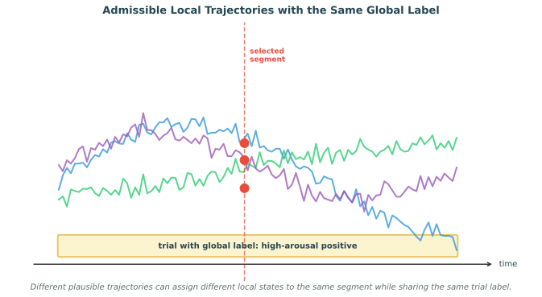

# Local-Segment and Global-Trial Label Inconsistency

Many EEG affective datasets provide a single label for an entire trial, clip, or stimulus episode, while the actual model is trained and evaluated on much shorter local segments. This creates a subtle but important supervision problem. The global trial label may be appropriate for the overall affective episode, yet individual local windows inside that episode need not share exactly the same emotional state. Affect can fluctuate, drift, stabilize, briefly reverse, or pass through mixed intermediate states while still producing a trial-level judgment that is globally consistent.

This means that a mismatch between a local segment and the global label should not automatically be interpreted as annotation noise. The two labels live at different temporal scales. A local segment may reflect a transient state that differs from the overall trial summary, and multiple plausible latent emotion trajectories can aggregate to the same final trial label. When a learner sees only the global label, it is being asked to solve a temporally fine-grained prediction problem from coarse supervision.

*Figure 1. Local-global label inconsistency. Several psychologically plausible trajectories can share the same trial-level label while disagreeing about the state of any single local segment.*

## Why This Is Not Ordinary Label Noise

Classical noisy-label problems assume that the target for a sample exists at the same scale as the observation, but is recorded incorrectly, ambiguously, or inconsistently. The present issue is different. Here, the global label may be correct, and a local segment label may also be correct, even when they are not identical.

Suppose two psychologically plausible affect trajectories both correspond to the same global trial label, but at a particular local segment one trajectory passes through a slightly calmer state while the other remains somewhat more aroused. Neither local state is necessarily wrong. The disagreement arises because the local segment does not uniquely determine the full trial trajectory, and the global label compresses information across time.

This is better understood as a **time-scale mismatch**, **weak supervision problem**, or **multi-instance learning problem** rather than simple label corruption.

## Why the Problem Arises in Affective EEG

Several factors make this issue common in affective computing:

- **Emotion unfolds dynamically**: affect is not constant over the duration of a video clip, music excerpt, or interaction episode.
- **Self-reports are usually global summaries**: participants often rate how they felt overall after the trial ends.
- **Window-based learning is computationally convenient**: EEG pipelines often segment trials into many short overlapping windows to increase sample count.
- **Local physiology and global appraisal differ**: a brief local fluctuation may not change the participant's final overall judgment.
- **Mixed states are common**: local segments may reflect blended or transitional affect even when the final trial label is discrete.

For datasets such as DEAP and SEED, this issue is especially relevant because trial-level labels are commonly reused as if they were exact labels for every local window.

## A Concrete Conceptual Example

Consider a one-minute affect induction trial with a global label of high arousal and positive valence. The participant may begin in a neutral or anticipatory state, become strongly engaged in the middle, and settle into a milder positive state near the end. A short segment drawn early in the trial could plausibly carry weaker arousal than a segment drawn from the emotional peak. Yet both segments belong to a trial whose final overall summary is still high-arousal positive.

If two admissible latent trajectories assign slightly different local labels to the same short segment, it is misleading to call either local label noisy. The ambiguity comes from unresolved temporal structure, not from an erroneous annotation. In that sense, the local prediction target is only partially identifiable from the available supervision.

## Subjective Labels as Representatives, Not Exact Point Truth

This issue becomes even more important because many affective EEG labels are self-assessed and therefore inherently subjective. In many datasets, the provided label should not be interpreted as a perfectly solid ground-truth point in emotion space. It is often better understood as a representative summary of a nearby region, cluster, or bag of closely related affective states.

For example, in a continuous arousal setting, the practical difference between arousal values such as 2.0 and 2.5 may be mild relative to rating uncertainty, inter-subject differences, and within-trial fluctuations. In a discrete setting, neighboring states such as neutral and calm may also be only weakly separated psychologically and physiologically. When the dataset records one of these nearby labels, it may be selecting a convenient representative of a close affective neighborhood rather than identifying a uniquely correct atomic state.

This means two things at once:

- the global trial label itself may already summarize a fuzzy group of nearby emotional interpretations,
- and the local segment inside that trial may legitimately occupy different points inside that group without contradicting the observed label.

Under this view, disagreement should not be framed too quickly as error. A local segment can differ slightly from the representative global label while still belonging to the same broader admissible emotion family. The problem is therefore not only temporal mismatch, but also **label granularity mismatch**: the annotation may live at a coarser semantic resolution than the prediction target.

## Consequences for How Labels Should Be Interpreted

Once labels are treated as representative summaries rather than exact point truth, several common practices become harder to justify.

- A copied trial label should not be treated as an exact local class target for every segment.
- A near-miss prediction into a neighboring affective state should not always be penalized as if it were completely wrong.
- Boundary cases between close emotions should often be modeled with soft, ordinal, or neighborhood-aware targets.
- Evaluation should distinguish gross semantic mistakes from mild deviations within the same nearby affective group.

This perspective is especially important for datasets with coarse discrete categories or low-resolution self-rating scales, where the annotation procedure itself compresses a continuum of plausible internal states.

## Relation to Weak Supervision and Multi-Instance Learning

This setting is naturally related to weakly supervised learning. The learner observes a bag-level label at the trial level, but must reason about instance-level states at the segment level.

- In **multi-instance learning**, a trial can be viewed as a bag of segments, with only the bag label observed.
- In **weak sequence supervision**, a sequence-level target constrains but does not uniquely determine frame- or window-level states.
- In **latent-variable models**, the segment-level labels are hidden variables whose aggregation should be compatible with the observed trial label.

This framing is often more faithful than copying the trial label onto every window and treating the result as ordinary supervised classification.

## What Makes a Local Prediction Compatible with a Global Label?

A key modeling question is what kind of aggregation rule connects local states to the global trial label. Several possibilities exist:

- the global label may reflect an average affective tendency across the trial,
- it may reflect the peak or most memorable moment,
- it may depend disproportionately on late segments because of recency effects,
- or it may summarize the participant's overall appraisal rather than any single local state.

Different datasets and annotation procedures may imply different aggregation mechanisms. Without an explicit aggregation model, the local supervision problem is underdetermined.

## Failure Modes of Naive Window Labeling

Simply assigning the global label to every local segment can create several problems:

- **false supervision**: transitional or weakly emotional windows are treated as if they had the full trial label,
- **blurry decision boundaries**: models learn to associate many heterogeneous local states with a single category,
- **misleading confidence**: the model may become overconfident about local predictions that were never directly supervised,
- **temporal inconsistency**: the learner is not encouraged to model plausible within-trial evolution,
- and **evaluation distortion**: window-level metrics may reward agreement with copied trial labels rather than true local affect dynamics.

These issues can be substantial even if the original trial-level annotation itself is perfectly reliable.

## Modeling Strategies

Several modeling strategies are better aligned with this setting than naive label replication.

### 1. Multi-Instance Learning

Treat each trial as a bag of local segments and predict the global trial label from the bag representation.

- aggregate segment embeddings using attention, pooling, or learned weighting,
- allow only some segments to dominate the trial-level decision,
- and inspect the learned weights as a proxy for which parts of the trial matter most.

This avoids forcing every segment to carry the full trial label.

### 2. Latent Segment Labels with Global Constraints

Another approach is to treat local labels as hidden variables.

- infer segment-level latent states jointly with the trial-level prediction,
- constrain the latent sequence to aggregate consistently to the observed global label,
- and regularize the latent states with temporal smoothness or psychologically plausible dynamics.

This is appealing when one wants interpretable local predictions without direct local annotation.

### 3. Ordinal or Soft Local Supervision

Rather than assigning a hard copied label to every segment, one can use softer supervision:

- allow local predictions to lie in a neighborhood around the global label,
- use interval, ordinal, or distributional targets instead of exact classes,
- encourage consistency only after temporal aggregation,
- and define partial credit for nearby emotions that belong to the same representative group.

This is especially appropriate when the global label is dimensional, such as valence or arousal.

### 4. Sequence Models with Aggregation Heads

Temporal encoders can produce segment-level hidden states while a downstream aggregation head predicts the trial label.

- recurrent, Transformer, or state-space models can capture within-trial dynamics,
- attention pooling can model which windows matter most to the final report,
- and multiple heads can predict both trial-level and optional pseudo-local objectives.

This makes the supervision path explicit: local dynamics first, global summary second.

### 5. Self-Supervised and Consistency-Based Objectives

Because direct local supervision is missing, representation learning becomes even more important.

- pretrain on unlabeled EEG with temporal or contrastive objectives,
- enforce consistency across neighboring windows when psychologically plausible,
- and add cross-modal or stimulus-timing constraints when available.

This reduces over-reliance on copied trial labels as the sole learning signal.

### 6. Designing Aggregation Functions

Even when the modeling strategy explicitly aggregates segment-level representations into a trial-level prediction, the choice of aggregation function can substantially change results. The REFED dataset provides direct evidence for this challenge: it confirms that the segment-majority label—the label that would result from a simple majority vote over individual window predictions—often does not match the observed trial-level label. This mismatch is not an annotation error but a signal that naive aggregation can misrepresent the relationship between local and global affect.

**The risk of naive aggregation.** Simple pooling strategies such as majority voting, unweighted averaging, or max-pooling implicitly assume that every segment contributes equally to the trial label, or that a single most-salient segment determines it. These assumptions are rarely justified. A segment drawn from an emotional peak, a recovery period, or a transitional moment may carry very different relevance to the final self-report, and treating them uniformly can dilute or distort the aggregated prediction.

**Confidence-weighted and uncertainty-aware aggregation.** Some datasets provide segment-level information beyond a hard label. In SEED-V, for instance, segment annotations are not actual ground-truth labels but confidence scores or soft indicators. These can be aggregated into a trial-level prediction through straightforward weighted averaging, where more confident segments contribute more strongly to the final vote. This approach naturally down-weights ambiguous or transitional windows without requiring explicit segment-level ground truth.

**Prior-informed weighting schemes.** When additional domain knowledge is available, the aggregation weights can incorporate psychologically or physiologically motivated priors:

- **Recency**: later segments may receive higher weight if self-reports are known to be influenced by the most recent experience (a recency effect).
- **Intensity**: segments with higher predicted arousal, larger physiological responses, or stronger stimulus features can be up-weighted if peak moments drive the overall appraisal.
- **Stability**: segments where the affective state is stable (low variance across neighboring windows) may be weighted more than volatile transition periods.
- **Stimulus alignment**: when the induction stimulus timeline is known, segments aligned with emotionally salient events (e.g., the climax of a video clip) can be assigned higher weights.

These priors should be declared and justified rather than tuned post hoc to improve test performance.

**Learned aggregation.** Rather than hand-designing an aggregation rule, a neural network can learn to combine segment predictions or embeddings into a trial-level output. Attention-based pooling, set transformers, or recurrent aggregation modules can discover which segments matter most from the data itself. The learned weights then become an interpretable byproduct—they can be inspected to understand which parts of the trial drive the global prediction. This approach is particularly attractive when the aggregation mechanism is unknown or likely to vary across participants, stimuli, or emotion dimensions.

Regardless of the method, the aggregation function should be reported transparently: whether it is fixed, prior-informed, or learned; what information it consumes (segment predictions, confidences, embeddings, or auxiliary signals); and how its parameters, if any, are fitted and validated.

## Evaluation Challenges

This topic also changes how local prediction should be evaluated. If only global labels are available, then window-level accuracy against copied trial labels is not a trustworthy measure of true local affect recognition.

Better evaluation options include:

- assessing trial-level prediction while separately analyzing the plausibility of learned local trajectories,
- collecting sparse local annotations on a small subset for validation,
- checking whether local predictions aggregate back to the correct global label,
- comparing local trajectories against stimulus structure, behavioral markers, or peripheral physiology,
- using distance-aware, ordinal, or neighborhood-aware metrics when close emotions are not meaningfully separable,
- and measuring temporal smoothness, calibration, and uncertainty rather than only exact per-window agreement.

In other words, the absence of local supervision should change both training and evaluation protocols.

## Relation to Noisy Labels

This issue is closely related to noisy-label learning, but it is more general in an important sense. A true mislabeled trial is a special case of incorrect supervision. By contrast, local-segment and global-trial mismatch can arise even when every observed label is correct at its own scale.

For that reason, robust learning under noisy labels is helpful but not sufficient. Methods designed only to identify and suppress corrupted labels may mis-handle valid local deviations if they assume every disagreement with the copied trial label is noise. What is needed instead is a model that respects the distinction between local and global supervision.

## Relevance to Common EEG Emotion Datasets

This problem is especially important for widely used benchmarks where labels are attached at the trial level and then reused for short windows.

- In **DEAP**, valence, arousal, dominance, and liking are typically collected per trial rather than per window.
- In **SEED** and related datasets, emotion categories are often tied to entire clips or trials, while the EEG is segmented into many local samples for training.
- In naturalistic or wearable settings, the temporal gap between global self-report and local neural fluctuations can be even larger.

As a result, models that claim fine-grained local emotion decoding from these datasets should state clearly whether they are truly learning local labels or only segment-level predictors constrained by global trial supervision.

## Practical Recommendations

For most affective EEG studies using trial-level labels with segment-level modeling, a defensible protocol would include the following:

- avoid presenting copied trial labels as exact local ground truth without qualification,
- distinguish clearly between trial-level recognition and local-state inference,
- use multi-instance, latent-variable, or aggregation-aware objectives when possible,
- validate local predictions indirectly through temporal plausibility or auxiliary signals,
- and describe the assumed aggregation mechanism from local states to global labels.

The broader lesson is that affective EEG supervision is often hierarchical in time. Once that is acknowledged, the goal is no longer to force every local segment to mirror the global label, but to learn local dynamics whose aggregation remains consistent with the observed trial-level affect.

### References

- Ilse, M., Tomczak, J. M., and Welling, M. (2018). Attention-based deep multiple instance learning. Proceedings of the International Conference on Machine Learning, 2127-2136.
- Carbonneau, M.-A., Cheplygina, V., Granger, E., and Gagne, G. (2018). Multiple instance learning: A survey of problem characteristics and applications. Pattern Recognition, 77, 329-353.
- Wang, Z., Yan, W., and Oates, T. (2017). Time series classification from scratch with deep neural networks: A strong baseline. International Joint Conference on Neural Networks, 1578-1585.
- Li, J., Qiu, S., Du, C., Wang, Y., and He, H. (2020). Domain adaptation for EEG emotion recognition based on latent representation similarity. IEEE Transactions on Cognitive and Developmental Systems, 12(2), 344-353.
- Koelstra, S., Muhl, C., Soleymani, M., Lee, J.-S., Yazdani, A., Ebrahimi, T., Pun, T., Nijholt, A., and Patras, I. (2012). DEAP: A database for emotion analysis using physiological signals. IEEE Transactions on Affective Computing, 3(1), 18-31.