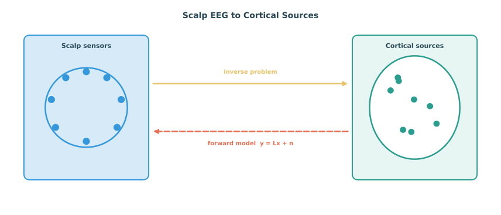

# Source Estimation and Inverse Modeling for Affective EEG

Scalp EEG records voltage fluctuations at the surface of the head, but the neural processes that generate emotion-related signals occur in cortical and subcortical regions. Source estimation — also called EEG source imaging or the inverse problem — attempts to reconstruct those underlying brain sources from the scalp measurements. This is not a preprocessing step in the usual sense. It is a modeling investment that changes the spatial resolution of the input representation and, potentially, the interpretability of the resulting affect predictions.

This section discusses why source estimation matters for affective computing, how it works at a conceptual and practical level, what deep learning has contributed, and where the limits remain.

*Figure 1. Source estimation maps between scalp EEG measurements and underlying cortical sources. The forward model is well-posed; the inverse problem requires regularization or learned constraints.*

## Why Source Estimation Matters for Affective Computing

Emotion is not a single uniformly distributed brain state. Different components of affective experience — appraisal, arousal regulation, valence processing, autonomic control, subjective feeling — engage partially dissociable cortical and subcortical networks. Scalp EEG mixes contributions from many sources through volume conduction, which spatially blurs the signal and makes channel-level patterns harder to interpret.

Source estimation can help by:

- reducing volume conduction blur and improving spatial specificity,
- approximating activity in regions known to be relevant to emotion, such as the prefrontal cortex, anterior cingulate, insula, and amygdala-adjacent areas,
- providing input features that are more directly linked to known affective circuits,
- enabling region-of-interest analysis rather than relying on raw channel-space patterns,
- and improving cross-subject and cross-session alignment by operating in a common anatomical space.

For affective computing, the question is not whether source estimation is perfect, but whether the spatial transformation it provides adds enough signal to justify its complexity and assumptions.

## The Forward and Inverse Problems

### Forward Problem

The forward problem is: given a set of current sources inside the brain and a model of the head's conductive properties, predict the scalp potential at each electrode. This is well-posed and deterministic. The forward model depends on:

- a head model describing the geometry and conductivity of scalp, skull, cerebrospinal fluid, and brain tissue,
- electrode positions registered to the head model,
- and a source model, typically a grid of current dipoles distributed across the cortical surface or a volumetric brain grid.

The forward solution can be expressed as a linear operation. Let $\mathbf{x} \in \mathbb{R}^{S}$ be the source activity at $S$ dipole locations and $\mathbf{y} \in \mathbb{R}^{C}$ be the scalp measurement at $C$ channels. Then:

$$\mathbf{y} = \mathbf{L}\mathbf{x} + \mathbf{n}$$

where $\mathbf{L} \in \mathbb{R}^{C \times S}$ is the leadfield matrix and $\mathbf{n}$ is measurement noise.

### Inverse Problem

The inverse problem is: given $\mathbf{y}$ and $\mathbf{L}$, estimate $\mathbf{x}$. This is ill-posed because $S \gg C$ in almost all practical settings. Many different source configurations produce identical or nearly identical scalp patterns.

Solving the inverse problem therefore requires additional assumptions. Common families of inverse methods include:

- **Minimum-norm estimates**: choose the source configuration with smallest overall energy while fitting the data to a specified tolerance.
- **Weighted minimum-norm and LORETA**: incorporate depth weighting and spatial smoothness to avoid superficial bias.
- **Beamforming**: scan the source space with a spatial filter that passes activity from a target location while suppressing contributions from elsewhere.
- **Bayesian and sparse methods**: place structured priors on source distributions, favoring focal or sparse activation patterns.
- **Deep-learning-based methods**: learn a direct or regularized inverse mapping from data, sometimes using realistic forward-model simulations for training.

No method is uniquely correct. The choice depends on the assumptions that are most defensible for the affective paradigm under study.

## Deep Learning for Source Estimation

Traditional inverse solvers are model-based. Deep learning offers an alternative route: learn the inverse mapping from large amounts of simulated or real data rather than relying on explicit anatomical and conductivity assumptions.

Several deep-learning approaches have been explored:

- convolutional or Transformer architectures that map scalp topographies directly to source-space distributions,
- autoencoder-style models that reconstruct sources from scalp inputs in a learned latent representation,
- physics-informed networks that incorporate the forward model as a constraint during training,
- and conditional generative models that produce plausible source distributions rather than a single point estimate.

For affective EEG, deep source imaging is attractive because it can be co-optimized with the downstream affect recognition task. However, it also raises a risk: if the learned inverse is driven by biases in the simulation data, it may produce plausible-looking but scientifically misleading source estimates.

## Source Estimation in Practice: What Is Needed

Applying source estimation to an affective EEG dataset typically requires:

- individual or template head models (MRI-derived when available, or standard templates such as the ICBM152),
- electrode digitization or template-based electrode positioning,
- tissue conductivity estimates,
- a source space definition (cortical surface mesh or volumetric grid),
- coregistration between electrode positions and the head model,
- computation of the leadfield matrix,
- and choice of an inverse solver with appropriate regularization.

Software tools such as MNE-Python, Brainstorm, and FieldTrip support these workflows. For low-channel or wearable EEG, additional assumptions and stronger regularization are unavoidable.

## Source-Level Features for Affective Computing

Once source estimates are obtained, they can be used as input to emotion recognition models in several ways:

- **Region-level band power**: compute alpha, beta, theta, or gamma power in predefined cortical regions of interest and use these as features.
- **Source-space connectivity**: derive functional connectivity measures such as phase-locking value, coherence, or imaginary coherence directly in source space.
- **Source-space asymmetry**: compute lateralization indices for regions implicated in affective processes, such as frontal alpha asymmetry.
- **Time-frequency source maps**: generate full spatio-temporal-spectral representations at the source level.
- **Learned source embeddings**: use the source estimates as input to a deep network that learns downstream affect-relevant representations.

Source-level features often improve interpretability because they localize affect-related dynamics to anatomical regions with known functional roles in emotion.

## Source Estimation for Cross-Subject and Cross-Session Generalization

One underappreciated benefit of source estimation for affective computing is improved anatomical alignment across subjects. Scalp EEG topographies depend on individual head geometry and electrode placement, so the same underlying source activity can produce different channel-level patterns in different people. Projecting data into a common source space — even with template-based models — reduces this source of variability and can improve transfer.

This is especially valuable when:

- subject-independent decoding is a goal,
- training and test populations differ,
- or a pretrained model must generalize to new users without extensive calibration.

In such settings, source-space features often serve as a domain-alignment step before any learning takes place.

## Limitations and Cautions

Source estimation is not a magic step that makes EEG into fMRI. Important limitations include:

- **Ill-posedness is fundamental**: even the best inverse solver cannot uniquely recover the true source distribution.
- **Subcortical sources are mostly invisible to scalp EEG**: emotion-critical structures such as the amygdala, hypothalamus, and brainstem nuclei contribute little to scalp potentials, especially at standard electrode densities.
- **Head model errors propagate**: incorrect conductivity assumptions, misaligned electrodes, or simplified geometry degrade source estimates.
- **Template-based models introduce bias**: using a standard head model rather than individual MRI introduces systematic spatial errors.
- **Low-channel systems amplify all problems**: with fewer than about 32 channels, the source reconstruction is severely underdetermined even with strong priors.

For affective computing, the safest interpretation of source estimation is as a denoising and spatial re-projection step rather than as precise neural localization.

## When Source Estimation Is Worth the Effort

Source estimation is most likely to add value when:

- the recording uses a high-density system with 32 or more channels covering the whole head,
- electrode positions are measured or carefully templated,
- anatomical interpretability is a study goal,
- cross-subject generalization is a priority and templates can help anatomical alignment,
- or when source-space features are expected to outperform channel-space features for the specific affective task.

For low-channel wearable studies, the cost-benefit ratio is less favorable, and alternative spatial representations such as channel-level patterns, graph-based electrode modeling, or learned spatial filters may be more appropriate.

## Relation to Other Chapter 10 Topics

Source estimation interacts naturally with several other sections in this chapter.

- **EEG foundation models** can be pretrained on source-space representations to improve cross-dataset transfer.
- **Psychological priors** can be applied in source space, regularizing the temporal dynamics of region-level estimates.
- **General class discovery** may benefit from the improved spatial specificity of source-level embeddings when discovering new affective classes.
- **Robust learning under noisy labels** is relevant because source estimation itself introduces modeling uncertainty that should not be ignored during training.

The broader point is that source estimation is not an isolated preprocessing choice. It is a modeling decision that changes the spatial representation on which all downstream learning, evaluation, and interpretation depend.

### References

- Baillet, S., Mosher, J. C., and Leahy, R. M. (2001). Electromagnetic brain mapping. IEEE Signal Processing Magazine, 18(6), 14-30.
- Pascual-Marqui, R. D. (2002). Standardized low-resolution brain electromagnetic tomography (sLORETA): technical details. Methods and Findings in Experimental and Clinical Pharmacology, 24(Suppl D), 5-12.
- Michel, C. M., and Brunet, D. (2019). EEG source imaging: A practical review of the analysis steps. Frontiers in Neurology, 10, 325.
- He, B., Sohrabpour, A., Brown, E., and Liu, Z. (2018). Electrophysiological source imaging: A noninvasive window to brain dynamics. Annual Review of Biomedical Engineering, 20, 171-196.
- Schirrmeister, R. T., Springenberg, J. T., Fiederer, L. D. J., Glasstetter, M., Eggensperger, K., Tangermann, M., Hutter, F., Burgard, W., and Ball, T. (2017). Deep learning with convolutional neural networks for EEG decoding and visualization. Human Brain Mapping, 38(11), 5391-5420.
