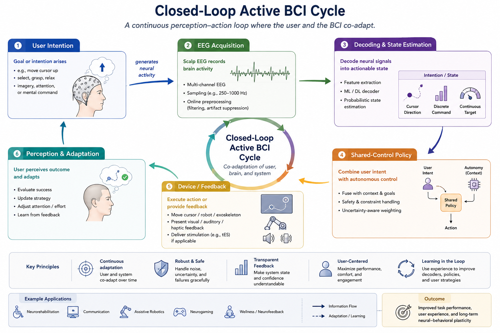

# Active BCI: Closed-Loop Feedback and Human-Machine Co-Adaptation

Much of affective EEG research is passive: the machine observes a person's signals and estimates an internal state such as arousal, stress, engagement, or emotion. An active brain-computer interface (BCI) changes the direction of interaction. Neural activity is decoded into an intentional command, and the system returns information or control to the user through a display, sound, haptic cue, stimulation, or an assistive device. The resulting behavior is a closed loop rather than a one-way prediction problem.

In a closed-loop system, the person learns how to produce usable neural patterns while the decoder learns how to interpret that person's signals. Neither side is fixed. Calibration, feedback design, shared control, and safety constraints are therefore central parts of the problem formulation.

*Figure 1. Closed-loop active BCI. The user and decoder co-adapt through continuous feedback; both sides of the loop change over time.*

## From Passive Inference to Active Interaction

Passive BCI asks questions such as: "Is the user becoming fatigued?" or "What is the user's current affective state?" The output may adapt an interface, but the user does not necessarily learn to control the measured signal intentionally.

Active BCI asks a different question: "Can the user intentionally control an interface through neural activity?" A common formulation maps an EEG observation $$x_t$$ to a command $$a_t$$:

$$
a_t = \pi_\theta(x_{\leq t}),
$$

where $$\pi_\theta$$ is a decoder or policy that must operate within the available time and feedback latency. The command may select a target, move a cursor, control a wheelchair, spell a character, regulate a game or training task, or trigger a device action.

Some assistive systems also deliver information *to* the user. For example, a camera can be converted into auditory or tactile sensory-substitution cues for a blind user, or a visual prosthesis may provide patterned stimulation intended to create useful percepts. These systems are not always active EEG BCIs in the strict sense, because their input may come from a camera or implanted interface rather than an EEG decoder. They share the key closed-loop property: the user must learn how to interpret artificial feedback, and the system must be calibrated to support that learning.

| System type | Direction of primary information flow | Example | Central learning problem |
| --- | --- | --- | --- |
| Passive BCI | Brain to machine | Detect fatigue to adapt a dashboard | Infer state accurately without requiring intentional control |
| Active BCI | Brain to machine to device | Use motor imagery to select a communication item | User learns controllable patterns; decoder learns the user's signals |
| Sensory substitution or neuroprosthetic feedback | Environment or device to user | Camera-derived sound or tactile cues for navigation | User learns a new perceptual code; feedback is tuned for useful behavior |
| Bidirectional closed-loop interface | Brain to machine and device to user | Decoder-controlled assistive device with haptic confirmation | Coordinate decoding, action, feedback, and adaptation safely |

## The Closed-Loop System

A practical active BCI contains more than a classifier. Its loop includes:

1. **User goal and strategy:** The user attempts a mental or motor-imagery strategy to express an intention.
2. **Neural acquisition:** Sensors capture EEG or another neural signal with noise, delay, and occasional failure.
3. **Decoding:** A model maps the signal to a command, confidence estimate, or continuous control value.
4. **Shared control:** A controller may constrain, smooth, or combine the decoded command with environmental context.
5. **Feedback:** The system communicates the current state, selected action, error, or reward through visual, auditory, haptic, or other channels.
6. **Human adaptation:** The user changes attention, strategy, timing, or interpretation of feedback on subsequent attempts.
7. **Machine adaptation:** The decoder or controller updates when explicitly permitted by the calibration protocol.

The loop is successful when the person can accomplish the task, not merely when offline decoding accuracy is high. A decoder with a modest offline score can be usable if its errors are predictable and feedback supports correction; a high-scoring decoder can be unusable if latency, false activations, or unstable feedback disrupt the user's strategy.

## Co-Adaptation During Calibration and Use

Co-adaptation means that the user and system improve together. Early calibration often begins with instructed trials, such as imagined left-versus-right hand movement or attention to distinct flashing targets. These trials provide initial labels for a decoder, but they also teach the user which mental strategies produce detectable patterns.

After initial calibration, feedback changes the data-generating process. A user may discover a better strategy, alter effort in response to errors, or adapt to the decoder's bias. The neural distribution during autonomous use can therefore differ from the distribution during scripted calibration. A fixed decoder may become outdated, while unrestricted adaptation can become unstable or inadvertently reinforce errors.

A co-adaptive protocol should state:

- the duration and task design of initial calibration;
- whether the decoder is fixed, periodically recalibrated, or updated online;
- what feedback the user receives and at what latency;
- whether adaptation uses explicit labels, inferred intent, confidence, or reward;
- which data are held out for unbiased evaluation;
- and conditions under which adaptation pauses, resets, or requests assistance.

**Example scenario:** A user first completes 40 guided motor-imagery trials to initialize a two-command EEG decoder. During later cursor-control blocks, the decoder is updated only after high-confidence target hits, while a visual cue shows the current command and confidence. Performance is evaluated on future blocks that were not used for adaptation. Both the user's changing control skill and the decoder's update history are recorded.

## Shared Control and Feedback Design

Raw neural commands are often noisy and low bandwidth. Shared control combines them with context, task rules, or autonomous assistance. For a wheelchair, a user may choose a direction while the controller avoids obstacles. For a communication interface, the user may select a row while language modeling narrows the available choices. Shared control can improve usability, but it must not hide whether the user or automation produced an outcome.

Feedback is equally important. It should be immediate enough to support learning, interpretable enough to reveal errors, and restrained enough to avoid overload. Feedback can report decoded direction, confidence, target proximity, device state, or task success. In affective applications, feedback may also regulate arousal or engagement, for example through a neurofeedback display. The interface should be evaluated for both decoder performance and the user's understanding of the feedback.

| Design choice | Potential benefit | Risk to manage |
| --- | --- | --- |
| Command smoothing or dwell time | Reduces accidental commands | May increase latency and user frustration |
| Confidence-gated actions | Avoids low-confidence activations | May make control feel unresponsive or biased toward easy users |
| Autonomous obstacle avoidance | Improves physical safety | Can obscure user agency or introduce unexpected behavior |
| Multimodal feedback | Supports learning and accessibility | Can overload attention or conflict across channels |
| Online decoder adaptation | Tracks nonstationarity and user learning | Can reinforce incorrect inferred labels |

## Evaluation Beyond Offline Accuracy

Closed-loop evaluation should measure task-level performance, learning, and safety in addition to signal-decoding metrics. Relevant measures include:

- task completion rate, time, and error rate;
- information transfer rate or throughput, reported with its assumptions;
- false activation rate and recovery time after errors;
- command latency, feedback latency, and stability over a session;
- learning curves across calibration and use;
- workload, frustration, perceived agency, and accessibility measures;
- and performance under realistic sensor degradation or environmental conditions.

Compare an adaptive system with a fixed-decoder baseline under the same user training time. When studying a feedback or shared-control component, include ablations that reveal whether the observed improvement comes from neural control, automation, user training, or their combination.

## Safety, Agency, and Inclusive Design

Active and bidirectional systems may control meaningful actions or influence perception. Safety requirements should therefore be built into the design: emergency stop mechanisms, conservative confidence thresholds, bounded adaptation, transparent device state, and human override are often necessary. High-risk applications need additional clinical, regulatory, and ethics review.

Agency matters as well. Users should understand when the system is following a decoded command, when it is acting autonomously, and what data are used to update the model. A system that improves aggregate throughput while making the user feel unable to predict or correct its actions may not be acceptable in practice.

Inclusive design requires testing with the intended users, not only healthy participants in laboratory tasks. Sensory, motor, cognitive, and fatigue-related access needs affect both interface design and the interpretation of EEG control performance. The appropriate goal is not to force every user into the same neural strategy, but to provide adaptable interaction and feedback that support individual learning.

## Relation to Affective EEG

Affective signals can enrich active BCI without replacing intentional control. A passive arousal estimate may adjust task difficulty, pause a demanding interface, or alter feedback intensity, while an active decoder remains responsible for explicit commands. This combination creates a human-centered adaptive system: the machine interprets state, receives intentional control signals, and changes its behavior in ways the user can learn and supervise.

The central methodological shift is that the user is part of the learning system. Data collected after feedback begins are not passive observations of a fixed process. They reflect the coupled adaptation of person, decoder, controller, and interface. Experimental protocols should therefore report calibration, feedback, adaptation, and user learning as carefully as they report the neural model.

The engineering stack that keeps such a loop causal, time-constrained, and failure-aware is the subject of [Chapter 10](../10-real-time-affective-bci-engineering/README.md). The present section remains focused on the human-machine learning problem rather than on clocks, buffers, or runtime state machines.

## References

- Millan, J. del R., Rupp, R., Muller-Putz, G. R., et al. (2010). Combining brain-computer interfaces and assistive technologies: State-of-the-art and challenges. Frontiers in Neuroscience, 4, 161.
- Wolpaw, J. R., and Wolpaw, E. W. (Eds.). (2012). Brain-Computer Interfaces: Principles and Practice. Oxford University Press.
- Lotte, F., Larrue, F., and Muehl, C. (2013). Flaws in current human training protocols for spontaneous brain-computer interfaces: Lessons learned from instructional design. Frontiers in Human Neuroscience, 7, 568.
- Sitaram, R., Ros, T., Stoeckel, L., et al. (2017). Closed-loop brain training: The science of neurofeedback. Nature Reviews Neuroscience, 18, 86-100.
- Ortiz-Catalan, M., et al. (2014). Phantom motor execution facilitated by machine learning and augmented reality as treatment for phantom limb pain. The Lancet, 383, 100-109.
