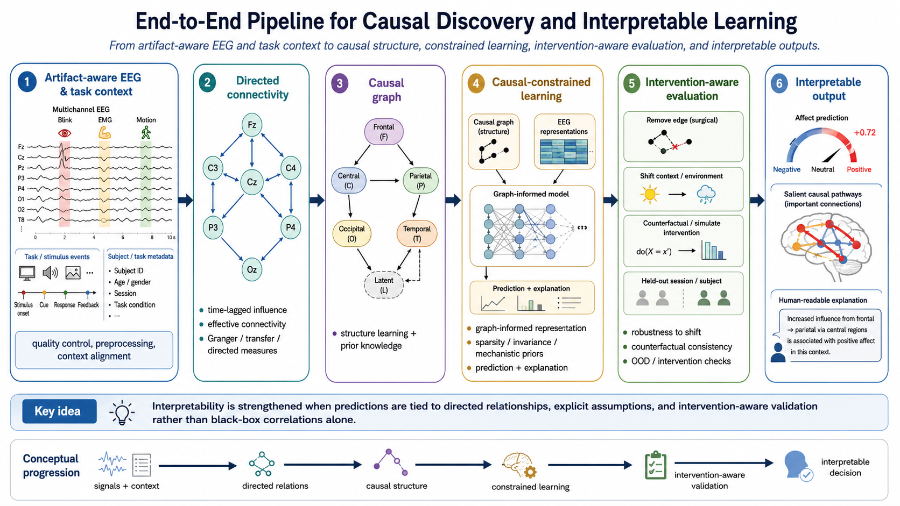

# Causal Discovery, Inference, and Interpretable Learning

Most EEG affective models learn associations: a pattern predicts an emotion label within a dataset. Association can be useful, but it is fragile when subjects, sessions, devices, stimuli, or interventions change. Causal discovery and causal inference offer a complementary goal: identify directed relations that remain meaningful under stated assumptions, use them to constrain learning, and evaluate whether a model's explanations reflect more than correlations or recording artifacts.

For EEG, causal conclusions must be modest. Sensor-level signals are mixtures of neural sources affected by volume conduction, common inputs, filtering, reference choice, and finite samples. A directed connectivity estimate is not proof that one brain region directly causes another, nor that a neural pattern causes an emotion. The value of causal analysis is to make assumptions, directionality, confounding risks, and intervention claims explicit.

*Figure 1. Causal discovery and interpretable-learning pipeline. Directed connectivity estimates inform a causal graph, which constrains learning and is validated through intervention-aware evaluation.*

## Causal Questions at Different Levels

Causal work in affective EEG can address different questions. They should not be conflated.

| Level | Example question | Appropriate evidence |
| --- | --- | --- |
| Directed signal interaction | Does past activity in channel or source $$X$$ improve prediction of $$Y$$? | Time-series assumptions, directed-connectivity estimate, stability analysis |
| Network mechanism | Which directed pathways mediate a task or affective condition? | Source-informed analysis, controls for common drivers, replication |
| Causal effect of an intervention | Does changing feedback or task difficulty change outcome $$Y$$? | Randomized or otherwise identifiable intervention design |
| Causal representation learning | Does a learned representation preserve stable mechanisms across domains? | Cross-environment invariance and intervention-aware evaluation |

A method can answer one level without answering the others. Granger causality, for example, concerns predictive temporal direction under a specified model; it does not by itself identify a manipulable biological mechanism.

## Classical Directed-Interaction Methods

### Granger Causality

Granger causality asks whether the past of one time series improves prediction of another beyond the target's own past and other included variables. For signals $$X$$ and $$Y$$, $$X$$ Granger-causes $$Y$$ when including $$X_{<t}$$ reduces the predictive error for $$Y_t$$ compared with a restricted model:

$$
\mathrm{Var}(Y_t \mid Y_{<t}, X_{<t}) < \mathrm{Var}(Y_t \mid Y_{<t}).
$$

Multivariate autoregressive models, conditional Granger causality, directed transfer function, and partial directed coherence extend the idea to multichannel and frequency-specific analyses. In affective EEG, these estimates can describe changes in directed spectral interaction across conditions or time.

The method assumes an adequately modeled temporal process, meaningful sampling rate and lag order, and sufficient control of common drivers. It is sensitive to filtering, nonstationarity, volume conduction, and omitted variables. Use multivariate or conditional variants when possible, select lags within training or analysis data, and report stability across reasonable preprocessing and model-order choices.

### Information-Theoretic and Information-Flow Methods

Transfer entropy estimates directed statistical dependence by asking whether the past of $$X$$ reduces uncertainty about future $$Y$$ beyond the past of $$Y$$. It can capture nonlinear relationships but requires substantial data and careful choices of embedding dimension, lag, and estimator. It measures directed information dependence, not a guaranteed intervention effect.

Liang-Kleeman information flow provides another route to directionality. It derives a directional information-flow rate from the evolution of probability distributions. For a bivariate linear stochastic system, the information flow from $$X$$ to $$Y$$ can be estimated from covariances and their time derivatives, producing a signed quantity that describes the contribution of $$X$$ to the entropy tendency of $$Y$$. A common estimator is expressed as

$$
T_{X \to Y} = \frac{C_{XY}}{C_{YY}}\,
\frac{C_{YY} C_{X,\dot{Y}} - C_{XY} C_{Y,\dot{Y}}}
{C_{XX} C_{YY} - C_{XY}^{2}},
$$

where $$C$$ denotes covariance terms and $$\dot{Y}$$ is the temporal derivative of $$Y$$. The exact estimator and assumptions depend on the chosen dynamical model. Liang-Kleeman flow can be attractive for its directional and signed interpretation, but finite-sample uncertainty, nonstationarity, mixed sensor signals, and unobserved common causes remain central concerns.

### Other Discovery Families

Constraint-based algorithms such as PC or FCI infer graph constraints from conditional independences; score-based methods search for a graph that balances fit and complexity; and structural equation or dynamical causal models impose explicit generative assumptions. These methods can be useful when task variables, interventions, and multiple modalities are modeled jointly, but EEG sample size, autocorrelation, and hidden confounding often violate their simplest assumptions.

## Construct a Causal Graph Responsibly

Causal discovery should be treated as a pipeline, not a button. A practical workflow is:

1. Define nodes at a defensible level, such as source-space regions, frequency-band summaries, task variables, behavior, or device actions.
2. State plausible confounders and common drivers, including stimulus timing, motion, peripheral physiology, reference scheme, and recording quality.
3. Estimate directed relations separately within training or discovery data using a declared window length, lag model, and statistical threshold.
4. Quantify edge stability across time blocks, subjects, preprocessing variants, and resampled data.
5. Retain uncertainty or edge weights rather than presenting one thresholded graph as ground truth.
6. Validate candidate directions against task timing, held-out data, known interventions, or independent modalities.

Source-space nodes can reduce some sensor-mixing concerns, but source estimation introduces its own assumptions. At either level, a causal graph is a hypothesis with uncertainty, not a literal wiring diagram of the brain.

## Integrate Directed Causal Graphs with GNNs

Standard EEG graph neural networks often use undirected correlation, coherence, distance, or learned similarity matrices. A causal graph can instead provide directed, signed, frequency-specific, or time-varying edges. This lets message passing respect a proposed direction of influence:

$$
h_v^{(l+1)} = \phi\left(h_v^{(l)},\; \sum_{u \in \mathrm{Pa}(v)} w_{u \to v} \psi(h_u^{(l)})\right),
$$

where $$\mathrm{Pa}(v)$$ denotes candidate parent nodes of $$v$$ and $$w_{u \to v}$$ is a directed edge weight. Separate incoming and outgoing channels, edge-confidence gating, and temporal graph models can preserve asymmetry that undirected aggregation discards.

Several integration directions are promising:

- use Granger, transfer-entropy, or Liang-Kleeman estimates as fixed or softly regularized directed adjacency matrices;
- learn graph edges while penalizing directions inconsistent with a stable discovered graph;
- condition graph structure on task phase or affective state to model time-varying networks;
- combine source-space anatomical priors with directed functional edges;
- and jointly learn a predictor and a graph only when graph identifiability assumptions are reported clearly.

A GNN using a directed graph is not automatically causal. The causal claim depends on how edges were discovered, what confounders were modeled, and whether the graph survives appropriate tests.

## Causal Distillation and Causality-Preserving Compression

Knowledge distillation normally trains a smaller student to reproduce a teacher's outputs or representations. Causal distillation adds a stronger requirement: the student should preserve relations that are stable under interventions or environment changes, not only match average predictions.

Possible strategies include:

- distilling predictions jointly with a directed-connectivity or causal-graph representation;
- matching teacher and student responses under controlled interventions, such as channel masking, task-context changes, or simulated sensor shift;
- regularizing the student to preserve invariant causal parents while reducing reliance on unstable correlates;
- transferring a teacher's uncertainty and abstention behavior, not only its class probabilities;
- and using a causal teacher graph to constrain which pathways may influence a student explanation.

**Example scenario:** A large source-space teacher estimates affect and a stable directed network from multi-session training data. A wearable student receives only a reduced electrode montage. During distillation, it matches the teacher's affect estimates while also matching the teacher's response to masked channels and task-context changes. Evaluation tests whether the student retains stable performance on a new session and whether its directed explanations remain consistent with the teacher's validated graph.

Causal distillation should be judged by intervention and shift behavior, not merely by agreement with a teacher on the original training distribution.

## Causal Objectives in Training

Causal information can enter training through constraints rather than a single causal-loss formula. Examples include invariant-risk objectives across subjects or sessions, penalties for dependence on known nuisance variables, graph regularization from stable directed edges, counterfactual data augmentation with explicit assumptions, and multi-environment training that separates condition-specific shortcuts from stable predictors.

These approaches require variation across environments or interventions. Without it, a model may learn a causal-looking explanation that remains indistinguishable from a correlation. Training reports should identify the environments, assumed causal parents, nuisance variables, and conditions under which invariance is expected.

## Evaluation and Interpretability Design

Causal interpretability should be evaluated like any other model claim. A useful design includes:

| Evaluation question | Example test |
| --- | --- |
| Edge stability | Re-estimate directed edges across resampled windows, sessions, and preprocessing variants |
| Predictive contribution | Compare the model with directed edges, shuffled directions, undirected edges, and no graph |
| Intervention consistency | Test response to randomized task changes, controlled feedback, or realistic channel removal |
| Confound sensitivity | Add or control likely common drivers and report how the graph changes |
| Cross-environment transfer | Train in one task, device, or session context and evaluate in another |
| Explanation faithfulness | Remove or perturb the pathways highlighted by the explanation and measure the predicted effect |

Post hoc saliency maps, attention weights, and learned graph edges are not causal explanations by default. They become more credible only when they are stable, predictive of intervention outcomes, and consistent with explicitly stated assumptions.

## Practical Recommendations

- Use causal language proportionally: say "directed predictive influence" when using Granger causality, and reserve intervention claims for designs that identify causal effects.
- Prefer source-informed or multivariate analyses when possible, but report their modeling assumptions and limitations.
- Treat preprocessing, reference choice, window size, lag order, and graph threshold as sensitivity variables rather than hidden defaults.
- Keep causal discovery, graph selection, and hyperparameter tuning inside training or discovery partitions; test graph-based claims on held-out data.
- Compare causal-graph models with strong correlation-based and context-only baselines.
- Report uncertainty, edge stability, negative controls, and failure cases alongside attractive network visualizations.

Causal discovery will not make affective EEG simple. Its contribution is disciplined reasoning: it can make model design, interpretation, and intervention claims more transparent, more falsifiable, and more likely to survive changes in people and environments.

## References

- Granger, C. W. J. (1969). Investigating causal relations by econometric models and cross-spectral methods. Econometrica, 37(3), 424-438.
- Liang, X. S. (2014). Unraveling the cause-effect relation between time series. Physical Review E, 90(5), 052150.
- Liang, X. S. (2016). Information flow and causality as rigorous notions ab initio. Physical Review E, 94(5), 052201.
- Schreiber, T. (2000). Measuring information transfer. Physical Review Letters, 85(2), 461-464.
- Pearl, J. (2009). Causality: Models, Reasoning, and Inference. Cambridge University Press.
- Peters, J., Janzing, D., and Schölkopf, B. (2017). Elements of Causal Inference: Foundations and Learning Algorithms. MIT Press.
